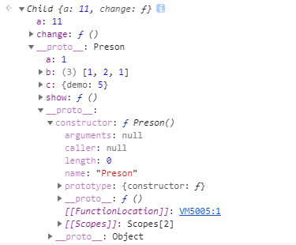

## 简介
<hr/>

这道面试题考察的比较综合，也有很多要注意的点，如果知道答案就没有必要往下看了。
```javascript
  function Preson () {
    this.a = 1;
    this.b = [ 1, 2, this.a ];
    this.c = { demo: 5 };
    this.show = function () {
      console.log(this.a, this.b, this.c.demo);
    }
  }
  function Child() {
    this.a = 2;
    this.change = function () {
      this.b.push(this.a);
      this.a = this.b.length;
      this.c.demo = this.a++;
    }
  }

  Child.prototype = new Preson();
  var parent = new Preson();
  var child1 = new Child();
  var child2 = new Child();
  child1.a = 11;
  child2.a = 22;
  parent.show();
  child1.show();
  child2.show();
  child1.change();
  child2.change();
  parent.show();
  child1.show();
  child2.show();
  // parent.show(); // (1, [1, 2, 1], 5)
  // child1.show(); // (11, [1, 2, 1], 5)
  // child2.show(); // (22, [1, 2, 1], 5)
  // child1.change();
  // child2.change();
  // parent.show(); // (1, [1, 2, 1], 5)
  // child1.show(); // (5, [1, 2, 1, 11, 12], 5)
  // child2.show(); // (6, [1, 2, 1, 11, 12], 5)
```
## 考察点
<hr/>
这道题比较经典考察了`JavaScript`中很多方面的知识，大致如下几点：
- prototype原型、原型链问题
- new改变this指向，new 产生实例属性和原型属性
- 值类型和引用类型
- 原型继承

是一道比较综合的题前四题比较好答，后面的两题想多或者想少了都会出错。这里就对一些知识点不多做赘述，可以查看往期文章了解。
**往期文章**
> [JavaScript类型转换（一） 常见数据类型](/blog/javascript/javascript-Type-conversion.html)
`...后期添加`

## 结题需要的知识点
<hr/>
大致的知识点如下：
1. **构造函数有一个`prototype`属性指向原型对象，多个实例属性共享一个原型对象**
2. **实例中的属性都是独立的互相之间不会影响**
3. **每一个实例都有一个隐式原型`__proto__`指向构造函数的原型对象**
4. **`this`的指向问题，大致如下：**
  - 作为对象方法时，谁调用就指向谁
  - `new`、`bind`、`call`、`apply`都会改变this的指向
  - 箭头函数的`this`从外层普通函数获取
5. **对象字面量和数组都是引用对象**
6. **原型链的查找规则：  就近原则**
  - 当实例上存在属性时， 用实例上的
  - 如果实例不存在，顺在原型链，往上查找，如果存在，就使用原型链的
  - 如果原型链都不存在，就用Object原型对象上的
  - 如果Object原型对象都不存在， 就是undefined

## 第一问 parent.show()
```javascript
  parent.show();
```
调用`parent.show()`的方法，其实就是调用`parent`实例上的`show`方法，直接输出`1, [1, 2, 1], 5`;没什么太多解释的，了解`new`关键字就可以。

## 第二问 child1.show()、child2.show()
```javascript
  child1.show();
  child2.show();
```
首相要了解下面的代码：
```javascript

  Child.prototype = new Preson();

  var child1 = new Child();
  var child2 = new Child();
  child1.a = 11;
  child2.a = 22;
```
上面代码把`Child.prototype`指向一个`Preson`的实例，可以知道`Child.prototype.__proto__`指向`Preson.prototype`;`Child.prototype.constructor`指向`Preson`。下面是验证代码：
```javascript
  Child.prototype.__proto__ === Preson.prototype; // true
  Child.prototype.constructor === Preson; // true
```
`child1`、`child2`的结构如下图所示：


`child1`、`child2`都是`Child`构造函数实例化产生的，所以`child1.show() child2.show()`是调用的`Child.prototype`上的方法，但是注意`child1`、`child2`的对象上都声明了一个新属性`a`。
根据上面第`6`条知识点可知结果为`11, [1, 2, 1], 5)`、`12, [1, 2, 1], 5`；

**注意**
从代码上看`child1.__proto__.b`数组的第三项是指向`child1.__proto__.a`的，那我们此时修改`child1.__proto__.a`的值，是否会影响`child1.show()`的结果呢:
```javascript
  child1.__proto__.a = 12123;
  child1.show(); // 11, [1, 2, 1], 5
```
是没有影响的，因为`parent`实例生成的时候，`this.a`指向了一个原始值`2`,所以`this.b`中的第三项实际上是被赋值了一个**原始值**，故此处乍看起来像是**引用类型**的赋值，实则不是。**原始值赋值会开辟新的存储空间**，使得`this.a`和`this.b[2]`的值相等，但是却指向了堆内存里的不同地址。

## 第三问 parent.show()
```javascript
  parent.show();
```
根据上面第`2`条知识点，可知`preson`和`Child`是`Person`的不同的实例，它们之间不会相互影响，所以它的经过不会更改为`1, [1, 2, 1], 5`。

## 第四问 child1.show()、child2.show()
```javascript
  // 前面执行了
  child1.change();
  child2.change();

  child1.show();
  child2.show();
```

`child1.change()`执行了`change()`时执行过程如下：

**`this.b.push(this.a)`**
由于`this`的动态指向特性，`this.b`会指向`Child.prototype`上的`b`数组,`this.a`会指向`child1`的`a`属性,所以`Child.prototype.b`变成了`[1,2,1,11]`;

**`this.a = this.b.length`**
`this.b.length`经过上一步的添加了一条数据变为了`4`，所以当前的`this.a`就是`4`。

**`this.c.demo = this.a++;`**
`this.a`是`4`，`this.c.demo`的值被复制为`4`，不要忽略`this.a++`以后的值变为了`5`。

`child2`执行了`change()`方法, 而`child2`和`child1`均是`Child`类的实例，所以他们的原型链指向同一个原型对象`Child.prototype`,也就是同一个`parent`实例，所以`child2.change()`中所有影响到原型对象的语句都会影响`child1`的最终输出结果

`child2.change()`执行了`change()`时执行过程如下：
**`this.b.push(this.a)`**
由于`this`的动态指向特性，`this.b`会指向`Child.prototype`上的`b`数组,`this.a`会指向`child2`的`a`属性,所以`Child.prototype.b`变成了`[1,2,1,11,12]`;

**`this.a = this.b.length`**
`this.b.length`经过上一步的添加了一条数据变为了`5`，所以当前的`this.a`就是`5`。

**`this.c.demo = this.a++;`**
`this.a`是`5`，`this.c.demo`的值被复制为`5`，不要忽略`this.a++`以后的值变为了`6`。

所以会输出如下：
```javascript
  child1.show(); // 5, [1,2,1,11,12], 5
  child2.show(); // 6, [1,2,1,11,12], 5
```

## 总结
1. 前端的所有知识都是比较零散的，所以尽量要建立自己的知识结构图才方便以后的查漏补缺
2. 因为知识比较零散不便于记忆，最好多找几个切入点把零散的知识串联起来更容易记住
3. 没有别的办法多写、多看、多记一遍不行就直到记住为止

> 值类型变量赋值给引用类型时，改变值类型变量的值并不会影响赋值给引用类型中的值，
```javascript
  var test = 111;
  var arr = [1, 2, 3, 4, test];
  test = 2222;
  console.log(arr); // [1, 2, 3, 4, 111];
```

## 参考
> [javascript基础修炼(1)——一道十面埋伏的原型链面试题](https://www.cnblogs.com/dashnowords/p/9404237.html)
> [javascript原型链的一道面试题的分析（详细）](https://www.php.cn/js-tutorial-410582.html)