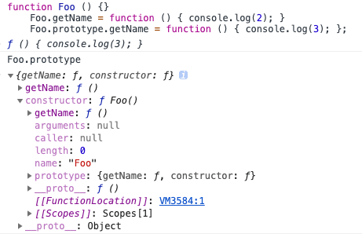
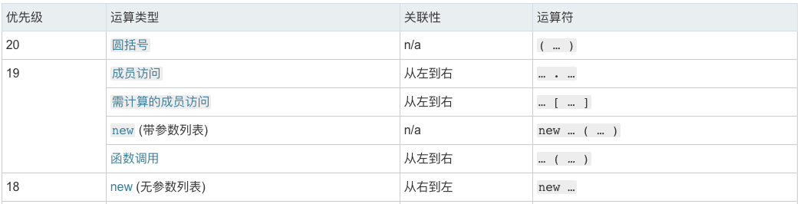

## 第一题

```javascript
    // 声明一个Foo 函数
    function Foo () {
        getName = function () { console.log(1);}
        return this;
    }
    // Foo创建了一个叫getName的静态属性存储了一个匿名函数
    Foo.getName = function () { console.log(2); };
    // Foo的原型对象新创建了一个叫getName的匿名函数
    Foo.prototype.getName = function () { console.log(3); };
    // 声明一个匿名，并且赋值给全局变量getName (函数表达式)
    var getName = function () { console.log(4); };
    // 声明一个全局函数getName (函数声明)
    function getName () { console.log(5); }

    Foo.getName(); // 第一问
    getName(); // 第二问
    Foo().getName(); // 第三问
    getName(); // 第四问
    new Foo.getName(); // 第五问
    new Foo().getName(); // 第六问
    new new Foo().getName(); // 第七问
```

**如果这几个问题能直接回答出来，后面就没必要看了**。

**简单了解一下javascript中的原型继承**

```javascript
    function Preson(name) {
        var name = name; //私有属性
        this.name = name; //公有属性
        function getName() { //私有方法
            return name;
        }
    }
    Preson.prototype.getName = function() { //公有方法
        return this.name;
    }
    Preson.name = 'Wscats'; //静态属性
    Preson.getName = function() { //静态方法
        return this.name;
    }
    var Son = new Preson('Son'); //实例化
```

注意下面几点：

- **调用公有方法，公有属性，我们必需先实例化对象，也就是用new操作符实化对象，就可构造函数实例化对象的方法和属性，并且公有方法是不能调用私有方法和静态方法的**
- **静态方法和静态属性就是我们无需实例化就可以调用**
- **而对象的私有方法和属性,外部是不可以访问的**
- **静态属性不能被继承**

首先看一下代码，如下：

```javascript
    function Foo () {}
    Foo.getName = function () { console.log(2); }
    Foo.prototype.getName = function () { console.log(3); };
```

首先看一下`Foo.getName`会在`Foo.prototype.constructor`中添加一个`getName`属性，如果直接调用`Foo.getName`他就直接调用`Foo.prototype.constructor`上得`getName`属性。
如果没有通过`new`关键字调用`Foo`的话，是不能访问`prototype`中的`getName`属性。
代码结果如下：


## 第一问

```javascript
    Foo.getName(); // 第一问
    // 2
```

根据上面的说明，可以得出第一问的`Foo.getName`就是会访问`constructor`上得静态属性，结果就是`2`。

## 第二问

```javascript
    getName(); // 第二问
    // 4
```

首先要介绍一下**函数声明**和**函数表达式**，如下：

### 函数声明

```javascript
    // 函数声明
    function getName () {}
```

### 函数表达式

```javascript
    // 函数表达式
    var getName = function () {}
```

这里考察的是**变量提升**的技巧，简单来说就是**函数声明**存在变量提升，不了解变量提升的话可以看另一篇文章[javascript中的变量提升](/blog/javascript/hoisting.html)，所以这一题的答案就是4。

## 第三问

```javascript
    Foo().getName(); // 第三问
    // 1
```

`Foo().getName()`; 先执行了`Foo`函数，然后调用`Foo`函数的返回值对象的`getName`属性函数。主要考察`this`指向问题和在`Foo`函数中没有`var`声明变量问题。
要注意`Foo`函数中的`getName`声明是没有`var`的，所以它会在全局作用域中创建一个`getName`，如果全局作用域中存在这个属性就会**覆盖**全局作用域的已存在的属性。
所以当`Foo`函数执行完成之后`getName = function () { console.log(1);}`会覆盖`getName = function () { console.log(4); }`。
> 注意：此处若依然没有找到会一直向上查找到window对象，若window对象中也没有getName属性，就在window对象中创建一个getName变量。

`Foo`函数的返回值是`this`，而`JS`的`this`问题已经有非常多的文章介绍，简单来讲this的指向就是由函数的调用方式决定的。
所以答案就是**输出1**。
这里最主要考察两个知识点，一个是作用域问题、一个是this指向问题，这个就不多做解释直接看往期文章。

## 第四问

```javascript
    getName(); // 第四问
    // 1
```

直接调用`getName`函数，相当于`window.getName()`，因为这个变量已经被`Foo`函数执行时修改了，所以结果和第三问相同也会**输出1**。

## 第五问

```javascript
    new Foo.getName(); // 第五问
    // 2
```

第五问主要考察的是<font color="#ff502c">JS中的运算符优先级</font>，所以首先要了解**JS中的运算符优先级**，可以通过[MDN运算符优先级](https://developer.mozilla.org/zh-CN/docs/Web/JavaScript/Reference/Operators/Operator_Precedence)学习这里就不多展示，只展示用到的如下图所示：

可以在上面看到一下两点：

- 成员访问`.`的优先级为**(19)**比new无参数列表**(18)**优先级高
- 当点运算完后又因为有个括号()，此时就是变成new有参数列表**(19)**，所以直接执行new，`new constructor` 后面可以跟**一个指定对象实例的类型的类或函数**。它是把`Foo.getName()`看做一个**整体**，而不是调用了`new`完成以后的**函数**，不信的话可以运行`new (Foo.getName)`这个代码，它的结果和本题的**结果一致**。
所以我们可以把代码改写成`new (Foo.getName)()`这样可以清晰的看到他的执行顺序，大的执行顺序分为两部步如下：

1. 先执行`Foo.getName`
2. 再是`new (Foo.getName)()`

所以这里实际上将**getName函数**作为了**构造函数**来执行，所以**结果是2**。

## 第六问

```javascript
    new Foo().getName(); // 第六问
    // 3
```

根据上面的**运算符优先级**可知，首先new有参数列表(19)跟点的优先级(19)是同级，同级的话按照**从左向右的执行顺序**，所以先执行new有参数列表(19)再执行点的优先级(19)，最后再函数调用(18)。
> new有参数列表(19)->.成员访问(19)->()函数调用(18)
根据优先级可以把上面的问题该写为`(new Foo()).getName()`，这样可以更清晰的看到它的执行过程。

### 构造函数的返回值

在传统语言中构造函数不应该有返回值，实际执行的返回值就是此构造函数的实例化对象，而在JS中构造函数可以有返回值也可以没有。大致可以分总结为三类：

- 没有返回值则按照其他语言一样返回实例化对象。
- 若有返回值则检查其返回值是否为引用类型。如果是非引用类型，如基本类型（String,Number,Boolean,Null,Undefined）则与无返回值相同，实际返回其实例化对象。
- 若返回值是引用类型，则实际返回值为这个引用类型。

原题中，由于返回的是`this`，而this在构造函数中本来就代表当前实例化对象，最终`Foo`函数返回**实例化对象**。
之后调用实例化对象的`getName`函数，因为在Foo构造函数中没有为**实例化对象**添加任何属性，当前对象的**原型对象(prototype)**中寻找`getName`函数。所以会执行`prototype`上得`getName`的方法也就是`function () { alert (3);};`，**结果为3**。

## 第七问

```javascript
    new new Foo().getName(); // 第七问
    // 3
```

根据第六问的优先级可以把第七问的代码改写为`new ((new Foo()).getName)()`，所以得到的**结果也为3**。

## 总结

其实有很多关于**this指向**、**构造函数返回值**、**作用域**都没有记录的很完整，以前有些过一些文章但是并没有整理，慢慢会整理好。
