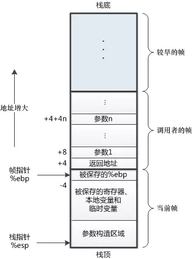

## 简介

首先解释什么是`尾递归`和`尾调用`，后面再来解释什么是`斐波拉契数列`，怎么用`JavaScript`实现`斐波拉契数列`，尾递归和它有什么关联。
本文文章大致章节如下：

- 理解调用栈
- 什么是尾调用和尾调用优化
- 什么是尾递归
- 什么是斐波拉契数列

通过上面的几个章节一步一步加深理解。

## 调用栈

首先要了解什么是`调用栈`，后面才能更好的了解`尾递归`和`尾调用`。

**调用栈**是**解释器（就像浏览器中的JavaScript解释器）追踪函数执行流的一种机制**。简单来说就是能够通过`调用栈`追踪到那个函数正在执行，执行的函数中又调用了那个函数。可能这样说还是不太具体，我们可以把它更具体一下。

首先引入一个概念：`栈帧`，**栈帧**是指一个函数调用单独分配的那部**分栈空间**。`栈帧`中有两种比较重要的帧`当前帧`、`调用帧`，先看一张图：



当运行中的程序`调用另一个函数时`，就要进入一个`新的栈帧`，`原来函数`的栈帧称为`调用者的帧`，`新的栈帧`称为`当前帧`。
那么`调用栈`大致是怎么执行的呢？大致步骤如下：

- 每调用一个函数，解释器就会把该函数添加进`调用栈`并开始执行。
- 正在`调用栈`中**执行的函数(调用者帧)**还`调用了其它函数`，那么`新函数(当前帧)`也将会被`添加进调用栈`，一旦这个函数被调用，便会立即执行。
- `新函数(当前帧)`执行完毕后，解释器将其`清出调用栈`，继续执行**执行的函数(调用者帧)**环境下的剩余的代码。
- 当分配的`调用栈空间`被占满时，会引发`“堆栈溢出”(递归爆栈)`。

在线代码体验[调用栈执行过程](https://codepen.io/njmcode/pen/dMPmGq)，如果访问比较慢可以看[调用栈执行过程demo](https://github.com/Braveheartforyou/Blog-Static/tree/master/callStack)把代码下载到本地运行查看。

执行效果大致如下：

因为gif文件过大，就放一张图片好了。

### 调试

我们也可以通过`chrome`中的控制台，通过`console.trace()`来追踪当前的调用栈，如下图所示：


或者通过在代码中`打断点调试`看到当前调用栈：


其实`调用栈`和`事件轮询(event loop)`有很大的关联，如果对`事件轮询(event loop)`有兴趣的话看我另一篇文章[事件轮询/事件模型](/blog/javascript/evenloop.html)。

## 尾调用和尾调用优化

### 尾调用

`尾调用`是函数式编程中一个很重要的概念，当一个`函数执行时`的`最后一个步骤`是返回`另一个函数`的`调用`，这就叫做`尾调用`。
什么样算尾调用，什么不算尾调用呢？

注意这里函数的调用方式是无所谓的，以下方式均可：

```js
    函数调用:     func(···)
    方法调用:     obj.method(···)
    call调用:     func.call(···)
    apply调用:    func.apply(···)
```

并且只有下列表达式会包含尾调用：

```js
    条件操作符:      ? :
    逻辑或:         ||
    逻辑与:         &&
    逗号:           ,
```

**不是尾调用**的实例

```js
    // 不是尾调用 调用函数后还有复制操作
    function notCallStack (name) {
        let name = otherFunc(name);
        return name;
    }
    // 不是尾调用 调用函数后还有拼接操作
    function notCallStack (name) {
        return otherFunc(name) + 1;
    }

    // g()有可能是尾调用，f()不是
    const a = x => x ? f() : g();
```

**是尾调用**的实例

```js
    // 尾调用正确示范1.0
    function f(x){
        return g(x);
    }

    // 尾调用正确示范2.0
    function f(x) {
        if (x > 0) {
            return m(x)
        }
        return n(x);
    }
```

这个就是`尾调用`，下面我们就可以通过`尾调用`去优化执行栈的调用过程。

### 尾调用优化

函数在调用的时候会在`调用栈（call stack）`中存有记录，每一条记录叫做一个`调用帧（call frame）`，每调用一个函数，就向栈中`push`一条记录，函数执行结束后`依次向外弹出`，直到`清空调用栈`，参考下图：

```js
    function one () {
        two();
    }
    function two () {
        three();
    }
    function three () {
        console.trace();
    }
    one();
```

执行过程如下下图所示：


我们在一个函数中调用另一个函数，但是并没有通过`return`来结束当前函数的执行，`JS引擎`会认为当前的函数并没有执行完成，会在执行当前函数调用的函数，等他执行完成才会释放当前函数。

- `one函数`执行时，会把`one函数`添加进`调用栈`中，`one函数`现在为`当前帧`。
- 在`one函数`中又调用了`two函数`，当时在调用`two函数`时没有`return`，所以会把`two函数`添加进`调用栈`。现在`one函数`为`调用者帧`，而`two函数`为`当前帧`
- 在`two函数`中又调用`three函数`，执行过程与`two函数`执行相同。
- 当`three函数`执行完成时（默认返回undefined），`three函数`就会被`调用栈`弹出并且被销毁。再在后面逐步销毁`two函数`、`one函数`，到此`调用栈为空`。

下面通过尾调用优化，修改代码如下：

```js
    “use strict”;
    function one () {
        return two();
    }
    function two () {
        return three();
    }
    function three () {
        console.trace();
        return false;
    }
    one();
```

执行效果如下图所示：


- `one函数`执行时，会把`one函数`添加进`调用栈`中，`one函数`现在为`当前帧`。
- 在`one函数`中又调用了`two函数`，当时在调用`two函数`添加了`return`，`调用栈`会把`one函数`弹出，当前`调用栈`中只有一个`two函数`。
- 在`two函数`中又调用`three函数`，因为有`return`当前`调用栈`中只有`three函数`。
- 当`three函数`执行完成后，`调用栈`弹出`three函数`，此时`调用栈`当前为空。

> 注意： 无论是通过`console.trace()`,还是通过`chrome`断点查看`call stack`都并没有改变`调用栈`，意思就是和上面的一样，应该是`chrome`禁止了尾调用优化。(暂无找到原因--我佛了)

## 尾递归