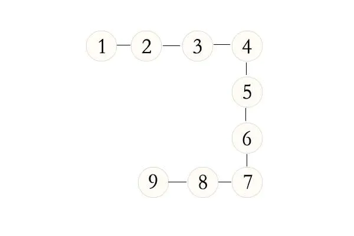
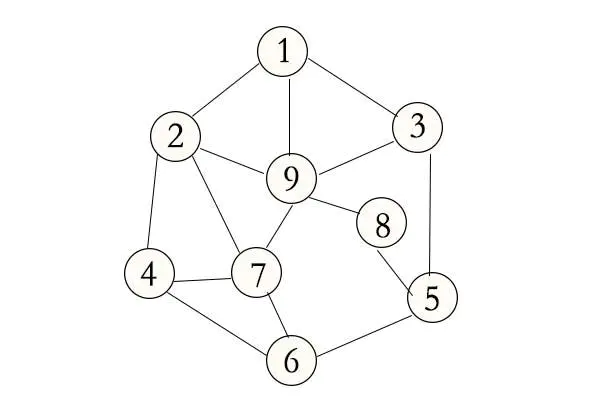
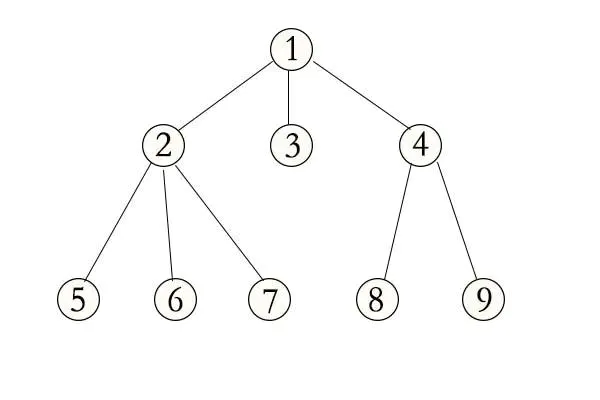
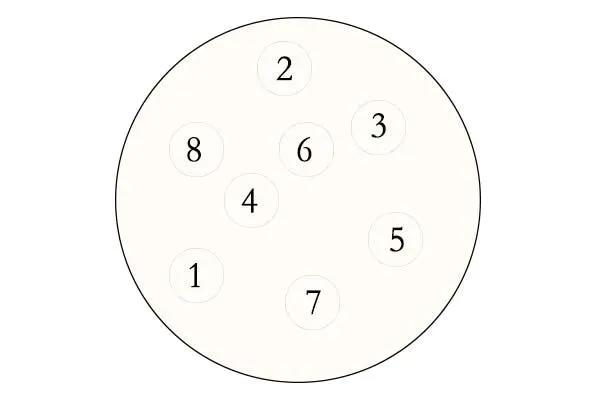
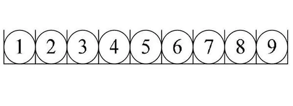
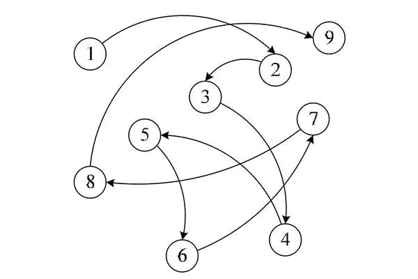
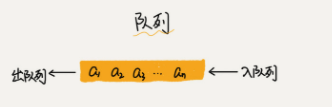
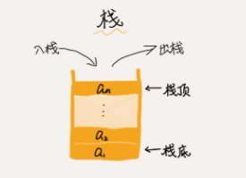
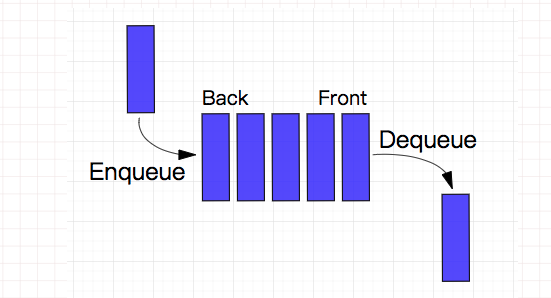

## 概览

什么是数据结构？数据结构的作用是啥？
什么是算法？算法有什么作用？

本篇文章只是简单了解一些专业术语、基本概念，作为后期文章的引导篇。对数据结构和算法有一个基本的概念和了解，以便于后面的 leetcode 刷题、数据结构深入了解做铺垫。

### 基本概念和术语

#### 数据(data)

- 是事实或观察的结果，是对客观事物的`逻辑归纳`，是用于表示客观事物的未经加工的原始素材。
- 在计算机科学中指的是所有能输入到计算机中并被计算机程序`处理的符号的总称`。

#### 数据项(data item)

- 数据项是指数据元素可由若干个`数据项（data item）组成`，数据项是数据的`不可分割`的`最小单位`。
- 数据项是数据记录中`最基本的`、`不可分的`有名`数据单位`，是具有独立含义的`最小标识单位`。

#### 数据元素(data element)

- 它是`数据`的`基本单位`，数据元素也叫做`结点`或`记录`。
- 一个`数据元素`可由`若干`个`数据项`组成.

#### 数据对象(data Object)

- 数据对象指`性质相同`的数据元素的集合，是数据的`子集`；
- `数据对象`简称数据

> 性质相同指数据元素具有相同数量和类型的数据项；

#### 数据结构(data structure)

- 由互相之间存在着`一种`或`多种`关系的数据元素组成的`集合`；这些数据元素之间的关系称为`结构`。

### 数据结构

> 在计算机科学中，`数据结构(英语：data structure)`是计算机中`存储`、`组织数据`的方式。

简单来说数据结构: 是指互相之间存在一种或多种特定关系的数据元素的组合。`数据结构 = 数据元素 + 元素之间的关系`.

数据结构一般分为两个维度：`逻辑结构`和`存储结构`，`逻辑结构`又大致可以分为`线性结构`和`非线性结构`两种。下面会对`逻辑机构`、`存储结构`展开来讲。

常见数据结构：

- `堆栈`（Stack）
- `队列`（Queue）
- `数组`（Array）
- `链表`（Linked List）
- `树` （Tree）
- `图` （Graph）
- `堆积` (Heap)
- `散列表` （Hash table）

#### 基本逻辑结构

**集合结构**： `数组元素的有限集合`。数据元素之间除了”属于同一个集合“的关系之外`没有其他关系`。


**线性结构**： `数据元素的有序集合`。数据元素之间形成`一对一`的关系。


**树形结构**： 树是层次数据结构，树中数据元素之间存在`一对多`的关系。


**图状结构**：  图中数据元素之间的关系是`多对多`。


### 算法

> `算法（algorithm）`，在数学（算学）和计算机科学之中，为任何一系列良定义的具体计算步骤，常用于`计算`、`数据处理`和`自动推理`。作为一个有效方法，算法被用于计算函数，它包含了一系列定义清晰的指令，并可于有限的时间及空间内清楚的表述出来。

#### 算法的基本特征

算法的基本特征： 是一组严谨地定义运算顺序的规则，每一个规则都是`有效的`，是`明确的`，此顺序将在有限的次数下终止。
特征包括：

1. 输入：一个算法必须有零个或以上输入量。
2. 输出：一个算法应有一个或以上输出量，输出量是算法计算的结果。
3. 明确性：算法的描述必须无歧义，以保证算法的实际执行结果是精确地符合要求或期望，通常要求实际运行结果是确定的。
4. 有限性：依据图灵的定义，一个算法是能够被任何图灵完全系统模拟的一串运算，而图灵机只有有限个状态、有限个输入符号和有限个转移函数（指令）。而一些定义更规定算法必须在有限个步骤内完成任务。
5. 有效性：又称可行性。能够实现，算法中描述的操作都是可以通过已经实现的基本运算执行有限次来实现。

#### 常用设计模式

`完全遍历法和不完全遍历法`： 在问题的解是有限离散解空间，且可以验证正确性和最优性时，最简单的算法就是把解空间的所有元素完全遍历一遍，逐个检测元素是否是我们要的解。这是最直接的算法，实现往往最简单。但是当解空间特别庞大时，这种算法很可能导致工程上无法承受的计算量。这时候可以利用不完全遍历方法——例如各种搜索法和规划法——来减少计算量。
`分治法`： 把一个问题`分割`成`相互独立`的`多个部分`分别求解的思路。这种求解思路带来的好处之一便是进行并行计算。
`动态规划`： 当问题的整体最优解就是由`局部最优解组成`的时候，经常采用的一种方法。
`贪心算法`：常见的近似求解思路。当问题的整体`最优解不是（或无法证明是）由局部最优解组成`，且对接的最优性没有要求的时候，可以采用的一种方法。
`线性规划法`： `线性规划（Linear Programming，简称LP）`特指目标函数和约束条件皆为线性的最优化问题。线性规划是最优化问题中的一个重要领域。
`简并法`： 把一个问题通过逻辑或者数学推理，简化成与之等价或者近似的、相对简单的模型，进而求解的方法。

#### 常用实现方法

[递归方法](https://zh.wikipedia.org/wiki/%E9%80%92%E5%BD%92): 递归（英语：Recursion），又译为递回，在数学与计算机科学中，是指在函数的定义中`使用函数自身的方法`。递归一词还较常用于描述以`自相似方法重复事物`的过程。
[迭代方法](https://zh.wikipedia.org/wiki/%E8%BF%AD%E4%BB%A3): 迭代是重复反馈过程的活动，其目的通常是为了接近并到达所需的目标或结果。每一次对过程的`重复被称为一次“迭代”`，而每一次迭代得到的结果会被用来作为`下一次迭代的初始值`。

`顺序计算`: 顺序计算就是把形式化算法用编程语言进行单线程序列化后执行。
`并行计算`: 并行计算（英语：parallel computing）一般是指许多指令得以同时进行的计算模式。在同时进行的前提下，可以将计算的过程分解成小部分，之后以并发方式来加以解决

常用的算法：`递归`、`排序`、`二分查找`、`搜索`、`哈希算法`、`贪心算法`、`分治算法`、`回溯算法`、`动态规划`、`字符串匹配算法`等等。

## 数据结构

数据结构一般分为两个维度： `逻辑结构`和`存储结构`。下面再根据这两个维度来大致了解一下一些常用的知识点。

### 逻辑结构

> 逻辑结构即数据之间的关系，逻辑结构可以分为两种：`线性结构`和`非线性结构`。

`非线性结构`又大致可以分为`图形结构`、`树形结构`、`集合结构`对应上面的分类。

**线性结构**

线性结构：是一个`有序数据元素的集合`，其中数据元素之间的关系是`一对一`的关系，即除了第一个和最后一个元素之外，其他数据元素都是一个`首尾接应`的。
常用的线性结构有：`数组`、`栈`、`队列`、`链表`、`线性表`等。

**非线性结构**

非线性结构：各个数据元素不再保持在`一个线性序列中`，每个数据元素可能与`零个或者多个`其他数据元素发生联系。
常见的非线性结构：`二叉树`、`图`、`树`、`集合`等等。

### 存储结构

逻辑结构指的是数据元素之间的关系，而存储结构是逻辑结构用计算机语言的实现。常见的存储结构有： `顺序存储`、`链式存储`、`索引存储`、`散列存储`。

比较常见的就是`顺序存储`和`链式存储`

**顺序存储结构**

顺序存储结构：把数据元素存放在地址`连续的的存储单元里`，其数据间的`逻辑关系和物理关系一致`；比如数组等等，它存储结构大致如下图所示：


**链式存储结构**

链式存储结构: 把数据元素存放在任意的存储单元里，这组存储单元可以是`连续`的也可以是`不连续`的。数据元素的存储关系`不反映其逻辑关系`，用`指针存放数据元素的地址，我们通过地址可以找到相关联数据元素的位置`。



下面会把比较常用的数据结构再稍微详细的介绍一下。

## 算法

在学习算法和后面的算法实战中首先要非常清楚两个衡量算法的指标，`时间复杂度`和`空间复杂度`。

### 大O复杂度表示法

通过一个代码样例来了解一下什么是`大O`？代码如下：

```js
  function sum (n) {
    let sum = 0;
    for (let i = 0; i < n; i++) {
      sum += i;
    }
    return sum
  }
```

`例1`

这是一个最简单的js代码，不需要关注代码的功能。假设每行代码的执行的时间都是相同为`unit_time`，从代码执行的角度来分析代码的执行时间。第`2行`代码它们只需要一个`unit_time`，但是下面`for循环（第3行、第4行）`它执行代码的时间为`2n*unit_time`，再加上`第6行`的代码执行时间为`unit_time`，到此我们知道总执行时间为`(2n+2)*unit_time`的时间。我们可以从这个样例里面知道，`所有代码执行时间T(n)与每行代码执行次数n成正比`。

来看一下`大O`，公式为`T(n) = O(f(n))`，下面来解释一下`大O`中一些关键性的东西。

- `T(n)`: 它表示代码执行的总时间。
- `n`: 表示数据规模的大小，通俗的讲就是代码执行的次数。
- `f(n)`: 表示每次代码执行的次数总和。因为这是一个公式，所以用`f(n)`来表示。
- `O`: 表示代码的执行时间`T(n)`与`f(n)`表达式成正比。

上面例子通过`大O`表示的话就是`T(n) = O(2n + 2)`，这就是`大O时间复杂度表示法`。

> 大O时间复杂度实际上并不具体表示代码真正的执行时间，而是表示代码`执行时间随数据规模增长变化趋势`，所以，也叫作`渐进时间复杂度`

### 时间复杂度分析

在上面的例子中我们得到公式`T(n) = O(2n + 2)`，当我们在看一些真实算法的时间复杂度时，并没有看到`O(2n + 2)`这种格式的方式，一般都是`O（n）`、`O(n²)`这种格式的，这是问什么呢。因为`大O这种复杂度表示方法`只是表示一种变化趋势。如何分析一段代码的时间复杂度？[王争--时间复杂度分析 三种实用方法](https://time.geekbang.org/column/article/40036)。

#### 只关注循环执行次数最多的一段代码

在上面例子中我们得到的`大O`公式`T(n) = O(2n + 2)`，但是一般不会这么些反而会`O(n)`这样写，因为通常会忽略掉公式中常量、低阶、系数，只需要记录一个最大阶的量级就可以了。我们在`分析一个算法、一段代码的时间复杂度的时候，也只关注循环执行次数最多的那段代码就可以了。`

#### 加法法则：总复杂度等于最大的那段代码的复杂度

通过下面这个一段代码来分析一下`加法法则`，代码如下：

```js
  function sum (n) {
    let sum1 = 0
    for(let i = 0;i < 100; i++) {
      sum1 += i;
    }

    let sum2 = 0;
    for(let i = 0;i < n; i++) {
      sum2 += i;
    }

    let sum3 = 0;
    for(let i = 0; i <= n; i++) {
      for(let j = 0; j <= n; j++) {
        sum3 = sum3 + i * j;
      }
    }
    return sum1 + sum2 + sum3;
  }
```

`例2`

上面代码可以分为三段`sum1`、`sum2`、`sum3`，可以分别求三段代码的`时间复杂度`，再取三段代码中量级最大的作为整段代码的复杂度。下面直接来分析三段代码的`时间复杂度`：

第一段`时间复杂度`是多少呢？这段代码执行了`100`次，但是根据上面的规则我们知道，一个常量的执行时间，跟`n`的规模无关。即使是这个循环执行`1000`次、`10000`次，只要是一个已知数，跟`n`无关，照样也是常良级的执行时间。所以我们可以忽略掉当前

第二段`时间复杂度`为`T(n) = O(n)`，第三段`时间复杂度`为`T(n) = O(n²)`。

那我们怎么算当前所有代码的`总时间复杂度`呢？根据上面的规则我们去当前最大量级的，所以整段代码的`时间复杂度`为`O(n²)`。也就是说:`总的时间复杂度就等于量级最大的那段代码的时间复杂度`。抽象成公式为：

如果`T1(n) = O(f(n))`,`T2(n) = O(g(n))`;那么`T(n) = T1(n) + T2(n) = max(O(f(n)), O(g(n))) = O(max(f(n), g(n)))`.

#### 乘法法则：嵌套代码的复杂度等于嵌套内外代码复杂度的乘积

还是以`例2`里面的第三段代码为样例，来分析一下`乘法法则`的复杂度计算，我们还是用抽象的公式来推导一下：

`T1(n) = O(f(n)), T2(n) = O(g(n));`分别来表示内层、外层的抽象公式，`总时间复杂度`为`T(n) = T1(n) * T2(n) = O(f(n)) * O(g(n)) = O(f(n) * g(n))`, 我们假设`f(n)`和`g(n)`它们两个相等，我们就可以得到`T(n) = O(n²)`。我们再来一个例子来分析一下：

```js
  function sum1 (n) {
    let sum11 = 0;
    for (let i = 0; i < n; i++) {
      sum11 += sum2(i);
    }
  }

  function sum2 (n) {
    let sum22 = 0;
    for (let i = 0; i < n; i++) {
      sum22 += i;
    }
    return sum22;
  }

```

首先看一下`sum1`它的`时间复杂度`，我们假设`sum2`它只是一个普通的操作，`sum1`的时间复杂度就是`T1(n) = O(f(n)) = T1(n) = O(n)`。但是在我们的代码中`sum2`它又是一个循环，`sum2`的时间复杂度为`T2(n) = O(n)`，那么整体的时间复杂度为`T(n) = T1(n) * T2(n) = O(n*n) = O(n²)`。

### 空间复杂度分析

空间复杂度分析相对于时间复杂度分析是相简单的，`时间复杂度`全称是`渐进时间复杂度，表示算法的执行时间与数据规模之间的增长关系`。类比一下，`空间复杂度`全称就是`渐进空间复杂度（asymptotic space complexity），表示算法的存储空间与数据规模之间的增长关系`。

还是来一个例子分析一下，代码如下：

```js
  function sum1 (n) {
    let sum11 = 0;
    for (let i = 0; i < n; i++) {
      sum11 += sum2(i);
    }
    return sum11;
  }
```

在代码第2行声明了一个`sum11`,这行代码会申请了一个空间存储变量，第3行声明了一个变量`i`和传入`n`变量，它们会分别会声明两个空间存储变量，其他的代码并没有占用更多的空间，所以整段代码的空间复杂度就是`O(n)`。

常见的空间复杂度是`O(1)`、`O(n)`、`O(n²)`，像`O(logn)`、`O(nlogn)`这样的对数阶复杂平常都用不到。

### 常见的时间复杂度实例分析

常见复杂度量级并不多，大致如下：

**多项式量级**

- 常量阶O(1)
- 对数阶O(logn)
- 线性阶O(n)
- 线性对数阶O(nlogn)
- 平方阶O(n²)、立方阶O(n³)、.....k次方阶O(n^k)

**非多项式量级**

- 指数阶O(2^n)
- 阶乘阶O(n!)

上面复杂度量级大致可以分为`多项式量级`和`非多项式量级`。其中，非多项式量级只有两个：`O(2^n)`、`O(n!)`。

> 复杂度量级会随着量级的增多而递增


我们把时间`复杂度为非多项式量级`的算法问题叫作 `NP（Non-Deterministic Polynomial，非确定多项式）`问题。当数据规模`n`越来越大时，非多项式量级算法的执行时间会急剧增加，求解问题的执行时间无线增长。所以，非多项式时间复杂度的算法其实是非常低效的算法。

#### O(1)

`O(1)`只是一个常量级时间复杂度的一种表示法，并不是只执行了一行代码。如下面代码所示，它的时间复杂度也是`O(1)`，而不是`O(3)`。

```js
  let i = 0;
  let j = 0;
  let sum = i + j;
```

总结： 只要代码的执行时间不随`n`的增大而增大，这样代码的时间复杂度我们都记作`O(1)`。或者说，`一般情况下，只要算法中不存在循环语句、递归语句、即使有成千上万行的代码，其时间复杂度也是O(1)`。

#### O(logn)、O(nlogn)

对数阶时间复杂度非常常见，它们是比较难分析的，通过下面的例子来看一下：

```js
  let i = 1;
  while (i <= n) {
    i = i * 2;
  }
```

从代码执行的的顺序来看，变量`i`的值从`1`开始，每循环一次就乘以`2`,当大于`n`时，循环结束。变量`i`的取值就是一个等比数列。大致如下：

```js
  2^0、2^1、2^2、.......2^k、2^x = n
```

通过`2^x = n`求解`x`这个问题我们知道`x = log2n`，所以当前代码段的时间复杂度就是`O(log2n)`。
当把`2`替换为`3`时，根据`大O`来标记复杂度的时候，可以忽略系数，记`O(Cf(n)) = O(f(n))`。

**O(nlogn)**

`O(nlogn)`就是一个乘法`O(n * logn)`，如果一段代码的时间复杂度是`O(logn)`，我们玄幻执行`n`遍，时间复杂度就是`O(nlogn)`。而且`O(nlogn)`也是一种非常常见的算法时间复杂度。比如递归排序、快速排序的时间复杂度都是`O(nlogn)`。

#### O(m+n)、O(m*n)

一段代码的复杂度由两个数据的规模来决定。代码如下：

```js
  function sum (m, n) {
    let sum1 = 0;
    for(let i = 0; i < m; i++) {
      sum1 += i;
    }

    let sum2 = 0;
    for(let i = 0; i < n; i++) {
      sum2 += i;
    }
    return sum1 + sum2;
  }
```

在这一段代码中我们要分别计算两个循环的时间复杂度，分别为`O(m)`、`O(n)`两个时间复杂度。那我们能不能应用上面的`加法法则`呢？其实是不能的，因为我们没办法知道`m`大，还是`n`大。所以，是不知道要忽略掉`m或者n`。这一段代码的时间复杂度就是`O(m+n)`。

这里的`O(m) * O(n)`和`O(m) + O(n)`是一样的，也可以推算为`O(m) * O(n) = O(m * n)`。

## 线性表

线性表： **就是数据排成像一条线一样的结构。每个线性表上的数据最多只有前和后两个方向**。

线性表包括`数组`、`栈`、`队列`、`链表`等等都是线性结构。下面我们就简单的看一下这四个算是比较常用的结构类型。

### 数组

在大部分的编程语言中都会有一个基本数据类型数组，`数组(Array)是一种线性表数据结构。它用一组连续的内存空间，来存储一组具有相同类型的数据`。
数组为了保持内存数据的连续性，会导致`插入`、`删除`这两个操作比较低效。因为在`插入`、`删除`都会对后续的数组元素进行操作，这两个操作的时间复杂度平均来算为`O(n)`。

## 栈和队列

栈和列表是比较常见的数据结构，在一些代码中我们经常也是能看到的。我们就分别来看一下`栈`和`队列`。
它们两种都是限制访问顺序的数据结构：`栈（先进后出）`、`队列（先进先出）`。大致如下图所示：




### 队列

队列是一种受限的序列，它只能够操作队尾和队首，并且只能在队尾添加元素，在队首删除元素。

队列作为最常见的数据结构同样有着非常广泛的应用，比如消息队列。同时我们也可以通过`JavaScript`中的数组来实现一个简单的队列操作：

```js
  // 声明一个 数据 用以模仿队列
  var queue = [];
  // 向队列中添加 两个元素（入队）
  queue.push(1);
  queue.push(2);
  // 出队
  let dequeue = queue.shift();
  console.log(dequeue, queue);
```

在计算机科学中，一个队列（queue）是一种特殊的抽象数据类型或集合。集合中的实体按顺序保存。

队列基本操作有两种：

- 入队：向队列的后端位置添加实体。
- 出队：从队列的前端位置移除实体。

队列中元素`先进先出FIFO(first in, first out)`如下图所示：


[图片来自](https://github.com/trekhleb/javascript-algorithms/blob/master/src/data-structures/queue/README.zh-CN.md)

以`HTTP 1.0`、`HTTP 1.1` 、`HTTP 2.x`来举一个例子。

我们前端在做性能优化的时候，很多时候会提到的一点就是`“HTTP 1.1 的队头阻塞问题”`。

具体来说，就是`HTTP2` 解决了 `HTTP1.1 中的队头阻塞`问题，但是为什么`HTTP1.1`有队头阻塞问题，HTTP2究竟怎么解决的很多人都不清楚。

其实`“队头阻塞”`是一个专有名词，不仅仅这里有，交换器等其他都有这个问题，引起这个问题的根本原因是使用了`队列`这种数据结构。

在`HTTP 1.0`的版本中每一次请求都需要建立一个`TCP`连接，请求结束后立即断开连接。对于同一个tcp连接，所有的HTTP 1.0请求放入队列中，只有前一个`请求的响应`收到了，然后才能发送下一个请求，这个阻塞主要发生在`客户端`。

> 在HTTP/1.1 中，并发多个请求需要多个TCP链接，且单个域名有6-8个TCP链接请求限制。

在`HTTP 1.1`中，每一个连接都默认是长连接(persistent connection)。

对于`同一个tcp连接`，允许一次发送多个`HTTP 1.1`请求，不必等到前一个响应收到，就可以发送下一个请求。这样解决了`HTTP 1.0`的客户端的
`队头阻塞`，而这也就是`HTTP 1.1`中 `管道（Pipeline）`的概念。

但是,`HTTP 1.1 规定，服务器端的响应的发送要根据请求被接收的顺序排队`，也就是说，先接收到的请求的响应也要先发送。这样造成的问题是，如果最先收到的请求的处理时间长的话，响应生成也慢，就会阻塞已经生成了的响应的发送。也会造成队头阻塞。所以，`HTTP 1.1`的`队头阻塞发生在服务端`。


为了解决`HTTP 1.1`中的`服务器端队头阻塞`，`HTTP 2.x`采用了`二进制分帧`和``多路复用`等方法。

`二进制帧`是`HTTP 2.x`数据通信的最小单位。在`HTTP 1.1`中数据包是文本格式。采用帧可以将请求和响应的数据分割的更小，且二进制协议可以更高效解析。

> HTTP 2.x 中的帧分为头部帧、主体帧。

在`HTTP 2.x`中，`同域名下所有通信都在单个连接上完成，该连接可以承载任意数量的双向数据流。`

`每一个数据流都以消息的形式发送，而消息又由一个或多个帧组成。`

`多个帧之间可以乱序发送，根据帧首部的流标识可以重新组装。`

`多路复用，用于替代原来的序列和阻塞机制。`

在`HTTP/2`中，`同一域名下的所有通信在单个链接完成`，仅占用`一个TCP链接`，且在这一个链接上可以并行请求和响应，互不干扰。

想了解多路复用的可以看我另一篇文章[HTTP 2.x]()

### 栈

栈也是一种受限的序列，它只能够操作栈顶，不管入栈还是出栈，都是在`栈顶操作`。

在计算机科学中, 一个`栈(stack)` 是一种抽象数据类型,用作表示元素的集合,具有两种主要操作:

- push 添加元素到栈的顶端（末尾）。
- pop 移除栈最顶端（末尾）的元素。

以上两种操作可以简单概括为`后进先出 LIFO(last in, first out)`。

此外,应有一个 peek 操作用于访问栈当前顶端(末尾)的元素。（只返回不弹出）

> "栈"这个名称,可类比于一组物体的堆叠(一摞书,一摞盘子之类的)。

可以通过`JS`中的数组类型来模仿栈的操作如下：

```js
    // 声明一个 数据 用以模仿栈
  var queue = [];
  // 向栈中添加 两个元素（push）
  queue.push(1);
  queue.push(2);
  // pop
  let dequeue = queue.pop();
  console.log(dequeue, queue);
```

