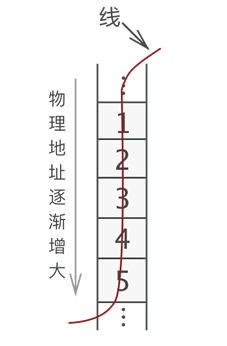
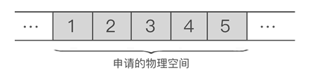
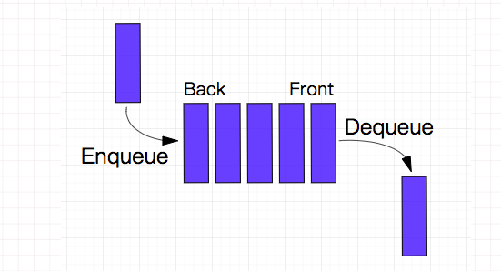
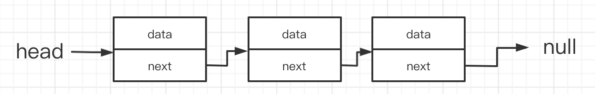

## 概览

什么是数据结构？数据结构的作用是啥？
什么是算法？算法有什么作用？

本篇文章只是简单了解一些专业术语、基本概念，作为后期文章的引导篇。对数据结构和算法有一个基本的概念和了解，以便于后面的 leetcode 刷题、数据结构深入了解做铺垫。

### 基本概念和术语

#### 数据(data)

- 是事实或观察的结果，是对客观事物的`逻辑归纳`，是用于表示客观事物的未经加工的原始素材。
- 在计算机科学中指的是所有能输入到计算机中并被计算机程序`处理的符号的总称`。

#### 数据项(data item)

- 数据项是指数据元素可由若干个`数据项（data item）组成`，数据项是数据的`不可分割`的`最小单位`。
- 数据项是数据记录中`最基本的`、`不可分的`有名`数据单位`，是具有独立含义的`最小标识单位`。

#### 数据元素(data element)

- 它是`数据`的`基本单位`，数据元素也叫做`结点`或`记录`。
- 一个`数据元素`可由`若干`个`数据项`组成.

#### 数据对象(data Object)

- 数据对象指`性质相同`的数据元素的集合，是数据的`子集`；
- `数据对象`简称数据

> 性质相同指数据元素具有相同数量和类型的数据项；

#### 数据结构(data structure)

- 由互相之间存在着`一种`或`多种`关系的数据元素组成的`集合`；这些数据元素之间的关系称为`结构`。

### 数据结构

> 在计算机科学中，`数据结构(英语：data structure)`是计算机中`存储`、`组织数据`的方式。

简单来说数据结构: 是指互相之间存在一种或多种特定关系的数据元素的组合。`数据结构 = 数据元素 + 元素之间的关系`.

数据结构一般分为两个维度：`逻辑结构`和`存储结构`，`逻辑结构`又大致可以分为`线性结构`和`非线性结构`两种。下面会对`逻辑机构`、`存储结构`展开来讲。

常见数据结构：

- `堆栈`（Stack）
- `队列`（Queue）
- `数组`（Array）
- `链表`（Linked List）
- `树` （Tree）
- `图` （Graph）
- `堆积` (Heap)
- `散列表` （Hash table）

#### 基本逻辑结构

**集合结构**： `数组元素的有限集合`。数据元素之间除了”属于同一个集合“的关系之外`没有其他关系`。


**线性结构**： `数据元素的有序集合`。数据元素之间形成`一对一`的关系。


**树形结构**： 树是层次数据结构，树中数据元素之间存在`一对多`的关系。


**图状结构**：  图中数据元素之间的关系是`多对多`。


### 算法

> `算法（algorithm）`，在数学（算学）和计算机科学之中，为任何一系列良定义的具体计算步骤，常用于`计算`、`数据处理`和`自动推理`。作为一个有效方法，算法被用于计算函数，它包含了一系列定义清晰的指令，并可于有限的时间及空间内清楚的表述出来。

#### 算法的基本特征

算法的基本特征： 是一组严谨地定义运算顺序的规则，每一个规则都是`有效的`，是`明确的`，此顺序将在有限的次数下终止。
特征包括：

1. 输入：一个算法必须有零个或以上输入量。
2. 输出：一个算法应有一个或以上输出量，输出量是算法计算的结果。
3. 明确性：算法的描述必须无歧义，以保证算法的实际执行结果是精确地符合要求或期望，通常要求实际运行结果是确定的。
4. 有限性：依据图灵的定义，一个算法是能够被任何图灵完全系统模拟的一串运算，而图灵机只有有限个状态、有限个输入符号和有限个转移函数（指令）。而一些定义更规定算法必须在有限个步骤内完成任务。
5. 有效性：又称可行性。能够实现，算法中描述的操作都是可以通过已经实现的基本运算执行有限次来实现。

#### 常用设计模式

`完全遍历法和不完全遍历法`： 在问题的解是有限离散解空间，且可以验证正确性和最优性时，最简单的算法就是把解空间的所有元素完全遍历一遍，逐个检测元素是否是我们要的解。这是最直接的算法，实现往往最简单。但是当解空间特别庞大时，这种算法很可能导致工程上无法承受的计算量。这时候可以利用不完全遍历方法——例如各种搜索法和规划法——来减少计算量。
`分治法`： 把一个问题`分割`成`相互独立`的`多个部分`分别求解的思路。这种求解思路带来的好处之一便是进行并行计算。
`动态规划`： 当问题的整体最优解就是由`局部最优解组成`的时候，经常采用的一种方法。
`贪心算法`：常见的近似求解思路。当问题的整体`最优解不是（或无法证明是）由局部最优解组成`，且对接的最优性没有要求的时候，可以采用的一种方法。
`线性规划法`： `线性规划（Linear Programming，简称LP）`特指目标函数和约束条件皆为线性的最优化问题。线性规划是最优化问题中的一个重要领域。
`简并法`： 把一个问题通过逻辑或者数学推理，简化成与之等价或者近似的、相对简单的模型，进而求解的方法。

#### 常用实现方法

[递归方法](https://zh.wikipedia.org/wiki/%E9%80%92%E5%BD%92): 递归（英语：Recursion），又译为递回，在数学与计算机科学中，是指在函数的定义中`使用函数自身的方法`。递归一词还较常用于描述以`自相似方法重复事物`的过程。
[迭代方法](https://zh.wikipedia.org/wiki/%E8%BF%AD%E4%BB%A3): 迭代是重复反馈过程的活动，其目的通常是为了接近并到达所需的目标或结果。每一次对过程的`重复被称为一次“迭代”`，而每一次迭代得到的结果会被用来作为`下一次迭代的初始值`。

`顺序计算`: 顺序计算就是把形式化算法用编程语言进行单线程序列化后执行。
`并行计算`: 并行计算（英语：parallel computing）一般是指许多指令得以同时进行的计算模式。在同时进行的前提下，可以将计算的过程分解成小部分，之后以并发方式来加以解决

常用的算法：`递归`、`排序`、`二分查找`、`搜索`、`哈希算法`、`贪心算法`、`分治算法`、`回溯算法`、`动态规划`、`字符串匹配算法`等等。

## 数据结构

数据结构一般分为两个维度： `逻辑结构`和`存储结构`。下面再根据这两个维度来大致了解一下一些常用的知识点。

### 逻辑结构

> 逻辑结构即数据之间的关系，逻辑结构可以分为两种：`线性结构`和`非线性结构`。

`非线性结构`又大致可以分为`图形结构`、`树形结构`、`集合结构`对应上面的分类。

**线性结构**

线性结构：是一个`有序数据元素的集合`，其中数据元素之间的关系是`一对一`的关系，即除了第一个和最后一个元素之外，其他数据元素都是一个`首尾接应`的。
常用的线性结构有：`数组`、`栈`、`队列`、`链表`、`线性表`等。

**非线性结构**

非线性结构：各个数据元素不再保持在`一个线性序列中`，每个数据元素可能与`零个或者多个`其他数据元素发生联系。
常见的非线性结构：`二叉树`、`图`、`树`、`集合`等等。

### 存储结构

逻辑结构指的是数据元素之间的关系，而存储结构是逻辑结构用计算机语言的实现。常见的存储结构有： `顺序存储`、`链式存储`、`索引存储`、`散列存储`。

比较常见的就是`顺序存储`和`链式存储`

**顺序存储结构**

顺序存储结构：把数据元素存放在地址`连续的的存储单元里`，其数据间的`逻辑关系和物理关系一致`；比如数组等等，它存储结构大致如下图所示：


**链式存储结构**

链式存储结构: 把数据元素存放在任意的存储单元里，这组存储单元可以是`连续`的也可以是`不连续`的。数据元素的存储关系`不反映其逻辑关系`，用`指针存放数据元素的地址，我们通过地址可以找到相关联数据元素的位置`。


下面会把比较常用的数据结构再稍微详细的介绍一下。

## 算法

在学习算法和后面的算法实战中首先要非常清楚两个衡量算法的指标，`时间复杂度`和`空间复杂度`。

### 大O复杂度表示法

通过一个代码样例来了解一下什么是`大O`？代码如下：

```js
  function sum (n) {
    let sum = 0;
    for (let i = 0; i < n; i++) {
      sum += i;
    }
    return sum
  }
```

`例1`

这是一个最简单的js代码，不需要关注代码的功能。假设每行代码的执行的时间都是相同为`unit_time`，从代码执行的角度来分析代码的执行时间。第`2行`代码它们只需要一个`unit_time`，但是下面`for循环（第3行、第4行）`它执行代码的时间为`2n*unit_time`，再加上`第6行`的代码执行时间为`unit_time`，到此我们知道总执行时间为`(2n+2)*unit_time`的时间。我们可以从这个样例里面知道，`所有代码执行时间T(n)与每行代码执行次数n成正比`。

来看一下`大O`，公式为`T(n) = O(f(n))`，下面来解释一下`大O`中一些关键性的东西。

- `T(n)`: 它表示代码执行的总时间。
- `n`: 表示数据规模的大小，通俗的讲就是代码执行的次数。
- `f(n)`: 表示每次代码执行的次数总和。因为这是一个公式，所以用`f(n)`来表示。
- `O`: 表示代码的执行时间`T(n)`与`f(n)`表达式成正比。

上面例子通过`大O`表示的话就是`T(n) = O(2n + 2)`，这就是`大O时间复杂度表示法`。

> 大O时间复杂度实际上并不具体表示代码真正的执行时间，而是表示代码`执行时间随数据规模增长变化趋势`，所以，也叫作`渐进时间复杂度`

### 时间复杂度分析

在上面的例子中我们得到公式`T(n) = O(2n + 2)`，当我们在看一些真实算法的时间复杂度时，并没有看到`O(2n + 2)`这种格式的方式，一般都是`O（n）`、`O(n²)`这种格式的，这是问什么呢。因为`大O这种复杂度表示方法`只是表示一种变化趋势。如何分析一段代码的时间复杂度？[王争--时间复杂度分析 三种实用方法](https://time.geekbang.org/column/article/40036)。

#### 只关注循环执行次数最多的一段代码

在上面例子中我们得到的`大O`公式`T(n) = O(2n + 2)`，但是一般不会这么些反而会`O(n)`这样写，因为通常会忽略掉公式中常量、低阶、系数，只需要记录一个最大阶的量级就可以了。我们在`分析一个算法、一段代码的时间复杂度的时候，也只关注循环执行次数最多的那段代码就可以了。`

#### 加法法则：总复杂度等于最大的那段代码的复杂度

通过下面这个一段代码来分析一下`加法法则`，代码如下：

```js
  function sum (n) {
    let sum1 = 0
    for(let i = 0;i < 100; i++) {
      sum1 += i;
    }

    let sum2 = 0;
    for(let i = 0;i < n; i++) {
      sum2 += i;
    }

    let sum3 = 0;
    for(let i = 0; i <= n; i++) {
      for(let j = 0; j <= n; j++) {
        sum3 = sum3 + i * j;
      }
    }
    return sum1 + sum2 + sum3;
  }
```

`例2`

上面代码可以分为三段`sum1`、`sum2`、`sum3`，可以分别求三段代码的`时间复杂度`，再取三段代码中量级最大的作为整段代码的复杂度。下面直接来分析三段代码的`时间复杂度`：

第一段`时间复杂度`是多少呢？这段代码执行了`100`次，但是根据上面的规则我们知道，一个常量的执行时间，跟`n`的规模无关。即使是这个循环执行`1000`次、`10000`次，只要是一个已知数，跟`n`无关，照样也是常良级的执行时间。所以我们可以忽略掉当前

第二段`时间复杂度`为`T(n) = O(n)`，第三段`时间复杂度`为`T(n) = O(n²)`。

那我们怎么算当前所有代码的`总时间复杂度`呢？根据上面的规则我们去当前最大量级的，所以整段代码的`时间复杂度`为`O(n²)`。也就是说:`总的时间复杂度就等于量级最大的那段代码的时间复杂度`。抽象成公式为：

如果`T1(n) = O(f(n))`,`T2(n) = O(g(n))`;那么`T(n) = T1(n) + T2(n) = max(O(f(n)), O(g(n))) = O(max(f(n), g(n)))`.

#### 乘法法则：嵌套代码的复杂度等于嵌套内外代码复杂度的乘积

还是以`例2`里面的第三段代码为样例，来分析一下`乘法法则`的复杂度计算，我们还是用抽象的公式来推导一下：

`T1(n) = O(f(n)), T2(n) = O(g(n));`分别来表示内层、外层的抽象公式，`总时间复杂度`为`T(n) = T1(n) * T2(n) = O(f(n)) * O(g(n)) = O(f(n) * g(n))`, 我们假设`f(n)`和`g(n)`它们两个相等，我们就可以得到`T(n) = O(n²)`。我们再来一个例子来分析一下：

```js
  function sum1 (n) {
    let sum11 = 0;
    for (let i = 0; i < n; i++) {
      sum11 += sum2(i);
    }
  }

  function sum2 (n) {
    let sum22 = 0;
    for (let i = 0; i < n; i++) {
      sum22 += i;
    }
    return sum22;
  }

```

首先看一下`sum1`它的`时间复杂度`，我们假设`sum2`它只是一个普通的操作，`sum1`的时间复杂度就是`T1(n) = O(f(n)) = T1(n) = O(n)`。但是在我们的代码中`sum2`它又是一个循环，`sum2`的时间复杂度为`T2(n) = O(n)`，那么整体的时间复杂度为`T(n) = T1(n) * T2(n) = O(n*n) = O(n²)`。

### 空间复杂度分析

空间复杂度分析相对于时间复杂度分析是相简单的，`时间复杂度`全称是`渐进时间复杂度，表示算法的执行时间与数据规模之间的增长关系`。类比一下，`空间复杂度`全称就是`渐进空间复杂度（asymptotic space complexity），表示算法的存储空间与数据规模之间的增长关系`。

还是来一个例子分析一下，代码如下：

```js
  function sum1 (n) {
    let sum11 = 0;
    for (let i = 0; i < n; i++) {
      sum11 += sum2(i);
    }
    return sum11;
  }
```

在代码第2行声明了一个`sum11`,这行代码会申请了一个空间存储变量，第3行声明了一个变量`i`和传入`n`变量，它们会分别会声明两个空间存储变量，其他的代码并没有占用更多的空间，所以整段代码的空间复杂度就是`O(n)`。

常见的空间复杂度是`O(1)`、`O(n)`、`O(n²)`，像`O(logn)`、`O(nlogn)`这样的对数阶复杂平常都用不到。

### 常见的时间复杂度实例分析

常见复杂度量级并不多，大致如下：

**多项式量级**

- 常量阶O(1)
- 对数阶O(logn)
- 线性阶O(n)
- 线性对数阶O(nlogn)
- 平方阶O(n²)、立方阶O(n³)、.....k次方阶O(n^k)

**非多项式量级**

- 指数阶O(2^n)
- 阶乘阶O(n!)

上面复杂度量级大致可以分为`多项式量级`和`非多项式量级`。其中，非多项式量级只有两个：`O(2^n)`、`O(n!)`。

> 复杂度量级会随着量级的增多而递增


我们把时间`复杂度为非多项式量级`的算法问题叫作 `NP（Non-Deterministic Polynomial，非确定多项式）`问题。当数据规模`n`越来越大时，非多项式量级算法的执行时间会急剧增加，求解问题的执行时间无线增长。所以，非多项式时间复杂度的算法其实是非常低效的算法。

#### O(1)

`O(1)`只是一个常量级时间复杂度的一种表示法，并不是只执行了一行代码。如下面代码所示，它的时间复杂度也是`O(1)`，而不是`O(3)`。

```js
  let i = 0;
  let j = 0;
  let sum = i + j;
```

总结： 只要代码的执行时间不随`n`的增大而增大，这样代码的时间复杂度我们都记作`O(1)`。或者说，`一般情况下，只要算法中不存在循环语句、递归语句、即使有成千上万行的代码，其时间复杂度也是O(1)`。

#### O(logn)、O(nlogn)

对数阶时间复杂度非常常见，它们是比较难分析的，通过下面的例子来看一下：

```js
  let i = 1;
  while (i <= n) {
    i = i * 2;
  }
```

从代码执行的的顺序来看，变量`i`的值从`1`开始，每循环一次就乘以`2`,当大于`n`时，循环结束。变量`i`的取值就是一个等比数列。大致如下：

```js
  2^0、2^1、2^2、.......2^k、2^x = n
```

通过`2^x = n`求解`x`这个问题我们知道`x = log2n`，所以当前代码段的时间复杂度就是`O(log2n)`。
当把`2`替换为`3`时，根据`大O`来标记复杂度的时候，可以忽略系数，记`O(Cf(n)) = O(f(n))`。

**O(nlogn)**

`O(nlogn)`就是一个乘法`O(n * logn)`，如果一段代码的时间复杂度是`O(logn)`，我们玄幻执行`n`遍，时间复杂度就是`O(nlogn)`。而且`O(nlogn)`也是一种非常常见的算法时间复杂度。比如递归排序、快速排序的时间复杂度都是`O(nlogn)`。

#### O(m+n)、O(m*n)

一段代码的复杂度由两个数据的规模来决定。代码如下：

```js
  function sum (m, n) {
    let sum1 = 0;
    for(let i = 0; i < m; i++) {
      sum1 += i;
    }

    let sum2 = 0;
    for(let i = 0; i < n; i++) {
      sum2 += i;
    }
    return sum1 + sum2;
  }
```

在这一段代码中我们要分别计算两个循环的时间复杂度，分别为`O(m)`、`O(n)`两个时间复杂度。那我们能不能应用上面的`加法法则`呢？其实是不能的，因为我们没办法知道`m`大，还是`n`大。所以，是不知道要忽略掉`m或者n`。这一段代码的时间复杂度就是`O(m+n)`。

这里的`O(m) * O(n)`和`O(m) + O(n)`是一样的，也可以推算为`O(m) * O(n) = O(m * n)`。

### 排序

排序算法有很多种，最常见的就是`冒泡排序`、`插入排序`、`选择排序`、`快速排序`、`归并排序`、`计数排序`、`桶排序`、`基数排序`等等。

- 冒泡排序

> 循环数据，比较相近的两个元素的值，如果当前值比下一个元素的值大，交换两者位置。重复循环直到排序正确

- 选择排序

> 首先在未排序的序列中找到`最小（大）元素`，存放到排序序列的起始位置，然后，再从剩余未排序元素中继续寻找`最小（大）元素`，然后放到已排序序列的末尾。以此类推，知道所有元素均排序完毕。

- 插入排序

> 它的工作原理是通过构建有序序列，对于未排序数据，在已排序序列中从后向前扫描，找到相应位置并插入。

- 归并排序

> 该算法是采用分治法（Divide and Conquer）的一个非常典型的应用。将已有序的子序列合并，得到完全有序的序列；即先使每个子序列有序，再使子序列段间有序。若将两个有序表合并成一个有序表，称为2-路归并。 

- 快速排序

> 通过一趟排序将待排记录分隔成独立的两部分，其中一部分记录的关键字均比另一部分的关键字小，则可分别对这两部分记录继续进行排序，以达到整个序列有序。

它们各有各的特点，在我们需求不同时就要选择不同的排序方式，从`时间复杂度`、`是否稳定排序`、`是否原地排序`三个方面来对比结果如下图所示：


### 二分法查找

`二分查找（Binary Search）算法`，也叫`折半查找算法（half-interval search algorithm）`、`对数搜索算法（logarithmic search algorithm）`，是一种在`有序数组`中查找某一特定元素的搜索算法。

二分查找针对的是一个`有序的数据集合`，查找思想有点类似分治思想。每次都通过跟区间的`中间元素`对比，将待查找的`区间缩小为之前的一半`，直到找到要查找的元素，或者区别被缩小为0。

二分查找的**时间复杂度**为`O(logn)`。

假设数据大小为`n`大小，每次查找后数据都会缩小为原来的一半，也就是会除以`2`。最坏的情况下，直到查找区间被缩小为空，才停止。


这是一个等比舒蕾。其中`n/(2^k) = 1`时，`k`的值就是总共缩小的次数。而每一次缩小操作只涉及两个数据的大小比较，所以，经过了`k次`区间缩小操作，时间复杂度就是`O(k)`。通过`n/2^k = 1`,我们可以求得`K = log2n`，所以时间复杂度就是`O(logn)`。

### 哈希算法

哈希算法其实就是`Hash`，它的定义和原理非常简单。将任意长度的二级制值串映射为固定长度的二进制值串，这个映射的规则就是`哈希算法`。而通过原始数据映射之后得到的二进制值串就是`哈希值`。

一个优秀的`哈希算法`大概有以下几个特点：

- 从哈希值不能反向推导出原始数据（所以哈希算法也叫单向哈希算法）；
- 对输入数据非常敏感，哪怕原始数据只修改了一个 Bit，最后得到的哈希值也大不相同；
- 散列冲突的概率要很小，对于不同的原始数据，哈希值相同的概率非常小；
- 哈希算法的执行效率要尽量高效，针对较长的文本，也能快速地计算出哈希值。

`哈希算法`可以应用到很多方面比如：

- 用于安全加密的哈希算法`MD5`和`SHA`
- 唯一标识，百度云转存
- 数据校验，大文件上传

### 广度优先搜索

`广度优先搜索(Breadth-First-Search)`，我们平常都是简称为`BFS`。它其实是一种`"地毯式"`层层推进的搜索策略，即先查找离起始顶点最近的，以此向外搜索。大致搜索过程如下图所示：


### 深度优先搜索

`深度优先搜索（Depth-First-Search）`，`简称 DFS`。与`BFS`不同，更早的访问的节点可能不是更靠近根节点的节点。因此，你在`DFS`中找到的第一条路径可能不是最短路径。


在 DFS中，结点的处理顺序是完全相反的顺序，就像它们被添加到栈中一样，它是后进先出。所以深度优先搜索一般使用栈实现。

### 字符串匹配


## 线性表

`将具有“一对一”关系的数据“线性”地存储到物理空间中，这种存储结构就称为**线性存储结构（简称线性表）**`

线性表包括`数组`、`栈`、`队列`、`链表`等等都是线性结构。下面我们就简单的看一下这四个算是比较常用的结构类型。

线性表存储数据可以细分为2种：

- 将数据依次存储在连续的整块物理空间中，这种存储结构称为`顺序存储结构（简称顺序表）`。

- 数据分散的存储在物理空间中，通过一根线保存着它们之间的逻辑关系，这种存储结构称为`链式存储结构（简称链表）`。


### 术语

数据结构中，一组数据中的每个个体被称为`数据元素（简称元素）`。在线性表中元素都是`一对一`逻辑关系的数据。数据元素之间关系怎么称呼呢？

- 某一元素的左侧相邻元素称为`“直接前驱”`，位于此元素左侧的所有元素都统称为`“前驱元素”`；
- 某一元素的右侧相邻元素称为`“直接后继”`，位于此元素右侧的所有元素都统称为`“后继元素”`；


## 顺序表

顺序表对数据的物理存储结构也有要求。`顺序表存储数据时，会提前申请一整块足够大小的物理空间，然后将数据依次存储起来，存储时做到数据元素之间不留一丝缝隙`。

例如，使用顺序表存储集合 `{1,2,3,4,5}`，数据最终的存储状态如图所示：



由此我们可以得出，将“具有 '一对一' 逻辑关系的数据按照次序连续存储到一整块物理空间上”的存储结构就是顺序存储结构。

## 数组

在大部分的编程语言中都会有一个基本数据类型数组，`数组(Array)是一种线性表数据结构。它用一组连续的内存空间，来存储一组具有相同类型的数据`。
数组为了保持内存数据的连续性，会导致`插入`、`删除`这两个操作比较低效。因为在`插入`、`删除`都会对后续的数组元素进行操作，这两个操作的时间复杂度平均来算为`O(n)`。

## 栈和队列

栈和列表是比较常见的数据结构，在一些代码中我们经常也是能看到的。我们就分别来看一下`栈`和`队列`。
它们两种都是限制访问顺序的数据结构：`栈（先进后出）`、`队列（先进先出）`。大致如下图所示：


### 队列

队列是一种受限的序列，它只能够操作队尾和队首，并且只能在队尾添加元素，在队首删除元素。

队列作为最常见的数据结构同样有着非常广泛的应用，比如消息队列。同时我们也可以通过`JavaScript`中的数组来实现一个简单的队列操作：

```js
  // 声明一个 数据 用以模仿队列
  var queue = [];
  // 向队列中添加 两个元素（入队）
  queue.push(1);
  queue.push(2);
  // 出队
  let dequeue = queue.shift();
  console.log(dequeue, queue);
```

在计算机科学中，一个队列（queue）是一种特殊的抽象数据类型或集合。集合中的实体按顺序保存。

队列基本操作有两种：

- 入队：向队列的后端位置添加实体。
- 出队：从队列的前端位置移除实体。

队列中元素`先进先出FIFO(first in, first out)`如下图所示：


[图片来自](https://github.com/trekhleb/javascript-algorithms/blob/master/src/data-structures/queue/README.zh-CN.md)

以`HTTP 1.0`、`HTTP 1.1` 、`HTTP 2.x`来举一个例子。

我们前端在做性能优化的时候，很多时候会提到的一点就是`“HTTP 1.1 的队头阻塞问题”`。

具体来说，就是`HTTP2` 解决了 `HTTP1.1 中的队头阻塞`问题，但是为什么`HTTP1.1`有队头阻塞问题，HTTP2究竟怎么解决的很多人都不清楚。

其实`“队头阻塞”`是一个专有名词，不仅仅这里有，交换器等其他都有这个问题，引起这个问题的根本原因是使用了`队列`这种数据结构。

在`HTTP 1.0`的版本中每一次请求都需要建立一个`TCP`连接，请求结束后立即断开连接。对于同一个tcp连接，所有的HTTP 1.0请求放入队列中，只有前一个`请求的响应`收到了，然后才能发送下一个请求，这个阻塞主要发生在`客户端`。

> 在HTTP/1.1 中，并发多个请求需要多个TCP链接，且单个域名有6-8个TCP链接请求限制。

在`HTTP 1.1`中，每一个连接都默认是长连接(persistent connection)。

对于`同一个tcp连接`，允许一次发送多个`HTTP 1.1`请求，不必等到前一个响应收到，就可以发送下一个请求。这样解决了`HTTP 1.0`的客户端的
`队头阻塞`，而这也就是`HTTP 1.1`中 `管道（Pipeline）`的概念。

但是,`HTTP 1.1 规定，服务器端的响应的发送要根据请求被接收的顺序排队`，也就是说，先接收到的请求的响应也要先发送。这样造成的问题是，如果最先收到的请求的处理时间长的话，响应生成也慢，就会阻塞已经生成了的响应的发送。也会造成队头阻塞。所以，`HTTP 1.1`的`队头阻塞发生在服务端`。


为了解决`HTTP 1.1`中的`服务器端队头阻塞`，`HTTP 2.x`采用了`二进制分帧`和``多路复用`等方法。

`二进制帧`是`HTTP 2.x`数据通信的最小单位。在`HTTP 1.1`中数据包是文本格式。采用帧可以将请求和响应的数据分割的更小，且二进制协议可以更高效解析。

> HTTP 2.x 中的帧分为头部帧、主体帧。

在`HTTP 2.x`中，`同域名下所有通信都在单个连接上完成，该连接可以承载任意数量的双向数据流。`

`每一个数据流都以消息的形式发送，而消息又由一个或多个帧组成。`

`多个帧之间可以乱序发送，根据帧首部的流标识可以重新组装。`

`多路复用，用于替代原来的序列和阻塞机制。`

在`HTTP/2`中，`同一域名下的所有通信在单个链接完成`，仅占用`一个TCP链接`，且在这一个链接上可以并行请求和响应，互不干扰。

想了解多路复用的可以看我另一篇文章[HTTP 2.x]()

### 栈

栈也是一种受限的序列，它只能够操作栈顶，不管入栈还是出栈，都是在`栈顶操作`。

在计算机科学中, 一个`栈(stack)` 是一种抽象数据类型,用作表示元素的集合,具有两种主要操作:

- push 添加元素到栈的顶端（末尾）。
- pop 移除栈最顶端（末尾）的元素。

以上两种操作可以简单概括为`后进先出 LIFO(last in, first out)`。

此外,应有一个 peek 操作用于访问栈当前顶端(末尾)的元素。（只返回不弹出）

> "栈"这个名称,可类比于一组物体的堆叠(一摞书,一摞盘子之类的)。

可以通过`JS`中的数组类型来模仿栈的操作如下：

```js
    // 声明一个 数据 用以模仿栈
  var stack = [];
  // 向栈中添加 两个元素（push）
  stack.push(1);
  stack.push(2);
  // pop
  let stackPop = stack.pop();
  console.log(stackPop, stack);
```

栈的 `push` 和 `pop` 操作的示意:


[图片来自](https://github.com/trekhleb/javascript-algorithms/blob/master/src/data-structures/stack/README.zh-CN.md)

栈在很多地方都有着应用，比如大家熟悉的浏览器就有很多栈，其实浏览器的执行栈就是一个基本的栈结构，从数据结构上说，它就是一个栈。这也就解释了，我们用递归的解法和用循环+栈的解法本质上是差不多。

栈常见的应用有进制转换，括号匹配，栈混洗，中缀表达式（用的很少），后缀表达式（逆波兰表达式）等。

> 合法的栈混洗操作，其实和合法的括号匹配表达式之间存在着一一对应的关系，也就是说n个元素的栈混洗有多少种，n对括号的合法表达式就有多少种。感兴趣的可以查找相关资料。

## 链表

数据结构中的每`一个结点`对应于`一个存储单元`，这种存储单元称为`存储结点`。简称节点。

**链表中的结点**

链表中每个数据的存储都由以下两部分组成：

- 数据元素本身，其所在的区域称为`数据域（后面用data代指）`。
- 指向直接后继元素的指针，所在的区域称为`指针域（后面用next代指）`。

链表别名`链式存储结构`或`单链表`，用于存储逻辑关系为`一对一`的数据。`与顺序表不同，链表不限制数据的物理存储转态，链表存储的数据元素的为物理存储位置是随机的`。

<!-- 链式存储方式即可用于表示线性结构，也可用于表示非线性结构。
线性链表，`head`称为头`指针`，`head=null（或0）`称为空表，如果是两指针：`左指针（llink）指向前件结点，右指针（rlink）指向后件结点`。 
线性链表的基本运算：`查找、插入、删除`。  -->

例如我们用链表存储`{1,2,3}`三个元素节，大致如下图所示：


链表也有很多种类：常见的链表类型有`单链表`、`双链表`、`循环链表`它们在物理存储时的大致示意图。

**单链表**

`单链表：N个结点链结成一个链表，由于此链表的每一个结点中包含一个指针域，故又称线性链表或单链表。`



**双链表**

`双向链表（简称双链表）是指在前驱和后继方向都能游历(遍历)的线性链表`。
在双向链表结构中，每一个结点除了数据域外，还包括两个指针域，一个指针指向该结点的后继结点，另一个指针指向它的前趋结点。通常采用带表头结点的循环链表形式。


**循环链表**

`循环链表最后一个结点的next指针不为空，而是指向了表的前端。`


> 循环链表的特点是：只要知道表中某一结点的地址，就可搜寻到所有其他结点的地址。

### 链表操作时间复杂度

**单链表**

|操作方法|时间复杂度|说明|
|:---------:|:------------:|:---------:|
|append|O(n)|在链表尾部追加节点|
|search|O(n)|在链表中查找任意元素|
|insert|O(n)|在链表中任意位置插入一个节点|
|remove|O(n)|删除链表中任意位置的一个节点|
|searchNext|O(1)|查找某节点的后继节点|
|insertNext|O(1)|在某一节点后插入一个节点（后继节点）|
|removeNext|O(1)|在某一节点后删除一个节点（后继节点）|

**双链表**

|操作方法|时间复杂度|说明|
|:---------:|:------------:|:---------:|
|search|O(n)|在链表中查找任意元素|
|insert|O(n)|在链表中任意位置插入一个节点|
|remove|O(n)|删除链表中任意位置的一个节点|
|searchNext 或 searchPre|O(1)|查找某节点的后继节点或前驱节点|
|insertNext 或 insertPre|O(1)|插入某节点的后继节点或前驱节点|
|removeNext 或 removePre|O(1)|删除某节点的前驱节点或后继节点|

**循环链表**

|操作方法|时间复杂度|说明|
|:---------:|:------------:|:---------:|
|search|O(n)|在链表中查找任意元素|
|insert|O(n)|在链表中任意位置插入一个节点|
|remove|O(n)|删除链表中任意位置的一个节点|
|searchNext|O(1)|查找某节点的后继节点|
|insertNext|O(1)|在某一节点后插入一个节点（后继节点）|
|removeNext|O(1)|在某一节点后删除一个节点（后继节点）|

### 顺序表与链表的比较

- `顺序表`的存储空间可以是`静态分配`的，也可以是`动态分配`的。`链表`的存储空间是`动态分配`的。
- `顺序表`可以`随机或顺序存取`。`链表`只能`顺序存取`。
- `顺序表`进行`插入/删除`操作平均需要移动近一半元素。`链表`则`修改指针`不需要移动元素。若`插入/删`除仅发生在表的`两端`，宜采用`带尾指针的循环链表`。
- `存储密度=结点数据本身所占的存储量/结点结构所占的存储总量。顺序表的存储密度= 1，链表的存储密度< 1`。

总结：`顺序表是用数组实现的，链表是用指针实现的。用指针来实现的链表，结点空间是动态分配的，链表又按链接形式的不同，区分为单链表、双链表和循环链表`。

## 树和二叉树

树型结构是一类非常重要的非线性数据结构，其所有元素之间具有明显的层次特性。树中最常用的就是二叉树。

`树 是由n（n>=1）个有限节点组成一个具有层次关系的集合。它具有以下特点：每个节点有零个或多个子节点；没有父节点的节点称为 根 节点；每一个非根节点有且只有一个 父节点`。


将具有`“一对多”`关系的集合中的数据元素按照`图A`的形式进行存储，整个存储形状在逻辑结构上看，类似于实际生活中倒着的`树图B`倒过来），所以称这种存储结构为`“树型”存储结构`。

### 树的节点

`节点`：使用树结构存储的每一个数据元素都被称为`"节点"`。
`树根节点（简称“根节点”）`：每一个非空树都有且只有一个被称为`根的节点`。
`叶子节点`：如果结点没有任何子结点，那么此结点称为`叶子节点（叶节点）`。

> 树根的判断依据为：如果一个结点没有父结点，那么这个结点就是整棵树的根结点。

### 子树和空树

`子树`：我们上图整体树的根节点为`节点A`，而如果单看节点`B`、`E`、`F`等等组成的部分来说，也是一棵树，而且`节点B`为这棵树的`根节点`。所以`B、E、F`这几个节点组成的树为整棵树的子树；

> 注意：单个结点也是一棵树，只不过根结点就是它本身。图 A中，结点 K、L、F 等都是树，且都是整棵树的子树。

知道了子树的概念后，`树也可以这样定义：树是由根结点和若干棵子树构成的`。

`空树`：如果集合本身为空，那么构成的树就被称为空树。`空树中没有结点`。

> 补充：在树结构中，对于具有同一个根结点的各个子树，相互之间不能有交集。例如，图（A）中，除了根结点 A，其余元素又各自构成了三个子树，根结点分别为 B、C、D，这三个子树相互之间没有相同的结点。如果有，就破坏了树的结构，不能算做是一棵树。

### 节点的层数和树的深度

- `结点的层数`：根结点的层数为1，其余结点的层数等于其双亲结点的层数加1。
- `堂兄弟`：双亲在同一层的结点互为堂兄弟。
- `树的深度`：树中结点的最大层数称为树的深度。

### 树的遍历

- `先序遍历（DLR）`：先序遍历 若二叉树为空，则空操作，否则`访问根结点`——`先序遍历根的左子树`——`先序遍历根的右子数`。
- `中序遍历（LDR）`：若二叉树为空，则空操作，否则`中序遍历左子树`——`访问根结点`——`中序遍历右子树`。
- `后序遍历（LRD）`：若二叉树为空，则空操作，否则`后序遍历左子树`——`后序遍历右子树`——`访问根结点`。


- 先序遍历：A -> B -> D -> H -> I -> E -> C -> F -> G -> J -> K
- 中序遍历：H -> D -> I -> B -> E -> A -> F -> C -> J -> K -> G
- 后序遍历：H -> I -> D -> E -> B -> F -> K -> J -> G -> C -> A

### 二叉树

二叉树是树中的一种，二叉树也是树中最常用的一种。怎么才会被称为二叉树呢？

- 非空二叉树只有一个根节点；
- 每一个节点最多有两棵子树，且分别称为该节点的左子树与右子树。

二叉树中有两个比较常用的`满二叉树`和`完全二叉树`。

#### 满二叉树

`满二叉树`： 二叉树中`除了叶子结点`，每个节点的`度`都为`2`，则此二叉树称为满二叉树。并且满二叉树除了满足普通二叉树的性质，还具有一下性质：

1. 满二叉树中第i层的节点数为`2^n-1`个。
2. 深度为K的满二叉树必有`(2^k) - 1`个节点，叶子数为`2^k-1`。
3. 满二叉树中不存在度为`1`的节点，每一个分支节点中都两棵深度相同的子树，且`叶子节点`都在最底层。
4. 具有n个节点的满二叉树的深度为`log2(n+1)`。

#### 完全二叉树

`完全二叉树`： 如果二叉树中`除去最后一层节点为满二叉树`，且最后一层的结点`依次从左到右`分布，则此二叉树被称为完全二叉树。

对于任意一个完全二叉树来说，如果将含有的结点按照层次`从左到右依次`标号，对于任意一个`节点i`，完全二叉树还有以下几个结论成立：

1. 当`i > 1`时，父亲节点为节点`[i/2]`。`(i=1时，表示的是根节点，无父亲节点)`。
2. 如果`2*i > n (总节点的个数)`，则节点`i`肯定没有左子节点（为叶子节点）；否则其左孩子是节点`2*i`。
3. 如果`2*i + 1 > n`，则节点`i`肯定没有右子节点；否则右子节点是节点`2*i + 1`。

### 二叉树遍历

二叉树也有`先序遍历`、`中序遍历`、`后续遍历`，但是也会经常的被问到，`广度优先`、`深度优先`。

`广度优先搜索（ BFS）`是一种遍历或搜索数据结构（如树或图）的算法，也可以在更抽象的场景中使用。

它的特点是越是接近根结点的结点将越早地遍历。

例如，我们可以使用 BFS 找到从起始结点到目标结点的路径，特别是最短路径。

在 BFS中，结点的处理顺序与它们添加到队列的顺序是完全相同的顺序，即先进先出，所以广度优先搜索一般使用队列实现。

- 从上到下打印二叉树
- 单词接龙
- 员工的重要性
- 岛屿数量

### 二叉查找树

`二叉查找树`就是`二叉排序树`，也叫`二叉搜索树`。二叉查找树或者是一棵空树，或者是具有下列性质的二叉树： 

1. 若左子树不空，则左子树上所有结点的值均小于它的根结点的值；
2. 若右子树不空，则右子树上所有结点的值均大于它的根结点的值；
3. 左、右子树也分别为二叉排序树；
4. 没有键值相等的结点。


### 平衡二叉树

`平衡二叉树`又称`AVL树`，它或者是一棵空树，或者是具有下列性质的二叉树：

- 它的`左子树`和`右子树`都是`平衡二叉树`。
- `左子树`和`右子树`的`深度之差的绝对值不超过1`。


`AVL树`是最先发明的`自平衡二叉查找树算法`。在`AVL`中任何节点的儿歌儿子子树的高度最大差别为`1`，所以他也被称为`高度平衡树`，`n个节点`的`AVL树`最大深度约`1.44log2n`。
`查找`、`插入`、`删除`在平衡和最坏情况下都是`O(logn)`。增加和删除可能需要通过一次或多次树旋转来重新平衡这个树。

### 红黑树

红黑树是平衡二叉树的一种，它保证在最坏情况下基本动态几何操作的时间复杂度为`O(logn)`。`红黑树`和`平衡二叉树区别`如下:

1. 红黑树放弃了追求完全平衡，追求大致平衡，在与平衡二叉树的时间复杂度相差不大的情况下，保证每次插入最多只需要`三次旋转`就能达到平衡，实现起来也更为简单。
2. 平衡二叉树追求绝对平衡，条件比较苛刻，实现起来比较麻烦，每次插入新节点之后需要旋转的次数不能预知。

## 图

图是一种较`线性表`和`树`更为`复杂`的数据结构，在线性表中，数据元素之间仅有`线性关系`，在树形结构中，数据元素之间有着明显的`层次关系`，而在图形结构中，节点之间的关系可以是`任意的`，图中任意两个数据元素之间都可能相关。
