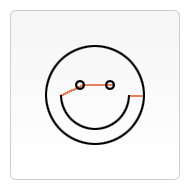

## 绘制路径
图形的基本元素是路径。路径是通过不同颜色和宽度的线段或曲线相连形成的不同形状的点的集合。一个路径，甚至一个子路径，都是闭合的。使用路径绘制图形需要一些额外的步骤。
1、首先，你需要创建路径起始点。
2、然后你使用画图命令去画出路径。
3、之后你把路径封闭。
4、一旦路径生成，你就能通过描边或填充路径区域来渲染图形。
### 常用方法
#### __beginPath()__
新建一条路径，生成之后，图形绘制命令会被指向到<font color="red">路径上生成路径。</font>
#### __closePath()__
闭合路径之后图形绘制命令又<font color="red">重新指向到上下文</font>中
#### __stroke()__
通过<font color="red">线条</font>来绘制图像轮廓
#### __fill()__
通过填充路径的内容区域生成<font color="red">实心的图形</font>。
#### __moveTo(x, y)__
将笔触移动到指定的坐标x以及y上。
你通常会使用moveTo()函数设置起点，使用moveTo()绘制一些不连续的路径
移动中心点
```javascript
    function draw () {
        var canvas = document.querySelector('.canvas');
        if (canvas.getContext) {
            var ctx  = canvas.getContext('2d');
            ctx.beginPath();
            ctx.arc(75,75,50,0,Math.PI*2,true); // 绘制
            ctx.moveTo(110,75);
            ctx.arc(75,75,35,0,Math.PI,false);   // 口(顺时针)
            ctx.moveTo(65,65);
            ctx.arc(60,65,5,0,Math.PI*2,true);  // 左眼
            ctx.moveTo(95,65);
            ctx.arc(90,65,5,0,Math.PI*2,true);  // 右眼
            ctx.stroke();
        }
    }
```
 
#### __lineTo(x, y)__
<font color="red">绘制直线</font>，需要用到的方法lineTo().
绘制一条从当前位置到指定x以及y位置的直线
绘制一个填充、描边的三角形
```javascript
    function draw () {
        var canvas = document.querySelector('.canvas');]
        if (canvas.getContext) {
            var ctx = canvas.getContext('2d');
            // 填充三角形
            ctx.beginPath();
            ctx.moveTo(25,25);
            ctx.lineTo(105,25);
            ctx.lineTo(25,105);
            ctx.fill();

            // 描边三角形
            ctx.beginPath();
            ctx.moveTo(125,125);
            ctx.lineTo(125,45);
            ctx.lineTo(45,125);
            ctx.closePath();
            ctx.stroke();
        }
    }
```
 
### 注意
注意：当前路径为空，即调用beginPath()之后，或者canvas刚建的时候，<font color="red">第一条路径</font>构造命令通常被视为是<font color="red">moveTo（）</font>，无论最后的是什么。出于这个原因，你几乎总是要在设置路径之后专门指定你的起始位置。
注意：当你调用<font color="red">fill()</font>函数时，所有没有闭合的形状都会自动闭合，所以你<font color="red">不需要</font>调用<font color="red">closePath()</font>函数。但是调用<font color="red">stroke()</font>时<font color="red">不会</font>自动闭合。
### 实例
绘制一个
```html
    <!DOCTYPE html>
<html lang="en">
<head>
    <meta charset="UTF-8">
    <meta name="viewport" content="width=device-width, initial-scale=1.0">
    <meta http-equiv="X-UA-Compatible" content="ie=edge">
    <title>Document</title>
    <style lang="">
        .canvas {
            width: 300px;
            height: 300px;
            margin: auto;
        }
    </style>
</head>
<body>
    <canvas class="canvas"></canvas>
    <script>
        
        function draw() {
            var canvas = document.getElementById('canvas');
            if (canvas.getContext){
                var ctx = canvas.getContext('2d');
                ctx.beginPath();
                ctx.moveTo(75,50);
                ctx.lineTo(100,75);
                ctx.lineTo(100,25);
                ctx.fill();
            }
        }
        draw();
    </script>
</body>
</html>
```