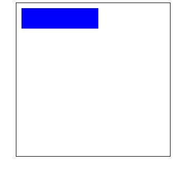
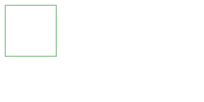
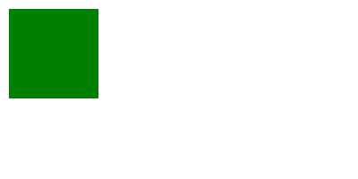

## 概述
canvas元素负责在页面中设定一个区域，然后就可以通过JavaScript动态地在这个区域中绘制图形。
与浏览器环境中的其他组件类似，<canvas>由几组API构成，但非所有浏览器都支持所有这些api,基本绘制能力的2D上下文，<canvas>还建议了一个名为webGL的3D上下文。
### 基本用法
```html
    <!DOCTYPE html>
    <html lang="en">
    <head>
        <meta charset="UTF-8">
        <meta name="viewport" content="width=device-width, initial-scale=1.0">
        <meta http-equiv="X-UA-Compatible" content="ie=edge">
        <title>Document</title>
        <style>
            .canvas1 {
                border: 1px solid #000;
                margin: auto;
                display: block;
            }
        </style>
    </head>
    <body>
        <canvas class="canvas1"  width="300" height="300"></canvas>
        <script>
            // 使用canvas必须先设置其width和height属性，指定可以绘图的区域大小
            var canvas = document.querySelector('.canvas');
            var ctx = null;
            // 判断当前浏览器支不支持 canvas
            if (canvas.getContext) {
                ctx = canvas.getContext('2d');
                ctx.strokeStyle = 'red';
                ctx.fillStyle = '#0000ff';
                ctx.fillRect(0, 0, 150, 150);
            }
            // fillStyle 填充颜色、strokeStyle 描边颜色
            // 字符串（颜色名、十六进制、rgb、rgba、hsl、hsla）、渐变对象、模式对象

        </script>
    </body>
    </html>
```
可以获取到<font color="red">canvas</font>dom,再通过<font color="red">getContext('2d')</font>获取到2D上下文，通过fillStyle<font color="red">fillStyle</font>设置填充颜色，通过<font color="red">strokeStyle</font>设置描边颜色（默认显示 #000），fillRect(0, 0, 150, 150)
设置矩形的位置和长宽
效果如下所示：
  
### 栅格
在我们开始画图之前，我们需要了解一下画布栅格（canvas grid）以及坐标空间。栅格的起点为左上角（坐标为（0,0））。所有元素的位置都相对于原点定位。所以图中蓝色方形左上角的坐标为距离左边（X轴）x像素，距离上边（Y轴）y像素（坐标为（x,y））。在课程的最后我们会平移原点到不同的坐标上，旋转网格以及缩放。现在我们还是使用原来的设置。
  
### fillStyle strokeStyle
fillStyle、strokeStyle这个两个属性的值可以是字符串、渐变对象或者模式对象，而且他们的默认值都是"#000000"。字符串值可以为颜色值、十六进制码、rgb、rgba、hsl或hsla.
### 绘制矩形
不同于SVG，HTML中的元素canvas只支持一种原生的图形绘制：矩形。所有其他的图形的绘制都至少需要生成一条路径。不过，我们拥有众多路径生成的方法让复杂图形的绘制成为了可能。
#### fillRect
fillRect(x, y, width, height)
参数
x
矩形起始点的 x 轴坐标。
y
矩形起始点的 y 轴坐标。
width
矩形的宽度。
height
矩形的高度。
绘制一个
  
  ```html
    <canvas id="canvas"></canvas>
```
```javascript
    var canvas = document.getElementById("canvas");
    var ctx = canvas.getContext("2d");

    ctx.strokeStyle = "green";
    ctx.fillRect(10, 10, 100, 100);
```
#### strokeRect
参数
x
矩形起始点的 x 轴坐标。
y
矩形起始点的 y 轴坐标。
width
矩形的宽度。
height
矩形的高度。
  
```html
    <canvas id="canvas"></canvas>
```
```javascript
    var canvas = document.getElementById("canvas");
    var ctx = canvas.getContext("2d");

    ctx.strokeStyle = "green";
    ctx.strokeRect(10, 10, 100, 100);
```
#### clearRect
参数
x
矩形起始点的 x 轴坐标。
y
矩形起始点的 y 轴坐标。
width
矩形的宽度。
height
矩形的高度。
这仅是一段简单地使用 clearRect 方法的代码片段。
  
```html
<canvas id="canvas"></canvas>
```
```javascript
    var canvas = document.getElementById("canvas");
    var ctx = canvas.getContext("2d");

    ctx.beginPath();
    ctx.moveTo(20,20);
    ctx.lineTo(200,20);
    ctx.lineTo(120,120);
    ctx.closePath(); // draws last line of the triangle
    ctx.stroke();

    ctx.clearRect(10, 10, 100, 100);

    // clear the whole canvas
    // ctx.clearRect(0, 0, canvas.width, canvas.height);
```
