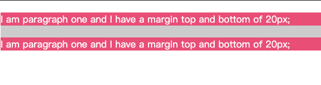

## 简介
**块格式化上下文（Block Formatting Context，BFC）** 是Web页面的可视化CSS渲染的一部分，是块盒子的布局过程发生的区域，也是浮动元素与其他元素交互的区域。
> 注意：一个BFC的范围包含创建该上下文元素的所有子元素，但不包括创建了新BFC的子元素的内部元素。这从另一方角度说明，一个元素不能同时存在于两个BFC中。因为如果一个元素能够同时处于两个BFC中，那么就意味着这个元素能与两个BFC中的元素发生作用，就违反了BFC的隔离作用。

下列方式会创建**块格式上下文**：
- 根元素或包含根元素的元素
- 浮动元素（元素的 `float` 不是 `none`）
- 绝对定位元素（元素的 `position` 为 `absolute` 或 `fixed`）
- 行内块元素（元素的 `display` 为 `inline-block`）
- 表格单元格（元素的 `display`为 `table-cell`，HTML表格单元格默认为该值）
- 表格标题（元素的 `display` 为 t`able-caption`，HTML表格标题默认为该值）
- 匿名表格单元格元素（元素的 `display`为 `table`、`table-row`、 `table-row-group`、`table-header-group`、`table-footer-group`（分别是`HTML table`、`row`、`tbody`、`thead`、`tfoot`的默认属性）或 `inline-table`）
- `overflow` 值不为 `visible` 的块元素
- `display` 值为 `flow-root` 的元素
- `contain` 值为 `layout`、`content`或 `strict` 的元素
- 弹性元素（`display`为 `flex` 或 `inline-flex`元素的直接子元素）
- 网格元素（`display`为 `grid` 或 `inline-grid` 元素的直接子元素）
- 多列容器（元素的 `column-count` 或 `column-width` 不为 `auto`，包括 `column-count` 为 1）
- `column-span` 为 all 的元素始终会创建一个新的`BFC`，即使该元素没有包裹在一个多列容器中（标准变更，Chrome bug）。

块格式化上下文包含创建它的元素内部的所有内容。

**表现**
在**BFC(Block formatting contexts)**中，在**包含块**内一个盒子一个盒子不重叠地**垂直排列**，两个兄弟盒子直接的垂直距离由 `margin`决定。**浮动**也是如此（虽然有可能两个盒子的距离会因为 floats而变小），除非该盒子再创建一个新的`BFC`。

## 三中文档流的定位方案
我们常说的文档流其实分为**定位流**、**浮动流**、**普通流三种**。而普通流其实就是指`BFC`中的`FC`。`FC(Formatting Context)`，直译过来是格式化上下文，它是页面中的一块渲染区域，有一套渲染规则，决定了其子元素如何布局，以及和其他元素之间的关系和作用。常见的FC有BFC(Block Formatting Contexts)、IFC，还有GFC(GridLayout Formatting Contexts)和FFC(Flex Formatting Contexts)。

大致的文档流分类
- 普通文档流(Normal flow)
- 浮动(Floats)
- 绝对定位(Absolute positioning)

### 普通文档流
- 在普通文档流中，盒一个接着一个排列；
- 在块级格式化上下文里面， 它们竖着排列；
- 在行内格式化上下文里面， 它们横着排列；
- 当position为static或relative，并且float为none时会触发普通文档流；
- 对于静态定位(static positioning)，position: static，盒的位置是普通文档流布局里的位置；
- 对于相对定位(relative positioning)，position: relative，盒偏移位置由top、bottom、left、right属性定义。即使有偏移，仍然保留原有的位置，其它普通文档流不能占用这个位置。

### 浮动(Floats)
- 左浮动元素尽量靠左、靠上，右浮动同理
- 这导致普通文档流环绕在它的周边，除非设置 clear 属性
- 浮动元素不会影响块级元素的布局
- 但浮动元素会影响行内元素的布局，让其围绕在自己周围，撑大父级元素，从而间接影响块级元素布局
- 最高点不会超过当前行的最高点、它前面的浮动元素的最高点
- 不超过它的包含块，除非元素本身已经比包含块更宽
- 行内元素出现在左浮动元素的右边和右浮动元素的左边，左浮动元素的左边和右浮动元素的右边是不会摆放浮动元素的

### 绝对定位(Absolute positioning)
- 绝对定位方案，盒从普通文档流中被移除，不影响普通文档流的布局；
- 它的定位相对于它的包含块，相关CSS属性：top、bottom、left、right；
- 如果元素的属性position为absolute或fixed，它是绝对定位元素；
- 对于position: absolute，元素定位将相对于上级元素中最近的一个relative、fixed、absolute，如果没有则相对于body；

## BFC大致规则
- 内部的Box会在垂直方向上一个接一个的放置
- 内部的Box垂直方向上的距离由margin决定。（完整的说法是：属于同一个BFC的两个相邻Box的margin会发生折叠，不同BFC不会发生折叠。）
- 每个元素的左外边距与包含块的左边界相接触（从左向右），即使浮动元素也是如此。（这说明BFC中子元素不会超出他的包含块，而position为absolute的元素可以超出他的包含块边界）
- BFC的区域不会与float的元素区域重叠
- 计算BFC的高度时，浮动子元素也参与计算

**普通文档流布局**
- 浮动的元素是不会被父级计算高度
- 非浮动元素会覆盖浮动元素的位置
- margin会传递给父级元素
- 两个相邻元素上下的margin会重叠

## 开发中的使用
- BFC 可以防止 margin 折叠
- 可以阻止元素被浮动元素覆盖
- 多列布局中使用 BFC
- 可以包含浮动元素

### BFC 可以防止 margin 折叠
了解边距合并是另一个被低估的 `CSS` 技能。在下一个示例中，假设有一个背景颜色为灰色的 `div`。
这个 div 包含两个标签 p。外部 div 元素的 margin-bottom 为 `40` 像素，标签 p 的顶部和底部 margin 都是 20 像素。
```html
    <div class="outer">
        <p>I am paragraph one and I have a margin top and bottom of 20px;</p>
        <p>I am paragraph one and I have a margin top and bottom of 20px;</p>
    </div>
```
```css
    .outer {
        background-color: #ccc;
        margin: 0 0 40px 0;
    }
    p {
        padding: 0;
        margin: 20px 0 20px 0;
        background-color: rgb(233,78,119);
        color: #fff;
    }
```
效果如下图所示：

可以看到它和外层`div`的`margin-bottom`也有重叠，两个相邻的p段落的`margin`也有重叠。
在CSS当中，**相邻**的两个盒子（可能是兄弟关系也可能是祖先关系）的外边距可以结合成一个**单独**的外边距。这种合并外边距的方式被称为**折叠**，并且因而所结合成的外边距称为**折叠外边距**。折叠的结果按照如下规则计算：
- 两个相邻的外边距都是正数时，折叠结果是它们两者之间较大的值。
- 两个相邻的外边距都是负数时，折叠结果是两者绝对值的较大值。
- 两个外边距一正一负时，折叠结果是两者的相加的和。
> 产生折叠的必备条件：margin必须是邻接的!
如果我们把盒子设为 **BFC**，它现在包含了标签 `p` 和它们的**边距**，这样它们就不会**折叠**，我们可以看到边距后面容器的**灰色背景**。
修改css代码如下：
```css
    .outer {
        background-color: #ccc;
        margin: 0 0 40px 0;
        overflow: auto;
    }
```
效果图如下：


### 可以阻止元素被浮动元素覆盖、可以包含浮动元素
你将熟悉 **BFC** 的这种行为，因为使用**浮动**的任何列类型布局都是这样工作的。如果一个项目创建了一个 BFC，那么该项目将**不会包裹**任何浮动元素。在下面的例子中，代码如下：
```html
<div class="outer">
    <div class="float">I am a floated element.</div>
    <div class="text">I am textI am textI am textI am textI am textI am textI am textI am textI am textI am textI am text</div>
</div>
```
```css
    .outer {
        width: 200px;
        border: 1px solid #00ff00;
        padding: 10px;
    }
    .float {
        float: left;
        width: 60px;
        height: 60px;
        padding: 10px;
        background-color: #ff00ff;
    }
```
效果如下图所示：

我可以通过将包裹文本的 div 设置为 BFC 来防止这种包裹行为。新增css代码如下：
```css
.text {
  overflow: auto;
}
```

这实际上是我们创建具有多个列的浮动布局的方法。浮动项还为该项创建了一个 BFC，因此，如果右边的列比左边的列高，那么我们的列就不会相互环绕。

### 在多列布局中使用 BFC
**如果我们创建一个占满整个容器宽度的多列布局，在某些浏览器中最后一列有时候会掉到下一行。这可能是因为浏览器四舍五入了列宽从而所有列的总宽度会超出容器。但如果我们在多列布局中的最后一列里创建一个新的BFC，它将总是占据其他列先占位完毕后剩下的空间**。
代码如下：
```html
    <div class="container">
        <div class="column">column 1</div>
        <div class="column">column 2</div>
        <div class="column">column 3</div>
    </div>
```
```css
    .column {
        width: 31.33%;
        background-color: green;
        float: left;
        margin: 0 1%;
    }
    .column:last-child {
        float: none;
    }
```
效果如下：

添加以下样式创建一个 BFC:
```css
    .column:last-child {
        float: none;
        overflow: hidden; 
    }
```


## 总结
记录了什么叫做BFC，有哪些触发条件，在应用中有几种常用的方法。

## 参考
> [理解 CSS 布局和 BFC](https://mp.weixin.qq.com/s/ifg6jtxK9iwIc6JfUkT8OQ)
> [CSS中重要的BFC](https://mp.weixin.qq.com/s/gS-HPWZnrwaEM-X3vDEPyQ)
> [前端进阶之你真的知道BFC是什么吗？](https://mp.weixin.qq.com/s/Ywxlr3nex--2-qTG2KjLGA)