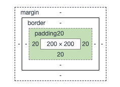
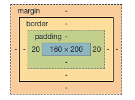
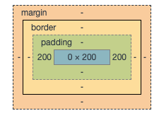

## 简介
**padding** 简写属性在一个声明中设置所有内边距属性。所有浏览器都支持 padding 属性，这里就多做赘述了，但是要注意以下：
> 任何的版本的 Internet Explorer （包括 IE8）都不支持属性值 "inherit"。

**可能的值**
| 值 | 描述 |
|:----------:|:-------------:|
| auto | 浏览器计算内边距。 |
| length | 规定以具体单位计的内边距值，比如像素（px）、厘米(cm)等。默认值是 0px。 |
| % | **规定基于父元素的宽度的百分比的内边距。** |
| inherit | 规定应该从父元素继承内边距。 |

本篇目录：
- padding对block元素的影响
- padding对inline元素的影响
- 关于padding的百分比值
- padding的应用场景

## padding对block的影响
- width固定
- width为auto 或者 box-sizing为border-box的时候

### width固定
padding是会影响元素的尺寸的，padding会对block元素的尺寸产生影响。代码如下：
**html**
```html
    <div class="box"></div>
```
**css**
```css
     .box{
        width:200px;
        height:200px;
        background-color: #ffed53;
        padding:20px;
    }
```
显示结果如下：

验证了上面的猜测，**padding会对block元素的尺寸产生影响**；
### width为auto 或者 box-sizing为border-box的时候
首先要知道box-sizing为border-box代表什么意思，其实就是盒模型为ie模式。ie的盒模型就是他的**content+padding+border**都算在盒模型内。
这个用上面的例子就不太合适，看下面的一个例子：
**html**
```html
    <div class="box">
        文字的应该怎么放置？
    </div>
```
**css**
```css
    .box{
        width: 200px;
        height: 200px;
        box-sizing: border-box;
        background-color: #ffed53;
        padding:0 20px;
    }
```
显示如下：


对于block水平元素，但是**width:auto**或**box-sizing为border-box**的时候padding**不会影响**元素的尺寸。当padding
大小**超过宽度**时，宽度按`padding的宽度`显示，里面的**文字按最小宽度**显示。

### 结论
- **padding值大于元素本身的宽度时，一定会影响尺寸**。
- **width非auto，padding影响尺寸**。
- **width为auto或box-sizing为border-box，同时padding值没有超过元素本身的宽度，不影响尺寸**。