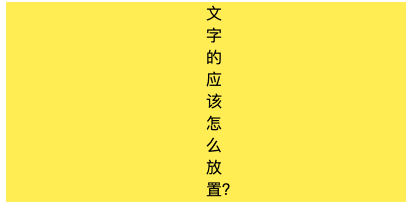
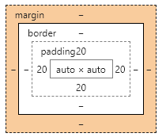
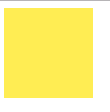
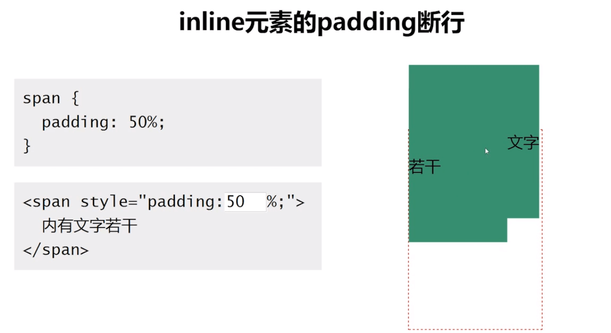
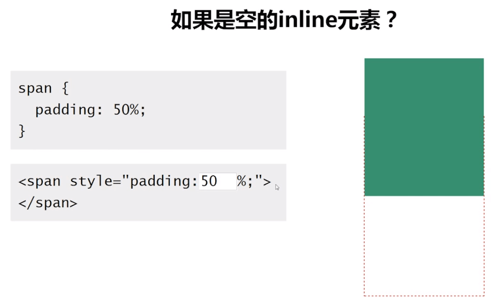
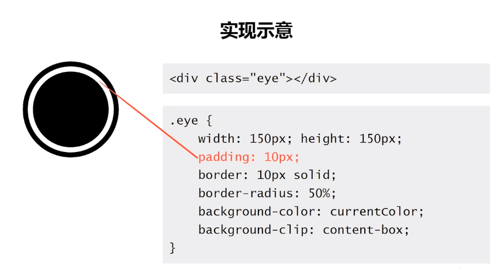
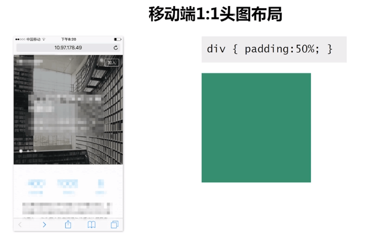
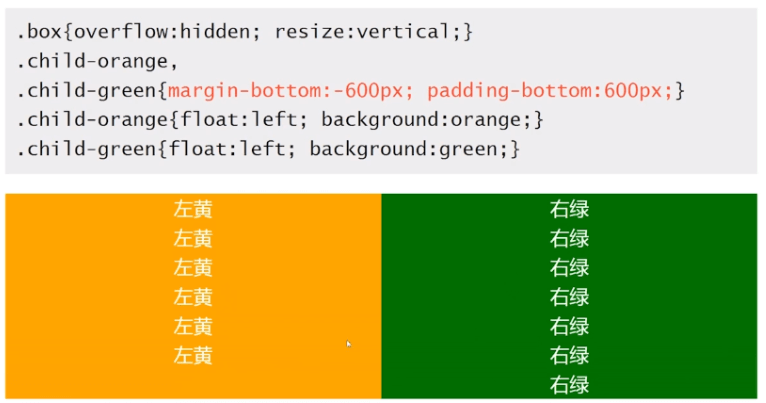
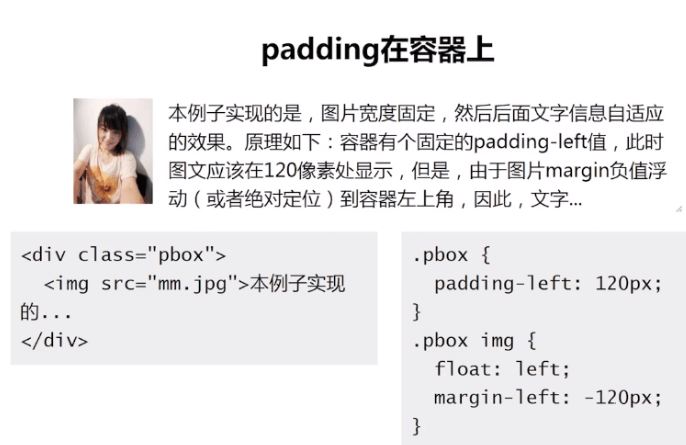
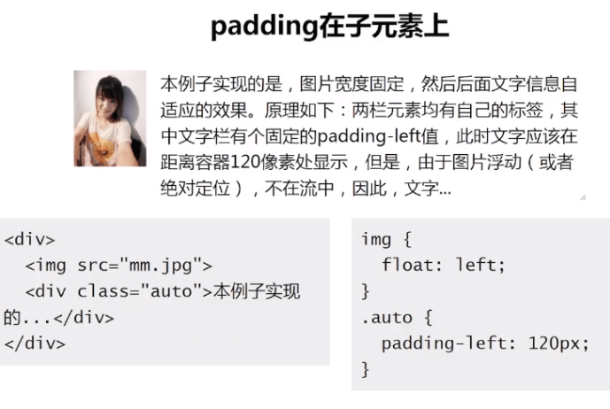

## 简介
**padding** 简写属性在一个声明中设置所有内边距属性。所有浏览器都支持 padding 属性，这里就多做赘述了，但是要注意以下：
> 任何的版本的 Internet Explorer （包括 IE8）都不支持属性值 "inherit"。

**可能的值**

| 值 | 描述 |
|:----------:|:-------------:|
| auto | 浏览器计算内边距。 |
| length | 规定以具体单位计的内边距值，比如像素（px）、厘米(cm)等。默认值是 0px。 |
| % | **规定基于父元素的宽度的百分比的内边距。** |
| inherit | 规定应该从父元素继承内边距。 |

> padding不支持负值

本篇目录：
- padding对block元素的影响
- padding对inline元素的影响
- 关于padding的百分比值
- padding的应用场景

## padding对block的影响
- width固定
- width为auto 或者 box-sizing为border-box的时候

### width固定
padding是会影响元素的尺寸的，padding会对block元素的尺寸产生影响。代码如下：
**html**
```html
    <div class="box"></div>
```
**css**
```css
     .box{
        width:200px;
        height:200px;
        background-color: #ffed53;
        padding:20px;
    }
```
显示结果如下：

验证了上面的猜测，**padding会对block元素的尺寸产生影响**；
### width为auto 或者 box-sizing为border-box的时候
首先要知道box-sizing为border-box代表什么意思，其实就是盒模型为ie模式。ie的盒模型就是他的**content+padding+border**都算在盒模型内。
这个用上面的例子就不太合适，看下面的一个例子：
**html**
```html
    <div class="box">
        文字的应该怎么放置？
    </div>
```
**css**
```css
    .box{
        width: 200px;
        height: 200px;
        box-sizing: border-box;
        background-color: #ffed53;
        padding:0 20px;
    }
```
显示如下：

<!--  -->
对于block水平元素，但是**width:auto**或**box-sizing为border-box**的时候padding**不会影响**元素的尺寸。

修改css代码如下：
**css**
```css
  .box{
    width: 200px;
    height: 200px;
    box-sizing: border-box;
    background-color: #ffed53;
    padding:0 200px;
  }
```


当`padding`大小**超过宽度**时，宽度按`padding的宽度`显示，里面的**文字按最小宽度**显示。

### 结论
- **padding值大于元素本身的宽度时，一定会影响尺寸**。
- **width非auto，padding影响尺寸**。
- **width为auto或box-sizing为border-box，同时padding值没有超过元素本身的宽度，不影响尺寸**。

## padding对inline元素的影响
在上面代码的基础上修改代码如下：
**css**
```css
    .box{
        display: inline;
        background-color: #ffed53;
        padding: 20px;
    }
```
显示效果如下：


**水平padding影响尺寸，垂直padding不影响尺寸，但会影响背景色（占据空间）**。

### 结论
- **水平padding影响尺寸，垂直padding不影响尺寸，但会影响背景色（占据空间）**。

## 关于padding的百分比值
- 关于block元素的padding的百分比值
- 关于inline元素的padding的百分比值

### block元素的padding的百分比值

**padding百分比均是相对于父元素的宽度计算的**。实现效果如下：

**html**
```html
    <div class="container">
        <div class="box"></div>
    </div>
```
**css**
```css
    .container {
        width: 100px;
    }
    .box{
        /* width: 100px; */
        background-color: #ffed53;
        padding: 50%;
    }
```
显示效果如下，可以明显看到`box`的宽高都是`100px`;



### inline水平元素的padding百分比值
注意以下几点：
- 同样相对于宽度计算
- 默认的高度宽度细节有差异
- padding会断行
```html
    <style>
       .container{
           width: 100px;
           height: 200px;
       }
        .box{
            background-color: #8ec63f;
            padding:50%;
        }
    </style>
    <div class="container">
        <span class="box">若干文字</span>
    </div>
```



`iniline`元素的垂直padding会让“幽灵空白节点”显现，也就是规范中的“strut”出现。

## 标签元素的内置paading
- ol/li元素内置padding-left, 但单位是px不是em;
    1. 例如chrom浏览器下是40px;
    2. 所以如果字号很小，间距就会很开；
    3. 如果字号很大，序号就会爬到容器外面

> 备注：文字大小一般为12px~14px ，padding-left 为22px~25px，基本可以实号与下面的内容对齐。

- 所有浏览器input/textarea输入框内置padding
- 所有浏览器button按钮内置padding
- 所有浏览器radio/chexbox单复选框无内置padding
- button按钮元素的padding最难控制
button使用：
```html
    <button id="btn"></button>
    <label for="btn">按钮</label>
    label {
        display: inline-block;
        line-height: 20px;
        padding: 10px;
    }
```
这样就可以实现一个在任何浏览器上高度为`40px`按钮。

## padding的应用场景
- 实现3道杠效果
- 实现白眼效果
- 1:1头图布局
- 实现等高布局
- 两栏自适应布局

### 实现3道杠效果
```html
    <style>
        .box {
            width: 150px;
            height: 30px;
            padding: 15px 0;
            border-top: 30px solid currentColor;
            border-bottom: 30px solid currentColor;
            background-color: currentColor;
            background-clip: content-box;
        }
    </style>

    <div class="box"></div>
```
> 备注：background-clip:content-box ; /**背景色不在padding区域显示**/

其实自己实现一个是最好的，借鉴一张别人的图如下：


### 实现白眼效果

> 备注：background-clip:content-box ; /**背景色不在padding区域显示**/

### 实现一个1:1布局


### 实现等高布局


> 很大的margin-bottom负值，再用很大的padding-bottom填充缺失的空间

### 两栏自适应布局



## 总计

<font color="#ff502c">padding对block元素的影响</font>
- **padding值大于元素本身的宽度时，一定会影响尺寸**。
- **width非auto，padding影响尺寸**。
- **width为auto或box-sizing为border-box，同时padding值没有超过元素本身的宽度，不影响尺寸**

<font color="#ff502c">padding对inline元素的影响</font>
- **水平padding影响尺寸，垂直padding不影响尺寸，但会影响背景色（占据空间）**

<font color="#ff502c">关于padding的百分比值</font>
- **block元素的padding的百分比值**
    1. padding百分比均是相对于父元素的宽度计算的
- **inline水平元素的padding百分比值**
    1. 同样相对于宽度计算
    2. 默认的高度宽度细节有差异
    3. padding会断行

<font color="#ff502c">padding的应用场景</font>
- **实现3道杠效果**
- **实现白眼效果**
- **1:1头图布局**
- **实现等高布局**
- **两栏自适应布局**

## 参考
> [css之深入理解padding](https://www.cnblogs.com/qianxunpu/p/8303228.html)
> [CSS深入理解之padding](https://www.imooc.com/learn/710)