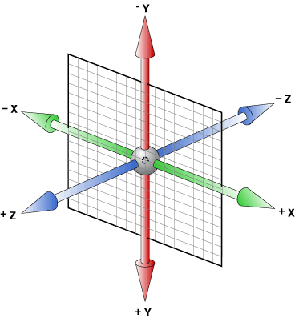
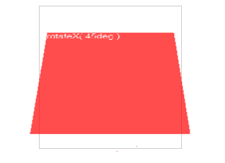

## css3 3d transfrom

---

参考 > http://www.zhangxinxu.com/wordpress/2012/09/css3-3d-transform-perspective-animate-transition/

### 3D 变化示意图



### 认识 rotate

- rotateX() 以 x 轴为中心旋转
  
- rotateY() 以 Y 轴为中心旋转
  
- rotateZ() 以 Z 轴为中心旋转
  

### perspective 属性

perspective 的意思是：透视,远景
CSS3 3D transform 的透视点是在浏览器的前方！
显示器中 3D 效果元素的透视点在显示器的上方（不是后面），近似就是我们眼睛所在方位！

### translateZ 帮你寻找透视位置

如果说 rotateX/rotateY/rotateZ 可以帮助理解三维坐标，则 translateZ 则可以帮你理解透视位置。
我们都知道近大远小的道理，对于没有 rotateX 以及 rotateY 的元素，translateZ 的功能就是让元素在自己的眼前或近或远。比方说，我们设置元素 perspective 为 201 像素，如下：

```css
perspective: 201px;
```

则其子元素，设置的 translateZ 值越小，则子元素大小越小（因为元素远去，我们眼睛看到的就会变小）;
可参考 > <http://www.zhangxinxu.com/study/201209/transform-perspective-translateZ.html>

### 反转效果

css 代码

```css
.flip-container {
  perspective: 1000;
}
.flip-container:hover .flipper,
.flip-container.hover .flipper {
  transform: rotateY(180deg);
}
.flip-container,
.front,
.back {
  width: 320px;
  height: 480px;
}
.flipper {
  transition: 0.6s;
  transform-style: preserve-3d;
  position: relative;
}
.front,
.back {
  backface-visibility: hidden;
  position: absolute;
  top: 0;
  left: 0;
}
.front {
  z-index: 2;
  background: red;
}
.back {
  background: blue;
  transform: rotateY(180deg);
}
```

```css
.flip-container {
  -webkit-perspective: 1000;
  -moz-perspective: 1000;
  -ms-perspective: 1000;
  perspective: 1000;
  -ms-transform: perspective(1000px);
  -moz-transform: perspective(1000px);
  -moz-transform-style: preserve-3d;
  -ms-transform-style: preserve-3d;
}
.flip-container:hover .back.flip {
  -webkit-transform: rotateY(0deg);
  -moz-transform: rotateY(0deg);
  -o-transform: rotateY(0deg);
  -ms-transform: rotateY(0deg);
  transform: rotateY(0deg);
}
.flip-container:hover .front.flip {
  -webkit-transform: rotateY(180deg);
  -moz-transform: rotateY(180deg);
  -o-transform: rotateY(180deg);
  transform: rotateY(180deg);
}
.flipper {
  -webkit-transition: 0.6s;
  -webkit-transform-style: preserve-3d;
  -ms-transition: 0.6s;
  -moz-transition: 0.6s;
  -moz-transform: perspective(1000px);
  -moz-transform-style: preserve-3d;
  -ms-transform-style: preserve-3d;
  transition: 0.6s;
  transform-style: preserve-3d;
  position: relative;
  height: 100%;
}
.front,
.back {
  -webkit-backface-visibility: hidden;
  -moz-backface-visibility: hidden;
  -ms-backface-visibility: hidden;
  backface-visibility: hidden;
  -webkit-transition: 0.6s;
  -webkit-transform-style: preserve-3d;
  -webkit-transform: rotateY(0deg);
  -moz-transition: 0.6s;
  -moz-transform-style: preserve-3d;
  -moz-transform: rotateY(0deg);
  -o-transition: 0.6s;
  -o-transform-style: preserve-3d;
  -o-transform: rotateY(0deg);
  -ms-transition: 0.6s;
  -ms-transform-style: preserve-3d;
  -ms-transform: rotateY(0deg);
  transition: 0.6s;
  transform-style: preserve-3d;
  transform: rotateY(0deg);
  position: absolute;
  top: 0;
  left: 0;
}
.front {
  -webkit-transform: rotateY(0deg);
  -ms-transform: rotateY(0deg);
  z-index: 2;
  width: 100%;
  height: 100%;
}
.back {
  -webkit-transform: rotateY(-180deg);
  -moz-transform: rotateY(-180deg);
  -o-transform: rotateY(-180deg);
  -ms-transform: rotateY(-180deg);
  transform: rotateY(-180deg);
  height: 100%;
}
```

html 代码

```html
<div class="flip-container" ontouchstart="this.classList.toggle('hover');">
  <div class="flipper">
    <div class="front">
      <!-- 前面内容 -->
    </div>
    <div class="back">
      <!-- 背面内容 -->
    </div>
  </div>
</div>
```
