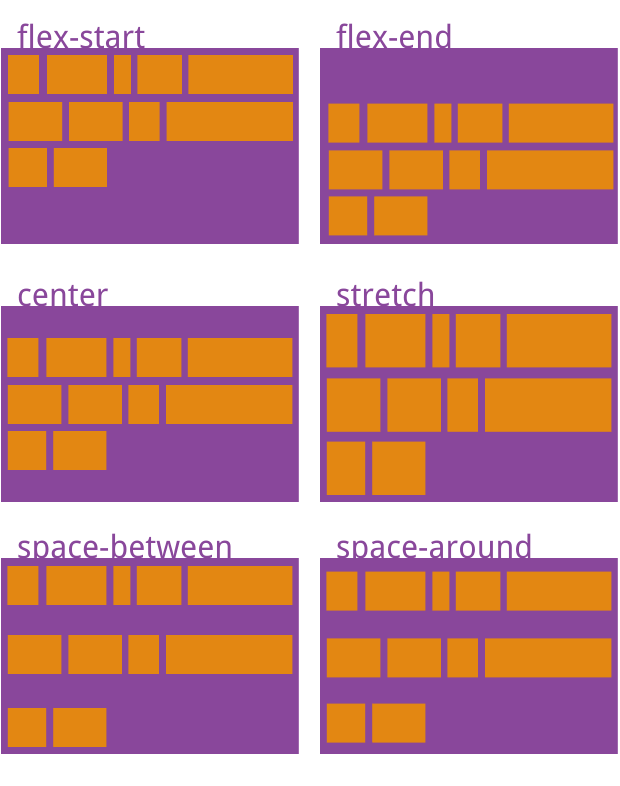

## 简介

在**H5**页面或者移动端书写`css`时，都会推荐你使用`flex`布局来实现，因为`flex`在移动端兼容性还是比较好的，最主要的是实现布局比较简单。

但是在真正的实战中很多人在不完全了解**flex**中的属性导致滥用，所以有了这篇文章，加深自己对**flex**的记忆。

## 什么是 FC?

**FC 的全称是：Formatting Contexts，是 W3C CSS2.1 规范中的一个概念**。它是页面中的一块渲染区域，并且有一套渲染规则，它决定了其子元素将如何定位，以及和其他元素的关系和相互作用。
常见的**FC**有什么比如**BFC**、**IFC**、**FFC**、**GFC**，在以前的博客里面有记录过**BFC**，这里就不多做赘述只记录**FFC**。

### FFC 是什么？

**Flex**遵循的是**FFC**的规则，**FFC**又是什么呢？
`FFC(Flex Formatting Contexts)`直译为"自适应格式化上下文"，`display`值为`flex`或者`inline-flex`的元素将会生成自适应容器（`flex container`）。

**布局规则**

- 设置为 `flex` 的容器被渲染为一个块级元素
- 设置为 `inline-flex` 的容器则渲染为一个行内元素
- **弹性容器中的每一个子元素都是一个弹性项目**。弹性项目可以是任意数量的。弹性容器外和弹性项目内的一切元素都不受影响。简单地说，Flexbox 定义了弹性容器内弹性项目该如何布局

基本上**FFC**和[**BFC**](/blog/css/docs/css-docs-bfc.html)是比较类似的这里只记录它们之前的区别，区别如下：

- **FlexBox**不支持`::first-line`和`::first-letter`这两种伪元素
- `vertical-align`对`FlexBox`中的子元素是没有效果的
- `float`和`clear`属性对`FlexBox`中的子元素是没有效果的，对`FlexBox`是有作用的
- 多烂布局`Cloumn-*`在`FlexBox`中也是无效的
- `FlexBox`下的子元素不会继承父级容器的宽

## Flex 中的概念

给`div`元素设置`display`值为`flex`或者`inline-flex`的元素将会生成自适应容器（`flex container`）。
**Flex**有很多属性，大致可以分为两类一类作用在**flex 容器上**、一类作用在**flex 子项上**。

|                                作用在 flex 容器上                                 |                 作用在 flex 子项上                 |
| :-------------------------------------------------------------------------------: | :------------------------------------------------: |
|                           flex-direction (设置主轴方向)                           |              order (在父容器中的排序)              |
|                             flex-wrap (主轴是否换行)                              | flex-grow (当有空白区域，是否站空白区域，是否扩展) |
|                       flex-flow (flex-direction flex-wrap)                        | flex-shrink (当空间过小时，是否收缩自身，是否收缩) |
|                   justify-content (水平方向子项对齐和分布方式)                    |   flex-basis (在分配剩余空间之前元素的默认大小)    |
|                     align-items (垂直方向子项对齐和分布方式)                      |      flex (flex-grow flex-shrink flex-basis)       |
| align-content (水平方向 flex 子项的对齐和分布方式，于 justify-content 类似且对立) |        align-self (自己本身的垂直对齐方式)         |


采用 Flex 布局的元素，称为 Flex 容器（flex container）,简称“容器”。它的所有子元素自动成为容器成员，成为 Flex 项目（flex item）,简称“项目”。

容器默认存在两根轴：**水平的主轴（main axis）和垂直的交叉轴（cross axis）**。
主轴的开始位置（与边框的交叉点）叫做`main start`，结束位置叫做`main end`；
交叉轴的开始位置叫做`cross start`，结束位置叫做`cross end`。

项目默认沿**主轴排列**。单个项目占据的主轴空间叫做`main size`，占据的交叉轴空间叫做`cross size`。

本文上所用到的`html`结构如下：

```html
<div class="flexbox">
  <div class="flexbox-item">1</div>
  <div class="flexbox-item">2</div>
  <div class="flexbox-item">3</div>
  <div class="flexbox-item">4</div>
</div>
```

`css`基础结构如下：

```css
.flexbox {
  display: flex;
  width: 300px;
}
.flexbox-item {
  width: 100px;
  height: 100px;
  line-height: 100px;
  box-sizing: border-box;
  text-align: center;
  font-size: 32px;
  color: #fff;
  border: 2px solid #fff;
  background: rebeccapurple;
}
.flexbox div:nth-child(2) {
  background-color: brown;
}
.flexbox div:nth-child(3) {
  background-color: cadetblue;
}
.flexbox div:nth-child(4) {
  background-color: coral;
}
```

## 作用在 flex 容器上的 CSS 属性

---

### flex-direction

`flex-direction`用来控制子项整体布局方向，是从左往右还是从右往左，是从上往下还是从下往上。
语法如下：

```css
.flexbox {
  flex-direction: row | row-reverse | column | column-reverse;
}
```

四个值

- row（默认值）：主轴为水平方向，起点在左端。
  
- row-reverse：主轴为水平方向，起点在右端。
  
- column：主轴为垂直方向，起点在上沿。
  
- column-reverse：主轴为垂直方向，起点在下沿。

### flex-wrap

`flex-wrap`用来控制子项整体单行显示还是换行显示，如果换行，则下面一行是否反方向显示。

```css
.flexbox {
  flex-wrap: nowrap | wrap | wrap-reverse;
}
```

它有三个值如下：

**nowrap**
默认值，表示单行显示，不换行。于是很容易出现宽度溢出的场景，其渲染表现比较复杂，需要对 CSS3 宽度有一定了解，可以阅读“理解 CSS3 max/min-content 及 fit-content 等 width 值”这篇文章。具体表现如下（以水平布局举例）：

- flex 子项最小内容宽度 min-content 之和大于 flex 容器宽度，则内容溢出，表现和 white-space:nowrap 类似。
- 如果 flex 子项最小内容宽度 min-content 之和小于 flex 容器宽度，则：
  - flex 子项默认的 fit-content 宽度之和大于 flex 容器宽度，则 flex 子项宽度收缩，正好填满 flex 容器，内容不溢出。
  - flex 子项默认的 fit-content 宽度之和小于 flex 容器宽度，则 flex 子项以 fit-content 宽度正常显示，内容不溢出。

**wrap**
宽度不足换行显示。

**wrap-reverse**
宽度不足换行显示，但是是**从下往上开始**，也就是原本换行在**下面**的子项现在跑到**上面**。


### flex-flow

`flex-flow`属性是`flex-direction`和`flex-wrap`的缩写，表示**flex 布局**的**flow 流动**特性，语法如下：

```css
.flexbox {
  flex-flow: < 'flex-direction' > || < 'flex-wrap' >;
}
```

举例说明如果设置代码如下：

```css
.flexbox {
  flex-flow: row-reverse wrap-reverse;
}
```

效果图如下：


### justify-content

`justify-content`属性决定了**水平方向子项的对齐和分布方式**。

```css
.flexbox {
  justify-content: flex-start | flex-end | center | space-between | space-around;
}
```

它可能取 5 个值，具体对齐方式与轴的方向有关。下面假设主轴为从左到右。

- `flex-start`: **默认值。逻辑 CSS 属性值，与文档流方向相关。默认表现为左对齐**。
- `flex-end`: **逻辑 CSS 属性值，与文档流方向相关。默认表现为右对齐**。
- `center`: **表现为居中对齐**。
  
- `space-between`: **表现为两端对齐。between 是中间的意思，意思是多余的空白间距只在元素中间区域分配**。
  
- `space-around`: **around 是环绕的意思，意思是每个 flex 子项两侧都环绕互不干扰的等宽的空白间距，最终视觉上边缘两侧的空白只有中间空白宽度一半**。
  
- `space-evenly`: **evenly 是匀称、平等的意思。也就是视觉上，每个 flex 子项两侧空白间距完全相等**。
  

### align-items

`align-items`属性定义项目在交叉轴上如何对齐。

```css
.flexbox {
  align-items: flex-start | flex-end | center | baseline | stretch;
}
```

它可能取 5 个值。具体的对齐方式与交叉轴的方向有关，下面假设交叉轴从上到下。

- `flex-start`：交叉轴的起点对齐。
- `flex-end`：交叉轴的终点对齐。
- `center`：交叉轴的中点对齐。
- `baseline`: 项目的第一行文字的基线对齐。
- `stretch`（默认值）：如果项目未设置高度或设为 auto，将占满整个容器的高度。


### align-content

`align-content`可以看成和`justify-content`是相似且对立的属性，`justify-content`指明水平方向 flex 子项的对齐和分布方式，而`align-content`则是指明垂直方向每一行`flex`元素的**对齐和分布方式**。如果所有`flex`子项只有一行，则`align-content`属性是没有任何效果的。

```css
.flexbox {
  align-content: stretch | flex-start | flex-end | center | space-between |
    space-around | space-evenly;
}
```

它有 7 个值，每个值是不同作用如下面所示:

- `stretch`: 默认值。每一行 flex 子元素都等比例拉伸。例如，如果共两行 flex 子元素，则每一行拉伸高度是 50%。
- `flex-start`：与交叉轴的起点对齐。
- `flex-end`：与交叉轴的终点对齐。
- `center`：表现为整体垂直居中对齐。
- `space-between`：表现为上下两行两端对齐。剩下每一行元素等分剩余空间。
- `space-around`：每一行元素上下都享有独立不重叠的空白空间。
- `space-evenly`： 每一行元素都完全上下等分。



## 作用在 flex 子项上的 CSS 属性

### order

可以通过设置**order**改变某一个**flex**子项的排序位置。数值越小，排列越靠前，默认为 0。

```css
.flexbox div:nth(1) {
  order: <integer>; /* 整数值，默认值是 0 */
}
.flexbox div:nth(2) {
  order: -2;
}
.flexbox div:nth(3) {
  order: -1;
}
```

如下图所示：


### flex-grow

`flex-grow`属性中的`grow`是扩展的意思，扩展的就是`flex`子项所占据的宽度，扩展所侵占的空间就是除去元素外的剩余的空白间隙。

```css
flex-grow: <number>; /* 数值，可以是小数，默认值是 0 */
```

`flex-grow`不支持负值，默认值是`0`，表示不占用剩余的空白间隙扩展自己的宽度。如果`flex-grow`大于`0`，则`flex`容器剩余空间的分配就会发生，具体规则如下：

- 所有剩余空间总量是`1`。

- 如果只有一个`flex`子项设置了`flex-grow`属性值：
  - 如果`flex-grow`值小于`1`，则扩展的空间就总剩余空间和这个比例的计算值。
  - 如果`flex-grow`值大于`1`，则独享所有剩余空间。

[张鑫旭大佬：具体可参见下面“grow 案例 1”。](https://www.zhangxinxu.com/wordpress/2018/10/display-flex-css3-css/#flex-grow)

- 如果有多个`flex`子项设置了`flex-grow`属性值：
- 如果`flex-grow`值总和小于`1`，则每个子项扩展的空间就总剩余空间和当前元素设置的`flex-grow`比例的计算值。
- 如果`flex-grow`值总和大于`1`，则所有剩余空间被利用，分配比例就是`flex-grow`属性值的比例。例如所有的`flex`子项都设置`flex-grow:1`，则表示剩余空白间隙大家等分，如果设置的`flex-grow`比例是 1:2:1，则中间的 flex 子项占据一半的空白间隙，剩下的前后两个元素等分。

[张鑫旭大佬：具体可参见下面“grow 案例 2”。](https://www.zhangxinxu.com/wordpress/2018/10/display-flex-css3-css/#flex-grow)

### flex-shrink

`shrink`是“收缩”的意思，`flex-shrink`主要处理当`flex`容器空间不足时候，单个元素的收缩比例。

```css
flex-shrink: <number>; /* 数值，默认值是 1 */
```

`flex-shrink`不支持负值，默认值是`1`，也就是默认所有的`flex`子项都会收缩。如果设置为`0`，则表示不收缩，保持原始的`fit-content`宽度。

`flex-shrink`的内核跟`flex-grow`很神似，`flex-grow`是空间足够时候如何利用空间，`flex-shrink`则是空间不足时候如何收缩腾出空间。

两者的规则也是类似。已知 flex 子项不换行，且容器空间不足，不足的空间就是“完全收缩的尺寸”：

- 如果只有一个**flex 子项**设置了`flex-shrink`：
  - `flex-shrink`值小于`1`，则收缩的尺寸不完全，会有一部分内容**溢出 flex 容器**。
  - `flex-shrink`值大于等于`1`，则收缩完全，正好**填满 flex 容器**。
- 如果多个**flex 子项**设置了`flex-shrink`：
  - `flex-shrink`值的总和小于`1`，则收缩的尺寸不完全，每个元素收缩尺寸占“完全收缩的尺寸”的比例就是设置的`flex-shrink`的值。
  - `flex-shrink`值的总和大于`1`，则收缩完全，每个元素收缩尺寸的比例和`flex-shrink`值的比例一样。下面案例演示的就是此场景。

[张鑫旭大佬：案例显示代码](https://www.zhangxinxu.com/wordpress/2018/10/display-flex-css3-css/#flex-shrink)

### flex-basis

`flex-basis`定义了**在分配剩余空间之前元素的默认大小**。相当于对浏览器提前告知：浏览器兄，我要占据这么大的空间，提前帮我预留好。

```css
flex-basis: <length> | auto; /* 默认值是 auto */
```

默认值是`auto`，就是自动。有设置`width`则占据空间就是`width`，没有设置就按内容宽度来。

如果同时设置`width`和`flex-basis`，就渲染表现来看，会忽略`width`。**flex 顾名思义就是弹性的意思，因此，实际上不建议对 flex 子项使用 width 属性，因为不够弹性**。

当剩余空间不足的时候，`flex`子项的实际宽度并通常不是设置的`flex-basis`尺寸，因为 flex 布局剩余空间不足的时候默认会收缩。

当剩余空间不足的时候，flex 子项的实际宽度并通常不是设置的`flex-basis`尺寸，因为 flex 布局剩余空间不足的时候默认会收缩。

[张鑫旭大佬：案例显示代码](https://www.zhangxinxu.com/wordpress/2018/10/display-flex-css3-css/#flex-basis)

### flex

`flex`属性是`flex-grow`，`flex-shrink`和`flex-basis`的缩写。

```css
flex: none | auto | [ < 'flex-grow' > < 'flex-shrink' >? || < 'flex-basis' > ];
```

其中第 2 和第 3 个参数**（flex-shrink 和 flex-basis）**是可选的。默认值为`0 1 auto`。

flex 为`none`和`auto`简写实际效果如下：

- **flex 默认值等同于 flex:0 1 auto**；
- **flex:none 等同于 flex:0 0 auto**；
- **flex:auto 等同于 flex:1 1 auto**；

[张鑫旭大佬：案例显示代码](https://www.zhangxinxu.com/wordpress/2018/10/display-flex-css3-css/#flex-flex)

### align-self

`align-self`指控制单独某一个**flex 子项的垂直对齐方式**.

```css
align-self: auto | flex-start | flex-end | center | baseline | stretch;
```

**唯一区别就是 align-self 多了个 auto（默认值），表示继承自 flex 容器的 align-items 属性值**。

[张鑫旭大佬：案例显示代码](https://www.zhangxinxu.com/wordpress/2018/10/display-flex-css3-css/#align-self)

## 参考

[写给自己看的 display: flex 布局教程](https://www.zhangxinxu.com/wordpress/2018/10/display-flex-css3-css/)
[Flex 布局教程：语法篇](http://www.ruanyifeng.com/blog/2015/07/flex-grammar.html)
[30 分钟学会 Flex 布局](https://zhuanlan.zhihu.com/p/25303493)
