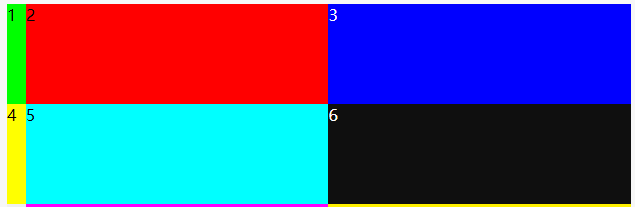
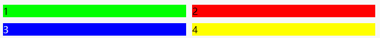

## 简介

CSS 网格布局擅长于将一个页面划分为几个主要区域，以及定义这些区域的`大小、位置、层次`等关系（前提是 HTML 生成了这些区域）。
Flex 布局是轴线布局，只能指定"项目"针对轴线的位置，可以看作是**一维布局**。
Grid 布局则是将容器划分成"行"和"列"，产生单元格，然后指定"项目所在"的单元格，可以看作是**二维布局**。Grid 布局远比 Flex 布局强大。
在 Grid 布局中，所有 css 属性分为两类，一类作用到 grid 容器上，还有一类作用在 grid 项目上。
如下表格所示：

|                                                                                                                                                                                                            作用在 grid 容器上                                                                                                                                                                                                            |                                                                                                              作用在 grid 子项上                                                                                                              |
| :--------------------------------------------------------------------------------------------------------------------------------------------------------------------------------------------------------------------------------------------------------------------------------------------------------------------------------------------------------------------------------------------------------------------------------------: | :------------------------------------------------------------------------------------------------------------------------------------------------------------------------------------------------------------------------------------------: |
| **grid-template-columns** <br/> **grid-template-rows** <br/> **grid-template-areas** <br/> **grid-template** <br/> **grid-column-gap ** <br/> **grid-row-gap ** <br/> **grid-gap ** <br/> **justify-items ** <br/> **align-items ** <br/> **place-items ** <br/> **justify-content ** <br/> **align-content ** <br/> **place-content ** <br/> **grid-auto-columns ** <br/> **grid-auto-rows ** <br/> **grid-auto-flow ** <br/> **grid ** | **grid-column-start** <br/> ** grid-column-end** <br/> ** grid-row-start** <br/> ** grid-row-end** <br/> ** grid-column** <br/> ** grid-row** <br/> ** grid-area** <br/> ** justify-self** <br/> ** align-self** <br/> ** place-self** <br/> |

## 作用在 grid 容器上的 CSS 属性

基础代码为：

```javascript
  <!DOCTYPE html>
<html>
<head>
  <meta charset="utf-8">
  <meta name="viewport" content="width=device-width">
  <title>JS Bin</title>
</head>
<body>
  <div class="container">
    <div style="background: #00ff00">
      1
    </div>
    <div style="background: #ff0000">
      2
    </div>
    <div style="background: #0000ff; color: #fff">
      3
    </div>
    <div style="background: #ffff00">
      4
    </div>
    <div style="background: #00ffff">
      5
    </div>
    <div style="background: #0f0f0f; color: #fff">
      6
    </div>
    <div style="background: #f0f0f0">
      7
    </div>
    <div style="background: #ff00ff">
      8
    </div>
    <div style="background: #fff000">
      9
    </div>
    <div style="background: #00ff00">
      10
    </div>
    <div style="background: #000fff; color: #fff">
      11
    </div>
    <div style="background: #00ffff">
      12
    </div>
  </div>
</body>
</html>
```

### grid-template-columns 和 grid-template-rows

容器指定了网格布局以后，接着就要划分行和列。`grid-template-columns` 属性定义每一列的列宽，`grid-template-rows` 属性定义每一行的行高。

```css
.container {
  display: grid;
  grid-template-columns: 100px 100px 100px;
  grid-template-rows: 100px 100px 100px 100px;
}
```

上面的代码会指定一个 `3 列 4 行`的网格，列宽和行高都是 `100px`;


**值**

- 可以为 `px` 或者 `百分比（%）`
- `auto`
- `repeat( [ <positive-integer> | auto-fill | auto-fit ] , <track-list> )`
- `fr(fraction)`是单词 `fraction` 的缩写，表示分数
- `max-content`、`min-content`、`minmax(min, max)`

`px 和百分比`我们就不介绍了。

#### auto

有时，单元格的大小是固定的，但是容器的大小不确定。如果希望每一行（或每一列）容纳尽可能多的单元格，这时可以使用 `auto-fill` 关键字表示自动填充。

```css
.container {
  display: grid;
  grid-template-columns: auto 100px 100px;
  grid-template-rows: 100px 100px 100px 100px;
}
```

我们把第一列设置为 `auto`，效果如下：


#### repeat()

表示网格轨道的重复部分，以一种更简洁的方式去表示大量而且重复列的表达式。函数接收两个参数，第一个参数是重复的次数，第二个参数是所要重复的值。在第一个基础上改写代码如下：

```css
.container {
  display: grid;
  grid-template-columns: repeat(3, 100px);
  grid-template-rows: 100px 100px 100px 100px;
}
```

这个效果和直接写三个 `100px` 的效果是一样的。

### fr

`fr`是单词 `fraction` 的缩写，表示分数。

- 先从简单例子看起：

```css
.container {
  display: grid;
  grid-template-columns: 1fr 1fr 1fr;
  grid-template-rows: 100px 100px 100px 100px;
}
```

`1:1:1`，网格宽度三等分，实时效果如下：


- 如果有固定尺寸值，则划分剩余空间大小，例如：

```css
.container {
  display: grid;
  grid-template-columns: 100px 1fr 1fr;
  grid-template-rows: 100px 100px 100px 100px;
}
```


后面两列是 `grid` 容器宽度减去 `100` 像素后的 `1/2`。

- 如果和 `auto` 混用会如何呢

```css
.container {
  display: grid;
  grid-template-columns: auto 1fr 1fr;
  grid-template-rows: 100px 100px 100px 100px;
}
```


`auto` 在和 `px、百分比`一起用的时候是撑满剩下的空间。但是和 `fr` 一起用的时候为内容宽度。

### grid-template-areas

`grid-template-areas` 属性是 `grid areas` 在 CSS 中的特定命名。

**语法**
**值**
`none`
网格容器没有定义任何的`网格区块(grid areas)`。
`<string>+`
每一个给定的字符串会生成一行，一个字符串中用空格分隔的每一个单元`(cell)`会生成一列。多个同名的，跨越相邻行或列的单元称为网格区块`(grid area)`。非矩形的网格区块是无效的。

代码如下：

```html
<div style="background: #00ff00">
  1
</div>
<div style="background: #ff0000">
  2
</div>
<div style="background: #0000ff; color: #fff">
  3
</div>
<div style="background: #ffff00">
  4
</div>
```

```css
.container {
  display: grid;
  grid-template-columns: 1fr 1fr 1fr;
  grid-template-rows: 1fr 1fr 1fr 1fr;
  grid-template-areas:
    '头部 头部 头部'
    'nav content content'
    'nav content content'
    'foot foot foot';
}
.container > div:first-child {
  grid-area: 头部;
}
.container > div:nth-child(2) {
  grid-area: nav;
}
.container > div:nth-child(3) {
  grid-area: content;
}
.container > div:last-child {
  grid-area: foot;
}
```

我们的网格区域一定要形成规整的矩形区域，什么 L 形，凹的或凸的形状都是不支持的，会认为是无效的属性值。


### grid-template

`grid-template` 是一个简写的 CSS 属性，用于定义 `grid columns`, `rows` 和 `areas`。
语法如下：

```css
grid-template: <grid-template-rows> / <grid-template-columns>;
```

用 `grid-template` 实现上面的效果，代码如下：

```css
.container {
  display: grid;
  grid-template:
    '头部 头部 头部' 1fr
    'nav content content' 1fr
    'nav content content' 1fr
    'foot foot foot' 1fr
    / 1fr 1fr 1fr;
}
```

它实现的效果和上面的一样。

> 由于`grid-template`不会重置一些隐式的 grid 属性（如`grid-auto-columns`，`grid-auto-rows`和`grid-auto-flow`），因此，大多数时候，还是推荐使用 grid 代替 grid-template。

### grid-column-gap 和 grid-row-gap、grid-gap

`grid-column-gap` 和 `grid-row-gap` 属性用来定义网格中网格间隙的尺寸。你可以理解成田地之间走路的田垄宽度。
语法如下：

```css
grid-column-gap: 10px; // 水平间隔 10px
grid-row-gap: 10px; // 垂直间隔 10px
```

代码如下：

```css
.container {
  display: grid;
  grid-template-columns: 1fr 1fr;
  grid-template-rows: 1fr 1fr;
  grid-column-gap: 10px;
  grid-row-gap: 10px;
}
```



#### grid-gap

`CSS grid-gap` 属性是 `grid-column-gap` 和 `grid-row-gap` 属性的缩写。语法如下：

```css
grid-gap: <grid-row-gap> <grid-column-gap>;
```

实现和上面一样的布局代码如下：

```css
grid-template-columns: 1fr 1fr;
grid-template-rows: 1fr 1fr;
grid-gap: 10px 10px;
```

### justify-items、align-items、palce-items

`justify-items` 属性设置单元格内容的水平位置（左中右），`align-items` 属性设置单元格内容的垂直位置（上中下）。
**语法如下**

```css
justify-items: start | end | center | stretch;
align-items: start | end | center | stretch;
```

- `start`：对齐单元格的起始边缘。
- `end`：对齐单元格的结束边缘。
- `center`：单元格内部居中。
- `stretch`：拉伸，占满单元格的整个宽度（默认值）。

[justify-items 效果参考 张鑫旭大佬的博客](https://www.zhangxinxu.com/wordpress/2018/11/display-grid-css-css3/#justify-items)
[align-items 效果参考 张鑫旭大佬的博客](https://www.zhangxinxu.com/wordpress/2018/11/display-grid-css-css3/#align-items)

#### palce-items

`place-items` 属性是 `align-items` 属性和 `justify-items` 属性的合并简写形式。
**语法**

```css
place-items: <align-items> <justify-items>;
```

> 如果省略第二个值，则浏览器认为与第一个值相等。

### justify-content、align-content、place-content

`justify-content` 属性是整个内容区域在容器里面的水平位置（左中右），`align-content` 属性是整个内容区域的垂直位置（上中下）。

> justify-content 指定了网格元素的水平分布方式。此属性仅在网格总宽度小于 grid 容器宽度时候有效果。

语法如下：

```css
justify-content: start | end | center | stretch | space-around | space-between |
  space-evenly;
align-content: start | end | center | stretch | space-around | space-between |
  space-evenly;
```

- start - 对齐容器的起始边框。
- end - 对齐容器的结束边框。
- center - 容器内部居中。
- stretch - 项目大小没有指定时，拉伸占据整个网格容器。
- space-around - 每个项目两侧的间隔相等。所以，项目之间的间隔比项目与容器边框的间隔大一倍。
- space-between - 项目与项目的间隔相等，项目与容器边框之间没有间隔。
- space-evenly - 项目与项目的间隔相等，项目与容器边框之间也是同样长度的间隔。

正式效果参考如下：
[justify-content 效果参考 张鑫旭大佬的博客](https://www.zhangxinxu.com/wordpress/2018/11/display-grid-css-css3/#justify-content)
[align-content 效果参考 张鑫旭大佬的博客](https://www.zhangxinxu.com/wordpress/2018/11/display-grid-css-css3/#align-content)

#### place-content

`place-content` 属性是 `align-content` 属性和 `justify-content` 属性的合并简写形式。

```css
place-content: <align-content> <justify-content>;
```

> 如果省略第二个值，浏览器就会假定第二个值等于第一个值。

### grid-auto-columns、grid-auto-rows

指定任何自动生成的网格轨道（也称为隐式网格轨道）的大小。 当网格项目多于网格中的单元格或网格项目放置在显式网格之外时，将创建隐式轨道。
**语法**

```css
grid-auto-columns: <track-size> ...;
grid-auto-rows: <track-size> ...;
```

`grid-auto-columns`属性和`grid-auto-rows`属性用来设置，浏览器自动创建的多余网格的列宽和行高。它们的写法与`grid-template-columns`和`grid-template-rows`完全相同。如果不指定这两个属性，浏览器完全根据单元格内容的大小，决定新增网格的列宽和行高。

示例如划分好的网格是 2 行 x 2 列，但是，3 号项目指定在第 3 行，4 号项目指定在第 4 行。
代码如下：

```css
.container {
  display: grid;
  grid-template-columns: 100px 100px;
  grid-template-rows: 100px 100px;
  grid-auto-columns: 50px;
  grid-auto-rows: 50px;
}
.container div:nth-child(3) {
  grid-column: 3;
  grid-row: 3;
}
.container div:nth-child(4) {
  grid-column: 4;
  grid-row: 4;
}
```


### grid-auto-flow

`grid-auto-flow` 属性控制没有明确指定位置的 `grid` 子项的放置方式。比方说定义了一个 5\*2 的 10 格子，共有 5 个元素，其中 2 个元素指定了放在哪个格子里，还有 3 个则自生自灭排列。此时，这 3 个元素如何排列就是由 grid-auto-flow 属性控制的。
**语法**

```css
grid-auto-flow: row | column | row dense | column dense;
```

- row 默认值。没有指定位置的网格依次水平排列优先。
- column 没有指定位置的网格依次垂直排列优先。
- dense dense 这个英文是稠密的意思。如果有设置，则表示自动排列启用“密集”打包算法。如果稍后出现的网格比较小，则尝试看看前面有没有合适的地方放置，使网格尽可能稠密紧凑。此属性值仅仅改变视觉顺序，会导致 DOM 属性和实际呈现顺序不符合，这对于可访问性是不友好的，建议谨慎使用。
  示例请看[grid-auto-flow 效果参考 张鑫旭大佬的博客](https://www.zhangxinxu.com/wordpress/2018/11/display-grid-css-css3/#grid-auto-flow)

### grid

是下面所有这些 CSS 属性的缩写集合，`grid-template-rows，grid-template-columns，grid-template-areas，grid-auto-rows，grid-auto-columns 和 grid-auto-flow`。
语法：

```css
grid: none;
```

`none`表示设置所有的子属性为初始值。

```css
grid: <grid-template>;
```

和 grid-template 用法一致

```css
grid: <grid-template-rows> / [ auto-flow && dense? ] <grid-auto-columns>?;
```

上面就是 grid 容器上的属性，属性很多不好记，要多练习几遍才能熟练使用。

## 作用在 grid 子项上的 CSS 属性

- `grid-column-start, grid-column-end, grid-row-start 和 grid-row-end`
- `grid-column 和 grid-row`
- `grid-area`
- `justify-self、align-self、place-self`

### grid-column-start, grid-column-end, grid-row-start 和 grid-row-end

表示 grid 子项所占据的区域的起始和终止位置，包括水平方向和垂直方向。
**语法**

```css
  grid-column-start: <number> | <name> | span <number> | span <name> | auto
  grid-column-end: <number> | <name> | span <number> | span <name> | auto
  grid-row-start: <number> | <name> | span <number> | span <name> | auto
  grid-row-end: <number> | <name> | span <number> | span <name> | auto
```

语法中的管道分隔符|表示“或者”的意思，所以别看上面好长，实际上就一个属性值，具体来讲：

- `<number>` : 起止与第几条网格线。
- `<name>` : 自定义的网格线的名称。
- `span <number>` : 表示当前网格会自动跨越指定的网格数量。
- `span <name>`: 表示当前网格会自动扩展，直到命中指定的网格线名称。
- `auto`: 全自动，包括定位，跨度等。

**普通数字**

```css
.container {
  display: grid;
  grid-template-columns: 100px 100px 100px;
  grid-template-rows: 100px 100px 100px;
}
.container div:nth-child(1) {
  grid-column-start: 1;
  grid-column-end: 3;
  grid-row-start: 1;
  grid-row-end: 3;
}
```


**网格线的名字**

```css
.container {
  display: grid;
  grid-template-columns: [第一列] 100px [第二列] 100px [第三列] 100px;
  grid-template-rows: [第一行] 100px [第二行] 100px [第三行] 100px;
}
.container div:nth-child(1) {
  grid-column-start: 第一列;
  grid-column-end: 3;
  grid-row-start: 第一行;
  grid-row-end: 3;
}
```

与上面结果相同

**span 关键字**

```css
.container {
  display: grid;
  grid-template-columns: [第一列] 100px [第二列] 100px [第三列] 100px;
  grid-template-rows: [第一行] 100px [第二行] 100px [第三行] 100px;
}
.container div:nth-child(1) {
  grid-column-start: span 2;
  grid-row-start: span 2;
}
```

### grid-column 和 grid-row

`grid-column`属性是`grid-column-start`和`grid-column-end`的合并简写形式，`grid-row`属性是`grid-row-start`属性和`grid-row-end`的合并简写形式。
**语法**

```css
grid-column: <start-line> / <end-line> | <start-line> / span <value>;
grid-row: <start-line> / <end-line> | <start-line> / span <value>;
```

改写上面的代码：

```css
.container div:nth-child(1) {
  grid-column: [第一列]/ span 2;
  grid-row-start: [第一行]/ span 2;
}
```

与上面的实现一样。

### grid-area

`grid-area`表示当前网格所占用的区域。在介绍`grid-template-areas`属性的时候就演示过该属性，我们使用`grid-template-areas`属性自定义一些网格区域，然后使用`grid-area`属性让 grid 子项指定使用这些区域，就自动进行了区域分布。
`grid-area`和`grid-column/grid-row`作用都是 grid 子项的分布，但`grid-area`语义要更好，识别度更佳，非常适合具有功能属性的布局区域（如头部，底部），同时，还支持非规则区域。

**语法**

```css
grid-area: <name> | <row-start> / <column-start> / <row-end> / <column-end>;
```

- <name> 区域名称。由 grid-template-areas 属性创建。
- `<row-start> / <column-start> / <row-end> / <column-end>` 占据网格区域的纵横起始位置。

改写上面代码：

```css
.container div:nth-child(1) {
  grid-area: 1 / 1 / 3 / 3;
}
```

### justify-self、align-self、place-self

`justify-self`属性设置单元格内容的水平位置（左中右），跟`justify-items`属性的用法完全一致，但只作用于单个项目。
`align-self`属性设置单元格内容的垂直位置（上中下），跟`align-items`属性的用法完全一致，也是只作用于单个项目。

**语法**

```css
justify-self: start | end | center | stretch;
align-self: start | end | center | stretch;
```

- start：对齐单元格的起始边缘。
- end：对齐单元格的结束边缘。
- center：单元格内部居中。
- stretch：拉伸，占满单元格的整个宽度（默认值）。

示例代码请看
[justify-self 效果参考 张鑫旭大佬的博客](https://www.zhangxinxu.com/wordpress/2018/11/display-grid-css-css3/#justify-self)
[align-self 效果参考 张鑫旭大佬的博客](https://www.zhangxinxu.com/wordpress/2018/11/display-grid-css-css3/#align-self)

#### place-self

place-items 可以让 align-self 和 justify-self 属性写在单个声明中。

```css
place-self: <align-self> / <justify-self>;
```

## 总结

- `Grid 布局则适用于更大规模的布局（二维布局），而 Flexbox 布局最适合应用程序的组件和小规模布局（一维布局）`
- `命名虽然支持中文，但由于 CSS 文件中文存在乱码的风险`
- `在 Grid 布局中，float，display:inline-block，display:table-cell，vertical-align 以及 column-\*这些属性和声明对 grid 子项是没有任何作用的。这个可以说是 Grid 布局中的常识，面试经常会问的，一定要记得。`
- `IE10-IE15 虽然名义上支持 Grid 布局，但支持的是老版本语法（本文是介绍的全是 2.0 全新语法）`，
  兼容性查询请看[can i use](https://caniuse.com)

## 参考

[写给自己看的 display: grid 布局教程](https://www.zhangxinxu.com/wordpress/2018/11/display-grid-css-css3/)
[CSS Grid 网格布局教程](http://www.ruanyifeng.com/blog/2019/03/grid-layout-tutorial.html)
