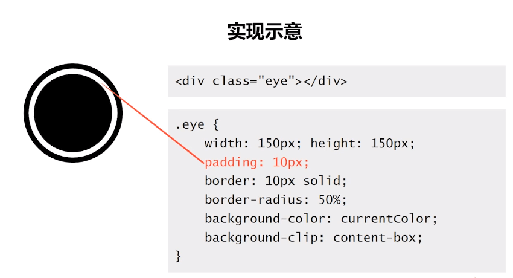

## 简介

`padding`: 简写属性在一个声明中设置所有内边距属性。所有浏览器都支持 `padding` 属性，这里就多做赘述了，但是要注意以下：

> 任何的版本的 `Internet Explorer` （包括 IE8）都不支持属性值 `"inherit"`。

**可能的值**

|   值    |                                  描述                                  |
| :-----: | :--------------------------------------------------------------------: |
|  auto   |                           浏览器计算内边距。                           |
| length  | 规定以具体单位计的内边距值，比如像素（px）、厘米(cm)等。默认值是 0px。 |
|    %    |               **规定基于父元素的宽度的百分比的内边距。**               |
| inherit |                      规定应该从父元素继承内边距。                      |

> **padding 不支持负值**

本篇目录：

- `padding` 对 `block` 元素的影响
- `padding` 对 `inline` 元素的影响
- 关于 `padding` 的百分比值
- `padding` 的应用场景

## padding 对 block 的影响

- `width` 固定
- `width` 为 `auto` 或者 `box-sizing` 为 `border-box` 的时候

### width 固定

`padding` 是会影响元素的尺寸的，`padding` 会对 `block` 元素的尺寸产生影响。代码如下：
**html**

```html
<div class="box"></div>
```

**css**

```css
.box {
  width: 200px;
  height: 200px;
  background-color: #ffed53;
  padding: 20px;
}
```

显示结果如下：

验证了上面的猜测，**padding 会对 block 元素的尺寸产生影响**；

### width 为 auto 或者 box-sizing 为 border-box 的时候

首先要知道 `box-sizing` 为 `border-box` 代表什么意思，其实就是盒模型为 ie 模式。ie 的盒模型就是他的**content+padding+border**都算在盒模型内。
这个用上面的例子就不太合适，看下面的一个例子：

**html**

```html
<div class="box">
  文字的应该怎么放置？
</div>
```

**css**

```css
.box {
  width: 200px;
  height: 200px;
  box-sizing: border-box;
  background-color: #ffed53;
  padding: 0 20px;
}
```

显示如下：


对于 `block` 水平元素，但是**width:auto**或**box-sizing 为 border-box**的时候 `padding`**不会影响**元素的尺寸。

修改 css 代码如下：
**css**

```css
.box {
  width: 200px;
  height: 200px;
  box-sizing: border-box;
  background-color: #ffed53;
  padding: 0 200px;
}
```


当`padding`大小**超过宽度**时，宽度按`padding的宽度`显示，里面的**文字按最小宽度**显示。

### 结论

- **padding 值大于元素本身的宽度时，一定会影响尺寸**。
- **width 非 auto，padding 影响尺寸**。
- **width 为 auto 或 box-sizing 为 border-box，同时 padding 值没有超过元素本身的宽度，不影响尺寸**。

## padding 对 inline 元素的影响

在上面代码的基础上修改代码如下：
**css**

```css
.box {
  display: inline;
  background-color: #ffed53;
  padding: 20px;
}
```

显示效果如下：


**水平 padding 影响尺寸，垂直 padding 不影响尺寸，但会影响背景色（占据空间）**。

## 关于 padding 的百分比值

- 关于 block 元素的 padding 的百分比值
- 关于 inline 元素的 padding 的百分比值

### block 元素的 padding 的百分比值

**padding 百分比均是相对于父元素的宽度计算的**。实现效果如下：

**html**

```html
<div class="container">
  <div class="box"></div>
</div>
```

**css**

```css
.container {
  width: 100px;
}
.box {
  /* width: 100px; */
  background-color: #ffed53;
  padding: 50%;
}
```

显示效果如下，可以明显看到`box`的宽高都是`100px`;


### inline 水平元素的 padding 百分比值

注意以下几点：

- 同样相对于宽度计算
- 默认的高度宽度细节有差异
- padding 会断行

```html
<style>
  .container {
    width: 100px;
    height: 200px;
  }
  .box {
    background-color: #8ec63f;
    padding: 50%;
  }
</style>
<div class="container">
  <span class="box">若干文字</span>
</div>
```


`inline`元素的垂直 padding 会让“幽灵空白节点”显现，也就是规范中的“strut”出现。

## 标签元素的内置 paading

- ol/li 元素内置 padding-left, 但单位是 px 不是 em;
  1. 例如 chrom 浏览器下是 40px;
  2. 所以如果字号很小，间距就会很开；
  3. 如果字号很大，序号就会爬到容器外面

> 备注：文字大小一般为 12px~14px ，padding-left 为 22px~25px，基本可以实号与下面的内容对齐。

- 所有浏览器 input/textarea 输入框内置 padding
- 所有浏览器 button 按钮内置 padding
- 所有浏览器 radio/chexbox 单复选框无内置 padding
- button 按钮元素的 padding 最难控制
  button 使用：

```html
<button id="btn"></button>
<label for="btn">按钮</label>
label { display: inline-block; line-height: 20px; padding: 10px; }
```

这样就可以实现一个在任何浏览器上高度为`40px`按钮。

## padding 的应用场景

- 实现 3 道杠效果
- 实现白眼效果
- 1:1 头图布局
- 实现等高布局
- 两栏自适应布局

### 实现 3 道杠效果

```html
<style>
  .box {
    width: 150px;
    height: 30px;
    padding: 15px 0;
    border-top: 30px solid currentColor;
    border-bottom: 30px solid currentColor;
    background-color: currentColor;
    background-clip: content-box;
  }
</style>

<div class="box"></div>
```

> 备注：background-clip:content-box ; /**背景色不在 padding 区域显示**/

其实自己实现一个是最好的，借鉴一张别人的图如下：


### 实现白眼效果


> 备注：background-clip:content-box ; /**背景色不在padding区域显示**/

### 实现一个 1:1 布局


### 实现等高布局


> 很大的 margin-bottom 负值，再用很大的 padding-bottom 填充缺失的空间

### 两栏自适应布局


## 总计

`padding 对 block 元素的影响`

- **padding 值大于元素本身的宽度时，一定会影响尺寸**。
- **width 非 auto，padding 影响尺寸**。
- **width 为 auto 或 box-sizing 为 border-box，同时 padding 值没有超过元素本身的宽度，不影响尺寸**

`padding 对 inline 元素的影响`

- **水平 padding 影响尺寸，垂直 padding 不影响尺寸，但会影响背景色（占据空间）**

`关于 padding 的百分比值`

- **block 元素的 padding 的百分比值**
  1. padding 百分比均是相对于父元素的宽度计算的
- **inline 水平元素的 padding 百分比值**
  1. 同样相对于宽度计算
  2. 默认的高度宽度细节有差异
  3. padding 会断行

`padding 的应用场景`

- **实现 3 道杠效果**
- **实现白眼效果**
- **1:1 头图布局**
- **实现等高布局**
- **两栏自适应布局**

## 参考

[css 之深入理解 padding](https://www.cnblogs.com/qianxunpu/p/8303228.html)
[CSS 深入理解之 padding](https://www.imooc.com/learn/710)
