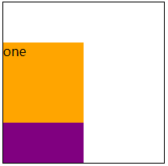
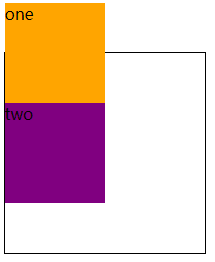
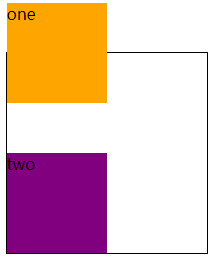
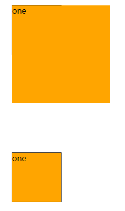
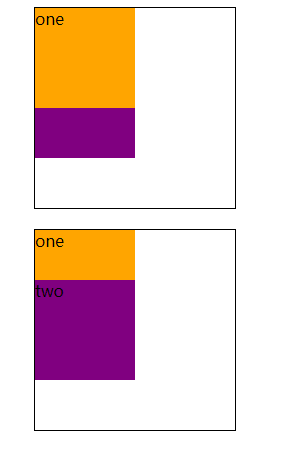

## 简介

`relative`其实是`position`中的一个属性，`positon`有五个属性分别为`static`、`relative`、`absolute`、`fixed`、`sticky`，分别代表不同的定位类型。大致分为下面四种：

**定位类型**

- **定位元素（positioned element）**是其计算后位置属性为 `relative`, `absolute`, `fixed` 或 `sticky` 的一个元素。
- **相对定位元素（relatively positioned element）**是计算后位置属性为 `relative` 的元素。
- **绝对定位元素（absolutely positioned element）**是计算后位置属性为 `absolute` 或 `fixed` 的元素。
- **粘性定位元素（stickily positioned element）**是计算后位置属性为 `sticky` 的元素。

**`static`、`relative`、`absolute`、`fixed`、`sticky`取值**

**static**

该关键字指定元素使用正常的布局行为，即元素在文档**常规流**中当前的布局位置。此时 `top`, `right`, `bottom`, `left` 和 `z-index` 属性无效。

**relative**

该关键字下，元素先放置在未添加定位时的位置，再在**不改变**页面布局的前提下**调整元素**位置（因此会在此元素未添加定位时所在位置留下空白）。`position:relative` 对 `table-*-group`, `table-row`, `table-column`, `table-cell`, `table-caption` 元素无效。

**absolute**

不为元素预留空间，通过指定**元素相对于最近的非 static 定位祖先元素的偏移**，来确定元素位置。绝对定位的元素可以设置外边距（margins），**且不会与其他边距合并**。

**fixed**

不为元素预留空间，而是通过指定元素**相对于屏幕视口（viewport）的位置来指定元素位置**。**元素的位置在屏幕滚动时不会改变**。打印时，元素会出现在的每页的固定位置。**fixed 属性会创建新的层叠上下文。当元素祖先的 transform 属性非 none 时，容器由视口改为该祖先**。

**sticky（实验属性）**

盒位置根据正常流计算(这称为正常流动中的位置)，然后**相对于该元素在流中的 flow root（BFC）和 containing block（最近的块级祖先元素）定位**。在所有情况下（即便被定位元素为 table 时），该元素定位均不对后续元素造成影响。当元素 B 被粘性定位时，后续元素的位置仍按照 B 未定位时的位置来确定。**position: sticky 对 table 元素的效果与 position: relative 相同**。

**语法**

```css
postion: static | relative | absolute | sticky | fixed;
```

## relative 的特性

在上面看到**MDN**对`relative`的定位的一下描述，但是并没有描述的比较通俗，通过下面的实例总结一下`relative`的特性。

**公用代码**

```html
<style>
  * {
    margin: 0;
    padding: 0;
  }
  .box {
    position: relative;
    width: 200px;
    height: 200px;
    margin: 200px auto;
    border: 1px solid #000;
  }
  .box div {
    width: 100px;
    height: 100px;
  }
  .one {
    background: orange;
  }
  .two {
    background: purple;
  }
</style>
<div class="box">
  <div class="one">one</div>
  <div class="two">two</div>
</div>
```

### relative 是相对于定位

直接上代码，修改代码如下：

```css
.one {
  position: relative;
  top: 50px;
}
```

效果图如下：


把`div.one`设置`position: relative`时，并且设置`top: 50px`时，可以看到`div.one`的元素相对于自身在正常流中的位置向下移动了`50px`，它挡住了一半的`div.two`元素。
`relative`的四个定位值`top`、`left`、`bottom`、`right`是相对自身移动的。

> **如果设置了对立属性 top/bottom、left/right 的相对定位元素，它的 top/left 生效，right/bottom 无效。**

### relative 不改变布局

`margin-top: 负值`修改代码如下：

```css
.one {
  margin-top: -50px;
}
```

代码执行效果如下：


可以看到`div.one`设置`margin-top: -50px;`时，它会影响到它相邻的兄弟元素`div.two`的位置，`div.one/div.two`都相对于原来的位置**向上**移动了`50px`。

`top: -50px;`修改代码如下：

```css
.one {
  position: relative;
  top: -50px;
}
```

代码执行效果如下：


可以看到`div.one`设置`postion: relative; top: -50px;`时，它不会影响到它相邻的兄弟元素`div.two`的位置，`div.one`都相对于原来的位置**向上**移动了`50px`，而`div.two`的位置是不变的。

- `relative`是相对于自身定位的。
- `relative`是不会改变布局的

## relative 的限制作用

### relative 对 absolute 的限制作用

`absolute`定位的是其**第一个祖先元素定位属性不为 static 属性**。这个就不多赘述，基本上都在用这种布局。
如果设置`postion: absolute;`元素的父元素没有设置`position: relative;`，那么设置`position: absolute;`元素的绝对定位就会最外层的**根元**素定位。

### relative 对 overflow 的限制作用

其实这个也比较常用但是一般不会太注意`relative`对`overflow`的影响。

**父元素不添加 relative**

修改**html**代码如下：

```html
<div class="box">
  <div class="one">one</div>
  <!-- <div class="two">two</div> -->
</div>
<div class="box" style="position: relative;">
  <div class="one">one</div>
  <!-- <div class="two">two</div> -->
</div>
```

修改**css**代码如下：

```css
.box {
  width: 100px;
  height: 100px;
  margin: 200px auto;
  border: 1px solid #000;
  overflow: hidden;
}
.box div {
  width: 200px;
  height: 200px;
}
.one {
  position: absolute;
  background: orange;
}
```

下过显示如下图所示：



可以看到第一个`div.box`没有设置`position: relative;`时，子元素设置`position: absoulte;`时，并且子元素的宽度高度大于父元素的宽度高度时，它会超出父元素的范围。
第二个`div.box`设置了`position: relative;`时，子元素设置不会超出父元素的宽高范围。

### relative 对层级 z-index 的限制作用

对于一个已经定位的元素（即`position`属性值不是`static`的元素），`z-index` 属性指定：

- 元素在当前堆叠上下文中的堆叠层级。
- 元素是否创建一个新的本地堆叠上下文。

修改**html**代码如下：

```html
<div class="box">
  <div class="one" style="position: relative;">one</div>
  <div class="two">two</div>
</div>
<div class="box">
  <div class="one">one</div>
  <div class="two">two</div>
</div>
```

修改**css**代码如下：

```css
.box {
  width: 200px;
  height: 200px;
  margin: 20px auto;
  border: 1px solid #000;
  overflow: hidden;
}
.box div {
  width: 100px;
  height: 100px;
}
.one {
  z-index: 3;
  background: orange;
}
.two {
  margin-top: -50px;
  z-index: 2;
  background: purple;
}
```

效果图如下：



在下面的第一幅图中，设置了`margin`负值，虽然同时设置了`z-index`为数值，但是后面的元素依然覆盖了前面的元素，而当增加了定位属性`position: relative`后，创建了层叠上下文，前面元素的层叠顺序高，虽然同时设置了`margin`负值，但是后面的元素依然覆盖不了前面的元素。

## 相对定位 relative 的使用原则-最小化

虽然`relative`定位很好用，并且使用的频率很高，但是根据张鑫旭大神总结的布局实践原则，最好基于以下原则为好：

- 尽量避免使用`relative`，如果要定位某些元素，看能否使用”无依赖的绝对定位”实现；
- 如果使用场景受限，一定要使用`relative`，则务必使`relative`最小化。

比如，我们想在某个模块的右上角定位一个图标，如果让你去布局实现的话，你该如何布局呢？十有八九会如下面的方式实现：

```html
<div style="position: relative">
  
  <p>内容1</p>
  <p>内容2</p>
  <p>内容3</p>
  ...
</div>
```

但是，我们可以采用”relative 的最小化使用原则”的方式实现，其代码如下面的方式实现：

```html
<div>
  <div style="position: relative">
    
  </div>
  <p>内容1</p>
  <p>内容2</p>
  <p>内容3</p>
  ...
</div>
```

## 总结

`position: relative;`其实它的特殊性比较少，但是最后的规则尽量要遵循，就是**relative 的最小化使用原则**。

## 参考

[CSS 深入理解之 relative](https://www.imooc.com/learn/565)
[CSS 深入理解之 relative 定位](https://juejin.im/entry/5b15fdb05188251371242963)
[position](https://developer.mozilla.org/zh-CN/docs/Web/CSS/position)
[z-index](https://developer.mozilla.org/zh-CN/docs/Web/CSS/z-index)
