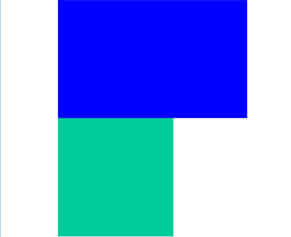
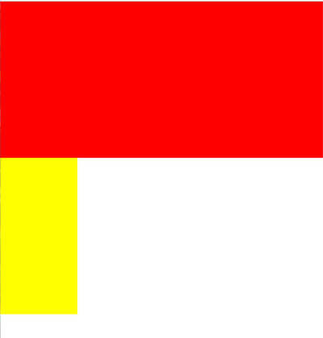
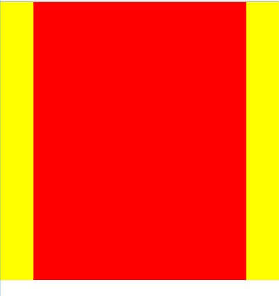

## 概述

圣杯布局和双飞翼布局解决的问题是一样的，就是两边`定宽`，中间`自适应`的三栏布局，`中间栏`要在放在文档流前面以`优先渲染`。

### 区别和统一

圣杯布局和双飞翼布局解决问题的方案在前一半是相同的，也就是`三栏`全部 float 浮动，但左右两栏加上负 margin 让其跟中间栏 div 并排，以形成三栏布局。

不同在于解决”中间栏 div 内容不被遮挡“问题的思路不一样：
圣杯布局，为了中间 div 内容不被遮挡，将中间 div 设置了左右 padding-left 和 padding-right 后，将左右两个 div 用相对布局 position: relative 并分别配合 right 和 left 属性，以便左右两栏 div 移动后不遮挡中间 div。

双飞翼布局，为了中间 div 内容不被遮挡，直接在中间 div 内部创建子 div 用于放置内容，在该子 div 里用 margin-left 和 margin-right 为左右两栏 div 留出位置。

简单说起来就是”双飞翼布局比圣杯布局多创建了一个 div，但不用相对布局了“，而不是你题目中说的”去掉 relative"就是双飞翼布局“。

## 圣杯布局

圣杯布局，为了中间 div 内容不被遮挡，将中间 div 设置了左右 padding-left 和 padding-right 后，将左右两个 div 用相对布局 position: relative 并分别配合 right 和 left 属性，以便左右两栏 div 移动后不遮挡中间 div。

### 实例

```html
<section class="container">
  <article class="con_continer"></article>
  <article class="con_left"></article>
  <article class="con_right"></article>
</section>
```

先设置`container`的左右`padding`值来摆正`con_continer 的位置`

```css
/*圣杯布局*/
/*摆正中间栏的位置*/
.container {
  padding: 0 200px;
}
/*清除浮动*/
.container::after {
  content: '';
  display: block;
  clear: both;
  overflow: hidden;
  zoom: 1;
}
/*设置三栏高度*/
.container .con_continer,
.container .con_left,
.container .con_right {
  height: 400px;
}
/*设置三栏为左浮动 float:left*/
.container .con_continer {
  float: left;
  width: 100%;
  background: red;
}
.container .con_left {
  float: left;
  width: 200px;
  background: yellow;
}
.container .con_right {
  float: left;
  width: 200px;
  background: yellow;
}
```

如下图所示：



左右栏通过添加`负的 margin`放到正确的位置了
修改如下：

```css
.container .con_continer {
  float: left;
  width: 100%;
  background: red;
}
// 通过margin-left为-100% 左侧栏 覆盖到中间栏上，再通过相对定位的负的left值来让他在左边
.container .con_left {
  float: left;
  width: 200px;
  margin-left: -100%;
  background: yellow;
  position: relative;
  left: -200px;
}
// 通过margin-left为-200px 右侧栏 覆盖到中间栏上，再通过相对定位的负的right值来让他在右边
.container .con_right {
  float: left;
  width: 200px;
  margin-left: -200px;
  background: yellow;
  position: relative;
  right: -200px;
}
```

## 双飞翼布局

双飞翼布局，为了中间 div 内容不被遮挡，直接在中间 div 内部创建子 div 用于放置内容，在该子 div 里用 margin-left 和 margin-right 为左右两栏 div 留出位置。

### 实例

```html
<section class="container">
  <article class="con_continer">
    <div class="item"></div>
  </article>
  <article class="con_left"></article>
  <article class="con_right"></article>
</section>
```

```css
/*双飞翼布局*/
/*清除浮动*/
.container::after {
  content: '';
  display: block;
  clear: both;
  overflow: hidden;
  zoom: 1;
}
/*设置三栏高度*/
.container .con_continer,
.container .con_left,
.container .con_right,
.container .con_continer .item {
  height: 400px;
}
/*设置三栏为左浮动 float:left*/
.container .con_continer {
  float: left;
  width: 100%;
  background: red;
}
.container .con_left {
  float: left;
  width: 200px;
  background: yellow;
}
.container .con_right {
  float: left;
  width: 200px;
  background: yellow;
}
```

如下图所示：

左右栏通过添加`负的 margin`放到正确的位置了
修改如下：

```css
.container .con_continer {
  float: left;
  width: 100%;
  background: red;
}
// 通过margin-left为-100% 左侧栏 覆盖到中间栏上，再通过相对定位的负的left值来让他在左边
.container .con_left {
  float: left;
  width: 200px;
  margin-left: -100%;
  background: yellow;
}
// 通过margin-left为-200px 右侧栏 覆盖到中间栏上，再通过相对定位的负的right值来让他在右边
.container .con_right {
  float: left;
  width: 200px;
  margin-left: -200px;
  background: yellow;
}
// 设置 con_continer内部 内容的margin来防止覆盖
.container .con_continer .item {
  margin: 0 200px 0 180px;
}
```

修改后的结局为这样


