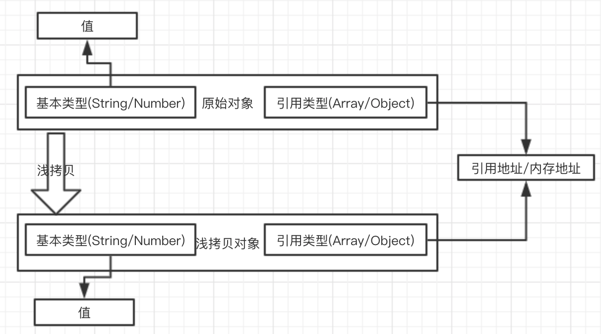
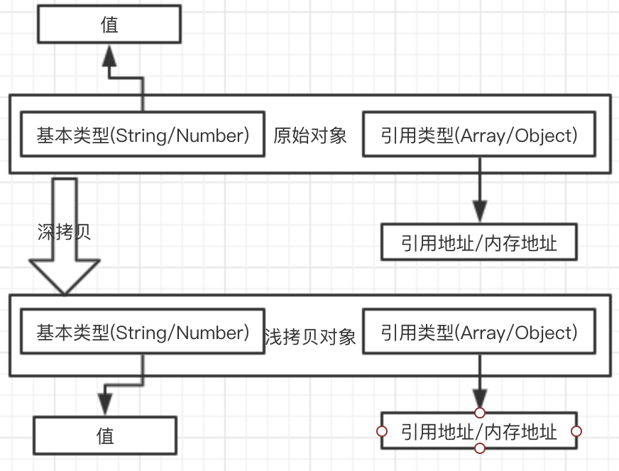

## 简介

首先我们要了解什么是`深拷贝`、`浅拷贝`，要了解`深拷贝/浅拷贝`首先要了解浅拷贝`JavaScript`中的数据类型。

`JavaScript`中的数据类型分为两类：

- `值类型/原始类型/基本类型：String、Number、Boolean、null、undefined、Symbol`
- `引用类型/“指针”类型：Object、Array、Window等等`

`基本类型`是储存在栈(stack)中的数据。
`引用类型`真实数据是储存在堆中的，而它的引用地址储存在栈中。


如果有兴趣了解`JavaScript`中的类型的话，可以看一下我往期的文章[JavaScript 数据类型（一） 常见数据类型](/blog/javascript/javascript-Type-conversion.html)，这个只是其中的一篇，有关`JavaScript`类型的常见的概念基本上都有提及。

`基本类型`是不存在`深拷贝`和`浅拷贝`的，因为`基本类型`是不可变的，无论是`修改`、`重新赋值`、`赋值给别的变量`都是一个新的值，和原来的值再无关联。

```javascript
var a = 'abc',
  b = a;
b = 'abcd';
console.log(a, b); // abc, abcd
```

`引用类型`因为是地址引用，所以会存在`深拷贝`和`浅拷贝`，下面就开始介绍。

- `浅拷贝简介`: 创建一个新对象，这个对象有着`原始对象属性值`的一份精确拷贝。如果属性是基本类型，拷贝的就是`基本类型的值`，如果属性是引用类型，拷贝的就是`内存地址` ，所以如果其中一个对象改变了这个地址，就会影响到另一个对象。



- `深拷贝`: 创建一个新的对象把原始对象的`所有属性`的拷贝一份，并且`引用类型的引用地址和内存空间都会被拷贝一份，重新分配内存空间`。`修改新对象不会影响原始对象`。



本章主要记录`深拷贝/浅拷贝`，主要讲解浅拷贝相关的如`assign、解构、扩展运算符、slice`等等，后面的文章会`由浅到深的`的介绍`深拷贝`相关的。

## 浅拷贝

虽然看着`浅拷贝`比较简单，其实它就是比较简单，但是它相关的东西也不少，下面就开始吧。

- Object.assign() & 自己实现一个 Object.assign()
- Array.prototype.slice()
- Array.prototype.concat()
- 解构
- ...扩展运算符
- jquery.extend()
- 自己实现一个浅拷贝

### Object.assign()

`语法`: `Object.assign(target, ...sources)`;
`返回值`: `target对象`

ES6 中拷贝对象的方法，接受的第一个参数是拷贝的`目标target`，剩下的参数是拷贝的`源对象sources`（`可以是多个`）

```js
var target = { firstname: 'target', age: 20 };
var source = { lastname: 'source', age: 21 };
const newtarget = Object.assign(target, source);
// target与newtarget指向同一个内存地址
console.log(target); // {firstname: "target", age: 21, lastname: "source"}
console.log(newtarget); // {firstname: "target", age: 21, lastname: "source"}
console.log(newtarget === target); // true

// 修改newtarget的age属性，target属性也跟着变化，而source不会变化
newtarget.age = 22;
console.log(target); // {firstname: "target", age: 22, lastname: "source"}
console.log(newtarget); // {firstname: "target", age: 22, lastname: "source"}
console.log(source); // { lastname: 'source', age: 21 }

// 通过Object.assgin()第一个传入一个空对象，结果和上方相同
const newSource = Object.assign({}, source);
console.log(newSource); // {firstname: "target", age: 21, lastname: "source"}

newSource.age = 22;
console.log(source); // {firstname: "target", age: 21, lastname: "source"}
console.log(newSource); // {firstname: "target", age: 22, lastname: "source"}
```

在上面的代码中我们可以看到通过`Object.assign(target, source);`会返回一个新的值`newtarget`，这个值的引用地址与`target`是同一个地址，所以修改`newtarget.age = 22;`后`target`和`newtarget`都会变化。
`Object.assign({}, source)`返回的`newSource`它被修改不会影响到`source`的变化，因为他的`target`传入的是一个空对象。

### 自己实现一个 assgin

**实现目标**

- 第一个`target`
- 支持多个对象合并
- 与 Object.assign 表现一至

大致分为下面几步：

- 判断传入`target`如果不为对象，或者 传入为`null`时直接返回`Object(target)`
- 获取所有参数，参数列表转为`Array`类型
- 循环上一步生成数组，获取每一个传入的对象
- 通过 `for...in`循环上一步获取的对象，并且通过`hasOwnProperty`判断当前属性是否是本身上的属性（不是原型上的）
- 上一步通过判断的属性，赋值给`target`对象
- 最后返回`target`对象

**函数版本**

```javascript
// 函数版本
function assign(target) {
  // 验证第一个参数是否为object
  if (typeof target !== 'object' || target == null) {
    return Object(target);
  }
  // arguments转为数组
  let copyList = Array.prototype.slice.call(arguments, 1);
  let len = copyList.length;
  // 循环复制多个对象的属性
  for (let i = 0; i < len; i++) {
    let item = copyList[i];
    // 获取当前对象的属性
    for (key in item) {
      // 判断属性是否在对象本身上
      if (item.hasOwnProperty(key)) {
        // 复制给目标对象
        target[key] = item[key];
      }
    }
  }
  // 返回目标对象
  return target;
}
// 验证assign代码
var target = { firstname: 'target', age: 20 };
var source = { lastname: 'source', age: 21 };
const newtarget = Object.assign(target, source);
// target与newtarget指向同一个内存地址
console.log(target); // {firstname: "target", age: 21, lastname: "source"}
console.log(newtarget); // {firstname: "target", age: 21, lastname: "source"}
console.log(newtarget === target); // true

// 修改newtarget的age属性，target属性也跟着变化，而source不会变化
newtarget.age = 22;
console.log(target); // {firstname: "target", age: 22, lastname: "source"}
console.log(newtarget); // {firstname: "target", age: 22, lastname: "source"}
console.log(source); // { lastname: 'source', age: 21 }

// 通过Object.assgin()第一个传入一个空对象，结果和上方相同
const newSource = Object.assign({}, source);
console.log(newSource); // {firstname: "target", age: 21, lastname: "source"}

newSource.age = 22;
console.log(source); // {firstname: "target", age: 21, lastname: "source"}
console.log(newSource); // {firstname: "target", age: 22, lastname: "source"}
```

**Object.defineProperty**版本

```javascript
if (typeof Object.newAssign !== 'function') {
  Object.defineProperty(Object, 'newAssign', {
    writable: true,
    configurable: true,
    enumberable: false,
    value: function (target) {
      // 验证第一个参数是否为object
      if (typeof target !== 'object' || target == null) {
        return Object(target);
      }
      // arguments转为数组
      let copyList = Array.prototype.slice.call(arguments, 1);
      let len = copyList.length;
      // 循环复制多个对象的属性
      for (let i = 0; i < len; i++) {
        let item = copyList[i];
        // 获取当前对象的属性
        for (key in item) {
          // 判断属性是否在对象本身上
          if (item.hasOwnProperty(key)) {
            // 复制给目标对象
            target[key] = item[key];
          }
        }
      }
      // 返回目标对象
      return target;
    }
  });
}

// 测试代码
Object.newAssign('abc', false); // String {"abc"}
Object.assign('abc', false); // String {"abc"}

Object.newAssign({}, 'abc'); // {0: "a", 1: "b", 2: "c"}
Object.assign({}, 'abc'); // {0: "a", 1: "b", 2: "c"}

Object.newAssign({}, 'abc', false, 123); // {0: "a", 1: "b", 2: "c"}
Object.assign({}, 'abc', false, 123); // {0: "a", 1: "b", 2: "c"}
```

### Array.prototype.slice()

`slice()` 方法返回一个新的`数组对象`，这一对象是一个由 `begin`和 `end`（不包括 end）决定的原数组的`浅拷贝`。原始数组不会被改变。
`slice()` 它的定义其实是复制一个数组。

```javascript
let old = ['a', 'b', ['c', 'd']];
// 通过slice复制当前数组
let newValue = old.slice(0);
console.log(newValue); // ['a', 'b', ['c', 'd']];

// 修改原数组的下标为0的值，新对象没有受到影响，因为下标为0的是基本类型，它们的内存地址是不同的
old[0] = 'f';
console.log(newValue); // ['a', 'b', ['c', 'd']];

// 修改原数组的下标为2的值，新对象受到影响，因为下标为2的是引用类型，它们的值指向同一个内存地址
old[2][0] = '';
console.log(newValue); // ['a', 'b', ['', 'd']];
```

### Array.prototype.concat()

`concat()` 方法用于**合并两个或多个数组**。此方法**不会更改**现有数组，而是返回一个**新数组**。

**语法**

`var new_array = old_array.concat(value1[, value2[, ...[, valueN]]])`

**返回值**
新的 Array 实例。

```js
var old = ['a', 'b', ['c', 'd']];
// 通过concat返回一个新的Array实例
var newArr = Array.prototype.concat([], old);
console.log(newArr); // ['a', 'b', ['c', 'd']];

// 修改原数组的下标为0的值，新对象没有受到影响，因为下标为0的是基本类型，它们的内存地址是不同的
old[0] = 'f';
console.log(newArr); // ['a', 'b', ['c', 'd']];

// 修改原数组的下标为2的值，新对象受到影响，因为下标为2的是引用类型，它们的值指向同一个内存地址
old[2][0] = '';
console.log(newArr); // ['a', 'b', ['', 'd']];
```

`concat()`它的效果是和`slice()`相同的。

### 解构

**解构**是**ES6**中的新特性，它可以方便的**浅复制**一个对象。

```js
// 声明一个对象
var old = {
  name: 'old',
  attr: {
    age: 18,
    sex: 'man'
  }
};

// 通过解构复制attr出来，它只复制了内存地址
var { attr } = old;
console.log(attr); // {age: 18, sex: "man"}

// 修改原对象的attr值，新对象受到影响
old.attr.age = 20;
console.log(attr); // {age: 20, sex: "man"}
```

### ...扩展运算符

`...扩展运算符`也是**ES6**中的新特性，它可以方便的**浅复制**一个对象。

```js
// 声明一个对象
var old = {
  name: 'old',
  attr: {
    age: 18,
    sex: 'man'
  }
};

// 通过...扩展运算符，它只复制了内存地址
var newValue = { ...old };
console.log(newValue); // {name: "old", attr: {age: 18, sex: "man"}}

// 修改原对象的attr.age值，新对象受到影响
old.attr.age = 20;
console.log(newValue); // {name: "old", attr: {age: 20, sex: "man"}}
```

### jquery.extend

`jquery.extend()`是一个浅拷贝，这个在这里就不多做赘述了，如果想看实现原理的话，可以去看`jquery`github 上的源码实现。

### 自己实现一个浅拷贝

实现一个**浅拷贝**其实很简单，大致步骤如下：

- 声明一个新对象
- 旧对象的属性赋值给新对象

```js
// 声明函数
function shallowCopy(oldObj) {
  // 声明新对象
  var newObj = {};
  // 判断传入是否为对象
  if (typeof oldObj !== 'object') {
    console.log('请传入对象');
    return oldObj;
  }
  // 循环获取传入对象属性
  for (key in oldObj) {
    // 判断属性是否在对象本身上
    if (oldObj.hasOwnProperty(key)) {
      // 把属性复制给新对象
      newObj[key] = oldObj[key];
    }
  }
  // 返回新对象
  return newObj;
}

// 声明一个对象
var old = {
  name: 'old',
  attr: {
    age: 18,
    sex: 'man'
  }
};
// 通过shallowCopy
var newValue = shallowCopy(old);
console.log(newValue); // {name: "old", attr: {age: 18, sex: "man"}}

// 修改原始对象的基本类型属性，新对象不受影响
old.name = 'new';
console.log(newValue); // {name: "old", attr: {age: 18, sex: "man"}}

// 修改原始对象引用类型属性，新对象受到影响
old.attr.age = 20;
console.log(newValue); // {name: "old", attr: {age: 20, sex: "man"}}
```

## 总结

在本文中我们分别介绍了**深拷贝**、**浅拷贝**是什么。着重介绍了我们日常使用的**浅拷贝**，并且自己实现了一个`assign()`和一个`shallowCopy`来加深对浅拷贝的理解，下一篇文件会介绍一个**深拷贝**相关的`JSON.stringify()/JSON.parse()`并且自己实现一个。

通过上面的实例，可以验证我们对**浅拷贝**的理解是对的，如果是**基本类型**浅拷贝可以把它的值拷贝到新对象中，如果是**引用类型**浅拷贝只能拷贝引用类型的引用地址。

## 参考

[https://developer.mozilla.org/zh-CN/docs/Web/JavaScript/Reference/Global_Objects/Array/slice](https://developer.mozilla.org/zh-CN/docs/Web)
[一文搞懂 JS 中的赋值·浅拷贝·深拷贝](https://mp.weixin.qq.com/s/bvYqA16mU_rRYT1G37onug)
