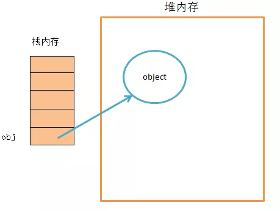
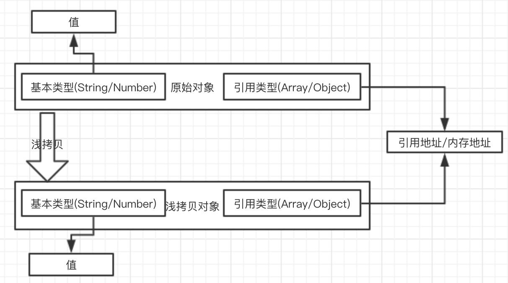
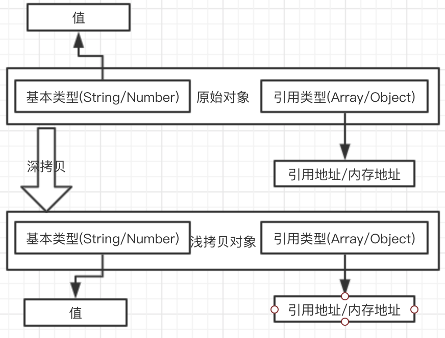

## 简介

首先我们要了解什么是**深拷贝**、**浅拷贝**，要了解**深拷贝/浅拷贝**首先要了解浅拷贝**JavaScript**中的数据类型。

**JavaScript**中的数据类型分为两类：

- **值类型/原始类型/基本类型：String、Number、Boolean、null、undefined、Symbol**
- **引用类型/“指针”类型：Object、Array、Window等等**

**基本类型**是储存在栈(stack)中的数据。
**引用类型**真实数据是储存在堆中的，而它的引用地址储存在栈中。



如果有兴趣了解**JavaScript**中的类型的话，可以看一下我往期的文章[JavaScript数据类型（一） 常见数据类型](/blog/javascript/javascript-Type-conversion.html)，这个只是其中的一篇，有关**JavaScript**类型的常见的概念基本上都有提及。

**基本类型**是不存在**深拷贝**和**浅拷贝**的，因为**基本类型**是不可变的，无论是**修改**、**重新赋值**、**赋值给别的变量**都是一个新的值，和原来的值再无关联。

```javascript
    var a = 'abc',
        b = a;
    b = 'abcd';
    console.log(a, b); // abc, abcd
```

**引用类型**因为是地址引用，所以会存在**深拷贝**和**浅拷贝**，下面就开始介绍。

**浅拷贝**

创建一个新对象，这个对象有着**原始对象属性值**的一份精确拷贝。如果属性是基本类型，拷贝的就是**基本类型的值**，如果属性是引用类型，拷贝的就是**内存地址** ，所以如果其中一个对象改变了这个地址，就会影响到另一个对象。



**深拷贝**

创建一个新的对象把原始对象的**所有属性**的拷贝一份，并且**引用类型的引用地址和内存空间都会被拷贝一份，重新分配内存空间**。**修改新对象不会影响原始对象**。



本章主要记录**深拷贝/浅拷贝**，主要讲解浅拷贝相关的如`assign、解构、扩展运算符、slice`等等，后面的文章会**由浅到深的**的介绍**深拷贝**相关的。

## 浅拷贝

虽然看着**浅拷贝**比较简单，其实它就是比较简单，但是它相关的东西也不少，下面就开始吧。

- Object.assign() & 自己实现一个Object.assign()
- Array.prototype.slice()
- Array.prototype.concat()
- 解构
- ...扩展运算符
- jquery.extend()
- 自己实现一个浅拷贝

### Object.assign()

**语法**: `Object.assign(target, ...sources)`;
**返回值**: `target对象`

ES6中拷贝对象的方法，接受的第一个参数是拷贝的`目标target`，剩下的参数是拷贝的`源对象sources`（**可以是多个**）

```js
    var target = { firstname: 'target', age: 20 };
    var source = { lastname: 'source', age: 21 };
    const newtarget = Object.assign(target, source);
    console.log(target); // {firstname: "target", age: 21, lastname: "source"}
    console.log(newtarget); // {firstname: "target", age: 21, lastname: "source"}

    newtarget.age = 22;
    console.log(target); // {firstname: "target", age: 22, lastname: "source"}
    console.log(newtarget); // {firstname: "target", age: 22, lastname: "source"}

    const newSource = Object.assign({}, source);
    console.log(newSource); // {firstname: "target", age: 21, lastname: "source"}
    newSource.age = 22;

    console.log(source); // {firstname: "target", age: 21, lastname: "source"}
    console.log(newSource); // {firstname: "target", age: 22, lastname: "source"}
```

在上面的代码中我们可以看到通过`Object.assign(target, source);`会返回一个新的值`newtarget`，这个值的引用地址与`target`是同一个地址，所以修改`newtarget.age = 22;`后`target`和`newtarget`都会变化。
`Object.assign({}, source)`返回的`newSource`它被修改不会影响到`source`的变化，因为他的`target`传入的是一个空对象。

### 自己实现一个assgin

- 第一个`target`
- 支持多个对象

```javascript
    function assign (target) {
        if (typeof target !== 'object') {
            console.log('细节，细节');
            return target;
        }
        let copyList = Array.prototype.slice.call(arguments, 1);
        let len = copyList.length;
        for (let i = 0; i < len; i++) {
            let item = copyList[i];
            for (key in item) {
                target[key] = item[key]
            }
        }
        // console.log(target)
        return target;
    }

    var target = { firstname: 'target', age: 20 };
    var source = { lastname: 'source', age: 21 };
    const newtarget = assign(target, source);
    console.log(target); // {firstname: "target", age: 21, lastname: "source"}
    console.log(newtarget); // {firstname: "target", age: 21, lastname: "source"}

    newtarget.age = 22;
    console.log(target); // {firstname: "target", age: 22, lastname: "source"}
    console.log(newtarget); // {firstname: "target", age: 22, lastname: "source"}

    const newSource = assign({}, source);
    console.log(newSource); // {firstname: "target", age: 21, lastname: "source"}
    newSource.age = 22;

    console.log(source); // {firstname: "target", age: 21, lastname: "source"}
    console.log(newSource); // {firstname: "target", age: 22, lastname: "source"}
```

### Array.prototype.slice()

`slice()` 方法返回一个新的**数组对象**，这一对象是一个由 `begin`和 `end`（不包括end）决定的原数组的`浅拷贝`。原始数组不会被改变。

```javascript
    let old = ['a', 'b', ['c', 'd']];
    let new = old.slice(0);

    console.log(new);

    old[0] = 'f';
    console.log(new);
    old[2][0] = ''
```