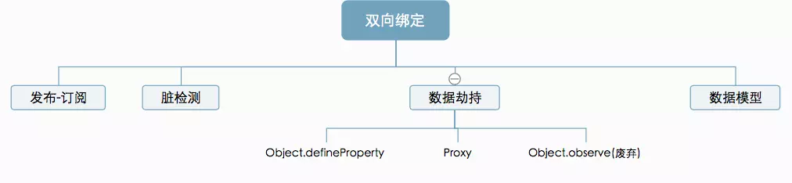

## 简介

<!-- 现在的三大框架非常的流行，在数据流中分为两派`React`的单项数据流，`Angluar/Vue`的双向数据流。其实`React`也是实现了的**双向数据绑定**的，只不过要通过`setState`来触发。

在不同框架中实现**双向数据绑定**也是不相同的，大致如下图所示：

`Object.definedproterty`和`proxy`都是`Vue`不同版本的重要组成部分，它们都是可以实现双向绑定， -->

