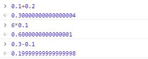

## 概述
在用到JavaScript中float类型的值来运算时,会产生精度不准的问题。
例如：

可以看到：
```javascript
    console.log(0.1+0.2);
    // 0.30000000000000004
```
他得到的值是不精准的，简单来说，你的电脑做着正确的二进制浮点运算，但问题是你输入的是十进制的数，电脑以二进制运算，这两者并不是总是转化那么好的
想了解更详细的请参考> https://www.zhihu.com/question/20679634
### 实例
```javascript

```