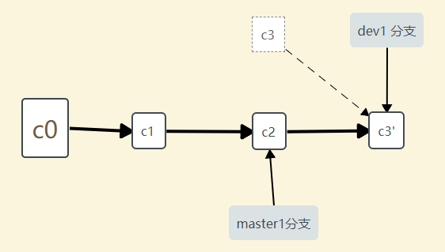

## 概述
把一个分支中的修改整合到另一个分支的办法有两种：merge 和 rebase（译注：rebase 的翻译暂定为“衍合”，大家知道就可以了。）。在本章我们会学习什么是衍合，如何使用衍合，为什么衍合操作如此富有魅力，以及我们应该在什么情况下使用衍合。
同时，比如要要合并多个commit,就可以用git rebase -i head~2。
```shell
git merge // 合并分支
git cherry-pick // copy单个commit
git rebase // 衍合
git rebase [startpoint]   [endpoint]  --onto  [branchName] // copy多个commit
git rebase -i  [startpoint]  [endpoint] // 合并多个commit
//  pick：保留该commit（缩写:p）
//  reword：保留该commit，但我需要修改该commit的注释（缩写:r）
//  edit：保留该commit, 但我要停下来修改该提交(不仅仅修改注释)（缩写:e）
//  squash：将该commit和前一个commit合并（缩写:s）
//  fixup：将该commit和前一个commit合并，但我不要保留该提交的注释信息（缩写:f）
//  exec：执行shell命令（缩写:x）
//  drop：我要丢弃该commit（缩写:d）
```

## git merge
使用 git merge 合并master1和dev1分支
``` shell
git checkout master1
git merge dev1
```

如上图所示：
最新的快照c2和c3，还有它们共同的祖先c1进行三方合并，合并的结果会产生以下新的c5，同时太还会对你的master1分支上的合并线条产生不好的结果。


## git rebase
我们现在使用 git rebase 来合并master1和dev1分支
``` shell
git checkout dev1
git rebase master1
git checkout master1
git merge dev1
```

如上图所示：
它的原理是回到两个分支最近的共同祖先，根据当前分支（也就是要进行衍合的分支 dev1）后续的历次提交对象（这里只有一个 C3），生成一系列文件补丁，然后以基底分支（也就是主干分支master1）最后一个提交对象（C2）为新的出发点，逐个应用之前准备好的补丁文件，最后会生成一个新的合并提交对象（C3'），从而改写 dev1 的提交历史，使它成为 master1 分支的直接下游.
把 C3 里产生的改变到 C2 上重演一遍。
现在回到 master1 分支，进行一次快进合并.


## git rebase [startpoint]   [endpoint]  --onto  [branchName]
当我们想从master1分支上复制b、c、d节点复制到dev1分支上，如下图所示：
![git rebase [startpoint]   [endpoint]  --onto  [branchName]](../images/git/1-5.jpg)
a
