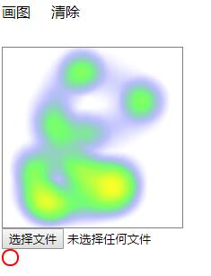

## 简述
绘制了热力图的时候用到了插件heatmap.js,高德地图的热力图也是用了这个插件来绘制的。
heatmap > https://www.patrick-wied.at/static/heatmapjs/
可能比较冷门，一般的话相信没人会用这个工具的，但是现在大数据这么火，相信还是有人能用到的。
要做的是，上传一张图片，然后在图片上绘制热力图，同是也是可以擦除，这个只是一个小的demo,可以根据自己的实际场景来实际应用
### 功能
默认是绘制图形，点击清除，擦除热力图
### 实例
```html
    <!DOCTYPE html>
    <html>
        <head>
            <meta charset="UTF-8">
            <title></title>
            <style>
                .heatmap {
                    width:1800px; height:600px;border: 1px solid;border-color: grey;cursor: pointer;
                }
                .imgUpdate {
                    position: absolute;
                    left: 10px;
                    top: 60px;
                    z-index: -999;
                }
                .draw, .clear{
                    display: inline-block;
                    width: 50px;
                    height: 50px;
                }
                .circle {
                    width: 15px;
                    height: 15px;
                    position: absolute;
                    border: 2px solid red;
                    border-radius: 100%;
                }
            </style>
        </head>
        <body>
            <div class="activat">
                <span class="draw">画图</span>
                <span class="clear">清除</span>
            </div>
            <div class="heatmap"></div>
            <div class="ge_pic_icon_Infor">
                
            </div>  
            <div class="Infor_file">  
                <input type="file" name="uploadPicture" id="file" value="" title="上传照片" onchange="getPhoto(this)"/>  
            </div> 
            <div class="circle">

            </div>
        </body>
        <script src="https://cdn.bootcss.com/heatmap.js/2.0.2/heatmap.js"></script>
        <script type="text/javascript">
        var body = document.body;
        var hm = document.querySelector('.heatmap');
        var clearDom = document.querySelector('.clear');
        var drawDom = document.querySelector('.draw');
        var circleDom = document.querySelector('.circle');
        let State = 0;
        // var hehedom = document.querySelector('#hehe');
        // hehedom.addEventListener('change', function () {
        //     console.log(this.value)
        // });
        var heatmap = h337.create({
            container: hm,
            radius: 30
        });
        heatmap.setData ({
        max: 100,
        min: 0,
        data: []
        });
        var lastX, lastY;
        let key = 0;
        body.onmousedown = function(ev) {
            key = 1;
            return false;
        }
        body.onmouseup = function(ev) {
            key = 0;
            return false;
        }
        let arr = [];
        let arr1 = [];
        hm.onmousemove = function(ev) {
            // console.log(222);
            if (key !== 1) {return false;}
            // console.log(ev);
            lastX = ev.pageX;
            lastY = ev.pageY - 50;
            let obj = {
                x: lastX,
                y: lastY,
                value: 10
            }
            heatmap.addData(obj);
            arr.push(obj);
            // console.log(obj);
        }
        drawDom.addEventListener('click', function(event) {
            hm.onmousemove = null;
            hm.onmousemove = function(ev) {
                if (key !== 1) {return false;}
                // console.log(ev);
                lastX = ev.pageX;
                lastY = ev.pageY - 50;
                let obj = {
                    x: lastX,
                    y: lastY,
                    value: 10
                }
                heatmap.addData(obj);
                arr.push(obj);
            }
        })
        clearDom.addEventListener('click', function(event) {
            hm.onmousemove = null;
            hm.onmousemove = function(ev) {
                circleDom.style.left = ev.pageX + 'px';
                circleDom.style.top = ev.pageY + 'px';
                if (key !== 1) {return false;}
                // console.log(ev);
                let arr2 = [];
                arr.forEach((item, index) => {
                    // console.log(typeof ev.pageX);
                    // console.log(ev.pageX + '' + ev.pageY);
                    // for (let i = 0; i <= 15; i++) {
                        let dx = ev.pageX - item.x;
                        let dy = ev.pageY - item.y - 50;
                        // console.log((dx * dx) + (dy * dy));
                        if ((dx * dx) + (dy * dy) <= 15 * 15){
                            arr2.push(index);
                        }
                })
                if (arr2.length) {
                    console.log(arr2)
                }
                let arr3 = [];
                // console.log(arr);
                for(var i = 0; i < arr2.length; i++) {
                    if (arr.length === 1) {
                        arr = [];
                    } else {
                        arr.splice((arr2[i]-i), 1)
                    }
                }
                let oObj = {
                    max: 100,
                    min: 0,
                    data: arr
                }
                window.heatmap.setData(oObj);

            }
        })
        var imgurl = "";  
            function getPhoto(node) {  
                var imgURL = "";  
                try{  
                    var file = null;  
                    if(node.files && node.files[0] ){  
                        file = node.files[0];  
                    }else if(node.files && node.files.item(0)) {  
                        file = node.files.item(0);  
                    }  
                    //Firefox 因安全性问题已无法直接通过input[file].value 获取完整的文件路径  
                    try{  
                        imgURL =  file.getAsDataURL();  
                    }catch(e){  
                        imgRUL = window.URL.createObjectURL(file);  
                    }  
                }catch(e){  
                    if (node.files && node.files[0]) {  
                        var reader = new FileReader();  
                        reader.onload = function (e) {  
                            imgURL = e.target.result;  
                        };  
                        reader.readAsDataURL(node.files[0]);  
                    }  
                }  
                creatImg(imgRUL);  
                return imgURL;  
            }  
        
            function creatImg(imgRUL){  
                // var textHtml = "";
                document.querySelector(".imgUpdate").setAttribute('src', imgRUL);  
            }  

        </script>
    </html>
```
如图所示：
  