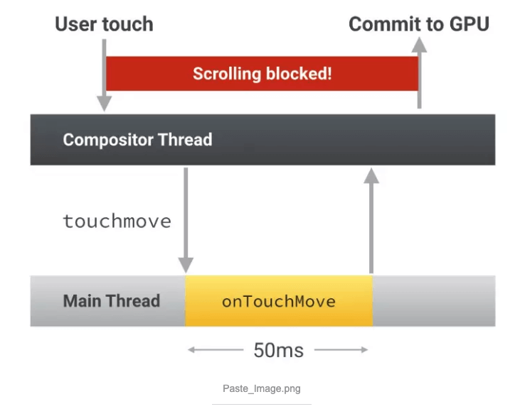
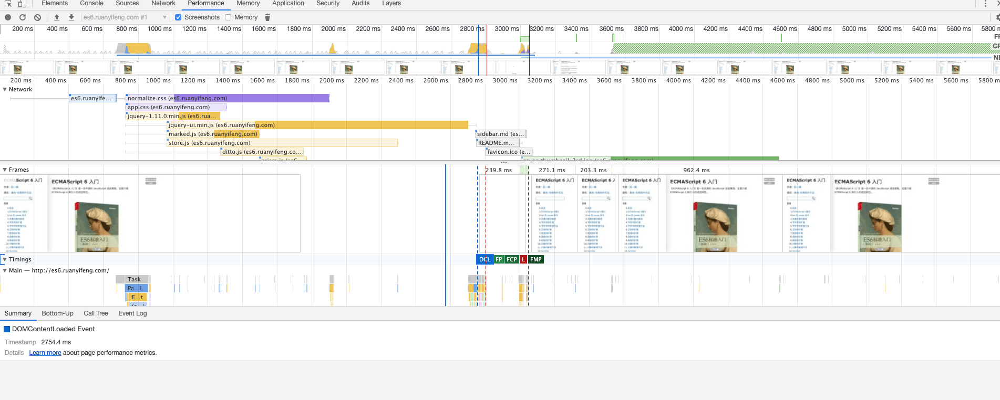

> [浏览器渲染原理 （一）在网址中输入一个网站后面都做了什么](/blog/html/html-browser-render.html)
> [浏览器渲染原理 （二）css、javascript、dom阻塞关系](/blog/html/html-style-javascript.html)
> [浏览器渲染原理 （三） repaint(重绘)和reflow(回流)详解](/blog/html/html-reload-reflow.html)

<font color="#ff502c"></font>
## 简介
大多数设备的刷新频率是60Hz，也就说是浏览器对每一帧画面的渲染工作要在16ms内完成,超出这个时间，页面的渲染就会出现卡顿现象，影响用户体验。
repaint(重绘)和reflow(回流)发生在什么渲染的那个阶段，我们要了解什么叫做repaint(重绘)和reflow(回流).
### (重绘)
repaint就是在<font color="#ff502c">不影响排版的情况下</font>对这个元素重新绘制的过程。例如改变一个元素的背景颜色、字体颜色等。
### reflow(回流、重排)
<font color="#ff502c">当render tree中的一部分（或全部）因为元素的规模尺寸，布局，隐藏等改变而需要重新构建</font>。这就称为回流（其实我觉得叫重新布局更简单明了些）。每个页面至少需要一次回流，就是在页面第一次加载的时候。
**回流必将引起重绘，而重绘不一定会引起回流** 

### 三种常见的渲染流程
**1. JS/CSS>计算样式>布局>绘制>渲染层合并**

这张图上渲染流程对应的是**reflow**渲染的过程，它会经过布局再绘制。
**2. JS/CSS>计算样式>绘制>渲染层合并**

这张图上渲染流程对应的是**repaint**渲染的过程，它不需要经过布局，只需要绘制当前的元素，不需要重新计算它的父元素。
**3. JS/CSS>计算样式>渲染层合并**

这张图上渲染流程比较特殊，它不选经过布局、绘制，它只需要在**合成层**上修改。
<!-- ### repaint、reflow和eventLoop关系 -->

## repaint(重绘)和reflow(回流)
上面大致已经记录了repaint、reflow的流程和为什么要关注它，下面记录一下它们的触发条件、和eventLoop的关系。
### 触发repaint、reflow
1. **添加、删除元素**（回流+重绘）
2. 隐藏元素，**display:none**(回流+重绘)，**visibility:hidden**(只重绘，不回流) 
3. **移动元素**，比如改变top、left（jquery的animate方法就是改变top、left不一定会影响回流），或者移动元素到另外1个父元素中。(重绘+回流) 
4. 对style的操作（对不同的属性操作，影响不一样）（color、background-color）=>(重绘)  (padding、margin)=>(回流)
5. 浏览器大小改变**resize**、**font-size**（重绘+回流）
6. **transform/opacity** （不会触发生重绘、回流）
7. 最复杂的一种：**获取某些属性**，引发回流 很多浏览器会对回流做优化，他会等到足够数量的变化发生，在做一次批处理回流。 但是除了render树的直接变化。 当获取一些属性时，浏览器为了获得正确的值也会触发回流。
    1. offsetTop, offsetLeft, offsetWidth, offsetHeight
    2. scrollTop/Left/Width/Height
    3. clientTop/Left/Width/Height
    4. width,height
    5. 调用了getComputedStyle(), 或者 IE的 currentStyle

上面大致就是触发**repaint、reflow**的操作，还有更多的后面还会补全。

### repaint、reflow和eventLoop关系
1. 当 Event loop 执行完 Microtasks 后，会判断 document 是否需要更新。因为浏览器是 60Hz 的刷新率，每 16ms 才会更新一次。
2. 然后判断是否有 resize 或者 scroll ，有的话会去触发事件，所以 resize和 scroll 事件也是至少 16ms 才会触发一次，并且自带节流功能。
3. 判断是否触发了 media query
4. 更新动画并且发送事件
5. 判断是否有全屏操作事件
6. 执行 requestAnimationFrame 回调
7. 执行 IntersectionObserver 回调，该方法用于判断元素是否可见，可以用于懒加载上，但是兼容性不好
8. 更新界面

在这个里面记录了触发repaing、reflow，还有和eventloop的关系，但是eventloop和ui渲染流程关系有点太复杂，所以大致记录了一下。

## 优化渲染性能
- 减少重绘和回流
- 优化JavaScript的执行效率
- 对用户输入事件的处理函数去抖动
- 优先使用渲染层合并属性、控制层数量
- 结合chrome工具分析性能

### 减少重绘和回流
- 避免逐项更改样式。最好一次性更改style属性，或者将样式列表定义为class并一次性更改class属性。
- 避免循环操作DOM。创建一个documentFragment或div，在它上面应用所有DOM操作，最后再把它添加到window.document。
- 避免多次读取offsetLeft等属性。无法避免则将它们缓存到变量。
- 将复杂的元素绝对定位或固定定位，使它脱离文档流。否则回流代价十分高
- 不要使用 table 布局，可能很小的一个小改动会造成整个 table 的重新布局
- 动画实现的速度的选择，动画速度越快，回流次数越多，也可以选择使用requestAnimationFrame
- CSS 选择符从右往左匹配查找，避免 DOM 深度过深
- 使用 visibility 替换 display: none ，因为前者只会引起重绘，后者会引发回流（改变了布局）
- 使用 translate 替代 top
- 把 DOM 离线后修改，比如：先把 DOM 给 display:none (有一次 Reflow)，然后你修改100次，然后再把它显示出来
- 使用flexbox替代老的布局模型
还有很多在这里就不一一列举了，主要思想就是减少reflow、repaint的次数。

### 优化JavaScript的执行效率
**动画实现，避免使用setTimeout或setInterval，尽量使用requestAnimationFrame**
**把耗时长的JavaScript代码放到Web Workers中去做**
#### requestAnimationFrame
**动画实现，避免使用setTimeout或setInterval，尽量使用requestAnimationFrame**
setTimeout(callback)和setInterval(callback)无法保证callback函数的执行时机，很可能在帧结束的时候执行，从而导致丢帧，如下图：

requestAnimationFrame(callback)可以保证callback函数在每帧动画开始的时候执行。
> 注意：jQuery的animate函数就是用setTimeout来实现动画，可以通过jquery-requestAnimationFrame这个补丁来用requestAnimationFrame替代setTimeout
#### 把耗时长的JavaScript代码放到Web Workers中去做
把耗时长的JavaScript代码放到Web Workers中去做JavaScript代码运行在浏览器的主线程上，与此同时，浏览器的主线程还负责样式计算、布局、绘制的工作，如果JavaScript代码运行时间过长，就会阻塞其他渲染工作，很可能会导致丢帧。
前面提到每帧的渲染应该在16ms内完成，但在动画过程中，由于已经被占用了不少时间，所以JavaScript代码运行耗时应该控制在3-4毫秒。

### 对用户输入事件的处理函数去抖动
用户输入事件处理函数会在运行时阻塞帧的渲染，并且会导致额外的布局发生。
理想情况下，当用户和页面交互，页面的渲染层合并线程将接收到这个事件并移动元素。这个响应过程是不需要主线程参与，不会导致JavaScript、布局和绘制过程发生。

但是如果被触摸的元素绑定了输入事件处理函数，比如touchstart/touchmove/touchend，那么渲染层合并线程必须等待这些被绑定的处理函数执行完毕才能执行，也就是用户的滚动页面操作被阻塞了，表现出的行为就是滚动出现延迟或者卡顿。
简而言之就是你必须确保用户输入事件绑定的任何处理函数都能够快速的执行完毕，以便腾出时间来让渲染层合并线程完成他的工作。


#### 避免使用运行时间过长的输入事件处理函数
输入事件处理函数，比如scroll/touch事件的处理，都会在requestAnimationFrame之前被调用执行。
因此，如果你在上述输入事件的处理函数中做了修改样式属性的操作，那么这些操作就会被浏览器暂存起来，然后在调用requestAnimationFrame的时候，如果你在一开始就做了读取样式属性的操作，那么将会触发浏览器的强制同步布局操作。


#### 对滚动事件处理函数去抖动
通过requestAnimationFrame可以对样式修改操作去抖动，同时也可以使你的事件处理函数变得更轻
```javascript
function onScroll(evt) {
    // Store the scroll value for laterz.
    lastScrollY = window.scrollY;

    // Prevent multiple rAF callbacks.
    if (scheduledAnimationFrame) {
        return;
    }

    scheduledAnimationFrame = true;
    requestAnimationFrame(readAndUpdatePage);
}

window.addEventListener('scroll', onScroll);
```
### chrome分析结合
使用Chrome DevTools来了解页面的渲染层情况
#### Chrome DevTools > Preformance
通过Chrome DevTools的Preformance来录制一段操作，并且开启More tools的Layers、Rendering功能，如果下图所示:


#### 借助Chrome暴露在window上的preformance对象
可以用preformance对象来做一些前端的性能分析和统计，如下图所示：

## 总结
在这个上面了解了reflow、repaint的流程和他的触发条件，再后面也有一部分怎么优化性能，结合前面的渲染流程大致知道优化的是那部分的流程。当然在优化性能的时候，一定要结合chrome的性能分析功能。
## 参考
> [深度剖析浏览器渲染性能原理，你到底知道多少？](https://www.jianshu.com/p/a32b890c29b1)
> [回流(reflow)与重绘(repaint)](https://www.cnblogs.com/dll-ft/p/5810639.html)
> [高性能WEB开发：深入理解页面呈现、重绘、回流](https://www.cnblogs.com/goloving/p/7545954.html)