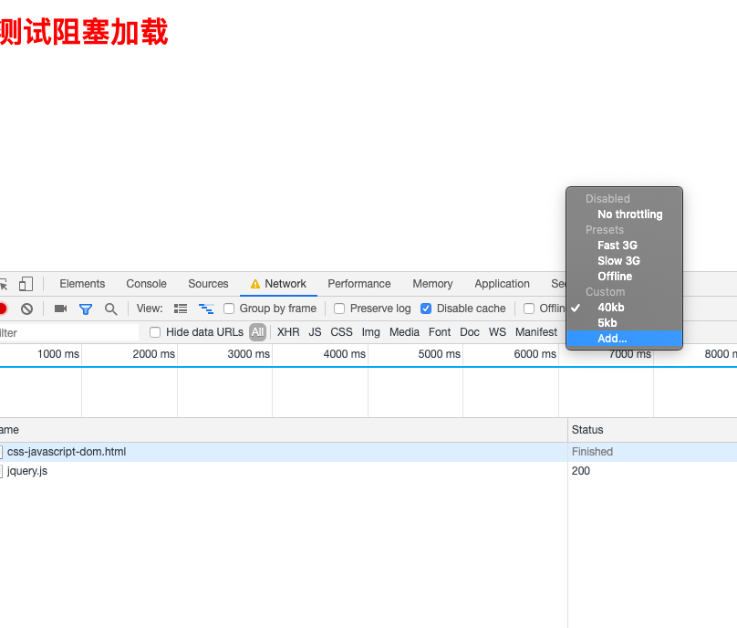
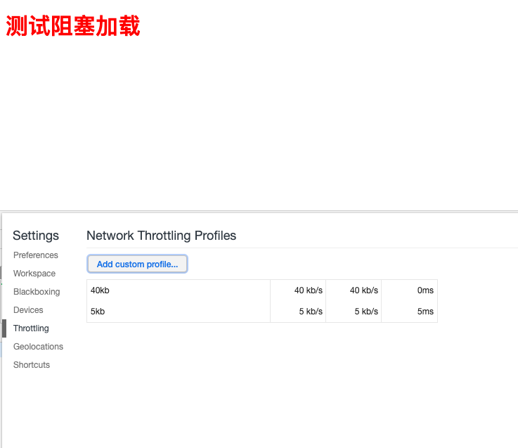
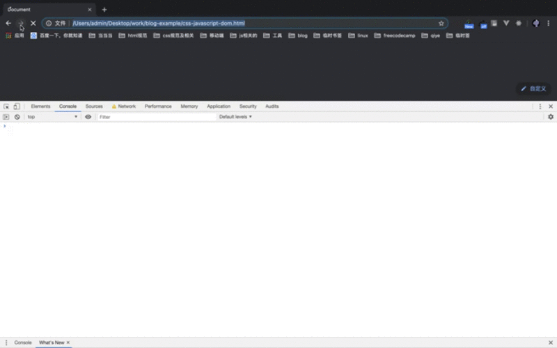
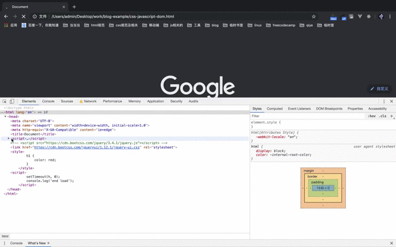

> [浏览器渲染原理 （一）在网址中输入一个网站后面都做了什么](/blog/html/html-style-javascript.html)
> [浏览器渲染原理 （二）css、javascript、dom阻塞关系](/blog/html/html-browser-render.html)
> [浏览器渲染原理 （三） repaint(重绘)和reflow(回流)详解](/blog/html/html-reload-reflow.html)
## 引子
我们在看一些前端优化规则的时候，比如雅虎军规等等，都有看到style写在head中，但是外链script写在body的最后，以优化性能，都知道应该怎么做，但是不知道其中的原理。
如果还不知道浏览器渲染的原理的，看一看[浏览器渲染原理](/blog/html/html-style-javascript.html)这一篇文章。其实这个就是考验大家对html中的css、javascript、dom之间的解析和相互阻塞关系。
## JavaScript会阻塞CSS、DOM吗？
### 提出自己观点
<font color="blue"></font>
当我们把script标签写到页面的顶部时，dom树在解析的时候检测到script标签是，会加载script里面的内容并且执行。我们假设在<font color="blue">执行</font>javascript会<font color="blue">阻塞dom</font>的解析和渲染，<font color="blue">阻塞css</font>的解析和加载。
### 验证自己的观点
在验证之前我们先把chrome的网速调到40kb每秒的下载和上传数据
**第一步**

**第二步**


我们来验证这个结论:
html代码如下
```javascript
<!DOCTYPE html>
<html lang="en">
<head>
    <meta charset="UTF-8">
    <meta name="viewport" content="width=device-width, initial-scale=1.0">
    <meta http-equiv="X-UA-Compatible" content="ie=edge">
    <title>Document</title>
    <script>
        console.log('start load');
        function h () {
            console.log(document.querySelectorAll('h1'))
        };
        setTimeout(h, 0);
    </script>
    <script src="https://cdn.bootcss.com/jquery/3.4.1/jquery.js"></script>
    <style>
        h1 {
            color: red;
        }
    </style>
    <script>
        console.log('end load');
        setTimeout(h, 0);
    </script>
</head>
<body>
    <h1>测试阻塞加载</h1>
</body>
</html>
```
在<font color="blue">加载到</font>jquery文件后，会先下载远程的jquery并且<font color="blue">执行</font>他，他会<font color="blue">阻塞dom的解析和渲染</font>，<font color="blue">css解析和渲染</font>，一直是白屏，等jquery<font color="blue">执行完成</font>了才接着解析Dom和cssom并且渲染，console.log打印h1标签也是空数组。
如下图所示：


### 总结
> javascript加载会阻塞 css解析和渲染
> javascript加载会阻塞 dom解析和渲染

## css加载会阻塞JavaScript的加载和执行、会阻塞Dom的解析和渲染？

### 提出自己观点
因为上面我们已经验证过JavaScript会阻塞Dom的解析和渲染，同时也会解析cssom的解析和渲染，所以我们假设css的加载会<font color="blue">阻塞</font>Dom的<font color="blue">解析</font>和<font color="blue">渲染</font>，会<font color="blue">阻塞</font>JavaScript的<font color="blue">加载</font>和<font color="blue">执行</font>。
### 验证我们的假设
在上面的代码基础上修改代码如下：
```javascript
<!DOCTYPE html>
<html lang="en">
<head>
    <meta charset="UTF-8">
    <meta name="viewport" content="width=device-width, initial-scale=1.0">
    <meta http-equiv="X-UA-Compatible" content="ie=edge">
    <title>Document</title>
    <script>
        console.log('start load');
        function h () {
            console.log(document.querySelectorAll('h1'))
        };
        setTimeout(h, 0);
    </script>
    <link href="https://cdn.bootcss.com/jqueryui/1.12.1/jquery-ui.css" rel="stylesheet">
    <style>
        h1 {
            color: red;
        }
    </style>
    <script>
        console.log('end load');
    </script>
</head>
<body>
    <h1>测试阻塞加载</h1>
</body>
</html>
```
执行结果如下图所示

#### css加载对Dom的阻塞
如果按我们假设的css加载会阻塞Dom的解析和渲染，那么执行的结果，应该是首先是白屏，然后h1标签的nodeList应该是为空数组的，但是在执行的时我们看到h1标签的nodeList是有值的，注（还有setTimeout的作用是为了在下一个Task最先执行，感觉并不会影响我们的实验的结果。）
这表示我们一开始的假设是有问题的，css加载会阻塞Dom的渲染有阻塞，但是并不会阻塞Dom的解析。
#### css加载对JavaScript的阻塞
css加载会对后续的JavaScript的执行会造成阻塞。

### 总结
> css加载对Dom的解析没有阻塞，但是对于Dom的渲染造成了阻塞。
> css加载对JavaScript的执行会造成阻塞

## 总结
如果还不了解整体的渲染流程可以看以前我前面的文章，[浏览器渲染原理 （一）在网址中输入一个网站后面都做了什么](/blog/html/html-style-javascript.html)
> JavaScript的加载会阻塞Dom的解析和渲染，并且也会阻塞css的解析和渲染。
> Css的加载会阻塞Dom的渲染，并不会阻塞Dom的解析，也会阻塞JavaScript的执行。
