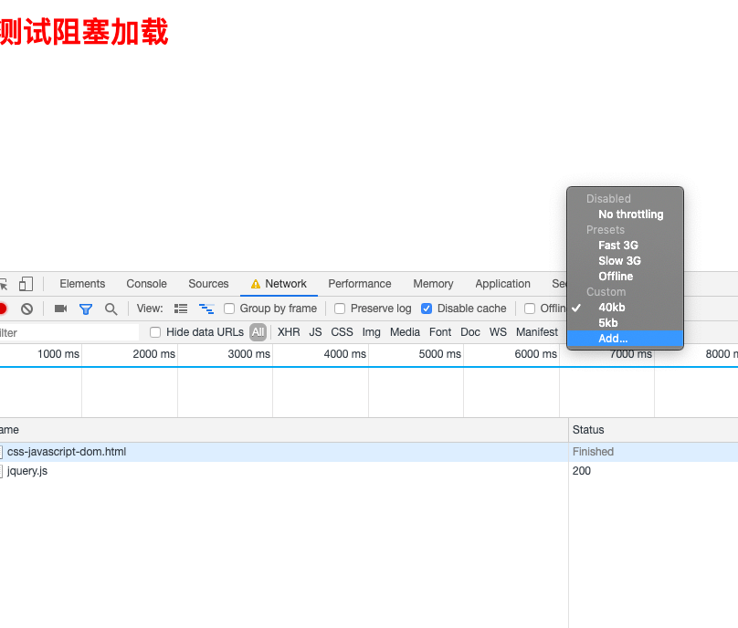
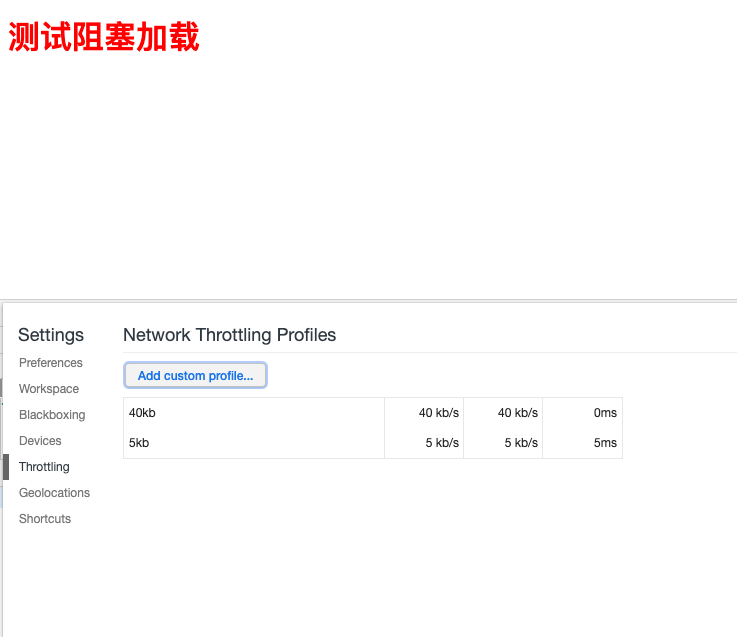
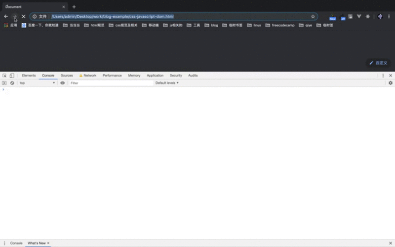
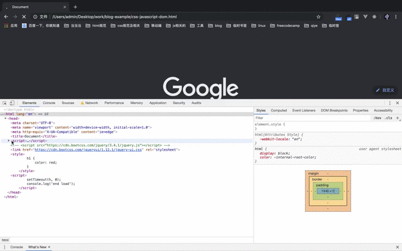

**_将欲取之，必先与之，是谓微明。柔弱胜刚强。——老子_**

## 引子

我们在看一些前端优化规则的时候，比如雅虎军规等等，都有看到 `style 写在 head 中`，但是`外链 script 写在 body` 的最后，以优化性能，都知道应该怎么做，但是不知道其中的原理。
如果还不知道浏览器渲染的原理的，看一看[浏览器渲染原理](/blog/html/render/html-style-javascript.html)这一篇文章。其实这个就是考验大家对 `html 中的 css、javascript、dom` 之间的解析和相互阻塞关系。

## JavaScript 会阻塞 CSS、DOM 吗

### 提出自己观点

当我们把 script 标签写到页面的顶部时，dom 树在解析的时候检测到 script 标签是，会加载 script 里面的内容并且执行。我们假设在`执行`javascript 会`阻塞 dom`的解析和渲染，`阻塞 css`的解析和加载。

### 验证自己的观点

在验证之前我们先把 chrome 的网速调到 40kb 每秒的下载和上传数据
**第一步**

**第二步**


我们来验证这个结论:
html 代码如下

```javascript
<!DOCTYPE html>
<html lang="en">
<head>
    <meta charset="UTF-8">
    <meta name="viewport" content="width=device-width, initial-scale=1.0">
    <meta http-equiv="X-UA-Compatible" content="ie=edge">
    <title>Document</title>
    <script>
        console.log('start load');
        function h () {
            console.log(document.querySelectorAll('h1'))
        };
        setTimeout(h, 0);
    </script>
    <script src="https://cdn.bootcss.com/jquery/3.4.1/jquery.js"></script>
    <style>
        h1 {
            color: red;
        }
    </style>
    <script>
        console.log('end load');
        setTimeout(h, 0);
    </script>
</head>
<body>
    <h1>测试阻塞加载</h1>
</body>
</html>
```

在`加载到`jquery 文件后，会先下载远程的 jquery 并且`执行`他，他会`阻塞 dom 的解析和渲染`，`css 解析和渲染`，一直是白屏，等 jquery`执行完成`了才接着解析 Dom 和 cssom 并且渲染，console.log 打印 h1 标签也是空数组。
如下图所示：


### 总结

> javascript 加载会阻塞 css 解析和渲染
> javascript 加载会阻塞 dom 解析和渲染

## css 加载会阻塞 JavaScript 的加载和执行、会阻塞 Dom 的解析和渲染？

### 提出自己观点

因为上面我们已经验证过 JavaScript 会阻塞 Dom 的解析和渲染，同时也会解析 cssom 的解析和渲染，所以我们假设 css 的加载会`阻塞`Dom 的`解析`和`渲染`，会`阻塞`JavaScript 的`加载`和`执行`。

### 验证我们的假设

在上面的代码基础上修改代码如下：

```javascript
<!DOCTYPE html>
<html lang="en">
<head>
    <meta charset="UTF-8">
    <meta name="viewport" content="width=device-width, initial-scale=1.0">
    <meta http-equiv="X-UA-Compatible" content="ie=edge">
    <title>Document</title>
    <script>
        console.log('start load');
        function h () {
            console.log(document.querySelectorAll('h1'))
        };
        setTimeout(h, 0);
    </script>
    <link href="https://cdn.bootcss.com/jqueryui/1.12.1/jquery-ui.css" rel="stylesheet">
    <style>
        h1 {
            color: red;
        }
    </style>
    <script>
        console.log('end load');
    </script>
</head>
<body>
    <h1>测试阻塞加载</h1>
</body>
</html>
```

执行结果如下图所示


#### css 加载对 Dom 的阻塞

如果按我们假设的 `css 加载会阻塞 Dom 的解析和渲染`，那么执行的结果，应该是`首先是白屏`，然后 `h1 标签的 nodeList` 应该是为`空数组`的，但是在执行的时我们看到 `h1 标签的 nodeList 是有值的`，注（还有 `setTimeout 的作用是为了在下一个 Task 最先执行，感觉并不会影响我们的实验的结果`。）
这表示我们一开始的假设是有问题的，`css 加载会阻塞 Dom 的渲染有阻塞，但是并不会阻塞 Dom 的解析`。

#### css 加载对 JavaScript 的阻塞

css 加载会对后续的 JavaScript 的执行会造成阻塞。

### 总结

**_css 加载对 Dom 的解析没有阻塞，但是对于 Dom 的渲染造成了阻塞。_**
**_css 加载对 JavaScript 的执行会造成阻塞_**

## 总结

如果还不了解整体的渲染流程可以看以前我前面的文章，[浏览器渲染原理 （一）在网址中输入一个网站后面都做了什么](/blog/html/render/html-style-javascript.html)

- `**_JavaScript 的加载会阻塞 Dom 的解析和渲染，并且也会阻塞 css 的解析和渲染。_**`
- `**_Css 的加载会阻塞 Dom 的渲染，并不会阻塞 Dom 的解析，也会阻塞 JavaScript 的执行。_**`

## 参考

[css 加载会造成阻塞吗？](https://juejin.im/post/5b88ddca6fb9a019c7717096)
