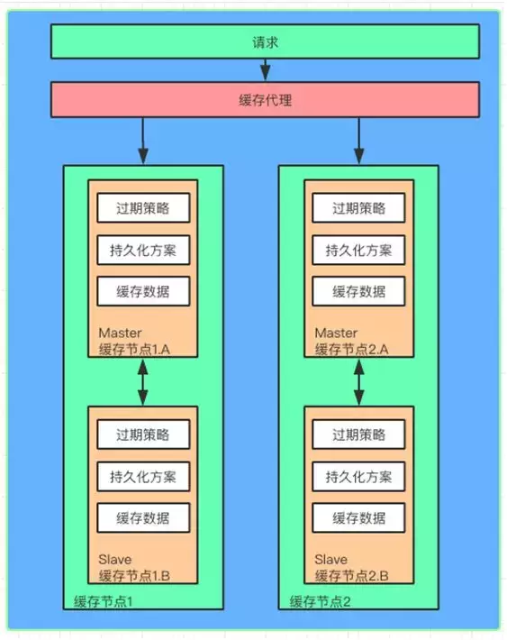
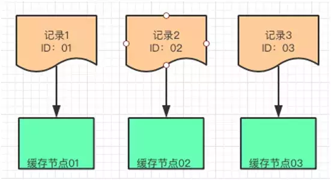

> [Http中的缓存（一） 多级缓存结构](/blog/http-cache-multiple.html)
> [Http中的缓存（二） HTTP中的缓存](/blog/http/http-cache-http.html)
> [Http中的缓存（三） PWA中的ServiceWorker](/blog/http/http-cache-serviceworker.html)

## 简介

**缓存**相信现在这个词大家都不陌生，因为在当前的应用中被广泛的应用。因为**缓存**会带来更高的**性能**、**用户体验**，同时也会**节省流量**、**离线体验**等等好处。

关于缓存的文章分为三篇：**多级缓存结构**、**HTTP缓存详解**、**离线缓存**

### 缓存的分层

**缓存**大致分为如下：

- **客户端/浏览器缓存**
- **http/服务器缓存**
- **cdn缓存**
- **代理服务器缓存**
- **后端进程缓存redis、lru等等**
- **分布式缓存**
- **数据库**

可以在下面几层做缓存大致如下：

### 多层缓存流程

整个的缓存判断流程是：

1. **用户刷新页面发出请求**
2. 客户端/浏览器是否命中`serviceWorker`、**强缓存（缓存策略）**、**协商缓存**
3. **cdn缓存**
4. **代理服务器缓存**
5. **进程缓存**
6. **分布式缓存**
7. **数据库**

这里主要记述**客户端/浏览器缓存**、**http/服务器缓存**的一些使用和细节。

## HTTP缓存

`HTTP`缓存基本上可以分为两类： **一类强缓存（有效期策略）**、**另一类 协商缓存（资源唯一标识符）**。它们缓存在不同的位置，按照分类为：**本地硬盘缓存**、**本地内存缓存**。当时对于一些不同的文件类型要用不同的缓存来做，同时让它们缓存在不同的位置。
跟随**移动端**应用的发展，为了提高用户离线的体验，延伸出了不同**离线缓存方案**大致有两种实现方式：**AppCache**、**ServiceWorker**两种方式。

在这里一些详细的实现方式和细节不多做解释，在下片文章[Http中的缓存（二） HTTP中的缓存](/blog/http/http-etag-cache.html)来详细的记录，比如**有限期是怎么验证的**、**详细的配置**、**不同的本地缓存储存在那**、**它们之间的对比和适用缓存文件**等等。

### 强缓存

**强缓存**可以用三种实行方式： `cache-control`、`Expires`、`Pragma`它们都是通过**有效期**来决定是否命中缓存的。

大致的优先级如下： 在本地 `Cache-Control > Expires，Pragma 在不支持 Cache-Control` 时生效。

### 协商缓存

**协商缓存**可以用两种种实行方式： `Last-Modified/If-Modified-Since`、`Etag/If-None-Match`它们的实现方式是不同的。

**Last-Modified/If-Modified-Since**是通过**有限期**来检验是否使用缓存，而**Etag/If-None-Match**它是通过**唯一资源标识符**来判断是否使用缓存。
同时它们的整体流程也是不同，比如说**Last-Modified/If-Modified-Since**返回的**HTTP状态**为**200状态码**，而**Etag/If-None-Match**它返回的是**304状态码**。

### 储存位置

从缓存位置上来看，分为**4种**，**从上往下依次检查**是否命中，如果但都没有命中则重新发起请求。

- `Service Worker` 是运行在浏览器背后的独立线程，一般可以用来实现缓存功能。使用 `Service Worker`的话，传输协议必须为 `HTTPS`。
- `Memory Cache` 也就是**内存**中的缓存，主要包含的是当前中页面中已经抓取到的资源,例如页面上已经下载的样式、脚本、图片等。
- `Disk Cache` 也就是存储在硬盘中的缓存。
- `Push Cache`（推送缓存）是 `HTTP/2` 中的内容，当以上三种缓存都没有命中时，它才会被使用。

它们之间是有优缺点的，比如说静态资源适用于`Memory Cache`。

### 用户操作对缓存的影响

当用户的操作比如**地址栏回车**、**前进回退**、**F5刷新**、**Ctrl+F5强制刷新**等等对缓存的影响。大致如下图所示：

在这里就不细究了不然这篇文章太长了。

## CDN缓存

**CND**的全称是**Content Delivery NetWork**内容分发网络。**HTTP**缓存主要是对一些**客户端/浏览器**中的静态资源和**不长更新的数据**资源。
**CDN**是在**客户端**和**服务器**端加设的一层，可以让**CDN**为应用服务器提供缓存，如果在 **CDN** 上缓存，就不用再请求应用服务器了。并且 **HTTP** 缓存提到的两种策略同样可以在 **CDN**服务器执行。

### CDN流程

**CDN**缓存流程大致如下：

- 客户端发送 `URL` 给 `DNS` 服务器。
- `DNS` 通过域名解析，把请求指向 `CDN` 网络中的 `DNS` 负载均衡器。
- `DNS` 负载均衡器将最近 `CDN` 节点的 `IP` 告诉 `DNS`，`DNS` 告之客户端最新 `CDN` 节点的 `IP`。
- 客户端请求最近的 `CDN` 节点。
- `CDN` 节点从应用服务器获取资源返回给客户端，同时将静态信息缓存。

> 注意：客户端下次互动的对象就是 `CDN` 缓存了，`CDN` 可以和应用服务器同步缓存信息。

`CDN` 接受客户端的请求，它就是离客户端最近的服务器，它后面会链接多台服务器，起到了缓存和负载均衡的作用。

## 负载均衡缓存

说完客户端（`HTTP`）缓存和 `CDN` 缓存，我们离应用服务越来越近了，在到达应用服务之前，请求还要经过**负载均衡器**。

虽说它的主要工作是对**应用服务器进行负载均衡**，但是它也可以作**缓存**。可以把一些修改频率不高的数据缓存在这里，例如：用户信息，配置信息。通过服务定期刷新这个缓存就行了。

以 `Nginx` 为例，我们看看它是如何工作的：

- 用户请求在达到应用服务器之前，会**先访问 Nginx 负载均衡器**，如果发现**有缓存信息**，直接**返回**给用户。
- 如果**没有发现**缓存信息，**Nginx 回源**到应用服务器获取信息。
- 另外，有一个**缓存更新服务**，定期把应用服务器中**相对稳定**的信息更新到 **Nginx 本地缓存**中。

## 进程内缓存

通过了**客户端**，**CDN**，**负载均衡器**，我们终于来到了应用服务器。应用服务器上部署着一个个应用，这些应用以进程的方式运行着，那么在进程中的缓存是怎样的呢？

**进程内缓存又叫托管堆缓存**，以 Java 为例，这部分缓存放在**JVM的托管堆**上面，同时会受到**托管堆回收算法**的影响。

由于其运行在内存中，对**数据的响应速度很快**，通常我们会把热点数据放在这里。

在**进程内缓存没有命中**的时候，我们会去**搜索进程外的缓存或者分布式缓存**。这种缓存的好处是**没有序列化和反序列化**，是**最快的缓存**。**缺点是缓存的空间不能太大**，**对垃圾回收器的性能有影响**。

目前比较流行的实现有 **Ehcache**、**GuavaCache**、**Caffeine**。这些架构可以很方便的把一些热点数据放到**进程内的缓存**中。

这里我们需要关注几个缓存的回收策略，具体的实现架构的回收策略会有所不同，但大致的思路都是一致的：

- **FIFO（First In First Out）**：先进先出算法，最先放入缓存的数据最先被移除。
- **LRU（Least Recently Used）**：最近最少使用算法，把最久没有使用过的数据移除缓存。
- **LFU（Least Frequently Used）**：最不常用算法，在一段时间内使用频率最小的数据被移除缓存。

在分布式架构的今天，多应用中如果采用进程内存缓存会存在数据一致性的问题。

这里推荐两个方案：

- **消息队列修改方案**
- **Timer修改方案**

### 消息队列修改方案

应用在**修改完自身缓存数据和数据库数据**之后，给消息队列**发送数据变化通知**，其他**应用订阅了消息通知**，在收到通知的时候**修改缓存数据**。

### Timer修改方案

为了**避免耦合**，**降低复杂性**，对“实时一致性”不敏感的情况下。每个应用都会**启动一个 Timer**，**定时**从数据库拉取最新的数据**更新缓存**。

不过在有的应用更新数据库后，其他节点通过 Timer 获取数据之间，会读到脏数据。这里需要控制好 Timer 的频率，以及应用与对实时性要求不高的场景。

### 应用场景

- **场景一**：**只读数据**，可以考虑在进程启动时加载到内存。当然，把数据加载到类似 Redis 这样的进程外缓存服务也能解决这类问题。

- **场景二**：**高并发**，可以考虑使用进程内缓存，例如：秒杀。

## 分布式缓存

说完进程内缓存，自然就过度到**进程外缓存**了。与进程内缓存不同，进程外缓存在应用运行的进程之外，它拥有**更大的缓存容量**，并且可以部署到**不同的物理节点**，通常会用**分布式缓存**的方式实现。

分布式缓存是与应用分离的缓存服务，最大的特点是，自身是一个独立的应用/服务，与本地应用隔离，**多个应用可直接共享一个或者多个缓存应用/服务**。

既然是分布式缓存，缓存的数据会分布到不同的缓存节点上，每个缓存节点缓存的数据大小通常也是**有限制**的。

数据被缓存到不同的节点，为了能方便的访问这些节点，需要引入**缓存代理**，类似 Twemproxy。他会帮助请求找到对应的缓存节点。

同时如果缓存节点增加了，这个代理也会只能识别并且把新的缓存数据分片到新的节点，做横向的扩展。

为了**提高缓存的可用性**，会在原有的缓存节点上加入 **Master/Slave 的设计**。当缓存数据写入 **Master 节点**的时候，会**同时同步**一份到 **Slave 节点**。

一旦 **Master** 节点失效，可以通过代理直接切换到 **Slave** 节点，这时 **Slave 节点就变成了 Master 节点**，保证缓存的正常工作。

每个缓存节点还会提供缓存过期的机制，并且会把缓存内容定期以快照的方式保存到文件上，方便缓存崩溃之后启动预热加载。

### 高性能

当缓存做成分布式的时候，数据会根据一定的规律分配到每个缓存应用/服务上。

如果我们把这些**缓存应用/服务叫做缓存节点**，每个节点一般都可以**缓存一定容量的数据**，例如：Redis 一个节点可以缓存 2G 的数据。

如果需要缓存的数据量比较大就需要扩展多个缓存节点来实现，这么多的缓存节点，客户端的请求不知道访问哪个节点怎么办？缓存的数据又如何放到这些节点上？

缓存代理服务已经帮我们解决这些问题了，例如：Twemproxy 不但可以帮助缓存路由，同时可以管理缓存节点。

这里有介绍三种缓存数据分片的算法，有了这些**算法缓存代理**就可以方便的找到分片的数据了。

#### 哈希算法

`Hash` 表是最常见的数据结构，实现方式是，对数据记录的**关键值**进行 `Hash`，然后再对需要分片的缓存节点个数进行取模得到的余数进行数据分配。

例如：有三条记录数据分别是 `R1，R2，R3`。他们的 ID 分别是 `01，02，03`，假设对这三个记录的 ID 作为关键值进行 Hash 算法之后的结果依旧是 `01，02，03`。

我们想把这三条数据放到三个缓存节点中，可以把这个结果分别对 3 这个数字取模得到余数，这个余数就是这三条记录分别放置的缓存节点。

**Hash 算法是某种程度上的平均放置，策略比较简单，如果要增加缓存节点，对已经存在的数据会有较大的变动。**

#### 一致性哈希算法

一致性 `Hash` 是将数据按照特征值**映射**到一个****首尾相接**的 `Hash`环上，同时也将缓存节点映射到这个环上。

如果要缓存数据，通过数据的**关键值（Key）**在环上找到自己存放的位置。这些数据按照自身的 `ID` 取 `Hash` 之后得到的值按照**顺序**在**环上排列**。

如果这个时候要**插入**一条新的数据其 `ID` 是 `115`，那么就应该插入到如下图的位置

同理如果要**增加**一个**缓存节点** `N4 150`，也可以放到如下图的位置。

**这种算法对于增加缓存数据，和缓存节点的开销相对比较小。**

#### Range Based 算法

这种方式是按照关键值（例如 `ID`）将数据划分成不同的区间，每个缓存节点负责一个或者多个区间。跟一致性哈希有点像。

例如：存在三个缓存节点分别是 `N1，N2，N3`。他们用来存放数据的区间分别是，`N1(0, 100]`， `N2(100, 200]`， `N3(300, 400]`。

那么数据根据自己 `ID` 作为关键字做 `Hash` 以后的结果就会分别对应放到这几个区域里面了。

### 可用性

根据事物的两面性，在**分布式缓存带来高性能**的同时，我们也需要重视它的可用性。那么哪些潜在的风险是我们需要防范的呢？

#### 缓存雪崩

当**缓存失效**，**缓存过期被清**除，缓存**更新**的时候。请求是**无法命中缓存**的，这个时候请求会直接**回源到数据库**。

如果上述情况**频繁发生**或者**同时发生**的时候，就会造成大面积的**请求直接到数据库**，造成**数据库访问瓶颈**。我们称这种情况为**缓存雪崩**。

从如下两方面来思考解决方案：

缓存方面：

- **避免缓存同时失效，不同的 key 设置不同的超时时间**。

- 增加**互斥锁**，**对缓存的更新操作进行加锁保护，保证只有一个线程进行缓存更新**。缓存一旦失效可以通过缓存快照的方式迅速重建缓存。对缓存节点增加主备机制，当主缓存失效以后切换到备用缓存继续工作。

设计方面，这里给出了几点建议供大家参考

- **熔断机制**：某个缓存节点**不能工作**的时候，需要通知**缓存代理不要**把请求路由到该节点，减少用户等待和请求时长。
- **限流机制**：在**接入层和代理层可以做限流**，当缓存服务无法支持高并发的时候，前端可以把无法响应的请求放入到队列或者丢弃。
- **隔离机制**：**缓存无法提供服务或者正在预热重建的时候**，把该请求放入队列中，这样该请求因为被隔离就不会被路由到其他的缓存节点。
- 如此就不会因为这个节点的问题影响到其他节点。当缓存重建以后，再从队列中取出请求依次处理。

#### 缓存穿透

缓存一般是 `Key`，`Value` 方式存在，一个 `Key` 对应的 `Value` 不存在时，请求会回源到数据库。

假如对应的 `Value` 一直不存在，则会频繁的请求数据库，对数据库造成访问压力。如果有人利用这个漏洞攻击，就麻烦了。

解决方法：如果一个 `Key` 对应的 `Value` 查询返回为空，我们仍然把这个空结果缓存起来，如果这个值没有变化下次查询就不会请求数据库了。

将所有可能存在的数据哈希到一个足够大的 `Bitmap` 中，那么不存在的数据会被这个 `Bitmap` 过滤器拦截掉，避免对数据库的查询压力。

#### 缓存击穿

在数据请求的时候，某一个缓存**刚好失效或者正在写入缓存**，同时这个缓存数据可能会在**这个时间点被超高并发请求**，成为“热点”数据。

这就是缓存击穿问题，这个和缓存雪崩的区别在于，这里是**针对某一个缓存**，前者是针对多个缓存。

解决方案：导致问题的原因是在同一时间读/写缓存，所以**只有保证同一时间只有一个线程写**，写完成以后，其他的请求再使用缓存就可以了。

比较常用的做法是使用 **mutex（互斥锁）**。在缓存失效的时候，不是立即写入缓存，而是先设置一个** mutex（互斥锁）**。当缓存被写入完成以后，再放开这个锁让请求进行访问。

## 总结

多层缓存结构：

**缓存结构**大致分为如下：

- **客户端/浏览器缓存**
- **http/服务器缓存**
- **cdn缓存**
- **代理服务器缓存**
- **后端进程缓存redis、lru等等**
- **分布式缓存**
- **数据库**

其中，前两种缓存静态数据，后三种缓存动态数据：

- **HTTP 缓存包括强缓存（缓存策略）和协商缓存**。
- **CDN 缓存和 HTTP 缓存是好搭档**。
- **负载均衡器缓存相对稳定资源，需要服务协助工作**。
- **进程内缓存，效率高，但容量有限制，有两个方案可以应对缓存同步的问题**。
- **分布式缓存容量大，能力强，牢记三个性能算法并且防范三个缓存风险**。

## 参考

> [一篇文章让你明白你多级缓存的分层架构](https://juejin.im/post/5d86cf7f6fb9a06b211724e7?utm_source=gold_browser_extension#heading-13)
