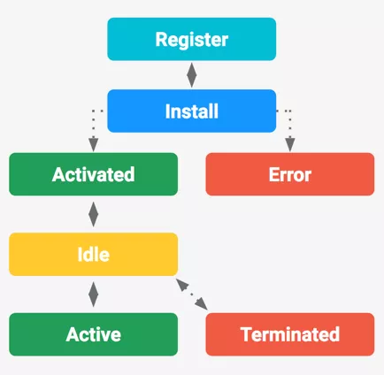

> [Http中的缓存（一） 多级缓存结构](/blog/http-cache-multiple.html)
> [Http中的缓存（二） HTTP中的缓存](/blog/http/http-cache-http.html)
> [Http中的缓存（三） PWA中的ServiceWorker](/blog/http/http-cache-serviceworker.html)

## 简介

首先了解一下`PWA（Progressive web apps，渐进式 Web 应用）`运用现代的 `Web API` 以及传统的渐进式增强策略来创建跨平台 `Web` 应用程序。
**PWA的优点**
`PWA` 是**可被发现**、**易安装**、**可链接**、**独立于网络**、**渐进式**、**可重用**、**响应性**和**安全**的。
`PWA`中可以通过`Service Worker`来实现离线的应用，这个也是PWA中一个比较重要的环节，它们主要应用到**Web App**中，已获得更好的体验，并且在现在也在大规模的应用。
`Service Worker`是一个事件驱动`worker`，运行在一个单独的后台进程，是`PWA（ProgressiveWeb App）`运行的基础。主要用于代理网页请求，可缓存请求结果；可实现离线缓存功能，也拥有单独的作用域范围和运行环境。

<!-- ## SW深入了解

`SW`线程的**生命周期与网页无关**，跟**浏览器进程一致**。从`SW`线程与主线程的角度来解释`SW`是怎么运行的。
- 当第一打开页面是通过`install`

## -->

## SW的特性

它们的运行在一个与我们页面的 `JavaScript 主线程独立的线程上`，并且`没有对 DOM 结构`的任何访问权限。
这引入了与传统 Web 编程不同的方法 - `API 是非阻塞的`，并且可以在不同的`上下文之间发送和接收信息`。

### SW使用限制

`SW`除了`work`线程的限制外，由于可拦截页面请求，为了保证页面安全，浏览器端对`sw`的使用限制也不少。

- **无法直接操作DOM对象**，也无法访问`window`、`document`、`parent`对象。可以访问`navigator`、`location`；
- **可代理的页面作用域限制**。默认是`sw.js`所在**文件目录及子目录的请求可代理**，可在注册时手动设置作用域范围；
- **必须**在 `https` 中使用，允许在开发调试的`localhost`使用。

### SW主要作用

- **可以用来做缓存，以达到提升体验、节省浏览等等**
- **离线缓存接口请求及文件，更新、清除缓存内容；**
- **可分配给 Service Worker 一些任务，并在使用基于 Promise 的方法当任务完成时收到结果。**
- **Service Worker处于空闲状态会被终止，在下一次需要时重启。**

### SW兼容性

可以通过查询[service worker](https://caniuse.com/#search=service%20worker)可以看到他在不同平台或不同浏览器中的兼容性。

## SW生命周期和使用

`SW` 为网页添加一个类似于 `App` 的生命周期，它只会**响应系统事件**，就算**浏览器关闭**时操作系统也可以唤醒 `SW`，这点非常重要，让`Web App`与 `Native App` 的能力变得类似了。
`SW`的生命周期大致分为：**注册**、**更新**、**安装成功（安装失败）**、**激活**、**销毁**。
`SW`的事件： `install`、`activate`、`message`、`fetch`、`push`、`async`。

由于是离线缓存，所以在**首次注册**、**二次访问**、**脚本更新**它们的所走的生命周期是不相同。下面我们就根据这**三种场景结合代码来分析**它的执行步骤。

### 首次注册

首次注册大致流程大致如下图：


- `注册`： 用户**首次访问**SW控制的网站或页面时，sw.js会立刻被下载和解析。会执行`Register`，同时会触发`install`事件，作响
- `安装`： 执行过程即使`installing`过程，此时会触发`install`事件。状态转换为`installed`。
- `激活`： 立即进入 `activating` 状态；并触发 `activate` 事件，处理相关事件内容。执行完成后，变成 `activated` 状态。
- `失败`： 如果安装失败会走失败状态。

<!-- **第一步**注册一个`Service Worker`，代码如下：

```javascript
    if (`serviceWorker` in navigator) {
        navigator.serviceWorker.register('/sw.js').then(registration => {
            console.log('ServiceWorker registration successful with scope: ', registration.scope);
        }).cache(err => {
            console.log('ServiceWorker registration failed: ', err);
        })
    }
``` -->

### 第二次访问

在退出浏览器进程时，`SW`线程也会关闭，但是并不会**销毁**。
当第二次访问时，会再次