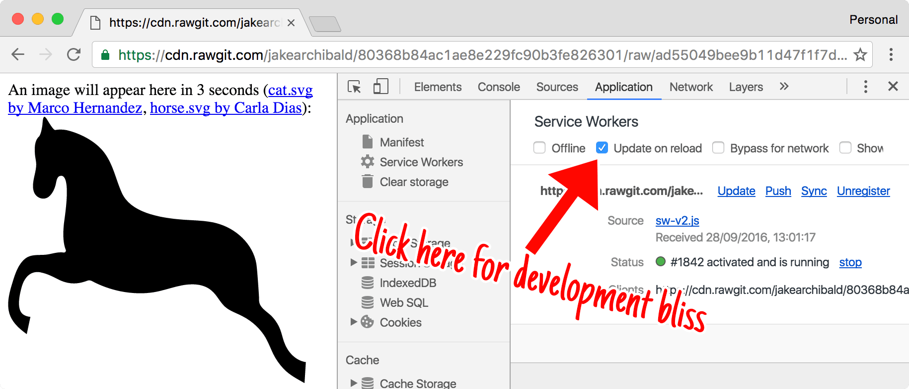

> [Http中的缓存（一） 多级缓存结构](/blog/http-cache-multiple.html)
> [Http中的缓存（二） HTTP中的缓存](/blog/http/http-cache-http.html)
> [Http中的缓存（三） PWA中的ServiceWorker](/blog/http/http-cache-serviceworker.html)

## 简介

首先了解一下`PWA（Progressive web apps，渐进式 Web 应用）`运用现代的 `Web API` 以及传统的渐进式增强策略来创建跨平台 `Web` 应用程序。
**PWA的优点**
`PWA` 是**可被发现**、**易安装**、**可链接**、**独立于网络**、**渐进式**、**可重用**、**响应性**和**安全**的。
`PWA`中可以通过`Service Worker`来实现离线的应用，这个也是PWA中一个比较重要的环节，它们主要应用到**Web App**中，已获得更好的体验，并且在现在也在大规模的应用。
`Service Worker`是一个事件驱动`worker`，运行在一个单独的后台进程，是`PWA（ProgressiveWeb App）`运行的基础。主要用于代理网页请求，可缓存请求结果；可实现离线缓存功能，也拥有单独的作用域范围和运行环境。我们以后把`Service Worker`简称为`SW`。

本文大致分为：

- SW特性
- SW生命周期和使用
- SW中的缓存策略
- SW一些注意事项
- SW几种缓存策略
- SW中的消息推送
- Workerbox使用

## SW的特性

它们的运行在一个与我们页面的 `JavaScript 主线程独立的线程上`，并且`没有对 DOM 结构`的任何访问权限。
这引入了与传统 Web 编程不同的方法 - `API 是非阻塞的`，并且可以在不同的`上下文之间发送和接收信息`。

### SW使用限制

`SW`除了`work`线程的限制外，由于可拦截页面请求，为了保证页面安全，浏览器端对`sw`的使用限制也不少。

- **无法直接操作DOM对象**，也无法访问`window`、`document`、`parent`对象。可以访问`navigator`、`location`； `SW` 通过响应 `postMessage` 接口发送的消息来与其控制的页面通信，页面可在必要时对 `DOM` 执行操作。
- **可代理的页面作用域限制**。默认是`sw.js`所在**文件目录及子目录的请求可代理**，可在注册时手动设置作用域范围；
- **必须**在 `https` 中使用，允许在开发调试的`localhost`使用。

### SW主要作用

- **可以用来做缓存，以达到提升体验、节省浏览等等**
- **SW 是一种可编程网络代理，让您能够控制页面所发送网络请求的处理方式。**
- **离线缓存接口请求及文件，更新、清除缓存内容；**
- **可分配给 Service Worker 一些任务，并在使用基于 Promise 的方法当任务完成时收到结果。**
- **Service Worker处于空闲状态会被终止，在下一次需要时重启。**

### SW兼容性

可以通过查询[service worker](https://caniuse.com/#search=service%20worker)可以看到他在不同平台或不同浏览器中的兼容性。

## SW生命周期和使用

`SW` 的生命周期完全独立于网页。
`SW` 为网页添加一个类似于 `App` 的生命周期，它只会**响应系统事件**，就算**浏览器关闭**时操作系统也可以唤醒 `SW`，这点非常重要，让`Web App`与 `Native App` 的能力变得类似了。由于是离线缓存，所以在**初始安装时**、**更新**它们的所走的生命周期是不相同。下面我们就根据这**两种场景结合代码来分析**它的执行步骤。
`SW`的生命周期大致分为：**注册**、**更新**、**安装成功**、**安装失败**、**激活**、**销毁**。
<!-- `SW`的事件： `install`、`activate`、`message`、`fetch`、`push`、`async`。 -->

**使用SW前提条件**

- **必须**在 `https` 中使用，允许在开发调试的`localhost`使用。
- 浏览器必须支持SW

## 初始安装时

初始安装时大致流程大致如下图：


大致可以分为`注册SW => 安装SW => 激活 => 空闲 => (缓存和返回请求/终止)`，在初始安装时会大致分为这几个步骤，下面就按照这几个步结合代码实现。

### 注册 Service Worker

用户**首次访问**SW控制的网站或页面时，`sw.js`会立刻被下载和解析。我们要在页面中写入`JavaScript`来注册`SW`。

```javascript
    // 判断浏览器是否支持serviceWorker
    if ('serviceWorker' in navigator) {
        // 在页面加载后
        window.addEventListener('load', function () {
            // 通过navigator.serviceWorker.register 注册'./sw.js
            navigator.serviceWorker.register('./sw.js')
            .then(reg => { //注册成功
                console.log('注册成功', reg)
            }).catch(err => { //注册成功
                console.log('注册失败', err)
            })
        });
    } else {
        console.log('当前浏览器不支持SW')
    }
```

首先检浏览器是否支持SW，如果支持就在浏览器加载后通过`register().then`注册**sw.js**，并且设置注册成功或者失败的回调函数。

> 注意：`register()` 方法的精妙之处在于服务工作线程文件的位置。`SW`降接收此网域上所有的事项的`featch`事件。
如果是Chrome浏览器可以通过`chrome://inspect/#service-workers`或者`console => application => Service Worker`查看是否注册成功

因为现在`sw.js`中我们的代码是空的，所以在浏览器中的`cache stoage`是空的，运行效果如下：


### 安装 Service Worker

在受控页面启动注册流程后，下面就是SW获取的第一个事件`install`，并且只发生一次。传递到 `installEvent.waitUntil()` 的一个 `promise` 可表明安装的持续时间以及安装是否成功。

在`install`中要做三件事**打开缓存**、**缓存文件**、**确认所有需要的资产是否已缓存**。

```javascript
    // 在sw.js中监听对应的安装事件，并预处理需要缓存的文件
    // 该部分内容涉及到cacheStorage API

    // 定义缓存空间名称
    const CACHE_NAME = 'sw_cache_v1';
    // 定义需要缓存的文件目录
    let cachelist = ['./app.js', './index.css'];
    // 监听安装事件，返回installEvent对象
    self.addEventListener('install', function (installEvent) {
        // waitUntil方法执行缓存方法
        installEvent.waitUntil(
            // cacheStorage API 可直接用caches来替代
            // open方法创建/打开缓存空间，并会返回promise实例
            // then来接收返回的cache对象索引
            caches.open(CACHE_NAME)
             // cache对象addAll方法解析（同fetch）并缓存所有的文件
            .then(function(cache) {
                console.log('Opened cache');
                return cache.addAll(cachelist);
            })
        );
    });

```

第一个事件为`install`，该事件在`Worker`执行时立即触发。在`install`的回调函数中，我们通过`caches.open(CACHE_NAME)`打开缓存，之后调用`cache.addAll()`并传入路径数组。这是一个`promise`链（`caches.open()`和`chaches.addAll()`。`installEvent.waitUntill()`放大带有`promise`并使用它来判断安装所花时间，以及是否安装成功。

> 注意： 第一个事件`install`，它只能被每个 **SW** 调用一次。如果您更改您的 **SW** 脚本，则浏览器将其视为一个**不同**的 **SW**，并且它将获得自己的 `install` 事件。
如有**任何文件无法下载**，则安装步骤将失败。
当前的状态是在等待状态。
我们可以直接通过`self.skipwaiting()`让当前`sw`立即将状态提升到`active`。

当我们安装成功时，效果如下图所示：


会多了一个`skipWaiting`，还有在`cache stroage`中的当前域名下的`service worker`对应的缓存文件列表。这个时候我们即使刷新也不会走`service worker`的缓存的。

### 激活

`SW` 准备控制客户端并处理 `push` 和 `sync` 等功能事件时，您将获得一个 `activate` 事件。但这不意味着调用 `.register()` 的页面将受控制。如果**第二次加载此演示（换言之，刷新页面）**，该页面将受控制。改写代码`sw.js`如下：

```javascript
    self.addEventListener('install', () => {
        // 一般注册以后，激活需要等到再次刷新页面后再激活
        // 可防止出现等待的情况，这意味着服务工作线程在安装完后立即激活
        self.skipWaiting();
    })
    self.addEventListener('activate', function (event) {
        event.waitUntil(
            // cacheStorage API 可直接用caches来替代
            // open方法创建/打开缓存空间，并会返回promise实例
            // then来接收返回的cache对象索引
            caches.open(CACHE_NAME)
            // cache对象addAll方法解析（同fetch）并缓存所有的文件
            .then(function(cache) {
                console.log('Opened cache');
                return cache.addAll(cachelist);
            })
        );
    })
```

一般在书写的时候，会在`install()`注册之后直接通过`self.skipWaiting();`激活当前的`SW`，在`activate`中书写**打开缓存等等**的逻辑，就不会出现上面还要**刷新或者手动激活**的问题。效果图如下：


但是如果出现**更新SW**，并且**更新了缓存列表**或者**出现异步资源时**，我们可以通过`clients.claim()`更新缓存列表。

### clients.claim

激活 `SW` 后，您可以通过在其中调用 `clients.claim()` 控制未受控制的客户端。[google developer](https://cdn.rawgit.com/jakearchibald/80368b84ac1ae8e229fc90b3fe826301/raw/df4cae41fa658c4ec1fa7b0d2de05f8ba6d43c94/)中的一个异步加载图片的实例。下面修改代码如下：

```javascript
    self.addEventListener('install', (event) => {
        event.waitUntil(
            // cacheStorage API 可直接用caches来替代
            // open方法创建/打开缓存空间，并会返回promise实例
            // then来接收返回的cache对象索引
            caches.open(CACHE_NAME)
            // cache对象addAll方法解析（同fetch）并缓存所有的文件
            .then(function(cache) {
                console.log('Opened cache');
                return cache.addAll(cachelist);
            })
        );
        // 一般注册以后，激活需要等到再次刷新页面后再激活
        // 可防止出现等待的情况，这意味着服务工作线程在安装完后立即激活
        self.skipWaiting();
    })
    self.addEventListener('activate', function (event) {
        // 若缓存数据更改，则在这里更新缓存
        var cacheDeletePromise = caches.keys()
        .then(keyList => {
            Promise.all(keyList.map(key => {
                if (key !== CACHE_NAME) {
                    var deletePromise = caches.delete(key)
                    return deletePromise
                } else {
                    Promise.resolve()
                }
            }));
        });
        event.waitUntil(
            Promise.all([cacheDeletePromise]).then(res => {
                this.clients.claim()
            })
        );
    })
```

用于处理更新缓存，新的文件。到现在我们还是没有用到`serviceWorker`的缓存，下面重头戏来了**缓存和返回请求**。

### 缓存和返回请求

上我们已经安装并且激活了**SW**，现在我们要返回一个缓存的响应。**SW**用户转至其他页面或刷新当前页面后，将开始接受`fetch`事件。

```javascript
    self.addEventListener('fetch', function(event) {
        event.respondWith(
            caches.match(event.request)
            .then(function(response) {
                // Cache hit - return response
                if (response) {
                    return response;
                }
                return fetch(event.request);
            })
        );
    });
```

在定义的`fetch`事件中，我们在`event.respondWith()`中传入来自`caches.match()`的一个`promise`。`caches.match()`这个方法检视该请求，并从服务工作线程所创建的任何缓存中查找缓存的结果。如果命中返回缓存值，否则，将调用`fetch`以发出网络请求。运行效果如下：


如果我们想把新的请求也缓存掉，修改代码如下：

```javascript
    self.addEventListener('fetch', function(event) {
        event.respondWith(
            caches.match(event.request)
            .then(function(response) {
                // Cache hit - return response
                if (response) {
                    return response;
                }
                // return fetch(event.request);
                var requestClone = event.request.clone();
                return fetch(requestClone).then(response => {
                    if(!response || response.status !== 200 || response.type !== 'basic') {
                        return response;
                    }
                    var responseToCache = response.clone();
                    caches.open(CACHE_NAME)
                    .then(function(cache) {
                        cache.put(event.request, responseToCache);
                    });
                    return response;
                });
            })
        );
    });
```

执行操作如下：

1. 在 `fetch` 请求中添加对 `.then()` 的回调。
2. 获得响应后，**确保响应有效。**、**检查并确保响应的状态为 200。**、**确保响应类型为 basic，亦即由自身发起的请求。 这意味着，对第三方资产的请求也不会添加到缓存。**
3. 如果**通过检查**，则克隆响应。

没有缓存新请求时效果如下：


当使用我们下面的代码时，效果图如下：

即使异步请求的`png`图片也被加入了缓存中。

## 更新SW

在以下情况下会触发更新：

- 导航到一个作用域内的页面。
- 更新 `push` 和 `sync` 等功能事件，除非在前 24 小时内已进行更新检查。
- 调用 `.register()`，仅在 `SW` 网址已发生变化时。

当触发更新时，会经过大致如下步骤：

1. 更新您的**服务工作线程** `JavaScript` 文件。 用户导航至您的站点时，浏览器会尝试在**后台重新下载**定义 `SW` 的脚本文件。 如果 `SW` 文件与其当前所用文件存在字节**差异**，则将其视为新 `SW`。
2. **更新**的 `SW` 与**现有** `SW` 一起启动，并获取自己的 `install` 事件。
3. 此时，**旧** `SW` 仍**控制着**当前页面，因此**新** `SW` 将进入 `waiting` 状态。
4. 如果`新 Worker` 出现**不正常状态代码**（例如，404）、解析失败，在执行中**引发错误**或**在安装期间被拒**，则系统`将舍弃新 Worker`，但`当前 Worker 仍处于活动状态`。
5. 安装成功后，`更新的 Worker 将 wait`，直到`现有 Worker` 控制零个客户端。（注意，在刷新期间客户端会重叠。）
6. `self.skipWaiting()` 可防止出现等待情况，这意味着 `Service Worker` 在安装完后立即激活。

### 更新SW代码

更新一个叫做`sw_cache_v2`的新的`SW`缓存，代码如下：

```javascript
    const CACHE_NAME = 'sw_cache_v2';

    self.addEventListener('install', (event) => {
        event.waitUntil(
            // cacheStorage API 可直接用caches来替代
            // open方法创建/打开缓存空间，并会返回promise实例
            // then来接收返回的cache对象索引
            caches.open(CACHE_NAME)
            // cache对象addAll方法解析（同fetch）并缓存所有的文件
            .then(function(cache) {
                return cache.add('index_copy.png')
            })
        );
        // 一般注册以后，激活需要等到再次刷新页面后再激活
        // 可防止出现等待的情况，这意味着服务工作线程在安装完后立即激活
        self.skipWaiting();
    })
    self.addEventListener('activate', function (event) {
        // 若缓存数据更改，则在这里更新缓存
        var cacheDeletePromise = caches.keys()
        .then(keyList => {
            Promise.all(keyList.map(key => {
                if (key !== CACHE_NAME) {
                    var deletePromise = caches.delete(key)
                    return deletePromise
                } else {
                    Promise.resolve()
                }
            }));
        });
        event.waitUntil(
            Promise.all([cacheDeletePromise]).then(res => {
                this.clients.claim()
            })
        );
    });
    self.addEventListener('fetch', function(event) {
        event.respondWith(
            caches.match(event.request)
            .then(function(response) {
                // Cache hit - return response
                if (response) {
                return response;
                }
                return fetch(event.request);
            }
            )
        );
    });
```

代码执行效果如下图所示：


整个过程我们大致经过了`install => waiting => activate`三个过程。

### 更新Install

我们在代码中把`sw_cache_v1`更改为`sw_cache_v2`，我们重新`Install`了一个新的缓存`sw_cache_v2`，并且通过添加了一个缓存进去`cache.add('index_copy.png')`。

### 更新Waiting

如果新的缓存安装成功`SW`后，更新的`SW`将延迟激活，直到现有`SW`不再控制任何客户端。此状态为`waiting`，这是浏览器确保每次只运行一个`SW`版本的样式。

### 激活Activate

旧 `SW` 退出时将触发 `Activate`，新 `SW` 将能够控制客户端。此时，您可以执行在仍使用旧 `Worker` 时无法执行的操作，如迁移数据库和清除缓存。
在上面的演示中，我维护了一个期望保存的缓存列表，并且在 `activate`事件中，我删除了所有其他缓存，从而也移除了旧的 `sw_cache_v1` 缓存。
> 不要更新以前的版本。它可能是许多旧版本的 `SW`。

如果您将一个 `promise` 传递到 `event.waitUntil()`，它将缓冲功能事件（`fetch、push、sync` 等），直到 `promise` 进行解析。因此，当您的 `fetch` 事件触发时，激活已全部完成。
> `Cache storage API` 属于“源存储”（如 `localStorage` 和 `IndexedDB`）。如果您在同源上运行许多网站（例如，`yourname.github.io/myapp`），请注意，不要删除其他网站的缓存。为避免此问题，可以为您的缓存名称提供一个在当前网站上具有唯一性的前缀（例如，myapp-static-v1），并且不要删除缓存，除非它们以 myapp- 开头。

### 跳过等待阶段skipWaiting

等待阶段表示您每次只能运行一个网站版本，但如果您不需要该功能，您可以通过调用 `self.skipWaiting()` 尽快将新 `SW` 激活。
这会导致您的 `SW` 将当前活动的 `Worker` 逐出，并在进入**等待阶段**时尽快激活自己（或**立即激活**，前提是已经处于**等待阶段**）。这不能让您的 `Worker` **跳过安装**，只是**跳过等待阶段**。
`skipWaiting()` 在等待期间调用还是在之前调用并没有什么不同。一般情况下是在 `install` 事件中调用它：

```javascript
    self.addEventListener('install', event => {
        self.skipWaiting();
        event.waitUntil(
            // caching etc
        );
    });
```

与 `clients.claim()` 一样，它是一个竞态。

> `skipWaiting()` 意味着新 Service Worker 可能会控制使用较旧 `Worker` 加载的页面。这意味着页面提取的部分数据将由旧 Service Worker 处理，而新 Service Worker 处理后来提取的数据。如果这会导致问题，则不要使用 `skipWaiting()`。

### 手动更新update

当页面**刷新或者执行功能性事件时**，浏览器会**自动**检查更新，其实我们也可以**手动**的来触发更新：

```javascript
    navigator.serviceWorker.register("/sw.js").then(reg => {
        // sometime later…
        reg.update();
    });
```

如果你希望你的用户访问页面很长时间而且不用刷新，那么你可以每个一段时间调用一次`update()`。

### 避免改变 SW 的 URL

你可能会考虑给每个 `SW` 不同的 `URL`。**千万不要这么做！**在 `SW` 中这么做是“最差实践”，要在原地址上修改 `SW`。

举个例子来说明为什么：

1. `index.html`注册了`sw-v1.js`作为`SW`。

2. `sw-v1.js`对`index.html`做了缓存，也就是缓存优先（`offline-first`）。

3. 你更新了`index.html`重新注册了在新地址的 SW `sw-v2.js`.

如果你像上面那么做，用户永远也拿不到`sw-v2.js`，因为`index.html`在`sw-v1.js`缓存中，这样的话，如果你想更新为`sw-v2.js`，还需要更改原来的`sw-v1.js`。

## SW一些注意事项

这里主要分为：

- **更新的小技巧**
- **sync事件**

### 更新小技巧

`SW` 生命周期是专为用户构建的，这就给开发工作带来一定的困难。幸运的是，我们可通过以下几个工具解决这个问题：

#### Update on reload



这可使生命周期变得对开发者友好。每次浏览时都将：

1. 重新提取 `SW`。
2. 即使**字节完全相同**，也将其作为新版本安装，这表示运行 `install` 事件并**更新缓存**。
3. **跳过等待阶段**，以**激活**新 `SW`。
4. 浏览页面。这意味着**每次浏览时（包括刷新）都将进行更新**，无需重新加载两次或关闭标签。

#### Skip waiting


如果您有一个 `Worker` 在等待，您可以按 `DevTools` 中的“`skip waiting`”以立即将其提升到“`active`”。同时也可以通过`self.skipWaiting()`来实现。

#### Shift-reload

如果您强制重新加载页面 `(shift-reload)`，则将完全绕过 `SW`。页面将变得不受控制。此功能已列入规范，因此，它在其他支持 `SW` 的浏览器中也适用。

#### 处理更新周期

为支持尽可能多的模式，整个更新周期都是可观察的：

```javascript
    navigator.serviceWorker.register('/sw.js').then(reg => {
        reg.installing; // the installing worker, or undefined
        reg.waiting; // the waiting worker, or undefined
        reg.active; // the active worker, or undefined

        reg.addEventListener('updatefound', () => {
            // A wild service worker has appeared in reg.installing!
            const newWorker = reg.installing;

            newWorker.state;
            // "installing" - the install event has fired, but not yet complete
            // "installed"  - install complete
            // "activating" - the activate event has fired, but not yet complete
            // "activated"  - fully active
            // "redundant"  - discarded. Either failed install, or it's been
            //                replaced by a newer version

            newWorker.addEventListener('statechange', () => {
            // newWorker.state has changed
            });
        });
    });

    navigator.serviceWorker.addEventListener('controllerchange', () => {
        // This fires when the service worker controlling this page
        // changes, eg a new worker has skipped waiting and become
        // the new active worker.
    });
```

### sync事件

`Sync事件`让你可以先将网络相关任务延迟到用户**有网络**的时候**再执行**。这个功能常被称作“**背景同步**”。这功能可以用于保证任何用户**在离线**的时候所产生**对于网络有依赖**的操作，最终可以在网络再次可用的时候抵达它们的目标。

代码示例如下

```javascript
    navigator.serviceWorker.ready.then(registration => {
        document.getElementById('submit').addEventListener('click', () => {
            registration.sync.register('submit').then(() => {
                console.log('sync registered!');
            });
        });
    });
```

我们指定在一个按钮的点击事件里，在一个全局的 `ServiceWorkerRegistration` 对象身上调用 `sync.register`。

简单地讲，任何你需要确保在**有网络时立刻执行**或者**等到有网再执行**的操作，都需要注册为一个`sync事件`。

这操作可以是发送一个评论，或者获取用户信息，在SW的事件监听器里会如下定义：

```javascript
    // sw.js
    self.addEventListener('sync', event => {  
        if (event.tag === 'submit') {
            console.log('sync!');
        }
    });
```

我们监听一个 `sync 事件`，然后在 `SyncEvent` 对象上检查 `tag` 是否匹配我们在点击事件里所设定的 `'submit'`。

如果多个 `tag` 标记为 `submit` 的 `sync`事件被注册了，`sync` 事件处理器只会运行一次。

所以在这个例子里，如果用户离线了，然后点击按钮7次，当网络再次连上，所有的`sync`注册都会合而为一，`sync`事件只会触发一次。

#### Sync事件是什么时候触发

如果用户的网络时联通的，那么`sync事件`会**立刻触发**并且**立刻执行**你所定义的任务。

而如果用户离线了，`sync 事件`会在网络恢复后**第一时间触发**。

## SW几种缓存策略

- 渐进式缓存
- 仅使用缓存
- 仅使用网络
- 缓存优先
- 网络优先
- 速度优先

### 渐进式缓存

对于在`install`中发现没有缓存，页面**又依赖但又不经常变化**的资源，可以在页面打开或发生用户交互时触发`fetch`然后使用`fetch api`再去网络拉取，将返回正常的`response缓存`起来以便下次使用。

**progressive-cache**

```javascript
    self.addEventListener('fetch', function(event) {
        event.respondWith(
            caches.match(event.request)
            .then(function(response) {
                // Cache hit - return response
                if (response) {
                    return response;
                }
                // return fetch(event.request);
                var requestClone = event.request.clone();
                return fetch(requestClone).then(response => {
                    if(!response || response.status !== 200 || response.type !== 'basic') {
                        return response;
                    }
                    var responseToCache = response.clone();
                    caches.open(CACHE_NAME)
                    .then(function(cache) {
                        cache.put(event.request, responseToCache);
                    });
                    return response;
                });
            })
        );
    });
```

### 仅使用缓存

在`fetch事件`中，**仅去匹配资源**，若匹配失败，表现出来的就是前端页面对于该 **资源加载失败**。这里**容错性比较差**，适用于页面资源都是**静态资源**的，且不能使用**不影响安装的资源预缓存**。

**cache-only**

```javascript
    // SW请求拦截事件
    self.addEventListener('fetch', (event) => {
        event.respondWith(
            caches.open(OFFLINE_CACHE_NAME).then((cache) => {
                // 匹配资源如果命中返回缓存
                return cache.macth(event.request.url);
            });
        );
    });
```

### 仅使用网络

在`fetch事件`中，仅将`request`重新抽出用`fetch`去网络加载并返回给前端页面。适用于资源大多是**动态资源**、**实时性要求高**的场景。

**network-only**

```javascript
    // SW请求拦截事件
    self.addEventListener('fetch', (event) => {
        // 仅使用网络加载
        event.respondWith(fetch(event.request));
    });
```

### 缓存优先

简单的资源缓存中使用的就是**缓存优先策略**，**先去缓存匹配**，**匹配失败折回网络**，这算是**最常用、容错性能**好的一种策略。

**firstCache**

```javascript
    function firstCache (cacheName, request) {
        // 打开SW
        return caches.open(cacheName).then(cache => {
            // 匹配请求路径
            return cache.match(request).then(response => {
                // fetch请求
                var fetchServer = function() {
                    return fetch(request).then(newResponse => {
                        cache.put(request, newResponse.clone());
                        return newResponse;
                    });
                }
                // 如果缓存中有数据则返回，否则请求网络数据
                if (response) {
                    return response;
                } else {
                    return fetchServer();
                }
            });
        });
    }
```

### 网络优先

在`fetch事件`中先去`网络fetch`，当出现服务器**故障或者网络不良时**，**折回本地缓存**，目的是为了展示最新的数据，对实时性要求比较高但又能够带来良好体验的应用，比如天气类型应用。

**firstNet**

```javascript
    function firstNet(cacheName, request) {
        // 请求网络数据并缓存
        return fetch(request).then(response => {
            // 响应clone
            var responseCopy = response.clone();
            caches.open(cacheName).then(cache => {
                // fetch请求
                cache.put(request, responseCopy);
            });
            return response;
        }).catch(() => {
            // fetch失败走本地缓存
            return caches.open(cacheName).then(cache => {
                return cache.match(request);
            });
        });
    }
```

### 速度优先

在`fetch事件`中**同时发起本地缓存匹配及网络请求**，**谁先返回使用谁的**，该方案**适用于对性能要求比较高**的站点，缩短了缓存优先策略中有可能缓存中没有资源再折回网络的时间消耗。

```javascript
function networkCacheRace(cacheName, request) {
    var timer, TIMEOUT = 500;
    /**
     * 网络好的情况下给网络请求500ms, 若超时则从缓存中取数据
     * 若网络较差且没有缓存, 由于第一个 Promise 会一直处于 pending, 故此时等待网络请求响应
     */
    return Promise.race([new Promise((resolve, reject) => {
        // 缓存请求
        timer = setTimeout(() => {
            caches.open(cacheName).then( cache => {
                cache.match(request).then( response => {
                    if (response) {
                        resolve(response);
                    }
                });
            });
        }, TIMEOUT);
    }), fetch(request).then( response => {
        // 网络请求
        clearTimeout(timer);
        var responseCopy = response.clone();
        caches.open(cacheName).then( cache => {
            cache.put(request, responseCopy);
        });
        return response;
    }).catch(() => {
        clearTimeout(timer);
        return caches.open(cacheName).then( cache => {
            return cache.match(request);
        });
    })]);
}
```

现在我们可以在 `sw.js` 中更改一下缓存策略，从而达到最理想的效果。

```javascript
    // sw.js
    self.addEventListener('fetch', event => {
        // ...
        if ( /\.(js|css)$/.test(url) ) {
            (cacheName = cacheMaps.cache_file) 
            && e.respondWith(networkCacheRace(cacheName, request));
        }
        // ...
    })
```

## SW中的消息推送

**Push消息**

在`SW`里，通过 `push 事件`以及浏览器的 `Push API`，可以实现`push消息`的功能。
在说道`web push消息`的时候，其实涉及到两个正在完善中的技术：`消息提醒` 与 `信息推送`。

### 消息提醒

用`SW`实现消息提醒挺简单直接：

```javascript
    // app.js
    // ask for permission
    Notification.requestPermission(permission => {  
        console.log('permission:', permission);
    });

    // display notification
    function displayNotification() {  
        if (Notification.permission == 'granted') {
            navigator.serviceWorker.getRegistration()
            .then(registration => {
                registration.showNotification('this is a notification!');
            });
        }
    }
```

```javascript
    // sw.js
    self.addEventListener('notificationclick', event => {  
        // 消息提醒被点击的事件
    });

    self.addEventListener('notificationclose', event => {  
        // 消息提醒被关闭的事件
    });
```

你需要先向用户寻求让你的网页产生消息提醒的权限。之后，你就可以弹出提示信息，然后处理某些事件，比如用户把消息关掉的事件。

### 信息推送

信息推送涉及到利用浏览器提供的`Push API`以及后端的配合实现。要讲解如何使用`Push API`完全可以再写一篇文章，不过基本的套路如下：


这是个略微复杂难懂的过程，已经超出这篇文章的讨论范围。

## 更好的方案 - Workbox

什么是 Workbox ?

> Workbox is a library that bakes in a set of best practices and removes the boilerplate every developer writes when working with service workers.

其大概意思是它对常见的 `SW` 操作进行了一层封装, 根据最佳实践方便了开发者的使用。因此在我们快速开发自己的 `PWA` 应用时使用 `Workbox` 是最合适不过的了。

它主要有以下几大功能 :

- Precaching  ~  预缓存
- Runtime caching  ~  运行时缓存
- Strategies  ~  缓存策略
- Request routing  ~  请求路由控制
- Background sync  ~  后台同步
- Helpful debugge

### 简单应用

直接修改`sw.js`的代码，如下：

```js
    // sw.js
    // 导入谷歌提供的 Workbox 库
    importScripts('https://storage.googleapis.com/workbox-cdn/releases/3.2.0/workbox-sw.js');

    if ( !workbox ) { 
        console.log(`Workbox didn't load.`);
        return;
    }

    // Workbox 注册成功, 可以进行下一步的操作

    // 立即激活, 跳过等待
    workbox.skipWaiting();
    workbox.clientsClaim();

    // workbox.routing.registerRoute()...
```

如果浏览器支持，可以直接引用API接口：

1. `precaching`可以在注册成功后直接缓存的文件；
2. `routing`匹配符合规则的`url`与`strategies`合作来完成文件的缓存。

代码如下：

```js
// 注册完成后，即缓存对应的文件列表
workbox.precaching.precacheAndRoute([
    '/src/static/js/index.js',
    '/src/static/css/index/css'
])

// routing方法匹配请求文件路径，strategies用来存储对应文件
workbox.routing.registerRoute(
    matchFunction,  // 字符串或者是正则表达式
    handler // 可以使用workbox.strategies缓存策略来缓存
)
```

### workbox缓存策略

`workbox.strategies`缓存策略有：

1. `staleWhileRevalidate` 使用已有的缓存，然后发起请求，用请求结果来更新缓存；
2. `networkFirst` 先发起请求，请求成功后会缓存结果。如果失败，则使用最新的缓存；
3. `cacheFirst` 总是先使用缓存，如果无匹配的缓存，则发起网络请求并缓存结果；
4. `networkOnly` 强制发起请求；
5. `cacheOnly` 强制使用缓存。

官方也有给了实现逻辑如下。

#### Cache Only

只从缓存中读取，当缓存中没有数据时，读取失败。


#### NetWork Only

只通过网络请求进行资源请求，若请求失败，则返回失败响应。


#### NetWork First

- 优先网络请求
- 网络请求成功时，将结果写入缓存，并将结果直接返回。
- 网络请求失败时，从缓存中读取结果，若读取结果，则返回，若未读取到，则请求失败。

不难看出，这种策略是为了保证在**第一次请求成功之后**，后面多次的请求始终都能返回结果。


```js
    workbox.routing.registerRoute(/\.(js|css)$/,
        workbox.strategies.networkFirst({
            // 给网络请求0.5秒，若仍未返回则从缓存中取数据
            networkTimetoutSeconds: 0.5,
            cacheName: 'css.js',
        }),
    );
```

#### Cache First

- 优先从缓存中读取结果
- 若缓存中不存在结果，则进行网络请求
- 网络请求成功时，将结果写入缓存并返回
- 网络请求失败时，返回失败响应


```js
    workbox.routing.registerRoute(/\.(png|jpg|jpeg|gif|webp)$/,
        // 对于图片资源使用缓存优先
        workbox.strategies.cacheFirst({
            cacheName: 'images',
            // 设置最大缓存数量以及过期时间
            plugins: [
            new workbox.expiration.Plugin({
                maxEntries: 60,
                maxAgeSeconds: 7 * 24 * 60 * 60,
            }),
            ],
        }),
    );
```

#### Stale-While-Revalidate

- 优先查缓存，并同时发起网络请求
- 若缓存命中且网络请求成功，返回缓存结果，并更新缓存（下次从缓存中读取的数据就是最新的了）
- 若缓存未命中，则看网络请求是否成功，成功则更新缓存并返回结果，失败则返回失败响应。


```js
    workbox.routing.registerRoute(/\.(js|css)$/,
        workbox.strategies.staleWhileRevalidate({
            cacheName: 'css.js',
        }),
    );
```

## 总结

在本篇文章中详细的记录了有关`SW`的主要功能和能给我们带来的好处。一般在开发中还是推荐使用`workbox`，最后如果个人有兴趣的可以自己编写示例来验证文章中的代码示例。

**SW主要作用**

- **可以用来做缓存，以达到提升体验、节省浏览等等**
- **SW 是一种可编程网络代理，让您能够控制页面所发送网络请求的处理方式。**
- **离线缓存接口请求及文件，更新、清除缓存内容；**
- **可分配给 Service Worker 一些任务，并在使用基于 Promise 的方法当任务完成时收到结果。**
- **Service Worker处于空闲状态会被终止，在下一次需要时重启。**

**SW几种策略**

- **渐进式缓存**
- **仅使用缓存**
- **仅使用网络**
- **缓存优先**
- **网络优先**
- **速度优先**

## 参考

> [Service Worker：简介  |  Web Fundamentals  |  Google Developers](https://developers.google.com/web/fundamentals/primers/service-workers?hl=zh-CN)
> [Service Worker 生命周期  |  Web Fundamentals  |  Google Developers](https://developers.google.com/web/fundamentals/primers/service-workers/lifecycle?hl=zh-CN#install)
> [用 Service Worker 实现前端性能优化](https://mp.weixin.qq.com/s/SLG_cDxDo7BaoQqAyLGa-Q)
> [service worker 实现离线缓存](https://mp.weixin.qq.com/s/aboA9dtCK6t0fzs0JU58Iw)
> [【前-workbox-网络摘要】WorkBox缓存策略](https://www.jianshu.com/p/3fb5615f18cf)