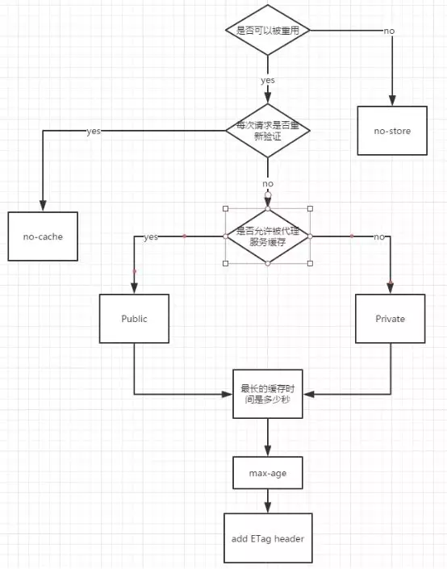
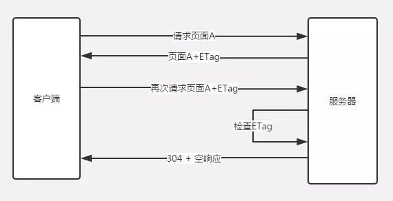
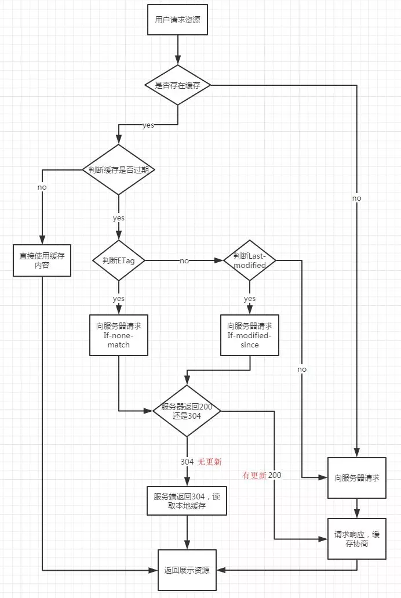
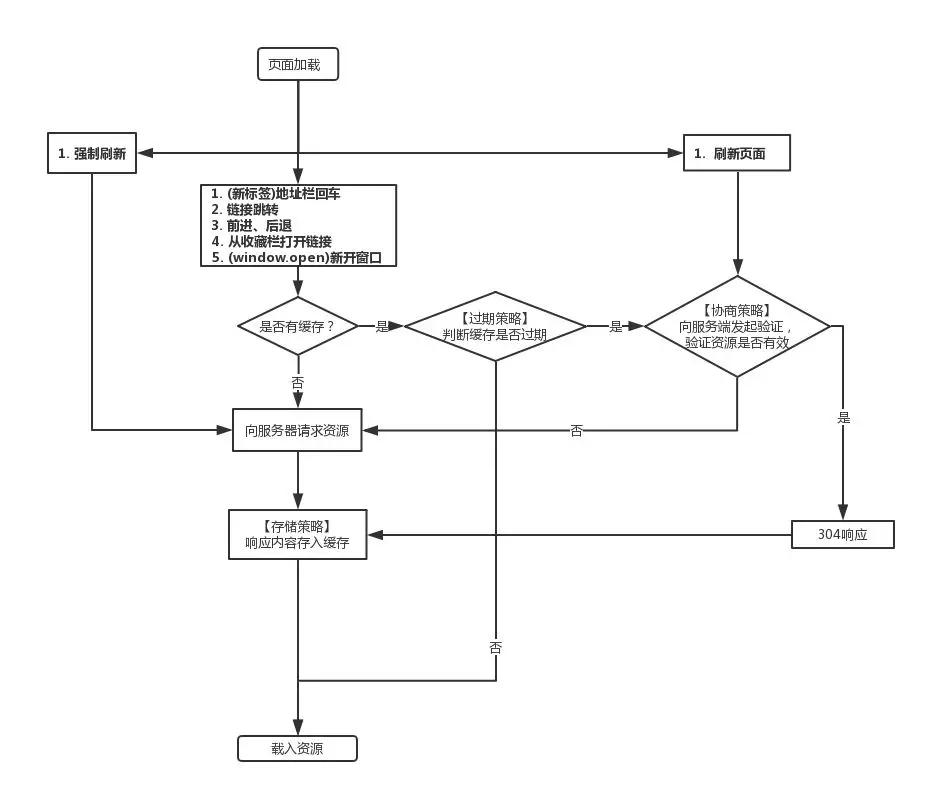

> [Http中的缓存（一） 多级缓存结构](/blog/http/http-cache.html)
> [Http中的缓存（二） HTTP中的缓存](/blog/http/http-etag-cache.html)
> [Http中的缓存（三） PWA中的ServiceWorker](/blog/http/http-cache-serviceworker.html)

## 简述

**HTTP缓存**相信都不陌生，因为它是在前端性能优化中必不可少的一个环节。在**首次进入或者请求数据**正常传输数据，而当**再次进入或者请求数据**时，可以走本地或者服务器上的缓存，来**节省流量**、**优化性能**、**提高用户体验**、**降低网络负荷**等等。

**web缓存**主要用来缓存**html文件**、**js文件**、**css文件**、**数据**，基本上都是提升**客户端/浏览器**请求到**服务器**之间的速度，当然也可以结合数据压缩如**gzip**、**7z**等等加快响应数据传输。

在整个应用中可以错多层缓存结构这里不多做介绍，因为前面已经大致介绍过了，这里主要介绍和前端比较相关的**HTTP缓存**。

## HTTP缓存

大致分为下面几步来加深对**HTTP中的缓存**理解和应用场景。

1. **必知缓存策略的基础**
2. **缓存的判断策略**
3. **用户操作对缓存策略的影响**
4. **缓存策略的储存**
5. **缓存策略之间的对比**

## 必知缓存策略的基础

大致把协议分为**强缓存（过期策略）**和**协商缓存（协商策略）**两类缓存，可能不太准确只是自己的现在的见解，**浏览器/客户端**通过这两种策略决定使用**缓存中的副本**还是从**服务器**中获取最新的资源。

- **强缓存（过期策略）**：也就是缓存副本有效期。
一个缓存副本必须满足以下任一条件，浏览器会认为它是有效的，足够新的，而直接从缓存中获取副本并渲染：
  - *含有完整的过期时间控制头信息（HTTP协议报头），并且仍在有效期内*
  - *浏览器已经使用过这个缓存副本，并且在一个会话中已经检查过新鲜度*
- **协商缓存（协商策略）**：*服务器返回资源的时候有时在控制头信息带上这个资源的实体标签Etag（Entity Tag），它可以用来作为浏览器再次请求过程的校验标识。如果发现校验标识不匹配，说明资源已经被修改或过期，浏览器需求重新获取资源内容。*

| key | 描述 | 缓存策略 | 首部类型 |
|:----:|:---------:|:----:|:----:|
| Pragma | 指定缓存机制（http 1.0 字段） | 强缓存（过期策略） | 响应首部字段 |
| Cache-COntrol | `Cache-Control` 通用消息头字段，被用于在http请求和响应中，通过指定指令来实现缓存机制。 | 强缓存（过期策略） | 响应/请求首部字段 |
| Expires | `Expires` 响应头包含日期/时间， 即在此时候之后，响应过期。 | 强缓存（过期策略） | 响应首部字段 |
| Last-Modified | `Last-Modified`  是一个响应首部，其中包含源头服务器认定的资源做出修改的日期及时间。 | 协商缓存（协商策略） | 响应首部字段 |
| If-Modified-Since | `If-Modified-Since` 是一个条件式请求首部，服务器只在所请求的资源在给定的日期时间之后对内容进行过修改的情况下才会将资源返回，状态码为 `200`。 | 协商缓存（协商策略） | 请求首部字段 |
| ETag | `ETag`HTTP响应头是资源的特定版本的标识符。 | 协商缓存（协商策略） | 响应首部字段 |
| If-None-Match | `If-None-Match` 是一个条件式请求首部。对于 `GET` 和 `HEAD` 请求方法来说，当且仅当服务器上没有任何资源的 `ETag` 属性值与这个首部中列出的相匹配的时候，服务器端会才返回所请求的资源，响应码为  `200`  。 | 协商缓存（协商策略） | 请求首部字段 |
| If-Match（辅助） | `If-Match` 的使用表示这是一个条件请求。在请求方法为 `GET` 和 `HEAD` 的情况下，服务器仅在请求的资源满足此首部列出的 `ETag`值时才会返回资源。 | 协商缓存（协商策略） | 请求首部字段 |
| If-Unmodified-Since（辅助） | `If-Unmodified-Since` 只有当资源在指定的时间之后没有进行过修改的情况下，服务器才会返回请求的资源，或是接受 `POST` 或其他 `non-safe` 方法的请求。 | 协商缓存（协商策略） | 请求首部字段 |
| Vary（辅助） | `Vary` 是一个`HTTP`响应头部信息，它决定了对于未来的一个请求头，应该用一个缓存的回复(response)还是向源服务器请求一个新的回复。 | 协商缓存（协商策略） | 响应首部字段 |

<!-- 下面四个就多做介绍了，大家可以去**mdn**中观看，下面是mdn中的连接。

- [Pragma](https://developer.mozilla.org/zh-CN/docs/Web/HTTP/Headers/Pragma)
- [If-Match](https://developer.mozilla.org/zh-CN/docs/Web/HTTP/Headers/If-Match)
- [If-Unmodified-Since](https://developer.mozilla.org/zh-CN/docs/Web/HTTP/Headers/If-Unmodified-Since)
- [Vary](https://developer.mozilla.org/zh-CN/docs/Web/HTTP/Headers/Vary) -->

*缓存又分为**强缓存和协商缓存**。其中强缓存包括`Expires`和`Cache-Control`，**主要是在过期策略生效时应用的缓存**。弱缓存包括`Last-Modified`和`ETag`，**是在协商策略后应用的缓存**。**强弱缓存之间的主要区别在于获取资源时是否会发送请求**。*

**强缓存和协商缓存**

- 如果本地缓存过期，则要依靠协商缓存
- **强缓存**的 http状态码是 `200 OK`
- **协商缓存**的 http 状态码是 `304 Not Modified`

## 强缓存（过期策略）

属于**强缓存（过期策略）**的有如下：

- Cache-COntrol
- Expires

### Cache-Control

`Cache-Control`用于指定资源的缓存机制，可以同时在**请求和响应头**中设定。但是`Cache-Control`中的属性也分为**请求和响应**缓存指令，大致分为如下：

**缓存请求指令**
客户端可以在**HTTP请求**中使用的标准 `Cache-Control` 指令。
> Cache-Control: max-age=<seconds>
Cache-Control: max-stale[=<seconds>]
Cache-Control: min-fresh=<seconds>
Cache-control: no-cache
Cache-control: no-store
Cache-control: no-transform
Cache-control: only-if-cached

**缓存响应指令**
服务器可以在**响应**中使用的标准 `Cache-Control` 指令。
> Cache-control: must-revalidate
Cache-control: no-cache
Cache-control: no-store
Cache-control: no-transform
Cache-control: public
Cache-control: private
Cache-control: proxy-revalidate
Cache-Control: max-age=<seconds>
Cache-control: s-maxage=<seconds>

`Cache-Control`: `cache-directive[,cache-directive]`。`cache-directive`为缓存指令，大小写不敏感，共有**12**个与**HTTP**缓存标准相关，如下所示。其中请求指令*7*种，响应指令*9*种。`Cache-Control`可以设置多个缓存指令，以逗号`,`分隔。

#### 可缓存性

- **public**： 表明响应可以被**任何对象（包括：发送请求的客户端、代理服务器、CDN等中间代理服务器等等）缓存**，如下图所示：

- **private**：表明响应只能被**单个用户缓存**，**不能作为共享缓存（即代理服务器不能缓存它）**。

- **no-cache**：指定**不缓存响应**，表明资源**不进行缓存**，但是设置了 `no-cache` 之后并不代表**浏览器**不缓存，而是在**获取缓存前**要向**服务器确认资源**是否被更改。相当于`max-age: 0, must-revalidate`
- **no-store**： **绝对禁止缓存，请求和响应都不缓存，每次请求都从服务器获取完整资源**。

#### 到期

- **max-age=<seconds>**: 设置**缓存存储的最大周期**，超过这个时间缓存被认为过期(**单位秒**)。
- **s-maxage=<seconds>**: 覆盖`max-age`或者`Expires`头，但是**仅适用于**共享缓存(比如各个代理)，私有缓存会忽略它。
- **max-stale[=<seconds>]**: **指定时间内，即使缓存过期，资源依然有效**。
- **min-fresh=<seconds>**：**表示客户端希望获取一个能在指定的秒数内保持其最新状态的响应**。

#### 重新验证和重新加载

- **muse-revalidate**: 使用缓存资源之前，**必须先验证状态**，如果页面是**过期的(如max-age)**，则去服务器进行**获取**。
- **proxy-revalidate**： 与`must-revalidate`作用相同，但它**仅适用于共享缓存（例如代理）**，并被私有缓存忽略。

#### 其他

- **no-transform**：强制要求代理服务器不要对资源进行转换，禁止代理服务器对`Content-Encoding`、`Content-Range`、`Content-Type`等字段的修改，因此代理服务器的`gzip`压缩将**不被允许**。

#### no-cache和no-store

还有一点需要注意的是，`no-cache`并不是指**不缓存文件**，`no-store`才是指**不缓存文件**。`no-cache`仅仅是表明**跳过强缓存**，强制进入**协商策略**。

#### 常用设置

**禁止缓存**
`Cache-Control: no-cache, no-store, must-revalidate`

**缓存静态资源**
`Cache-Control:public, max-age=86400`

### Expires

`Expires`指定缓存的**过期时间**，为绝对时间，即某一时刻。

> 注意：参考**本地时间**进行比对，在指定时刻后过期。**RFC 2616建议最大值不要超过1年**。

### max-age与Expires

`Cache-Control`中的`max-age`指令用于指定**缓存过期的相对时间**。资源达到指定时间后过期。该功能与`Expires`类似。但其**优先级高于Expires**，如果同时设置`max-age`和`Expires`，`max-age`生效，忽略`Expires`。

> Cache-Control > Expires

### 强缓存大致流程

强缓的设置流程图大致如下：


## 协商缓存

在没有**强缓存**时，就会走协商缓存，协商缓存大致流程：

- 第一次请求时，服务端返回给客户端一个**key(如Etag的资源值、Last-Modified最后修改时间)**和资源
- 第二次请求时，客户端带上第一次服务端返回的key
- 服务器端验证当前的key是否和上次返回给客户端的是否一致，一致返回304使用缓存，不一致重新返回key和新的资源

属于**协商缓存（协商策略）**的有如下：

- Last-Modified/If-Modified-Since/If-Unmodified-Since
- ETag/If-Match/If-None-Match

### Last-Modified/If-Modified-Since/If-Unmodified-Since

`Last-Modified/If-Modified-Since`大致流程如下：

- 第一次请求时，服务器会获取资源的最后修改时间通过设置`Last-Modified`，返回给客户端
- 后面请求时，客户端(浏览器)会自动带上`If-Modified-Since`字段
- 服务器从新获取修改时间与`If-Modified-Since`中的时间对比，如果没有变化返回`304`状态码（浏览器得知304状态码，资源从缓存中获取），如果改变返回`200`并且更新资源、更新`Last-Modified`

上面的流程是在设置不使用**强缓存**时的场景，这个只是现在的理解可能有很多的不太完善的地方。

#### Last-Modified

`Last-Modified`用于标记**请求资源的最后一次修改时间**。

**语法**

```javascript
Last-Modified: <day-name>, <day> <month> <year> <hour>:<minute>:<second> GMT

Last-Modified: Wed, 21 Oct 2015 07:28:00 GMT
```

**注意**

- **GMT(格林尼治标准时间)**
- `Last-Modified`只能精确到秒，因此不适合在一秒内多次改变的资源。

#### If-Modified-Since

`If-Modified-Since` 是一个条件式请求首部，与`Last-Modified`何用。有两种结果如下：

- `If-Modified-Since/Last-Modified`相同返回`304`状态码，客户端使用缓存
- `If-Modified-Since/Last-Modified`不相同返回`200`状态码，返回新的资源

> `If-Modified-Since` 只可以用在 `GET` 或 `HEAD` 请求中。

#### If-Unmodified-Since

`If-Unmodified-Since`表示资源未修改则正常执行更新，否则返回`412(Precondition Failed)`状态码的响应。主要有如下两种场景。

1. 用于不安全的请求中从而是请求具备条件性（如POST或者其他不安全的方法），如请求更新wiki文档，**文档未修改时才执行更新**。
2. 与`If-Range`字段同时使用时，可以用来保证新的片段请求来自一个未修改的文档。

### ETag/If-Match/If-None-Match

根据实体内容生成一段**唯一hash字符串**，标识资源的状态，由服务端产生。浏览器会将这**串字符串传回服务器**，验证资源是否已经修改，如果没有修改，过程如下：



`ETag` **HTTP响应头**是资源的特定版本的标识符。
**语法**

```javascript
  ETag: W/"<etag_value>"
  ETag: "<etag_value>"
```

**W/ 可选**
**'W/'(大小写敏感) **表示使用**弱验证器**。 弱验证器很**容易**生成，但**不利**于比较。 强验证器是**比较的理想**选择，但**很难**有效地生成。

**"<etag_value>"**
实体标签唯一地表示所请求的资源。 它们是位于**双引号**之间的ASCII字符串（如“675af34563dc-tr34”）。

> 注意：ETag和If-None-Match的值均为双引号包裹的。
`ETag`的优先级高于`Last-Modified`。当`ETag`和`Last-Modified`，`ETag`优先级更高，但不会忽略`Last-Modified`，需要服务端实现。

`ETag` 和 `If-None-Match` 常被用来处理**协商缓存**。而 `ETag` 和 `If-Match` 可以 **避免“空中碰撞”**。

`ETag` HTTP 响应头是资源的特定版本的标识符。这可以让缓存更高效，并节省带宽，因为如果内容没有改变，Web 服务器不需要发送完整的响应。而如果内容发生了变化，使用 `ETag` 有助于防止资源的**同时更新相互覆盖（“空中碰撞”）**。

#### 实例

当编辑MDN时，当前的WIki内容被散列，并在相应中放入`Etag`:

```javascript
  ETag: "33a64df551425fcc55e4d42a148795d9f25f89d4"
```

将更改保存到WIKI页面（发布数据）时，POST请求将包含有`ETag`值的`If-Match`头来检车是否为最新版本。

```javascript
  If-Match: "33a64df551425fcc55e4d42a148795d9f25f89d4"
```

如果哈希值不匹配，则意味着文档已经被编辑，抛出 `412 ( Precondition Failed)` 前提条件失败错误。

`If-None-Match` 是客户端发送给服务器时的请求头，其值是服务器返回给客户端的 `ETag`，当 `If-None-Match` 和服务器资源最新的 `Etag` 不同时，返回最新的资源及其 `Etag`。

## 缓存的判断策略

缓存策略分为**强缓存**和**协商缓存**，首先经过**强缓存**的**过期策略**，才会走后面的**协商缓存**的**协商策略**，大致把缓存分为三个阶段**本地缓存阶段（强缓存）**、**协商缓存阶段（本地+服务器）**、**缓存失败阶段**。

大致在每个阶段中做的什么判断：

1. **本地缓存阶段**：如果设置了**强缓存**，那么会现在本地查找该资源，如果发现该资源，而且该资源还没有过期，就使用这个资源副本，完全不会发起`http`请求到服务器。（主要应用是**强缓存**、**serverWorker**）;
2. **协商缓存阶段**：如果在**本地缓存**找到对应的资源，但是不知道该资源**是否过期或者已经过期**，则发一个http请求到服务器，然后服务器**判断**这个请求，如果请求的资源在服务器上没有改动过，则返回`304`，让浏览器使用本地找到的那个资源；
3. **缓存失败阶段**: 当服务器发现请求的资源**已经修改过**，或者这是一个新的请求(在本来没有找到资源)，服务器则返回该资源的数据，并且返回`200`， 当然这个是指找到资源的情况下，如果服务器上没有这个资源，则返回`404`。

大致流程如下图所示：



这张图中没有包含`serverWorker`的缓存判断流程b，但是在后面会有一篇文章专门介绍**serverWorker**，因为他是属于**PWA**中的内容。

> **存储策略**发生在**收到请求响应后**，用于决定**是否缓存**相应资源；**过期策略**发生在**请求前**，用于判断缓存**是否过期**；**协商策略**发生在**请求中**，用于判断缓存资源**是否更新**。

## 用户操作对缓存策略的影响

在用户刷新页面（F5）时，会对缓存产生影响，这里就会记录用户操作对缓存产生的影响。用户操作事项如下表所示：

| 用户操作 | 强缓存 | 协商缓存 |
|:--------:|:---------:|:--------:|
| (新标签)地址栏回车 | 有效 | 有效 |
| (地址不变)地址栏回车 | 兼容性问题Chrome(失效)/Firefox(有效) | 有效 |
| 链接跳转 | 有效 | 有效 |
| 前进/后退 | 有效 | 有效 |
| 从收藏栏打开链接 | 有效 | 有效 |
| (window.open)新开窗口 | 有效 | 有效 |
| 刷新（Command/Ctrl + R / F5） | 失效 | 有效 |
| 强制刷新（Command + Shift + R / Ctrl + F5） | 失效 | 失效 |

基本上包含了一些常见的用户操作对**强缓存**和**协商缓存**的影响，大致的判断流程如下：



**注意**

> - (地址不变)地址栏回车：它比较特殊，为什么它在**Chrome**是**失效**，在**Firefox**中是**有效**。因为**Chrome**把**地址不变回车**等同于**刷新当前页面**，而在**Firefox**都是作为**新地址回车**处理的。
> - `webkit(Chrome内核)`资源分为**主资源**和**派生资源**。**主资源**是地址栏输入的URL请求返回的**资源**，**派生资源**是主资源中所引用**的JS、CSS、图片等资源**。
> - 在`Chrome`下刷新时，只有主资源的缓存应用方式如上图所示，**派生资源**的**缓存应用方式与新标签打开类似**，会判断缓存是否过期。强缓存生效时的区别在于新标签打开为`from disk cache`，而当前页刷新派生资源是`from memory cache`。
> - 而在`Firefox`下，当前页面刷新，所有资源都会如上图所示。

## 缓存策略的储存

