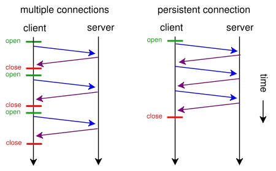

## 简介
**Hyper Text Transfer Protocol（超文本传输协议）**,是用于从万维网（WWW:World Wide Web ）服务器传输超文本到本地浏览器的传送协议。是互联网上应用最为广泛的一种网络协议。所有的WWW文件都必须遵守这个标准。

**超文本传输​​协议（HTTP）**是用于传输诸如HTML的超媒体文档的**应用层协议**。它被设计用于Web浏览器和Web服务器之间的通信，但它也可以用于其他目的。
**HTTP是一个基于TCP/IP通信协议来传递数据（HTML 文件, 图片文件, 查询结果等）。也要通过三次握手，四次挥手。**

**HTTP是一个属于应用层的面向对象的协议，由于其简捷、快速的方式，适用于分布式超媒体信息系统**。它于1990年提出，经过几年的使用与发展，得到不断地完善和扩展。

**HTTP协议工作于客户端-服务端架构为上**。浏览器作为HTTP客户端通过URL向HTTP服务端即WEB服务器发送所有请求。Web服务器根据接收到的请求后，向客户端发送响应信息。


## HTTP协议版本
大致版本可以分为以下四个：
- HTTP/0.9
- HTTP/1.0
- HTTP/1.1
- HTTP/2
发展的历史如下：


### HTTP/0.9
HTTP 是基于 <font color="#ff502c">TCP/IP 协议的应用层协议</font>。**它不涉及数据包（packet）传输**，主要规定了客户端和服务器之间的通信格式，默认使用80端口。
最早版本是1991年发布的0.9版。该版本极其简单，只有一个命令GET。
> GET /index.html

上面命令表示，**TCP 连接（connection）建立后**，客户端向服务器请求（request）网页index.html。协议规定，服务器只能回应HTML格式的字符串，不能回应别的格式。

```javascript
    <html>
        <body>Hello World</body>
    </html>
```
服务器发送完毕，就关闭TCP连接。

### HTTP/1.0
1996年5月，HTTP/1.0 版本发布，内容大大增加。
相对于HTTP/0.9大致增加了如下几点：
- 首先，**任何格式的内容都可以发送。这使得互联网不仅可以传输文字，还能传输图像、视频、二进制文件。这为互联网的大发展奠定了基础**。
- 其次，**除了GET命令，还引入了POST命令和HEAD命令，丰富了浏览器与服务器的互动手段**。
- 再次，**HTTP请求和回应的格式也变了。除了数据部分，每次通信都必须包括头信息（HTTP header），用来描述一些元数据**。
- 其他的新增功能还包括状态码**（status code）、多字符集支持、多部分发送（multi-part type）、权限（authorization）、缓存（cache）、内容编码（content encoding）**等。

当时其实也存在一些别的问题如下：
- **HTTP/1.0 版的主要缺点是，每个TCP连接只能发送一个请求**。发送数据完毕，连接就关闭，如果还要请求其他资源，就必须再新建一个连接。
- **TCP连接的新建成本很高，因为需要客户端和服务器三次握手，并且开始时发送速率较慢（slow start）**。

### HTTP/1.1
1997年1月，HTTP/1.1 版本发布，只比 1.0 版本晚了半年。它进一步完善了 HTTP 协议，一直用到了20年后的今天，直到现在还是最流行的版本。

相对于HTTP/1.0版本HTTP/1.1做了一些优化大致如下：
- **长连接：** <font color="#ff502c">HTTP 1.1支持长连接（PersistentConnection）</font>和<font color="#ff502c">请求的流水线（Pipelining）处理</font>，在一个TCP连接上可以传送<font color="#ff502c">多个HTTP请求和响应</font>，减少了建立和关闭连接的消耗和延迟，在HTTP1.1中<font color="#ff502c">默认开启Connection： keep-alive</font>，一定程度上弥补了HTTP1.0每次请求都要创建连接的缺点。
- **缓存处理：**在HTTP1.0中主要使用header里的<font color="#ff502c">If-Modified-Since,Expires</font>来做为缓存判断的标准，HTTP1.1则引入了更多的缓存控制策略例如<font color="#ff502c">Entity tag</font>，<font color="#ff502c">If-Unmodified-Since</font>, <font color="#ff502c">If-Match</font>, <font color="#ff502c">If-None-Match</font>等更多可供选择的缓存头来控制缓存策略。
- **带宽优化及网络连接的使用**，HTTP1.0中，存在一些浪费带宽的现象，例如客户端只是需要某个对象的一部分，而服务器却将整个对象送过来了，<font color="#ff502c">并且不支持断点续传功能</font>，HTTP1.1则在请求头引入了<font color="#ff502c">range头域</font>，它允许只请求资源的某个部分，即返回码是<font color="#ff502c">206（Partial Content）</font>，这样就方便了开发者自由的选择以便于充分利用带宽和连接。
- **错误通知的管理**，在HTTP1.1中新增了**24个错误状态响应码**，如409（Conflict）表示请求的资源与资源的当前状态发生冲突；410（Gone）表示服务器上的某个资源被永久性的删除。
- **Host头处理**，在HTTP1.0中认为每台服务器都绑定一个唯一的IP地址，因此，请求消息中的URL并没有传递主机名（hostname）。但随着虚拟主机技术的发展，在一台物理服务器上可以存在多个虚拟主机（Multi-homed Web Servers），并且它们共享一个IP地址。HTTP1.1的请求消息和响应消息都应支持Host头域，且请求消息中如果没有Host头域会报告一个错误（400 Bad Request）。

但是同时也存在一些问题如下：
- 虽然1.1版允许复用TCP连接，但是同一个TCP连接里面，所有的数据通信是按次序进行的。服务器只有处理完一个回应，才会进行下一个回应。要是前面的回应特别慢，后面就会有许多请求排队等着。**这称为"队头堵塞"（Head-of-line blocking）**。
- HTTP1.x在传输数据时，所有传输的内容都是<font color="#ff502c">明文</font>，客户端和服务器端都无法验证对方的身份，这在一定程度上无法保证数据的安全性。
- HTTP1.x在使用时，<font color="#ff502c">header里携带的内容过大</font>，在一定程度上增加了传输的成本，并且每次请求header基本不怎么变化，尤其在移动端增加用户流量。
- 虽然HTTP1.x支持了keep-alive，来弥补多次创建连接产生的延迟，但是keep-alive使用多了同样会给<font color="#ff502c">服务端带来大量的性能压力</font>，并且对于单个文件被不断请求的服务(例如图片存放网站)，keep-alive可能会极大的影响性能，因为它在文件被请求之后还保持了不必要的连接很长时间。

## SPDY 协议
2009年，谷歌公开了自行研发的 SPDY 协议，主要解决 HTTP/1.1 效率不高的问题。
这个协议在Chrome浏览器上证明可行以后，就被当作 HTTP/2 的基础，主要特性都在 HTTP/2 之中得到继承。SPDY可以说是综合了HTTPS和HTTP两者有点于一体的传输协议，主要解决：
- **降低延迟**，针对HTTP高延迟的问题，SPDY优雅的采取了<font color="#ff502c">**多路复用（multiplexing）**</font>。多路复用通过多个请求stream共享一个tcp连接的方式，解决了HOL blocking的问题，降低了延迟同时提高了带宽的利用率。
- **请求优先级（request prioritization）**。多路复用带来一个新的问题是，在连接共享的基础之上有可能会导致关键请求被阻塞。<font color="#ff502c">SPDY允许给每个request设置优先级</font>，这样重要的请求就会优先得到响应。比如浏览器加载首页，首页的html内容应该优先展示，之后才是各种静态资源文件，脚本文件等加载，这样可以保证用户能第一时间看到网页内容。
- **header压缩**。前面提到HTTP1.x的header很多时候都是重复多余的。选择合适的压缩算法可以减小包的大小和数量。
- **基于HTTPS的加密协议传输，大大提高了传输数据的可靠性**。
- **服务端推送（server push）**，采用了SPDY的网页，例如我的网页有一个sytle.css的请求，在客户端收到sytle.css数据的同时，服务端会将sytle.js的文件推送给客户端，当客户端再次尝试获取sytle.js时就可以直接从缓存中获取到，不用再发请求了。SPDY构成图：


## HTTP/2
HTTP/2可以说是SPDY的升级版（其实原本也是基于SPDY设计的），但是，HTTP2.0 跟 SPDY 仍有不同的地方，主要是以下两点：
- HTTP2.0 支持明文 HTTP 传输，而 SPDY 强制使用 HTTPS
- HTTP2.0 消息头的压缩算法采用 HPACK，而非 SPDY 采用的 DEFLATE

HTTP/2的新特性:
- 二进制分帧：HTTP/2 的所有帧都采用二进制编码
- 多路复用 (Multiplexing)
- 请求优先级
- header压缩
- 服务端推送

### 二进制分帧：HTTP/2 的所有帧都采用二进制编码
- **帧**：客户端与服务器通过交换帧来通信，帧是基于这个新协议通信的最小单位。
- **消息**：是指逻辑上的 HTTP 消息，比如请求、响应等，由一或多个帧组成。
- **流**：流是连接中的一个虚拟信道，可以承载双向的消息；每个流都有一个唯一的整数标识符（1、2…N）；


### 多路复用 (Multiplexing)
**多路复用允许同时通过单一的 HTTP/2 连接发起多重的请求-响应消息**。即连接共享，即每一个request都是是用作连接共享机制的。一个request对应一个id，这样一个连接上可以有多个request，每个连接的request可以随机的混杂在一起，接收方可以根据request的 id将request再归属到各自不同的服务端请求里面。多路复用原理图：


### 请求优先级
- 把HTTP 消息分解为很多独立的帧之后，就可以通过优化这些帧的交错和传输顺序，每个流都可以带有一个31 比特的优先值：0 表示最高优先级；2的31次方-1 表示最低优先级。
- 服务器可以根据流的优先级，控制资源分配（CPU、内存、带宽），而在响应数据准备好之后，优先将最高优先级的帧发送给客户端。
- HTTP 2.0 一举解决了所有这些低效的问题：浏览器可以在发现资源时立即分派请求，指定每个流的优先级，让服务器决定最优的响应次序。这样请求就不必排队了，既节省了时间，也最大限度地利用了每个连接。

### header压缩
HTTP1.x的header带有大量信息，而且每次都要重复发送，HTTP/2使用encoder来减少需要传输的header大小，通讯双方各自cache一份header fields表，既避免了重复header的传输，又减小了需要传输的大小。

### 服务端推送
服务器可以对一个客户端请求发送多个响应。服务器向客户端推送资源无需客户端明确地请求。**所有推送的资源都遵守同源策略**。**服务器必须遵循请求- 响应的循环，只能借着对请求的响应推送资源**。


## 总结
在HTTP/2中优化在对请求做了很多优化主要是多路复用，各个版本对比大致如下：
<!--  -->
**HTTP/0.9**

**HTTP/1.0**

**HTTP/1.1**

**HTTP/2**


## 参考
[HTTP 协议入门](https://mp.weixin.qq.com/s/fwRzZ8RWouyAhBiYDe9M7w)
[HTTP,HTTP2.0,SPDY,HTTPS你应该知道的一些事](https://mp.weixin.qq.com/s/x-KE9B3s6GyJbS-T3oya4w)
[http2.0的时代真的来了...](https://mp.weixin.qq.com/s/0m4R31gSV-DfY_-VOSb_jA)