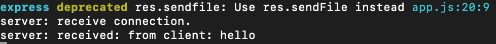

## 简介
> WebSocket 由多个标准构成: WebSocket API 是 W3C 定义的，而 WebSocket 协议(RFC 6455)及其扩展则由 HyBi Working Group(IETF)定义。

HTML5开始提供的一种浏览器与服务器进行<font color="#ff502c">全双工通讯的网络技术</font>，属于<font color="#ff502c">应用层协议</font>。它基于<font color="#ff502c">TCP传输协议</font>，并<font color="#ff502c">复用HTTP的握手通道</font>。
`WebSocket` 可以实现**客户端与服务器间双向**、**基于消息的文本或二进制数据传输**。`WebSocket` 连接远远不是一个**网络套接字**，因为浏览器在这个简单的 API 之后隐藏了所有的复杂性，而且还提供了更多服务:
-  连接协商和同源策略;
- 与既有 HTTP 基础设施的互操作;
- 基于消息的通信和高效消息分帧;
- 子协议协商及可扩展能力。

### 特点
为什么已经有了轮询还要WebSocket呢，是因为短轮询和长轮询有个缺陷：通信只能由客户端发起。
WebSocket提供了一个文明优雅的全双工通信方案。一般适合于对数据的实时性要求比较强的场景，如通信、股票、直播、共享桌面，特别适合于客户端与服务频繁交互的情况下，如聊天室、实时共享、多人协作等平台。

- **建立在 TCP 协议之上，服务器端的实现比较容易。**
- **与 HTTP 协议有着良好的兼容性。默认端口也是80和443，并且握手阶段采用 HTTP 协议，因此握手时不容易屏蔽，能通过各种 HTTP 代理服务器。**
- **数据格式比较轻量，性能开销小，通信高效。服务器与客户端之间交换的标头信息大概只有2字节;**
- **可以发送文本，也可以发送二进制数据。**
- **没有同源限制，客户端可以与任意服务器通信。**
- **协议标识符是 `ws`（如果加密，则为wss），服务器网址就是 URL。ex：`ws://example.com:80/some/path`**
- **不用频繁创建及销毁TCP请求，减少网络带宽资源的占用，同时也节省服务器资源;**
- **WebSocket是纯事件驱动的，一旦连接建立，通过监听事件可以处理到来的数据和改变的连接状态，数据都以帧序列的形式传输。服务端发送数据后，消息和事件会异步到达。**
- **无超时处理。**

## webSocket学习
对网络应用层协议的学习来说，最重要的往往就是**连接建立过程、数据交换教程**。当然，数据的格式是逃不掉的，因为它直接决定了协议本身的能力。好的数据格式能让协议更高效、扩展性更好。
大致可以通过下面的几个方面来学习:

- **如何建立连接**
- **数据帧格式**
- **数据传递**
- **连接保持+心跳**
- **Sec-WebSocket-Key/Accept的作用**
- **数据掩码的作用**

### 实例
在正式介绍协议细节前，先来看一个简单的例子，有个直观感受。例子包括了**WebSocket服务端、WebSocket客户端（网页端）**。完整代码可以在 这里 找到。这里服务端用了`ws`这个库。相比大家熟悉的`socket.io`，ws实现更**轻量**，更适合学习的目的。

#### 服务端
代码如下，监听`8080`端口。当有新的连接请求到达时，打印日志，同时向客户端发送消息。当收到到来自客户端的消息时，同样打印日志。
```javascript
    const express = require('express');
    const app = express();
    const server = require('http').Server(app);
    const WebSocket = require('ws');

    const wss = new WebSocket.Server({port: 8080});
    wss.on('connection', function connection(ws) {
        console.log('server: receive connection');
        ws.on('message', function incoming(message) {
            console.log('server: recevied: %s', message);
        });
        ws.send('world');
    });

    app.get('/', function (req, res) {
        res.sendfile(__dirname + '/index.html');
    });
    app.listen(3000);
```
服务端运行结果如下图所示：

#### 客户端
代码如下，向8080端口发起WebSocket连接。连接建立后，打印日志，同时向服务端发送消息。接收到来自服务端的消息后，同样打印日志。
```javascript
    const ws = new WebSocket('ws://localhost:8080');
    ws.onopen = function () {
        console.log('ws onopen');
        ws.send('from client:hello');
    };
    ws.onmessage = function (e) {
        console.log('ws onmessage');
        console.log('from server:' + e.data);
    }
```
客户端运行结果如下图所示：


## 如何建立连接
前面提到，WebSocket复用了<font color="#ff502c">HTTP的握手通道</font>。具体指的是，客户端通过HTTP请求与WebSocket<font color="#ff502c">服务端协商升级协议</font>。协议升级完成后，后续的数据交换则遵照<font color="#ff502c">WebSocket的协议</font>。

### 客户端：申请协议升级
首先，客户端发起协议升级请求。可以看到，采用的是标准的HTTP报文格式，且只支持<font color="#ff502c">GET方法</font>。
```javascript
    GET / HTTP/1.1
    Host: localhost:8080
    Origin: http://127.0.0.1:3000
    Connection: Upgrade // 表示要升级协议
    Upgrade: websocket // 表示要升级到websocket协议。
    Sec-WebSocket-Version: 13 // 表示websocket的版本。如果服务端不支持该版本，需要返回一个Sec-WebSocket-Versionheader，里面包含服务端支持的版本号。
    Sec-WebSocket-Key: w4v7O6xFTi36lq3RNcgctw== // 与后面服务端响应首部的Sec-WebSocket-Accept是配套的，提供基本的防护，比如恶意的连接，或者无意的连接。
```

重点请求首部意义如下：
- `Connection`: Upgrade：表示要升级协议
- `Upgrade: websocket`：表示要升级到websocket协议。
- `Sec-WebSocket-Version`: 13：表示websocket的版本。如果服务端不支持该版本，需要返回一个Sec-WebSocket-Versionheader，里面包含服务端支持的版本号。
- `Sec-WebSocket-Key`：与后面服务端响应首部的Sec-WebSocket-Accept是配套的，提供基本的防护，比如恶意的连接，或者无意的连接。

> 注意，上面请求省略了部分非重点请求首部。由于是标准的HTTP请求，类似Host、Origin、Cookie等请求首部会照常发送。在握手阶段，可以通过相关请求首部进行 安全限制、权限校验等。

### 服务端：响应协议升级
服务端返回内容如下，状态代码`101`表示协议切换。到此完成协议升级，后续的数据交互都按照新的协议来。
```javascript
    HTTP/1.1 101 Switching Protocols
    Connection:Upgrade
    Upgrade: websocket
    Sec-WebSocket-Accept: Oy4NRAQ13jhfONC7bP8dTKb4PTU=
```
如下图所示：


> 备注：每个header都以\r\n结尾，并且最后一行加上一个额外的空行\r\n。此外，服务端回应的HTTP状态码只能在握手阶段使用。过了握手阶段后，就只能采用特定的错误码。

### Sec-WebSocket-Accept的计算
`Sec-WebSocket-Accept`根据客户端请求首部的`Sec-WebSocket-Key`计算出来。
计算公式为：
- 将`Sec-WebSocket-Key`跟`258EAFA5-E914-47DA-95CA-C5AB0DC85B11`拼接。
- 通过`SHA1`计算出摘要，并转成`base64`字符串。

伪代码如下：
`>toBase64( sha1( Sec-WebSocket-Key + 258EAFA5-E914-47DA-95CA-C5AB0DC85B11 ) )`

验证下前面的返回结果：
```javascript
    const crypto = require('crypto');
    const magic = '258EAFA5-E914-47DA-95CA-C5AB0DC85B11';
    const secWebSocketKey = 'w4v7O6xFTi36lq3RNcgctw==';

    let secWebSocketAccept = crypto.createHash('sha1')
        .update(secWebSocketKey + magic)
        .digest('base64');

    console.log(secWebSocketAccept);
    // Oy4NRAQ13jhfONC7bP8dTKb4PTU=
```

## 数据帧格式
**客户端、服务端数据的交换**，离不开数据帧格式的定义。因此，在实际讲解数据交换之前，我们先来看下WebSocket的数据帧格式。

