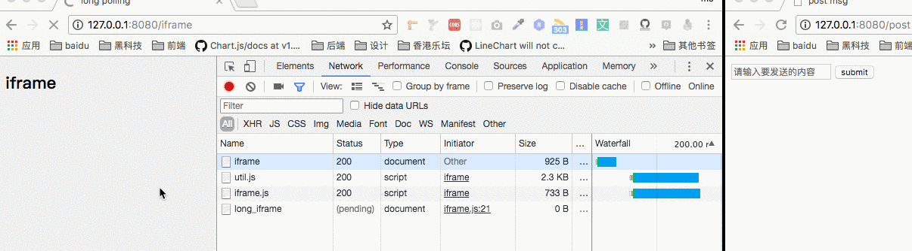

> [webSocket(一) 浅析](/blog/http/http-web-socket1.html)
> [webSocket(二) 短轮询、长轮询、Websocket、sse](/blog/http/http-web-socket2.html)

## 简介
Web Sockets定义了一种在通过一个单一的 socket 在网络上进行**全双工通讯的通道**。仅仅是传统的 HTTP 通讯的一个增量的提高，尤其对于**实时、事件驱动**的应用来说是一个飞跃。
通过<font color="#ff502c">Polling(轮询)</font>、<font color="#ff502c">Long-Polling(长轮询)</font>、<font color="#ff502c">Websocket</font>、<font color="#ff502c">sse</font>的对比。四种Web即时通信技术比较它们的**实现方式**和**各自的优缺点**。
对比优缺点如下：

| # |      轮询(Polling)      |  长轮询(Long-Polling) | Websocket | sse |
|:----------:|:-------------:|:------:|:------:|:------:|
| 通信协议 |  http | http | tcp | http |
| 触发方式 |  client(客户端) | client(客户端) | client、server(客户端、服务端) | client、server(客户端、服务端) |
| 优点 |  兼容性好容错性强，实现简单 | 比短轮询节约资源 | 全双工通讯协议，性能开销小、安全性高，可扩展性强 | 实现简便，开发成本低 |
| 缺点 |  安全性差，占较多的内存资源与请求数 | 安全性差，占较多的内存资源与请求数 | 传输数据需要进行二次解析，增加开发成本及难度 | 只适用高级浏览器 |
| 延迟 |  非实时，延迟取决于请求间隔 | 同短轮询 | 实时 | 非实时，默认3秒延迟，延迟可自定义 |

上面基本上包含了各个实现方式的**优点**和**缺点**，它们基于什么**协议**、由那端**主动**发送数据。
## 轮询(Polling) 
**短轮询(Polling)**的实现思路就是**浏览器端**每隔几秒钟向**服务器端**发送<font color="#ff502c">http</font>请求，服务端在收到请求后，不论是否有数据更新，都直接进行响应。**在服务端响应完成，就会关闭这个Tcp连接**，如下图所示：

示例代码实现如下：
```javascript
function Polling() {
    fetch(url).then(data => {
        // somthing
    }).catch(err => {
        console.log(err);
    });
}
setInterval(polling, 5000);
```
- 优点：可以看到实现非常简单，它的**兼容性**也比较好的只要**支持http协议**就可以用这种方式实现。
- 缺点：但是它的缺点也很明显就是非常的消耗资源，因为建立`Tcp`连接是非常消耗资源的，服务端响应完成就会关闭这个`Tcp`连接，下一次请求再次建立`Tcp`连接。

## COMET
**Alex Russell（Dojo Toolkit 的项目 Lead）**称这种基于`HTTP长连接`、无须在浏览器端安装插件的“服务器推”技术为`“Comet”`。
常用的COMET分为两种：**基于HTTP的长轮询（long-polling）技术，以及基于iframe的长连接流（stream）模式**。

### 长轮询（Long-Polling）
客户端发送请求后服务器端**不会立即**返回数据，服务器端会**阻塞请求**连接不会**立即断开**，直到服务器端**有数据更新或者是连接超时**才返回，客户端才再次发出请求新建连接、如此反复从而获取最新数据。大致效果如下：

客户端的代码如下：
```javascript
function LongPolling() {
    fetch(url).then(data => {
        LongPolling();
    }).catch(err => {
        LongPolling();
        console.log(err);
    });
}
LongPolling();
```
- 优点： 长轮询和短轮询比起来，明显减少了很多不必要的http请求次数，相比之下节约了资源。
- 缺点：连接挂起也会导致资源的浪费。

### 基于iframe的长连接流（stream）模式
当我们在页面中嵌入一个<font color="#ff502c">iframe</font>并设置其src时，服务端就可以通过长连接<font color="#ff502c">“源源不断”</font>地向客户端输出内容。
例如，我们可以向客户端返回一段`script`标签包裹的`javascript`代码，该代码就<font color="#ff502c">会在iframe中执行</font>。因此，如果我们预先在`iframe`的父页面中定义一个<font color="#ff502c">处理函数process()</font>，而在每次有新数据需要<font color="#ff502c">推送时</font>，在该连接响应中写入<font color="#ff502c"><script>parent.process(${your_data})</script></font>。那么iframe中的这段代码就会调用父页面中预先定义的<font color="#ff502c">process()函数</font>。（是不是有点像JSONP传输数据的方式？）
```javascript
  // 在父页面中定义的数据处理方法
  function process(data) {
      // do something
  }

  // 创建不可见的iframe
  var iframe = document.createElement('iframe');
  iframe.style = 'display: none';
  // src指向后端接口
  iframe.src = '/long_iframe';
  document.body.appendChild(iframe);
```
后端还是以node为例
```javascript
const app = http.createServer((req, res) => {
    // 返回数据的方法，将数据拼装成script脚本返回给iframe
    const iframeSend = data => {
        let script = `<script type="text/javascript">
                        parent.process(${JSON.stringify(data)})
                    </script>`;
        res.write(script);
    };

    res.setHeader('connection', 'keep-alive');
    // 注意设置相应头的content-type
    res.setHeader('content-type', 'text/html; charset=utf-8');        
    // 当有数据更新时，服务端“推送”数据给客户端
    EVENT.addListener(MSG_POST, iframeSend);

    req.socket.on('close', () => {
        console.log('iframe socket close');
        // 注意在连接关闭时移除监听，避免内存泄露
        EVENT.removeListener(MSG_POST, iframeSend);
    });
});

```
效果如下：


> 不过使用iframe有个小瑕疵，因此这个iframe相当于永远也不会加载完成，所以浏览器上会一直有一个loading标志。

他的优缺点和上面的长轮询一样。

## Websocket
WebSocket的一些特性和基础使用方法在这里就不多赘述了，请看另一篇博客[webSocket(一) 浅析](/blog/http/http-web-socket1.html);
大致代码如下：
**服务端**
```javascript
    const express = require('express');
    const app = express();
    const server = require('http').Server(app);
    const WebSocket = require('ws');

    const wss = new WebSocket.Server({port: 8080});
    wss.on('connection', function connection(ws) {
        console.log('server: receive connection');
        ws.on('message', function incoming(message) {
            console.log('server: recevied: %s', message);
        });
        ws.send('world');
    });

    app.get('/', function (req, res) {
        res.sendfile(__dirname + '/index.html');
    });
    app.listen(3000);
```
**客户端**
```javascript
    const ws = new WebSocket('ws://localhost:8080');
    ws.onopen = function () {
        console.log('ws onopen');
        ws.send('from client:hello');
    };
    ws.onmessage = function (e) {
        console.log('ws onmessage');
        console.log('from server:' + e.data);
    }
```
运行效果如下：


- 优点：不会造成性能的浪费
- 缺点：学习一套新的请求库

## SSE (Server-Sent Events)
`Server-Sent`是`HTML5`提出一个标准。由客户端发起与服务器之间创建`TCP`连接，然后**并维持这个连接**，直到客户端或服务器中的任何一方断开，`ServerSent`使用的是"问"+"答"的机制，连接创建后浏览器会周期性地发送消息至服务器询问，是否有自己的消息。其实现原理类似于我们在上一节中提到的**基于iframe的长连接模式**。
HTTP响应内容有一种特殊的`content-type —— text/event-stream`，该响应头标识了响应内容为**事件流**，客户端**不会关闭连接**，而是等待服务端不断得发送响应结果。
SSE规范比较简单，主要分为两个部分：浏览器中的<font color="#ff502c">EventSource</font>对象，以及服务器端与浏览器端之间的**通讯协议**。

## 基础用法
在浏览器中可以通过<font color="#ff502c">EventSource</font>构造函数来创建该对象
```javascript
  var source = new EventSource('/sse');
```
而`SSE`的响应内容可以看成是一个**事件流**，由不同的事件所组成。这些事件会触发前端`EventSource`对象上的方法。
```javascript
  // 默认的事件
  source.addEventListener('message', function (e) {
      console.log(e.data);
  }, false);

  // 用户自定义的事件名
  source.addEventListener('my_msg', function (e) {
      process(e.data);
  }, false);

  // 监听连接打开
  source.addEventListener('open', function (e) {
      console.log('open sse');
  }, false);

  // 监听错误
  source.addEventListener('error', function (e) {
      console.log('error');
  });
```
<font color="#ff502c">EventSource</font>通过事件监听的方式来工作。注意上面的代码监听了<font color="#ff502c">y_msg</font>事件，SSE支持自定义事件，默认事件通过监听message来获取数据。实现代码如下:

**客户端**
```javascript
  // 显示聊天信息
  let chat = new EventSource("/chat-room");
  chat.onmessage = function (event) {
      let msg = event.data;
      $(".list-group").append("<li class='list-group-item'>" + msg + "</li>");
      // chat.close(); 关闭server-sent event
  };

  // 自定义事件
  chat.addEventListener("myChatEvent", function (event) {
      let msg = event.data;
      $(".list-group").append("<li class='list-group-item'>" + msg + "</li>");
  });
```

**服务端 nodejs**
```javascript
  var express = require('express');
  var router = express.Router();
  router.get('/chat-room', function (req, res, next) {
      // 当res.white的数据data 以\n\n结束时 就默认该次消息发送完成，触发onmessage方法，以\r\n不会触发onmessage方法
      res.header({
          "Content-Type": "text/event-stream",
          "Cache-Control": "no-cache",
          "Connection": "keep-alive"
      });

      // res.white("event: myChatEvent\r\n"); 自定义事件
      res.write("retry: 10000\r\n"); // 指定通信的最大间隔时间
      res.write("data: start~~\n\n");
      res.end(); // 不加end不会认为本次数据传输结束 会导致不会有下一次请求
  });
```

- 优点： 客户端只需连接一次，Server就定时推送，除非其中一端断开连接。并且SSE会在连接意外断开时自动重连。
- 缺点： 要学习新的语法

## 总结
上面四种Web即时通信技术比较，可以从不同的角度考虑，它们的优先级是不同的，基本上可以分为两大类基于`http`和`tcp`两种通信中的一种。
**兼容性考虑**
<font color="#ff502c">短轮询>长轮询>长连接SSE>WebSocket</font>
**从性能方面考虑**
<font color="#ff502c">WebSocket>长连接SSE>长轮询>短轮询</font>
**服务端推送**
<font color="#ff502c">WebSocket>长连接SSE>长轮询</font>

## 参考
> [各类“服务器推”技术原理与实例（Polling/COMET/SSE/WebSocket）](https://juejin.im/post/5b135b78f265da6e420eab7d#heading-7)
> [JavaScript 服务器推送技术之 WebSocket](https://mp.weixin.qq.com/s/7KtvnY4zSfjORtxv30YaKQ)
> [轮询、长轮询、长连接、websocket](https://www.cnblogs.com/huchong/p/8595644.html)
> [消息推送机制-轮询、长轮询、SSE(Server Sent Event)和WS(WebSocket)](https://www.jianshu.com/p/ef054d3d1b62)