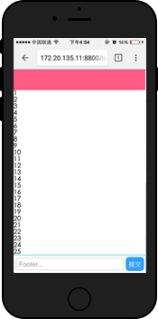
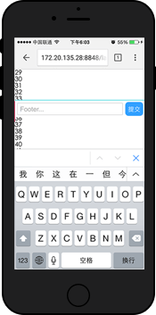
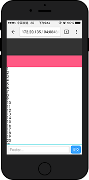

## iOS下的 Fixed + Input BUG现象
### 问题复现
让我们先举个例子，最直观的说明一个在ios中input + fixed布局，可能使用如下布局
转载 http://efe.baidu.com/
```html
<!DOCTYPE html>
<html lang="en">
<head>
    <meta charset="UTF-8">
    <meta name="viewport" content="width=device-width, initial-scale=1.0">
    <meta http-equiv="X-UA-Compatible" content="ie=edge">
    <title>Document</title>
</head>
<style>
header, footer, main {
    display: block;
}

header {
    position: fixed;
    height: 50px;
    left: 0;
    right: 0;
    top: 0;
}

footer {
    position: fixed;
    height: 34px;
    left: 0;
    right: 0;
    bottom: 0;
}

main {
    margin-top: 50px;
    margin-bottom: 34px;
    height: 2000px
}
</style>
<body class="layout-fixed">
    <!-- fixed定位的头部 -->
    <header>
        
    </header>
    
    <!-- 可以滚动的区域 -->
    <main>
        <!-- 内容在这里... -->
    </main>
    
    <!-- fixed定位的底部 -->
    <footer>
        <input type="text" placeholder="Footer..."/>
        <button class="submit">提交</button>
    </footer>
</body>
</html>
```
然后看起来就是下面这个样子。拖动页面时 header 和 footer 已经定位在了对应的位置，目测没问题了。

但接下来问题就来了！如果底部输入框软键盘被唤起以后，再次滑动页面，就会看到如下图所示：
 
<font color="red"> 软键盘唤起后，页面的 fixed 元素将失效（即无法浮动，也可以理解为变成了 absolute 定位），所以当页面超过一屏且滚动时，失效的 fixed 元素就会跟随滚动了。</font>
这就是ios上fixed元素和输入框的bug,其中不仅陷入于<font color="red">type="text"</font>的输入框，凡是软键盘（比如时间选择器、select选择等等）被唤起，都会遇到同样的问题。

### 解决思路
虽然 isScroll.js 可以很好的解决 fixed 定位滚动的问题，但是不在万不得已的情况下，我们尽量尝试一下不依赖第三方库的布局方案，以简化实现方式。这里抛砖引玉作为参考。

即使在ios下由于软键盘唤出后，页面fixed元素会失效，导致跟随页面一起滚动，那么<font color="red">页面不会过长出现滚动，那么即便fixed元素失效，也无法跟随页面滚动，也不会出现上面的问题了</font>，其实就是内部滚动
```html
<body class="layout-scroll-fixed">
    <!-- fixed定位的头部 -->
    <header>
        
    </header>
    
    <!-- 可以滚动的区域 -->
    <main>
        <div class="content">
        <!-- 内容在这里... -->
        </div>
    </main>
    
    <!-- fixed定位的底部 -->
    <footer>
        <input type="text" placeholder="Footer..."/>
        <button class="submit">提交</button>
    </footer>
</body>
```
```css
header, footer, main {
    display: block;
}

header {
    position: fixed;
    height: 50px;
    left: 0;
    right: 0;
    top: 0;
}

footer {
    position: fixed;
    height: 34px;
    left: 0;
    right: 0;
    bottom: 0;
}

main {
    /* main绝对定位，进行内部滚动 */
    position: absolute;
    top: 50px;
    bottom: 34px;
    /* 使之可以滚动 */
    overflow-y: scroll;
}

main .content {
    height: 2000px;
}
```
在原始输入法下， fixed 元素可以定位在页面的正确位置。滚动页面时，由于滚动的是 main 内部的 div，因此 footer 没有跟随页面滚动。

上面貌似解决了问题，但是如果在手机上实际测试一下，会发现 main 元素内的滚动非常不流畅，滑动的手指松开后，滚动立刻停止，失去了原本的流畅滚动特性。百度一下弹性滚动的问题，发现在 webkit 中，下面的属性可以恢复弹性滚动。
```css
-webkit-overflow-scrolling: touch;
```
在 main 元素上加上该属性，嗯，丝般顺滑的感觉又回来了！
```css
main {
    /* main绝对定位，进行内部滚动 */
    position: absolute;
    top: 50px;
    bottom: 34px;
    /* 使之可以滚动 */
    overflow-y: scroll;
    /* 增加该属性，可以增加弹性 */
    -webkit-overflow-scrolling: touch;
}
```
另外，这里的 header 和 footer 使用的是 fixed 定位，如果考虑到更老一些的 iOS 系统不支持 fixed 元素，完全可以把 fixed 替换成 absolute 。测试后效果是一样的。

至此一个不依赖第三方库的 fixed 布局就完成了。
### Android 下布局
谈到了 iOS ，也来简单说一下 Android 下的布局吧。

在 Android2.3+ 中，因为不支持 overflow-scrolling ，因此部分浏览器内滚动会有不流畅的卡顿。但是目前发现在 body 上的滚动还是很流畅的，因此使用第一种在 iOS 出现问题的 fixed 定位的布局就可以了。

如果需要考虑 Android2.3 以下系统，因为不支持 fixed 元素，所以依然要需要考虑使用 isScroll.js 来实现内部滚动。

其实在 fixed 和输入框的问题上，基本思路就是： > 由于 fixed 在软键盘唤起后会失效，导致在页面可以滚动时，会跟随页面一起滚动。因此如果页面无法滚动，那么 fixed 元素即使失效，也不会滚动，也就不会出现 bug 了。

所以可以在这个方面去考虑解决问题。
### 其他的一些细节处理
在细节处理上，其实还有很多要注意的，挑几个实际遇到比较大的问题来说一下：

有时候输入框 focus 以后，会出现软键盘遮挡输入框的情况，这时候可以尝试 input 元素的 scrollIntoView 进行修复。
在 iOS 下使用第三方输入法时，输入法在唤起经常会盖住输入框，只有在输入了一条文字后，输入框才会浮出。目前也不知道有什么好的办法能让唤起输入框时正确显示。这暂时算是 iOS 下的一个坑吧。
有些第三方浏览器底部的工具栏是浮在页面之上的，因此底部 fixed 定位会被工具栏遮挡。解决办法也比较简单粗暴——适配不同的浏览器，调整 fixed 元素距离底部的距离。
最好将 header 和 footer 元素的 touchmove 事件禁止，以防止滚动在上面触发了部分浏览器全屏模式切换，而导致顶部地址栏和底部工具栏遮挡住 header 和 footer 元素。
在页面滚动到上下边缘的时候，如果继续拖拽会将整个 View 一起拖拽走，导致页面的“露底”。

为了防止页面露底，可以在页面拖拽到边缘的时候，通过判断拖拽方向以及是否为边缘来阻止 touchmove 事件，防止页面继续拖拽。

以上面内滚动 layout-scroll-fixed 布局为例，给出一段代码作为参考：
```javascript
// 防止内容区域滚到底后引起页面整体的滚动
var content = document.querySelector('main');
var startY;

content.addEventListener('touchstart', function (e) {
    startY = e.touches[0].clientY;
});

content.addEventListener('touchmove', function (e) {
    // 高位表示向上滚动
    // 底位表示向下滚动
    // 1容许 0禁止
    var status = '11';
    var ele = this;

    var currentY = e.touches[0].clientY;

    if (ele.scrollTop === 0) {
        // 如果内容小于容器则同时禁止上下滚动
        status = ele.offsetHeight >= ele.scrollHeight ? '00' : '01';
    } else if (ele.scrollTop + ele.offsetHeight >= ele.scrollHeight) {
        // 已经滚到底部了只能向上滚动
        status = '10';
    }

    if (status != '11') {
        // 判断当前的滚动方向
        var direction = currentY - startY > 0 ? '10' : '01';
        // 操作方向和当前允许状态求与运算，运算结果为0，就说明不允许该方向滚动，则禁止默认事件，阻止滚动
        if (!(parseInt(status, 2) & parseInt(direction, 2))) {
            stopEvent(e);
        }
    }
});
```