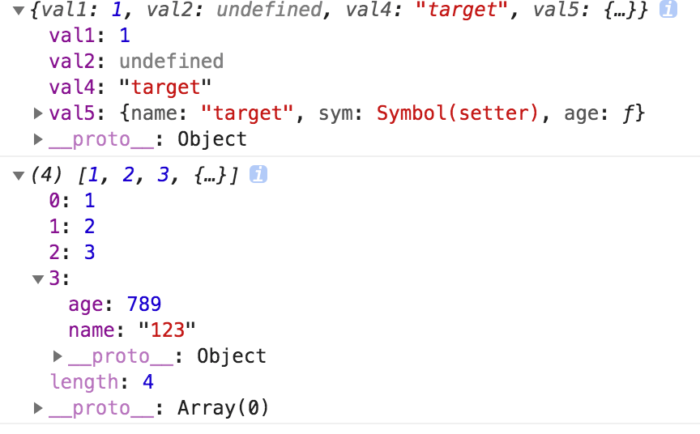

## 简介

在上篇文章中我们深入了解了`JSON.parse/JSON.stringify`，并且自己实现了一个`JSON.parse/JSON.stringify`，在这篇文章中我们要自己实现一个**深拷贝**，并且解决`JSON.parse/JSON.stringify`中出现的问题。

## 递归实现

**实现目标**

- 我们通过递归实现一个简单的深拷贝
- 判断`Object`和`Array`

**实现步骤**

- 提前声明一个判断类型函数`getType`
- 声明函数`cloneDeep`，首先判断`原对象`是否为`object`类型，如果不是直接返回原值
- 声明一个新的目标对象`newTarget`，它的类型根据入参决定`（Array、Object）`
- 通过`for...in`循环`原对象`，并且通过`hasOwnProperty`判断属性是否为本身属性
- 如果是本身属性递归调用`cloneDeep`
- 最后返回新对象`newTarget`

```js
// 获取当前类型
function getType(attr) {
  let type = Object.prototype.toString.call(attr);
  let newType = type.substr(8, type.length - 9);
  return newType;
}
// 声明一个函数
function cloneDeep(target) {
  // 判断是否传入类型为Object
  if (typeof target !== 'object') {
    return target;
  }
  // 声明新对象
  let newTarget = getType(target) === 'Array' ? [] : {};
  // 循环对象 递归复制给新对象
  for (let key in target) {
    // 判断属性是否在对象本身上
    if (target.hasOwnProperty(key)) {
      // 递归调用
      newTarget[key] = cloneDeep(target[key]);
    }
  }
  // 返回新对象
  return newTarget;
}

// 测试代码
const target = {
  val1: 1,
  val2: undefined,
  val4: 'target',
  val5: {
    name: 'target',
    age: function () {},
    sym: Symbol('setter')
  }
};
const targetArray = [1, 2, 3, { name: '123', age: 789 }];
console.log(cloneDeep(target));
console.log(cloneDeep(targetArray));
```

测试效果图如下：



在上面的代码中，已经解决了`JSON.stringify/JSON.parse`中的忽略`undefined/function`的问题，下面会逐渐解决问题，并且优化到类似与`lodash`库中的问题。

## 循环引用

**实现目标**

- 解决循环引用对象问题
- 解决引用丢失问题

**实现步骤**

- 首先了解`Map`、`WeakMap`是什么
- 通过`Map`、`WeakMap`、`Array`储存属性对象
- 如果再次使用，直接从`Map`、`WeakMap`中取出(这样既解决了循环引用，又解决了引用丢失)

测试循环引用代码：

```js
const target = {
  val1: 1,
  val2: undefined,
  val4: 'target',
  val5: {
    name: 'target',
    age: function () {},
    sym: Symbol('setter')
  }
};
target.target = target;
console.log(cloneDeep(target));
```

执行效果如下图所示：


### Map/weakMap

`Map`和`WeakMap`都是 ES6 中的新出的数据类型。如果有兴趣可以去[WeakMap mdn](https://developer.mozilla.org/zh-CN/docs/Web/JavaScript/Reference/Global_Objects/WeakMap)和[Map mdn](https://developer.mozilla.org/zh-CN/docs/Web/JavaScript/Reference/Global_Objects/Map)，或者[Set 和 Map 数据结构](http://es6.ruanyifeng.com/#docs/set-map)去了解它们的`api`和`使用场景`等。

#### Map

`Map`对象保存键值对。任何值(对象或者原始值) 都可以作为一个键或一个值。

**语法**

`new Map([iterable])`

- `iterable`: `Iterable` 可以是一个`数组`或者其他 `iterable 对象`，其元素为键值对(两个元素的数组，例如: `[[ 1, 'one' ],[ 2, 'two' ]]`)。 每个键值对都会添加到新的`Map`。`null` 会被当做 `undefined`。

**常用方法**

- `Map.prototype.get(key)`: 返回键对应的值，如果不存在，则返回`undefined`。
- `Map.prototype.set(key, value)`: 设置`Map`对象中键的值。返回该`Map对象`。
- `Map.prototype.has(key)`: 返回一个`布尔值`，表示`Map实例`是否包含键对应的值。
- `Map.prototype.delete(key)`: 如果 `Map对象`中存在该元素，则移除它并返回 `true`；否则如果该元素不存在则返回 `false`。

这里只介绍了常用的`操作方法`，`Map`还有`循环方法`、`其他方法`等等。

**实例**

```js
var oneMap = new Map();
var keyObj = {
  name: 'keyObj'
};
oneMap.set('name', 'test'); // {"name" => "test"}
oneMap.set(keyObj, 'keyObj'); // {"name" => "test", keyObj => "keyObj"} 这里的keyObj是上面声明的对象

oneMap.get('name'); // "test"
oneMap.get(keyObj); // "keyObj"

oneMap.has('name'); // true
oneMap.has(keyObj); // true
oneMap.has('age'); // false

oneMap.delete('name'); // true
```

#### WeakMap

`WeakMap` 对象是一组`键/值对`的集合，其中的键是`弱引用`的。其键`必须是对象`，而值可以是`任意`的。

它的语法、参数与`Map`是一至的，只有两点区别：

- `WeakMap`只接受`对象`作为`键`名（`null除外`），`不接受其他类型的值作为键名`。
- `WeakMap` `弱引用`的`只是键名`，而`不是键值`。`键值`依然是`正常引用`。

同时`WeakMap`只有上面`get/set/has/delete`四种方法，其它的方法它都是没有的。

**实例**

```js
const map = new WeakMap();
map.set(1, 2);
// TypeError: 1 is not an object!
map.set(Symbol(), 2);
// TypeError: Invalid value used as weak map key
map.set(null, 2);
// TypeError: Invalid value used as weak map key

const wm = new WeakMap();
let key = {};
let obj = { foo: 1 };

wm.set(key, obj);
obj = null;
wm.get(key);
// Object {foo: 1}
```

这里就不测试它的操作方法了，它的操作方法与`Map`一至。

### 通过 Map 解决

在这里我们通过`Map`来解决循环引用，修改代码如下：

```js
// 声明一个函数
function cloneDeep(target, map = new Map()) {
  // 判断是否传入类型为Object
  if (typeof target !== 'object') {
    return target;
  }
  // 声明新对象
  let newTarget = getType(target) === 'Array' ? [] : {};

  // <!------新增代码开始------!>
  // 查询map中是否有存在原对象（target），如果存在直接返回
  if (map.get(target)) {
    return target;
  }
  // 如果map中不存在原对象（target），则储存进map中
  map.set(target, newTarget);
  // <!------新增代码结束------!>

  // 循环对象 递归复制给新对象
  for (let key in target) {
    // 判断属性是否在对象本身上
    if (target.hasOwnProperty(key)) {
      // 递归调用
      newTarget[key] = cloneDeep(target[key], map);
    }
  }
  // 返回新对象
  return newTarget;
}
```

执行测试代码如下：


我们可以看到`target`变为一个`Circular`类型的对象，这个是在`node环境`中运行的，如果在`浏览器`对还是会`报错（爆栈）`。
到这里我们只做到了让他没有报错，但是也并没有完美的解决循环引用的问题，下面就要到`WeakMap`登场了。

### WeakMap 解决

上面我们已经讲解过`Map`和`WeakMap`的不同点和相同点，为什么说`WeakMap`在解决循环引用会比`Map`好很多呢，就是因为`WeakMap`它的`键值`是弱引用的。
什么是弱引用，即`垃圾回收机制`不考虑 `WeakMap` 对该对象的引用，也就是说，如果其他对象都`不再引用`该对象，那么`垃圾回收机制`会`自动回收`该对象所占用的`内存`，不考虑该对象还存在于 `WeakMap` 之中。
要深入理解`弱引用`这个又会涉及到`Node`和`JavaScript`底层垃圾回收机制，因为它们的垃圾回收机制都是使用的`标记法`，又分为`新生代`和`老生代`，所以这里就不多做赘述了。后面会有一系列文章来讲述`Node`和`JavaScript`中的相同和异同点。

修改代码如下：

```js
// 只是把Map修改为WeakMap
map = new WeakMap();
```

这样无论是在`浏览器端`还是`node`中都可以正常的运行。

## 类型问题

我们在上面只考虑了`Array/Object`其实就是`Object`类型的数据处理，其他的数据都是走的直接返回。

- 改写`Object`的判断，并且分别处理`Array/Object`方法
- 处理`Function`
- 处理`Symbol`
- 处理`不可循环类型（Number/String/Date/Boolean）`
- 处理`RegExp/Map/Set`

我们就按上面的步骤一步一步分拆不同类型走不同的处理，已解决在`JSON.stringify`遇到的问题。

### Object 类型判断

在上面的代码中我们只是简单的判断了`Object`，如果不是`Object`直接返回，其实是没有考虑到`null`这个特殊情况的。我们现在就要加上`null`的怕判断并且后面也要独立处理`Function`类型的`copy`。

**实现目标**：

- `null`的判断
- `function`的判断
- `Array/Object`的分别处理

**代码实现**：

```js
// 新增判断属性
function isObject(value) {
  // 储存传入值的类型
  const type = typeof value;
  // 过滤null
  return value != null && (type === 'object' || type === 'function');
}

// 声明一个函数
function cloneDeep(target, map = new Map()) {
  // 判断是否传入类型为Object
  if (!isObject) {
    return target;
  }
  // 。。。省略代码
  // 其实还可以通过Array.isArray()来检测是否为数组
}
```

### Function

**function**处理：

其实即使`function`指向同一个内存地址，他也是没有任何问题的，所以可以直接可以返回`return value`。

```js
const isFunc = typeof value === 'function';
if (isFunc) {
  return value;
}
```

### Symbol

数据类型 `“symbol”` 是一种原始数据类型，该类型的性质在于这个类型的值可以用来`创建匿名的对象属性`。
我们可以拷贝`symbol`类型的属性名？

首先我们可以通过`typeof、Object.prototype.toString.call()`来检测`symbol`的类型，但是我们怎么获取到`symbol`.

**示例**代码

```js
var test = Symbol('name');
typeof test; // symbol
Object.prototype.toString.call(test); // [object Symbol]
```

我们可以通过两种方法获取的到`symbol`.

- `Object.getOwnPropertySymbols(...)`: `Object.getOwnPropertySymbols(...)`可以查找一个给定对象的符号属性时返回一个 `symbol` 类型的数组。
- `Reflect.ownKeys(...)`: 返回一个由目标对象自身的`属性键`组成的数组。

> 注意： 每个初始化的对象都是没有自己的 symbol 属性的，因此这个数组可能为空，除非你已经在对象上设置了 symbol 属性。
> `Reflect.ownKeys(...)`的返回值等同于`Object.getOwnPropertyNames(target).concat(Object.getOwnPropertySymbols(target))`。

**示例**代码

```js
var sName = Symbol('name');
var age = Symbol('age');

var testObj = {
  firstSex: 'man'
};
testObj[sName] = 'name';
testObj[age] = 19;
testObj.lastSex = 'girl';

objectSymbols = Object.getOwnPropertySymbols(testObj);
console.log(objectSymbols.length); // 2
console.log(objectSymbols); // [Symbol('name'), Symbol('age')]
console.log(objectSymbols[0]); // Symbol('name')

Reflect.ownKeys(testObj); // ["firstSex", "lastSex", Symbol(name), Symbol(age)]
// 注意顺序
```

这个只能获取到当前的值，但是我们怎么拷贝这个属性呢？

我们可以通过`valueOf`来获取`symbol`的原始值，然后再复制当前的属性和值。
`valueOf()`方法返回当前 `symbol` 对象所包含的 `symbol` 原始值。

```js
function cloneSymbol(symbol) {
  // 保存方法
  const symbolValueOf = Symbol.prototype.valueOf;
  return Object(symbolValueOf.call(symbol));
}
```

### 不可循环类型

我们常用的不可循环的类型，比如`Number/String/Date/Boolean`，如果是一些字面量**直接赋值**给新的对象也是没有问题，但是我们通过创建一个新的对象自然更好。

```js
function cloneStatic(target) {
  // 获取构造函数
  const Ctor = targe.constructor;
  // 实例化一个同类型的属性
  return new Ctor(target);
}
```

### RegExp/Map/Set

首先处理`RegExp`正则，我们这里直接使用`lodash`中的，其实和静态的方法类似，都是生成一个新的`RegExp`对象。

```js
function cloneRegExp(regexp) {
  const reFlags = /\w*$/;
  const result = new regexp.constructor(regexp.source, reFlags.exec(regexp));
  result.lastIndex = regexp.lastIndex;
  return result;
}
```

#### Map/Set

我们要考虑`Map/Set`类型的处理，因为它们也是可以循环的，并且他们可以的`key-value`也可以为可循环的值。

```js
function cloneMap(target) {
  // 声明一个新的Map
  let newMap = new Map();
  // 循环复制到新Map
  target.forEach((value, key) => {
    // 因为值有可能是一个对象、数组，所以要递归调用
    newMap.set(key, cloneDeep);
  });
  return newMap();
}
function cloneSet(target) {
  // 声明一个新的Set
  let newSet = new Set();
  // 循环复制到新Set
  target.forEach((value, key) => {
    // 因为值有可能是一个对象、数组，所以要递归调用
    newSet.add(key, cloneDeep);
  });
  return newSet();
}
```

### 总结

我们考虑了大部分类型的实现，下面是完整的代码：

```js
// <!------------工具函数开始----------------------------!>
// 创建数据
function createData(deep, breadth) {
  var data = {};
  var temp = data;

  for (var i = 0; i < deep; i++) {
    temp = temp['data'] = {};
    for (var j = 0; j < breadth; j++) {
      temp[j] = j;
    }
  }
  return data;
}
// 获取类型
function getType(attr) {
  let type = Object.prototype.toString.call(attr);
  let newType = type.substr(8, type.length - 9);
  return newType;
}
// 判断是否为引用类型
function isObject(value) {
  // 储存传入值的类型
  const type = typeof value;
  // 过滤null
  return value != null && (type === 'object' || type === 'function');
}
// 克隆function
function cloneFunc(value) {
  const isFunc = typeof value === 'function';
  if (isFunc) {
    return value;
  }
}

// 克隆symbol
function cloneSymbol(symbol) {
  // 保存方法
  const symbolValueOf = Symbol.prototype.valueOf;
  // 返回key
  return Object(symbolValueOf.call(symbol));
}

// 克隆RegExp
function cloneRegExp(regexp) {
  const reFlags = /\w*$/;
  const result = new regexp.constructor(regexp.source, reFlags.exec(regexp));
  result.lastIndex = regexp.lastIndex;
  return result;
}

// 不可循环的类型 Number/String/Date/Boolean
function cloneStatic(target) {
  // 获取构造函数
  const Ctor = target.constructor;
  // 实例化一个同类型的属性
  return new Ctor(target);
}
// <!------------工具函数结束----------------------------!>
// <!------------克隆逻辑开始----------------------------!>
// 声明一个函数
function cloneDeep(target, map = new WeakMap()) {
  // 判断类型
  // console.log(isObject(target));
  if (!isObject(target)) {
    return target;
  }
  // console.log(111);
  let newTarget = {};
  switch (getType(target)) {
    case 'Number':
    case 'String':
    case 'Boolean':
    case 'Date':
      return cloneStatic(target);
    case 'RegExp':
      return cloneRegExp(target);
    case 'Function':
      return cloneFunc(target);
    case 'Array':
      newTarget = [];
      break;
    case 'Map':
      newTarget = new Map();
      break;
    case 'Set':
      newTarget = new Set();
      break;
  }

  // 查询map中是否有存在原对象（target），如果存在直接返回
  if (map.has(target)) {
    return target;
  }
  // 如果map中不存在原对象（target），则储存进map中
  map.set(target, newTarget);

  // 拷贝Map
  if (getType(target) === 'Map') {
    // 循环复制到新Map
    target.forEach((value, key) => {
      // 因为值有可能是一个对象、数组，所以要递归调用
      newTarget.set(key, cloneDeep(value, map));
    });
    return newTarget;
  }
  // 拷贝Set
  if (getType(target) === 'Set') {
    // 循环复制到新Map
    target.forEach((value, key) => {
      // 因为值有可能是一个对象、数组，所以要递归调用
      newTarget.add(key, cloneDeep(value, map));
    });
    return newTarget;
  }

  // 循环对象 递归复制给新对象
  for (let key in target) {
    // 判断属性是否在对象本身上
    if (target.hasOwnProperty(key)) {
      // 递归调用
      newTarget[key] = cloneDeep(target[key], map); // <!------新增代码 参数map------!>
    }
  }
  // 返回新对象
  return newTarget;
}
// <!------------克隆逻辑结束----------------------------!>

// 测试代码

// 实例化symbol
let oneSymbol = Symbol('name');
// 实例化Map
let newMap = new Map();
newMap.set('name', { name: 'everybody' });
// 实例化Set
let newSet = new Set();
newSet.add('age', { age: 18 });
const target = {
  val1: 1,
  val2: undefined,
  val4: 'target',
  val5: {
    name: 'target',
    age: function () {
      console.log('永远18岁');
    },
    sym: Symbol('setter')
  },
  val32: new Boolean(true),
  val23: new String(true),
  val443: new Number(true),
  date: new Date(),
  reg: /\d+/,
  empty: null,
  newMap,
  newSet,
  arrowFunc: () => {
    console.log('test111');
  },
  deepObj: createData(10, 100)
};
target[oneSymbol] = 'name';
console.time();
const ss = cloneDeep(target);
console.timeEnd();

console.log(ss);
```

执行结果：


## 性能问题

在上面我们使用的循环是`for...in`，但是他的性能并不是最高的，我们现在来对比一下`for...in`、`for`、`while`、`forEach`三个循环谁的速度更快。
我们可以通过每个循环`100000`次，在浏览器端通过`console.time()`、`console.timeend()`统计当前执行的循环效率。代码如下：

```js
// 生成数据
let initData = [];
var len = 100000;
for (let i = 0; i < len; i++) {
  let item = {
    name: 'name',
    age: 18,
    sex: 'man',
    class: 'first'
  };
  initData.push(item);
}
var sum = 0;

// 记录for循环时间
console.time();
for (let i = 0; i < len; i++) {
  sum += initData[i].age;
}
console.timeEnd();

// 记录for...in循环时间
console.time();
for (let item in initData) {
  sum += initData[item];
}
console.timeEnd();

// 记录while循环时间
let i = 0;
console.time();
while (i < len) {
  sum += initData[i].age;
  i++;
}
console.timeEnd();
// 记录forEach循环时间
console.time();
initData.forEach((item, index, soruce) => {
  sum += item;
});
console.timeEnd();
```

多次执行效果相差不多，执行效果如下：


图上的四个时间分别对应的顺序是：

- `for`: 2.8ms
- `for...in`: 17.7ms
- `while`: 4.4ms
- `forEach`: 45.2ms

这个测试环境是在`mac pro i7 16G`、`Chrome 78.0.3904.87`这个进行的只是简单测试，大致结果`for > while > for...in > forEach`。

但是我看到`lodash`中是用的`while`，并且别人测试的是和我测试相反的。这里就不再多做追究了，免的喧宾夺主后面会独立一篇文章好好探讨一下谁的速度更快。
我们也通过`while`改写代码吧。

```js
function arrayEach(array, iteratee) {
  let index = -1;
  // 获取数组长度
  const length = array.length;
  // 循环体
  while (++index < length) {
    // 执行回调
    if (iteratee(array[index], index, array) === false) {
      break;
    }
  }
  return array;
}
```

修改循环逻辑的代码如下

```js
// 原代码如下
// 循环对象 递归复制给新对象
for (let key in target) {
  // 判断属性是否在对象本身上
  if (target.hasOwnProperty(key)) {
    // 递归调用
    newTarget[key] = cloneDeep(target[key], map); // <!------新增代码 参数map------!>
  }
}

// 修改为

const keys = getType(target) === 'Array' ? undefined : Object.keys(target);
let i = 0;
arrayEach(keys || target, (value, key) => {
  if (keys) {
    key = value;
  }
  if (target.hasOwnProperty(key)) {
    newTarget[key] = cloneDeep(target[key], map); // <!------新增代码 参数map------!>
  }
});
```

测试代码

```js
// 实例化symbol
let oneSymbol = Symbol('name');
// 实例化Map
let newMap = new Map();
newMap.set('name', { name: 'everybody' });
// 实例化Set
let newSet = new Set();
newSet.add('age', { age: 18 });
const target = {
  val1: 1,
  val2: undefined,
  val4: 'target',
  val5: {
    name: 'target',
    age: function () {
      console.log('永远18岁');
    },
    sym: Symbol('setter')
  },
  val32: new Boolean(true),
  val23: new String(true),
  val443: new Number(true),
  date: new Date(),
  reg: /\d+/,
  empty: null,
  newMap,
  newSet,
  arrowFunc: () => {
    console.log('test111');
  },
  deepObj: createData(100, 1000)
};
target[oneSymbol] = 'name';

// console.log('');

console.time();
const ss1 = cloneDeepTwo(target);
console.timeEnd();

console.time();
const ss = clone(target);
console.timeEnd();
```

分开测试执行时间相差是`1ms-2ms`，其实并不相差太大，不能一起测试，因为一起测试的话，第一次执行的一些变量会被储存在内存中，第二次执行的速度自然会很快，所以一起测试的时间并不准确。

### 递归爆栈

我们测试使用的数据深度为`100`，广度为`1000`，这样还是不会造成递归爆栈，但是当我们把深度广度都提升到`10000`次就会造成递归爆栈。
解决递归爆栈的方法有三种：

- 加大阈值
- 循环改写
- 尾递归优化

因为`JavaScript`是会运行在浏览器端的，我们不能加大它的内存占用。

以前在`V8`中是已经是实现了`尾递归`的，但是它会影响`JavaScript`的栈的调用顺序，所以最后又删除掉了。
如果有兴趣可以去看我另一篇文章[尾递归](/blog/algorithm/algorithm-tailCall.html)

我们这里只用循环实现防止递归爆栈。

当我们的对象层级特别深事，我们通过递归循环时，会造成递归爆栈，因为一些临时变量会储存在堆栈中，通多深层递归调用，它们的不会被回收，当调用的层级越深自然储存的就越多，最后会导致栈储存不下，也就会造成递归爆栈。

我们可通过自己`创建一个栈`，`栈`中储存当前要拷贝的节点，一层一层往下拷贝，所以是一个深度优先的优化。

```js
function cloneLoop(x) {
  const root = {};

  // 栈
  const loopList = [
    {
      parent: root,
      key: undefined,
      data: x
    }
  ];

  while (loopList.length) {
    // 深度优先
    const node = loopList.pop();
    const parent = node.parent;
    const key = node.key;
    const data = node.data;

    // 初始化赋值目标，key为undefined则拷贝到父元素，否则拷贝到子元素
    let res = parent;
    if (typeof key !== 'undefined') {
      res = parent[key] = {};
    }

    for (let k in data) {
      if (data.hasOwnProperty(k)) {
        if (typeof data[k] === 'object') {
          // 下一次循环
          loopList.push({
            parent: res,
            key: k,
            data: data[k]
          });
        } else {
          res[k] = data[k];
        }
      }
    }
  }

  return root;
}
```

详细内容见[深拷贝的终极探索](https://mp.weixin.qq.com/s/iDbDyWeSDgShqR_nQ1po_g)

到此就一个`深拷贝`就结束了

## 全文总结

我们是在原来的基础上一步一步优化我们自己的`深拷贝`实现，但是最后的`递归爆栈`如果在当前文章书写的话，会让当前文章很乱，所以会独立出来一篇文章来记录什么是`斐波拉契数列`相关的。

我们的大致实现步骤是：

- 用递归实现一个简单的深拷贝
- 考虑循环引用问题，通过`WeakMap`解决
- 考虑类型问题，处理`Function、Map、Set`等等
- 考虑性能问题，递归爆栈问题

到此基本上就实现一个可以使用的**深拷贝**。

## 参考

[lodash cloneDeep](https://github.com/lodash/lodash/blob/master/cloneDeep.js)
[深浅拷贝原理](https://muyiy.cn/blog/4/4.1.html#%E4%B8%80%E3%80%81%E8%B5%8B%E5%80%BC%EF%BC%88copy%EF%BC%89)
[如何写出一个惊艳面试官的深拷贝](https://mp.weixin.qq.com/s/gQhfwoaxqHh4hRG1BQqKow)
[深拷贝的终极探索](https://mp.weixin.qq.com/s/iDbDyWeSDgShqR_nQ1po_g)
