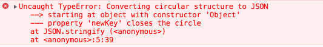

## 简介

在上篇文章我们已经了解什么是**深拷贝**和**浅拷贝**，也着重介绍了**浅拷贝**相关的一下实现方法，或者自己实现一个浅拷贝等等。本篇文章主要介绍深拷贝的一种简单实现方式`JSON.parse/JSON.stringify`。在平常开发时我们可以经常的看到别人使用，或者在不那么了解深拷贝时自己也有使用。

**JSON.parse/JSON.stringify**其实是用来序列化 JSON 格式的数据的方法。那它为什么能实现一个简单的深拷贝呢？
在执行`JSON.stringify`会把我们的一个对象序列化为字符串，而字符串是基本类型。
再通过`JSON.parse`时，把字符串类型反序列化为对象，这个时候因为在反序列化之前它是基本类型所以他会指向一个新的地址，在反序列化之后它是一个对象会再分配内存空间。
所以**JSON.parse/JSON.stringify**可以实现一个简单的**深拷贝**。

本篇文章首先实现一个`JSON.stringify/JSON.parse`，下一篇文章实现一个比较完整的**深拷贝**。

## 实例

直接上代码验证一下

```js
// 声明原始对象
var old = {
  name: 'old',
  attr: {
    age: 18,
    sex: 'man'
  },
  title: ['M1', 'P6']
};

// 声明一个新对象，通过SON.parse/JSON.stringify 实现对原始对象深拷贝，并且赋值给新对象
var newValue = JSON.parse(JSON.stringify(old));
console.log(newValue); // {name: "old", attr: {age: 18, sex: "man"}, title: [['M1', 'P6']]}

// 修改原始对象的name，新对象不受影响
old.name = 'new';
console.log(newValue); // {name: "old", attr: {age: 18, sex: "man"}, title: [['M1', 'P6']]}
console.log(old); // {name: "new", attr: {age: 18, sex: "man"}, title: [['M1', 'P6']]}

// 修改原始对象的引用类型，新对象也不受影响
old.attr.age = 20;
console.log(newValue); // {name: "old", attr: {age: 18, sex: "man"}, title: [['M1', 'P6']]}
console.log(old); // {name: "new", attr: {age: 20, sex: "man"}, title: [['M1', 'P6']]}
```

其实是不是以为用这个就可以了，并没有什么问题啊，下面我们就来一点点揭开它的面纱。

## 局限性

其实`JSON.parse/JSON.stringify`还是有很多局限性，大致如下：

- 会忽略 `undefined`
- 会忽略 `Symbol`
- 无法序列化`function`，也会忽略
- 无法解决循环引用，会报错
- 深层对象转换爆栈

直接上代码验证

```js
// 声明一个包含undefined、null、symbol、function的对象
var oldObj = {
  name: 'old',
  age: undefined,
  sex: Symbol('setter'),
  title: function () {},
  lastName: null
};
var newObj = JSON.parse(JSON.stringify(oldObj));
// 可以看到会忽略undefined、symbol、function的对象
console.log(newObj); // {name: "old", lastName: null}

var firstObj = {
  name: 'firstObj'
};
firstObj.newKey = firstObj;
// Converting circular structure to JSON
var newFirstObj = JSON.parse(JSON.stringify(firstObj));
```

如果循环引用报错如下图所示：


一个生成**任意深度、广度**对象方法。

```js
function createData(deep, breadth) {
  var data = {};
  var temp = data;

  for (var i = 0; i < deep; i++) {
    temp = temp['data'] = {};
    for (var j = 0; j < breadth; j++) {
      temp[j] = j;
    }
  }
  return data;
}
```

验证`JSON.stringify`递归爆栈

```js
JSON.stringify(createData(10000));
// VM97994:1 Uncaught RangeError: Maximum call stack size exceeded
```

## 自己实现 JSON.stringify

- **首先一个简单的递归**
- 区分`String`与`Boolean`、`Number`、`null`
- 过滤`undefined`、`symbol`、`function`
  <!-- - 递归爆栈提示 -->
- 循环引用警告

### 一个简单的递归

**实现目标**

- 递归调用

```js
// 数据类型判断
function getType(attr) {
  let type = Object.prototype.toString.call(attr);
  let newType = type.substr(8, type.length - 9);
  return newType;
}

// 转换函数
function StringIfy(obj) {
  // 如果是非object类型 or null的类型直接返回 原值的String
  if (typeof obj !== 'object' || getType(obj) === null) {
    return String(obj);
  }
  // 声明一个数组
  let json = [];
  // 判断当前传入参数是对象还是数组
  let arr = obj ? getType(obj) === 'Array' : false;
  // 循环对象属性
  for (let key in obj) {
    // 判断属性是否在对象本身上
    if (obj.hasOwnProperty(key)) {
      // 获取属性并且判断属性值类型
      let item = obj[key];
      // 如果为object类型递归调用
      if (getType(obj) === 'Object') {
        // consoarrle.log(item)
        item = StringIfy(item);
      }
      // 拼接数组字段
      json.push((arr ? '"' : '"' + key + '": "') + String(item) + '"');
    }
  }
  console.log(arr, String(json));
  // 转换数组字段为字符串
  return (arr ? '[' : '{') + String(json) + (arr ? ']' : '}');
}

// 测试代码
StringIfy({ name: { name: 'abc' } }); // "{"name": "{"name": "abc"}"}"
StringIfy([1, 2, 4]); // "["1","2","4"]"
```

在上面代码中我们基本的`JSON序列化`，可以序列化**引用类型**和**基本类型**。

### 区分数据类型

我说的区分的类型，是`JSON.stringify`再序列化时，像`Number`、`Boolean`、`null`它是不会加上`双引号`的，只有在`String`类型或者`Object中的key`才会带`双引号`。

- 增加一个判断当前属性类型

```js
// 。。。省略代码

// 转换函数
function StringIfy(obj) {
  // 。。。省略代码
  let IsQueto =
    getType(item) === 'Number' ||
    getType(item) === 'Boolean' ||
    getType(item) === 'Null'
      ? ''
      : '"';
  // 拼接数组字段
  json.push((arr ? IsQueto : '"' + key + '": "') + String(item) + IsQueto);
  // 。。。省略代
}

// 测试代码
StringIfy({ name: { name: 'abc' } }); // "{"name": "{"name": "abc"}"}"
StringIfy([1, 2, 4]); // "[1,2,4]"
```

### 不处理部分值

- 通过正则判断过滤`Symbol|Function|Undefined`
- 跳过当前循环

```js
if (/Symbol|Function|Undefined/.test(getType(item))) {
  delete obj[key];
  continue;
}
let test = {
  name: 'name',
  age: undefined,
  func: function () {},
  sym: Symbol('setter')
};
let newTest = StringIfy(test);
console.log(newTest); // {"name": "name"}
```

### 循环引用警告

- 处理循环引用，警告并且退出循环

```js
if (item === obj) {
  console.error(new TypeError('Converting circular structure to JSON'));
  return false;
}
```

### JSON.stingify 其他参数

`JSON.stringify`它可以传入三个参数。

**语法**： `JSON.stringify(value[, replacer [, space]])`

**参数**

- `value`：将要序列化成 一个 JSON 字符串的值。
- `replacer(可选)`：如果该参数是一个`函数`，则在序列化过程中，被序列化的值的`每个属性都会`经过该函数的`转换和处理`；如果该参数是一个`数组`，则`只有包含`在这个数组中的`属性名`才会被序列化到最终的 `JSON` 字符串中；
- `space`：指定缩进用的`空白字符串`，用于`美化输出（pretty-print）`；

这里主要记录`replacer`的实现，首先我们要知道`replacer`参数的使用才能自己实现。

**replacer**实例

```js
let oJson = {
  name: 'oJson',
  age: 20,
  sex: 'man',
  calss: 'one'
};
JSON.stringify(oJson, ['sex', 'name']); // "{"sex":"man","name":"oJson"}"
// 两个参数 key/value的形式
JSON.stringify(oJson, function (key, value) {
  if (typeof value === 'string') {
    return undefined;
  }
  return value;
}); // "{"age":20}"
```

**实现**

```js
// 转换函数
function StringIfy(obj, replacer) {
  // 如果是非object类型 or null的类型直接返回 原值的String
  if (typeof obj !== 'object' || getType(obj) === null) {
    return String(obj);
  }
  // 声明一个数组
  let json = [];

  // 判断当前传入参数是对象还是数组
  let arr = obj ? getType(obj) === 'Array' : false;
  // 循环对象属性
  for (let key in obj) {
    // 判断属性是否可枚举
    if (obj.hasOwnProperty(key)) {
      // console.log(key, item);

      // 获取属性并且判断属性值类型
      let item = obj[key];
      // <!-------修改开始-------!>
      let flag = true;
      // 处理第二个参数
      if (replacer) {
        // 判断第二个参数类型
        switch (getType(replacer)) {
          case 'Function':
            // 如果为函数执行
            flag = replacer(key, item);
            break;
          case 'Array':
            // 如果为数组
            flag = replacer.indexOf(key) !== -1;
            break;
        }
      }
      // 判断返回结果
      if (!flag) {
        continue;
      }
      // <!-------修改结束-------!>
      if (item === obj) {
        console.error(new TypeError('Converting circular structure to JSON'));
        return false;
      }
      if (/Symbol|Function|Undefined/.test(getType(item))) {
        delete obj[key];
        continue;
      }
      // 如果为object类型递归调用
      if (getType(item) === 'Object') {
        // consoarrle.log(item)
        item = StringIfy(item);
      }
      let IsQueto =
        getType(item) === 'Number' ||
        getType(item) === 'Boolean' ||
        getType(item) === 'Null'
          ? ''
          : '"';
      // 拼接数组字段
      json.push((arr ? IsQueto : '"' + key + '": "') + String(item) + IsQueto);
    }
  }
  console.log(arr, String(json));
  // 转换数组字段为字符串
  return (arr ? '[' : '{') + String(json) + (arr ? ']' : '}');
}
```

我们新增第二个参数的处理，第三个参数暂时就忽滤了，主要用于设置`space`的，下面直接测试上面的代码：

```js
let test = {
  name: 'name',
  age: undefined,
  func: function () {},
  sym: Symbol('setter'),
  age: 30,
  sex: 'man'
};
console.log(StringIfy(test, ['name', 'sex'])); // {"name": "name","sex": "man"}
let newTest = StringIfy(test, function (key, value) {
  if (typeof value === 'string') {
    return undefined;
  }
  return value;
});
console.log(newTest); // {"age": "30}
```

到此`StringIfy`的实现到此结束。

### Stringify 总结

到此自己实现`JSON.stringify`到此结束了，完整代码如下：

```js
// 数据类型判断
function getType(attr) {
  let type = Object.prototype.toString.call(attr);
  let newType = type.substr(8, type.length - 9);
  return newType;
}
// 转换函数
function StringIfy(obj) {
  // 如果是非object类型 or null的类型直接返回 原值的String
  if (typeof obj !== 'object' || getType(obj) === null) {
    return String(obj);
  }
  // 声明一个数组
  let json = [];
  // 判断当前传入参数是对象还是数组
  let arr = obj ? getType(obj) === 'Array' : false;
  // 循环对象属性
  for (let key in obj) {
    // 判断属性是否在对象本身上
    if (obj.hasOwnProperty(key)) {
      // console.log(key, item);
      // 获取属性并且判断属性值类型
      let item = obj[key];
      if (item === obj) {
        console.error(new TypeError('Converting circular structure to JSON'));
        return false;
      }
      if (/Symbol|Function|Undefined/.test(getType(item))) {
        delete obj[key];
        continue;
      }
      // 如果为object类型递归调用
      if (getType(item) === 'Object') {
        // consoarrle.log(item)
        item = StringIfy(item);
      }
      let IsQueto =
        getType(item) === 'Number' ||
        getType(item) === 'Boolean' ||
        getType(item) === 'Null'
          ? ''
          : '"';
      // 拼接数组字段
      json.push((arr ? IsQueto : '"' + key + '": "') + String(item) + IsQueto);
    }
  }
  console.log(arr, String(json));
  // 转换数组字段为字符串
  return (arr ? '[' : '{') + String(json) + (arr ? ']' : '}');
}
let aa = StringIfy([1, 2, 4]);
let test = {
  name: 'name',
  age: undefined,
  func: function () {},
  sym: Symbol('setter')
};
let newTest = StringIfy(test);
console.log(aa, newTest);
var firstObj = {
  name: 'firstObj'
};
firstObj.newKey = firstObj;
StringIfy(firstObj);
```

## JSON.parse 实现

有两种方法实现`parse`效果，第一种是`eval`实现，另一种是`Function`实现，下面直接开始。

### eval 实现

```js
function ParseJson(opt) {
  return eval('(' + opt + ')');
}

let aa = StringIfy([1, 2, 4]);
ParseJson(aa); // [1, 2, 4]

let test = {
  name: 'name',
  age: undefined,
  func: function () {},
  sym: Symbol('setter')
};
let newTest = StringIfy(test);
console.log(ParseJson(newTest)); // {name: "name"}
```

可以看到上面的代码可以实现基本的反序列化。

> 避免在不必要的情况下使用 eval，eval() 是一个危险的函数， 他执行的代码拥有着执行者的权利。如果你用 eval()运行的字符串代码被恶意方（不怀好意的人）操控修改，您最终可能会在您的网页/扩展程序的权限下，在用户计算机上运行恶意代码。

### Function 实现

```js
function ParseJsonTwo(opt) {
  return new Function('return ' + opt)();
}

let aa = StringIfy([1, 2, 4]);
ParseJson(aa); // [1, 2, 4]

let test = {
  name: 'name',
  age: undefined,
  func: function () {},
  sym: Symbol('setter')
};
let newTest = StringIfy(test);
console.log(ParseJson(newTest)); // {name: "name"}
```

`eval` 与 `Function` 都有着`动态编译js代码`的作用，但是在实际的编程中并不推荐使用。

### 处理 XSS

**它会执行 JS 代码，有 XSS 漏洞。**

**如果你只想记这个方法，就得对参数 json 做校验。**

```js
var rx_one = /^[\],:{}\s]*$/;
var rx_two = /\\(?:["\\\/bfnrt]|u[0-9a-fA-F]{4})/g;

var rx_three = /"[^"\\\n\r]*"|true|false|null|-?\d+(?:\.\d*)?(?:[eE][+\-]?\d+)?/g;

var rx_four = /(?:^|:|,)(?:\s*\[)+/g;
if (
	rx_one.test(
		json.replace(rx_two, "@").replace(rx_three, "]").replace(rx_four, "")
	);
) {
	var obj = ParseJson(json); // ParseJson(json) or ParseJsonTwo(json)
}
```

### Parse 总结

其实无论在什么时候都不太推荐`eval`和`function`，因为它很容造成入侵。
如果有兴趣可以去看一下[JSON.parse 三种实现方式](https://juejin.im/entry/5a98f1ef518825558001a859)，它有涉及到递归实现，状态机实现，讲的也不错。

## 总结

本篇文章主要讲解了`JSON.parse/JSON.stringify`是怎么实现的**深拷贝**，并且深入了解一下`JSON.parse/JSON.stringify`在**深拷贝**上的实现，其实还有怎么加速`JSON`序列化的速度，会在另一篇文章中讲解。最后自己也简单实现了一个`ParseJson/StringIfy`。

## 参考

[无敌秘籍之 — JavaScript 手写代码](https://mp.weixin.qq.com/s?__biz=Mzg5NDEyMzA2NQ==&mid=2247484039&idx=1&sn=a2adb13a072b889eec096523ef14ea98&chksm=c0252fd1f752a6c7b56b1fa268c34194a76d72e2be09bb4aa92b630bd7ffac120d82c50011e9&mpshare=1&scene=1&srcid=0817FYhsdmgAzbulSCdGAfOd&sharer_sharetime=1566046217540&sharer_shareid=491f5e3b572f21d39b90888df1c8829b#rd)
[JSON.parse 三种实现方式](https://juejin.im/entry/5a98f1ef518825558001a859)
