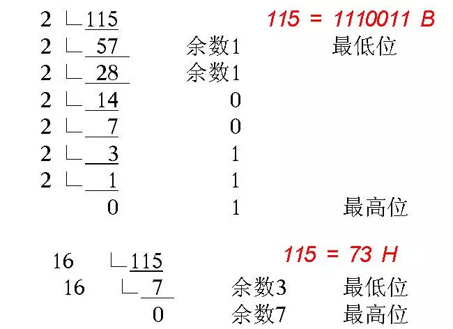

## JavaScript中的按位操作符

JavaScript提供了几种运算符，可以对一些简单的值进行基本操作，比如`算术运算符`、`赋值运算符`、`逻辑运算符`、`按位操作符`等。其他的操作运算符都是经常用到的，比如算数运算符的`+、-、*、/`；赋值运算符的`=、+=、-=`；逻辑运算符的`||、&&、!`等等。但是`按位操作符`操作符是比较来说不常用的，很多人也不知道都有什么`按位操作符`?

本章内容大致分为：

- 有哪些`按位操作符`?简单的应用
- 在日常开发是`按位操作符`可以做哪些事情？

会一步一步从了解`按位操作符`到能把它运用到项目中来，以使自己的编码更简洁、更方便。

## 简单了解按位操作符

首先来了解一下`按位操作符`的定义是什么： **`按位操作符（Bitwise operators） 将其操作数（operands）当作32位的比特序列（由0和1组成），而不是十进制、十六进制或八进制数值`**。其实[mdn 中 按位操作符](https://developer.mozilla.org/zh-CN/docs/Web/JavaScript/Reference/Operators/Bitwise_Operators)讲的有点晦涩，不太好理解通过对下面的介绍可能会好理解一点。

JavaScript内部`Number`是以`64位浮点数`的形式储存，但是做位运算的时候，是以`32位带符号的整数`进行运算的，并且返回值也是一个`32位带符号的整数`。

JavaScript中有七中按位操作符，如下表格所示：

|运算符|用法|描述|
|:------:|:-------:|:--------------:|
|按位与（ AND）|a & b|对于每一个比特位，只有两个操作数相应的比特位都是1时，结果才为1，否则为0。|
|按位或（OR）|a 丨 b|对于每一个比特位，当两个操作数相应的比特位至少有一个1时，结果为1，否则为0。|
|按位异或（XOR）|a ^ b|对于每一个比特位，当两个操作数相应的比特位有且只有一个1时，结果为1，否则为0。|
|按位非（NOT）|~ a|反转操作数的比特位，即0变成1，1变成0。|
|左移（Left shift）|	a << b|	将 a 的二进制形式向左移 b (< 32) 比特位，右边用0填充。|
|有符号右移	|a >> b|	将 a 的二进制表示向右移 b (< 32) 位，丢弃被移出的位。|
|无符号右移|	a >>> b|	将 a 的二进制表示向右移 b (< 32) 位，丢弃被移出的位，并使用 0 在左侧填充。|

## 简单了解二进制

已经知道计算机中，所有数据最终都是使用二进制数表达。
`10进制`转换为`2进制`or`16进制`如下图所示：



**原码**: `一个整数，按照绝对值大小转换成的二进制数，称为原码。`
其实就是一个数值的二进制比特位码，比如说`5`转换成二制是`101`, `Number/Int`类型的数占用`4字节(32位)`，它们为会默认填充`0`,所以`5`的二进制位`00000000 00000000 00000000 00000101`。

**反码**: `将二进制数按位取反，所得的新二进制数称为原二进制数的反码。`
取反操作指：原为`1`取反为`0`；原为`0`取反为`1`.
比如：将`00000000 00000000 00000000 00000101`每一位取反，得`11111111 11111111 11111111 11111010`。
称：`11111111 11111111 11111111 11111010`是 `00000000 00000000 00000000 00000101` 的反码。
反码是相互的，所以也可称：
`11111111 11111111 11111111 11111010` 和`00000000 00000000 00000000 00000101` 互为反码。

**补码**：`反码加1称为补码。`
也就是说，要得到一个数的`补码`，先得到`反码`，然后将`反码加上1`，所得数称为`补码`。
比如：`00000000 00000000 00000000 00000101`的反码是：`11111111 11111111 11111111 11111010`。
那么，补码为：
`11111111 11111111 11111111 11111010 + 1 = 11111111 11111111 11111111 11111011`
所以，-5 在计算机中表达为：`11111111 11111111 11111111 11111011`。
转换为十六进制：`0xFFFFFFFB`。

**负值在二进制中**： 二进制为了区分`正数`和`负数`，在`最高位`拿出来当作`符号位`，`0表示正数，1表示负数`。

比如我们就拿`-1`来做一下分析：

- `1`的原码为：`00000000 00000000 00000000 00000001`
- `1`的反码为：`11111111 11111111 11111111 11111110`
- `1`的补码为：`11111111 11111111 11111111 11111110 + 1 = 11111111 11111111 11111111 11111111`，也就是`-1`的二进制

## JavaScript中七中操作符

### 按位与（ AND）`&`

`&`以特定的方式组合操作`二进制`数中对应的位，如果对应的位都为`1`，那么结果就是`1`， 如果任意一个位是`0` 则结果就是`0`。请看下面示例：

```js
  // 1的二进制表示为: 00000000 00000000 00000000 00000001
  // 2的二进制表示为: 00000000 00000000 00000000 00000010
  // 3的二进制表示为: 00000000 00000000 00000000 00000011
  console.log(1&2) // 0
  console.log(1&3) // 1
```

**1&2对比过程**: 因为`1`和`2`它们的比特位没有相同的位置都为`1`，所以会返回一个`00000000 00000000 00000000 00000000`的`32位二进制`，转换位10进制就是`0`
**1&3对比过程**: 因为`1`和`3`它们的最低位比特位都为`1`，所以会返回一个`00000000 00000000 00000000 00000001`的`32位二进制`，转换位10进制就是`1`

### 按位或(OR)`|`

`|` 运算符跟 `&` 的区别在于如果对应的位中`任一个`比特位为`1` 那么结果就是`1`。请看下面示例：

```js
  // 1的二进制表示为: 00000000 00000000 00000000 00000001
  // 2的二进制表示为: 00000000 00000000 00000000 00000010
  // 3的二进制表示为: 00000000 00000000 00000000 00000011
  console.log(1|2) // 3
  console.log(1|3) // 3
```

**1|2对比过程**: 因为`1`和`2`它们的比特位为`1`的并集就是`00000000 00000000 00000000 00000011`的`32位二进制`，转换位10进制就是`3`
**1|3对比过程**: 因为`1`和`3`它们的比特位为`1`的并集就是`00000000 00000000 00000000 00000011`的`32位二进制`，转换位10进制就是`3`

### 按位异或(XOR)`^`

`^`如果对应两个操作位有且仅有一个`1`时结果为`1`，其他都是`0`。请看下面示例：

```js
  // 1的二进制表示为: 00000000 00000000 00000000 00000001
  // 2的二进制表示为: 00000000 00000000 00000000 00000010
  // 3的二进制表示为: 00000000 00000000 00000000 00000011
  console.log(1^2) // 3
  console.log(1^3) // 2
```

**1^2对比过程**: 因为`1`和`2`它们的比特位中只有其中一个为`1`的组合出来是`00000000 00000000 00000000 00000011`的`32位二进制`，转换位10进制就是`3`
**1^3对比过程**: 因为`1`和`3`它们的比特位中只有其中一个为`1`的组合出来`00000000 00000000 00000000 00000010`的`32位二进制`，转换位10进制就是`2`

### 按位非(NOT)`~`

`~`运算符是对位求反，`1`变`0`, `0`变`1`，也就是求二进制的反码。请看下面示例：

```js
  // 1的二进制表示为: 00000000 00000000 00000000 00000001
  console.log(~1) // -2
```

- `1`的二进制反码表示为`11111111 11111111 11111111 11111110`.
- 因为`1`的`反码``最高位为1`表示它是`负数`，`负数`又是以`补码`形式存储的，所以我们要反推一下`补码`
- 那么`1`的`反码 - 1`为`11111111 11111111 11111111 11111101`，我们要再把得到的`反码 - 1`再取`反码`为`00000000 00000000 00000000 00000010`,同时要加上一个负号`-`，最后转换为`10进制`就是`-2`

如果不理解`反码`、`原码`、`补码`可以看本篇文章上面的章节。

### 左移（Left shift）`<<`

`<<运算符`使指定值的二进制数`所有位都左移指定次数`，其移动规则：`丢弃高位`，低位`补0`即按二进制形式把所有的数字向`左移动对应的位数，高位移出(舍弃)，低位的空位补零`。请看下面示例：

```js
  // 1的二进制表示为: 00000000 00000000 00000000 00000001
  // 2的二进制表示为: 00000000 00000000 00000000 00000010

  console.log(1 << 1) // 2
```

### 有符号右移 `>>`

`>>该操作符`会将指定操作数的二进制位`向右移动指定的位数`。`向右被移出的位被丢弃，拷贝最左侧的位以填充左侧`。由于新的最左侧的位总是和以前相同，符号位没有被改变。所以被称作“`符号传播`”。请看下面示例：

```js
  // 1的二进制表示为: 00000000 00000000 00000000 00000001
  // 2的二进制表示为: 00000000 00000000 00000000 00000010
  // 3的二进制表示为: 00000000 00000000 00000000 00000011

  console.log(3 >> 1) // 1
```

### 无符号右移`>>>`

`>>>该操作符`会将第一个操作数向右移动指定的位数。`向右被移出的位被丢弃，左侧用0填充`。因为符号位变成了 0，所以结果`总是非负`的。（译注：即便`右移 0 个比特，结果也是非负的`。）
对于非负数，有符号右移和无符号右移总是返回相同的结果。例如， `9 >>> 2`得到 `2` 和 `9 >> 2` 相同。

## 位操作符使用技巧

### 判断奇偶

通过`按位与（ AND） &`来判断奇偶性 代码如下：

```js
  function isOdd (int) {
    return (int & 1) === 1;
  }

  function isEven (int) {
    return (int & 1) === 0;
  }
  console.log(isOdd(1))
  console.log(isOdd(2))
  console.log(isEven(3))
  console.log(isEven(4))
```

我们就拿`1 & 1`和`1 & 2`来分析它是什么执行对比的：

```js
  // 1的二进制表示为: 00000000 00000000 00000000 00000001
  // 2的二进制表示为: 00000000 00000000 00000000 00000010
  // 3的二进制表示为: 00000000 00000000 00000000 00000011
  (1 & 3) === 1 true
  (1 & 2) === 0 true
```

`(1 & 1)`:  `1`的二进制简写为`01`，`3`的二进制简写为`11`，因为它们的`最低位`都为`1`，所以`按位与（ AND） &`的结果就是`00000000 00000000 00000000 00000001`，最后转换为10进制`1`.
`(1 & 2)`: `1`的二进制简写为`01`，`2`的二进制简写为`10`，它们没有相同比特位为`1`，所以`按位与（ AND） &`的结果就是`00000000 00000000 00000000 00000000`，最后转换为10进制`0`.

### 取整

`>>，<<，|，~~`取整：它们无论是正数还是负数都不会受到影响，同时它们都是向下取整。
`>>>`取整：`>>>`它只能对正数向下取整。

#### >>，<<，|，~~

```js
  Math.floor(4.5) // 4
  Math.floor(-4.5) // -5
  Math.ceil(4.5) // 5
  Math.ceil(-4.5) // -4


  // 利用 >>
  console.log(24.6 >> 0) // 24 向下取整
  console.log(24.3 >> 0) // 24 向下取整
  console.log(-24.6 >> 0) // -24 向上取整
  console.log(-24.3 >> 0) // -24 向上取整

  // 利用 <<
  console.log(24.6 << 0) // 24 向下取整
  console.log(24.3 << 0) // 24 向下取整
  console.log(-24.6 << 0) // -24 向上取整
  console.log(-24.3 << 0) // -24 向上取整

  // 利用 |
  console.log(24.6 | 0) // 24 向下取整
  console.log(24.3 | 0) // 24 向下取整
  console.log(-24.6 | 0) // -24 向上取整
  console.log(-24.3 | 0) // -24 向上取整

  // 利用
  console.log(~~24.6) // 24 向下取整
  console.log(~~24.3) // 24 向下取整
  console.log(~~-24.6) // -24 向上取整
  console.log(~~-24.3) // -24 向上取整
```

`>>，<<，|`无论是正负数都会向下取整。

#### `>>>，~~`

**>>>**: 它只能对`正数`做向下取整，不能用于对`负数`取整。

```js
  // 利用 >>
  console.log(24.6 >>> 0) // 24 向下取整
  console.log(24.3 >>> 0) // 24 向下取整
  console.log(-24.6 >>> 0) // 4294967272
  console.log(-24.3 >>> 0) // 4294967272
```

### 交换值

```js
  // 1的二进制表示为: 00000000 00000000 00000000 00000001
  // 2的二进制表示为: 00000000 00000000 00000000 00000010
  // 3的二进制表示为: 00000000 00000000 00000000 00000011
  var a = 1,
    b = 2;
  a = a ^ b; // 00000000 00000000 00000000 00000011 为 3 a = 3
  b = a ^ b; // 00000000 00000000 00000000 00000001 为 1 b = 1
  a = a ^ b; // 00000000 00000000 00000000 00000010 为 2 a = 2
```

我们简单分析一下执行过程：
`a = a ^ b`: 现在`a = 1; b = 2`我们知道`1`和`2`的二进制，通过`^(相同的比特位只有一个为1，就会返回1，否则返回0)`计算得出`00000000 00000000 00000000 00000011`，转换为`10进制`的话就是`3`，所以现在`a = 3`。
`b = a ^ b`: 现在`a = 3; b = 2`我们知道`2`和`3`的二进制，通过`^(相同的比特位只有一个为1，就会返回1，否则返回0)`计算得出`00000000 00000000 00000000 00000001`，转换为`10进制`的话就是`1`，所以现在`b = 1`。
`a = a ^ b`: 现在`a = 3; b = 1`我们知道`1`和`3`的二进制，通过`^(相同的比特位只有一个为1，就会返回1，否则返回0)`计算得出`00000000 00000000 00000000 00000010`，转换为`10进制`的话就是`2`，所以现在`a = 2`。
最后就是`a = 2; b = 1`