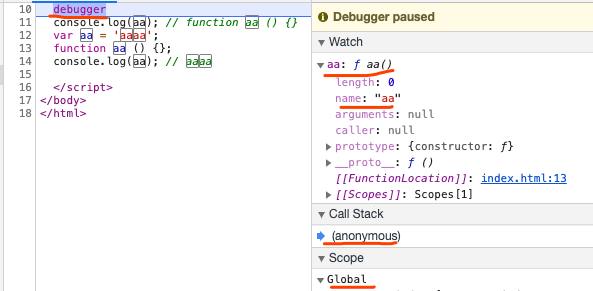
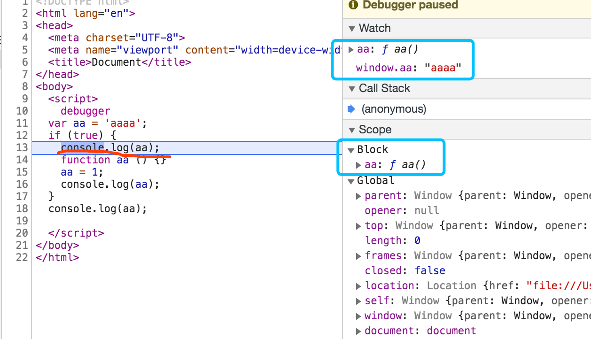
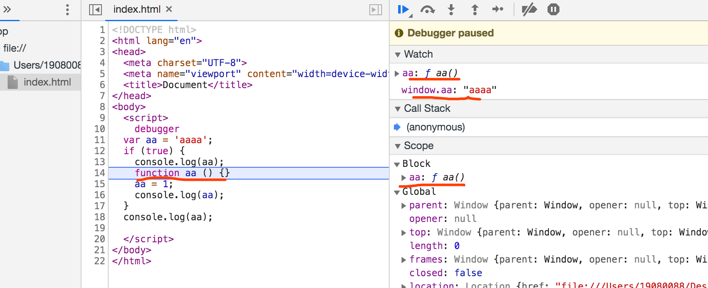
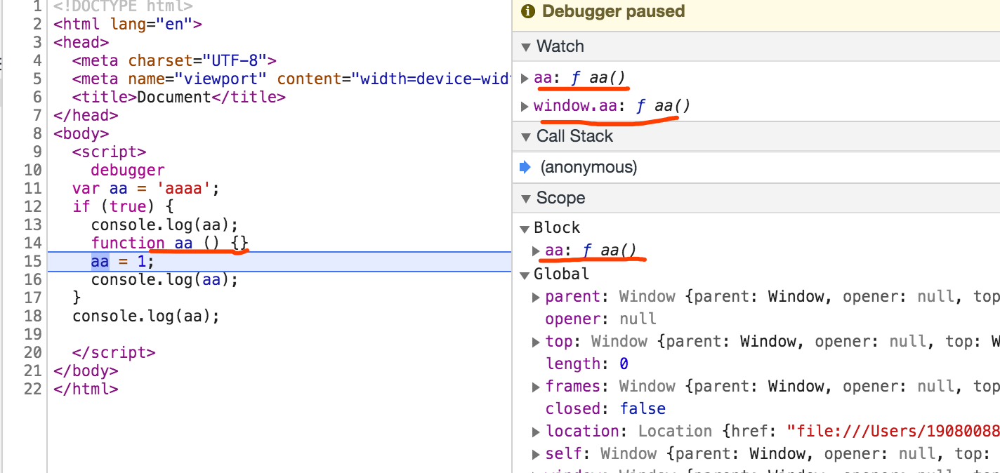
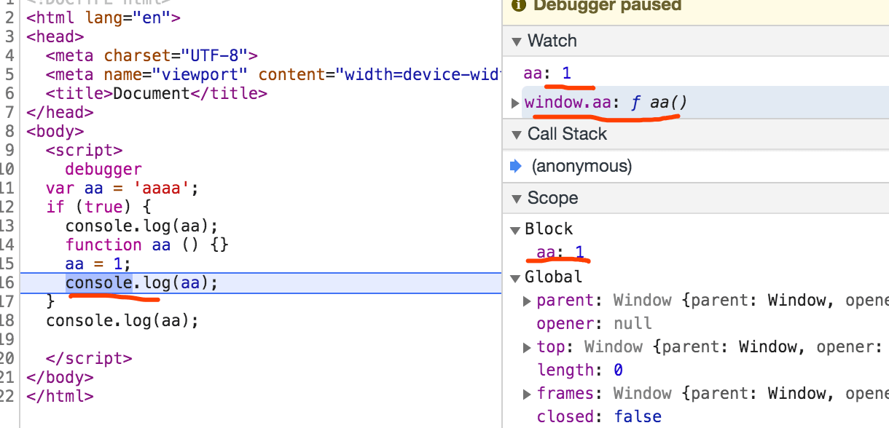
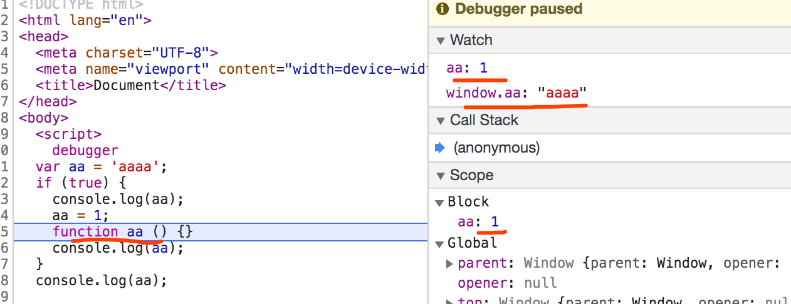
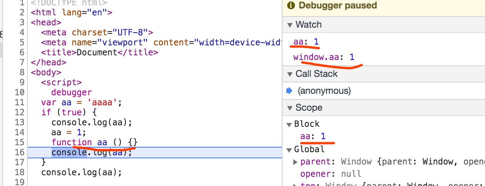

## 产生变量提升的原因

在 ES6 之前，JavaScript `没有块级作用域(一对花括号{}即为一个块级作用域)`，大致分为`全局作用域`和`函数作用域`。变量提升即将变量声明提升到它所在`作用域`的`最开始`的部分。
在 JavaScript 代码运行之前其实是有一个`编译阶段`的。编译之后才是`从上到下`，一行一行解释执行。变量提升就发生在`编译阶段`，它把`变量`和`函数`的声明提升至作用域的顶端。（编译阶段的工作之一就是将变量与其作用域进行关联）。我先分开介绍变量提升和函数提升到后面再放到一起比较。
如果想更深入的了解[产生变量提升的原因](https://www.cnblogs.com/liuhe688/p/5891273.html)
**`注意`**

1. 同一个变量只会`声明一次`，其它的会被覆盖掉。
2. `变量提升/函数提升`是提升到`当前作用域`的顶部，如果遇到特殊的`if(){}/try-cache`作用域，同时也会把也会提升到`特殊作用域`的外部。
3. `函数提升`的优先级是高于`变量提升`的优先级，并且`函数声明`和`函数定义`的部分一起被提升。

## 变量提升

我们直接从代码从最基础的开始

```javascript
console.log(a); // undefined
var a = 2;
```

相信这个大家知道，上面代码其实就是

```javascript
var a;
console.log(a); // undefined
a = 2;
```

他会提前声明 a,但是不会给 a 赋值。
但是如下代码会怎么执行呢？

```javascript
console.log(a); // Uncaught ReferenceError: a is not defined
a = 2;
```

如果没有通过 var 声明值类型的就不会存在变量提升，而是会报错。

## 函数提升

`声明函数`有两种方式: 一种是`函数表达式`，另一种是`函数声明`。

### 函数表达式

```js
  console.log(aa) // undefined
  var aa = function () {};

  /** 代码分解 ***/
  var aa;
  console.log(aa);
  aa = function () {};
```

`函数表达式`和`变量`的提升效果基本上是一致的，它会输出`undefined`。

### 函数声明

它和`函数表达式`是有点不一样的，在没有`{}作用域`时它们表现是一致的。表现一致的例子

```javascript
console.log(a); // function a () {}
function a() { };

/** 代码分解 ***/
function a() { };
console.log(a);
```

那如果`变量提升`和`函数提升`同时存在，谁先谁后呢? 我们根据上面的注意事项`1`和`3`可以得出结果，根据实例来分析一下。 请看下面的例子：

```js
  console.log(aa); // function aa () {}
  var aa = 'aaaa';
  function aa () {};
  console.log(aa); // aaaa

  /** 代码分解 ***/
  var aa; // 只会声明一次的变量
  function aa () {}; // 变量别覆盖为 aa 字面量函数
  console.log(aa); // function aa () {} 输出字面量函数
  aa = 'aaaa'; // aa 重新被覆盖为 'aaaa'
  console.log(aa); // aaaa 输出最后的覆盖值
```

其实我们可以通过`chrome`浏览器调试效果大致如下图所示：


到这里就大致知道`变量提升`、`函数提升`它们的大致过程和它们之间的`优先级`。下面我们来说一下它们和`块级作用域`和`函数作用域`的关系。

## 作用域

在`ES6`出现之后作用域变得很复杂，有太多种了，这里只说和本篇文章相关的几种作用域。我们只看`全局作用域`、`词法作用域`、`块级作用域`、`函数作用域`这四种作用域。
`全局作用域`基本上没什么好说的，上面的样例基本上都是`全局作用域`，这里就不做多的赘述。

### 词法作用域/函数作用域

词法作用域：`函数在定义它们的作用域里运行，而不是在执行它们的作用域里运行。`
我们直接通过一个例子来分析一下：

在有`作用域`时，我们来看一下`函数声明`的表现，还是通过一个实例来分析一下，代码如下：

```js
  console.log(aa); // 如果直接输入 会报错 VM1778:1 Uncaught ReferenceError: a is not defined
```

下面修改代码来分析在`函数作用域`中`函数声明`的特殊表现。

```js
  console.log(aa); // undefined
  var aa = 'aaaa';
  console.log(aa); // aaaa
  function test () {
    console.log(aa); // undefined
    var aa = 'bbbb';
    console.log(aa);  // bbbb
  }
  test();

  /** 代码分解 ***/
  var aa;
  console.log(aa); // undefined
  aa = 'aaaa';
  console.log(aa); // aaaa
  function test () {
    var aa;
    console.log(aa); // undefined
    aa = 'bbbb';
    console.log(aa);  // bbbb
  }
  test();
```

全局声明了一个名字叫做`aa`的变量，它被提升全局域的顶部声明，而在`test`函数中我们又声明了一个变量`aa`,这个变量在当前`函数作用`的顶部声明。在函数的执行的阶段，变量的读取都是就近原则，先从当先的`活动对象`或`作用域`查找，如果没有才会从`全局对象`或`全局作用域`查找。

稍微加大一点难度，修改代码如下：

```js
  console.log(aa); // undefined
  var aa = 'aaaa';
  console.log(aa); // aaaa
  function test () {
    console.log(aa); // aaaa
    aa = 'bbbb';
    console.log(aa);  // bbbb
  }
  test();

  /** 代码分解 ***/
  var aa;
  console.log(aa); // undefined
  aa = 'aaaa';
  console.log(aa); // aaaa
  function test () {
    console.log(aa); // aaaa
    aa = 'bbbb';
    console.log(aa);  // bbbb
  }
  test();
```

我们把`test函数`内部的`var aa = 'bbbb'`修改为`aa = bbbb`，这样就`不存在变量提升`只是一个简单`变量覆盖赋值`。

### 块级作用域

在`ES6`中新增了`块级作用域`，我们可以通过`let/const`来创建`块级作用域`，只能在当前`块中访问`通过`let/const`声明的变量。
我们简单的了解一下`let`和`块级作用域`，请看下方的代码：

```js
  if (true) {
    // console.log(aa); // VM439541:1 Uncaught SyntaxError: Identifier 'aa' has already been declared
    let aa = 'aaa';
  }
  console.log(aa); // VM439096:4 Uncaught ReferenceError: aa is not defined
```

在`if条件语句`内部通过`let aa = 'aaa'`中的`let`关键字创建了一个`块级作用域`，所以我们在外面不能访问`aa`变量。

```js
  console.log(aa); // VM440010:1 Uncaught ReferenceError: aa is not defined
  let aa = 'aaa';
```

`let`声明的变量同时存在`DTZ(暂时性死区)`，在`let`声明变量之前使用这个变量，会触发`DTZ(暂时性死区)`报错。

```js
  let aa = 'aaa';
  let aa = 'aaa';
  // Uncaught SyntaxError: Identifier 'aa' has already been declared
```

`let`不能多次声明同一个变量，不然会报错。

### if判断/try-cache

`if(){}/try-cache(){}`它们算一个作用域吗？我们通过下面的例子一步一步的分析它们，我们以`if`为分析样例请看代码：

```js
  console.log(aa) // undefined
  if (true) {
    var aa = 10;
  }
  console.log(aa); // 10

  /**代码分析**/
  var a;
  console.log(aa); // undefined
  if (true) {
    aa = 10;
  }
  console.log(aa); // 10
```

在`变量提升`时`if`是`不存在作用域`的，它的作用域就是全局作用域。那如果是`函数提升`呢？`if会存在作用域`吗？
通过下面这个实例我们大概会了解`函数提升`和`if`的关系：

```js
  console.log(aa); // undefined
  if (true) {
    console.log(aa); // function aa () {}
    function aa () {};
    console.log(aa); //function aa () {}
  }

  /**代码分析**/
  var aa;
  console.log(aa); // undefined
  if (true) {
    function aa () {};
    console.log(aa); // function aa () {}
    console.log(aa); //function aa () {}
  }
```

我们通过这个可以看到当前执行的结果和上面所描述的`函数提升`表现并不一致，它只是提升了`aa`的声明，赋值只是发生在`if`内部的，这也是`函数提升`在`if`中特异的表现。再来一个更特异的`if`和`函数提升`。

```js
  var aa = 'aaaa';
  if (true) { // **** 执行序号 5
    console.log(aa); // **** 执行序号 6
    aa = 1; // **** 执行序号 7
    function aa () {} // **** 执行序号 8
    console.log(aa);
  }
  console.log(aa);
  /**代码分析 执行顺序**/
  var aa;
  aa = 'aaaa';
  if (true) {
    function aa () {}
    console.log(aa); // function aa () {}
    aa = 1;
    // function aa () {} 再执行一遍
    console.log(aa); // 1
  }
  console.log(aa); // 1 ?这个确定对？
```

我们主要观察`if`内部的`aa = 1; function aa () {}`的顺序，在当前代码中`第二个console.log(aa)`会输出一个`1`，如果我们把`aa = 1; function aa () {}`改为`function aa () {}; aa = 1;` 它外部的`console.log(aa)`就会变化，看代码：

```js
  var aa = 'aaaa';
  if (true) { // **** 执行序号 1
    console.log(aa); // function aa () {} **** 执行序号 2
    function aa () {} // **** 执行序号 3
    aa = 1； // **** 执行序号 4
    console.log(aa); // 1
  }
  console.log(aa); // function aa () {}

  /**代码分析 执行顺序**/
  var aa;
  aa = 'aaaa';
  if (true) {
    function aa () {}
    console.log(aa); // function aa () {}
    // function aa () {} 再执行一遍
    aa = 1;
    console.log(aa); // 1
  }
  console.log(aa); // function aa () {} ?这个确定对？
```

如果是按上面分析的代码执行顺序是相同的，但是为什么结果不太相同，这种资料不太好找，我们直接上代码去`chrome`中调试一下代码就一清二楚了，大致调试过程如下：

**`function aa () {}; aa = 1;`执行过程**

1. 执行序号1时： 进入`if`内部执行，在`scope`中会多出来一个`block`，也就是在`作用域链`中会多出来一个`block`，这个作用域中有`aa = function aa () {}`。如下图所示：

这个时候`block`是`function aa() {}`而全局的`window.aa`现在还是`aaaa`

2. 执行序号2时： 执行`console.log(aa)`,这个只是一个输出语法并不会改变变量的值,执行效果没有变。


3. 执行序号3时: 执行`function aa() {}`, 我们可以看到`block`和`全局作用域`的`aa`变量都改变为`function aa () {}`，如下图所示：


4. 执行序号4时: 它会执行的代码`aa = 1`，这个时候根据作用域链的规则，就近获取和修改变量。所以`block`内的`aa = 1`,而全局变量`window.aa = function aa () {}` 如下图所示：


**`aa = 1; function aa () {};`执行过程**

1. 执行序号5时： 进入`if`内部执行，在`scope`中会多出来一个`block`，也就是在`作用域链`中会多出来一个`block`，这个作用域中有`aa = function aa () {}`。如下图所示：

这个时候`block`是`function aa() {}`而全局的`window.aa`现在还是`aaaa`

2. 执行序号6时： 执行`console.log(aa)`,这个只是一个输出语法并不会改变变量的值,执行效果没有变。


3. 执行序号7时: 执行`aa = 1`, 我们可以看到`block`作用域的变量`aa`被赋值为了`1`，而`全局作用域`中的变量`aa`还是`aaaa`。如下图所示：


4. 执行序号8时: 它会执行的代码`function aa() {}`，当前代码执行完成时，我们会发现`全局作用域`中的变量`aa`也被赋值为`1`. 如下图所示：


**`aa = 1;`执行过程**
当没有`function aa () {};`函数声明时，我们会发现不会产生一个临时的`block`作用域，也不会存在奇特的现象。

综合上面三个实例中我们可以得出以下的结论：

- 在`if`内部包含了`函数声明`会在内部产生一个`block作用域`，在不包含时不会产生`block作用域`。
- 在当前`if`外部存在和`函数声明`相同的`变量名称`时，当执行到`函数声明`时同时会更新外部`函数作用域or全局作用域`中变量的值，只更新当前执行的这一次。

我们再来一个例子来证明我们得到的结论，例子如下：

```js
  function test () {
    // debugger
    var aa = 'aaaa';
    if (true) {
      console.log(aa); // 第一个 ƒ aa () {}
      aa = 1;
      function aa () {}
      console.log(aa); // 第二个 1
    }
    console.log(aa); // 第三个 1
  }
  test()
  console.log(aa) // 第四个 VM5607:13 Uncaught ReferenceError: aa is not defined
```

- 第一个`console.log(aa)`会输出`ƒ aa () {}`，因为`函数声明`的提升和赋值都会放到`if`的内部。同时会产生一个`block作用域`。
- 第二个`console.log(aa)`会输出`if`内部中的`aa = 1`，因为`a = 1`会把`if`产生的`block作用域`中的变量`aa`修改为了`1`。
- 第三个`console.log(aa)`会输出`test函数作用域`中的`aa = 1`，因为在执行`function aa () {}`是都会更新外部变量`aa`的值为`1`，也就是`test函数作用域`中的`aa = 1`;
- 第四个`console.log(aa)`会输出`全局作用域`中的`aa`，因为从来没有声明过全局变量`aa`所以会报错，`is not defined`。

## 来两道题

来两道题加深一下印象。

### 第一道题

```javascript
var a = function() {
  console.log(1);
};
var a = function() {
  console.log(2);
};
var a;
console.log(a);
a = 1;
console.log(a);
a = 2;
console.log(a);
console.log(typeof a);
```

如果只能答出来就没有必要看了。

如果变量提升遇到函数提升，那个优先级更高呢，看下面的代码。

```javascript
console.log(a); // function a () {console.log(1);}
var a = 1;
function a() {
  console.log(1);
}
console.log(a); // 1
```

看上面的代码知道`函数提升`是`高于变量提升`的，因为在 javascript 中函数是一等公民，`并且不会被变量声明覆盖`，但是会被`变量赋值覆盖`。其实代码如下

```javascript
var a = function() {
  console.log(1);
};
var a;
console.log(a); // function a () {console.log(1);}
a = 1;
console.log(a); // 1
```

我们再来一个稍微复杂一点的，代码如下：

```javascript
console.log(a); // function a () {console.log(2);}
var a = 1;
function a() {
  console.log(1);
}
console.log(a); // 1
var a = 2;
function a() {
  console.log(2);
}
console.log(a); // 2
console.log(typeof a); // number
```

在多次函数提升的会后一个覆盖前一个，然后才是变量提升，其实代码如下：

```javascript
var a = function() {
  console.log(1);
};
var a = function() {
  console.log(2);
};
var a;
console.log(a); // function a () {console.log(2);}
a = 1;
console.log(a); // 1
a = 2;
console.log(a); // 2
console.log(typeof a); // number
```

### 第二道题

第二道题会比第一道题难一点点，代码如下：

```js
  console.log(aa);
  var aa = 'aaa';
  if (true) {
    console.log(aa);
    aa = 1;
    function aa () {}
    aa = 2;
    console.log(aa);
  }
  console.log(aa);
```

如果上面的内容看懂了，大概这个题就会感觉很简单，大致过程如下：

- 第一个`console.log(aa)`会输出`全局作用域`中的`aa`值为`undefined`，因为`var aa = 'aaa'`会产生变量提升，会把`var aa;`放到全局作用域中的顶端，所以会输出`undefined`。
- 第二个`console.log(aa)`会输出`if`内部中的`aa = ƒ aa () {}`，`if`内部执行产生`block作用域`，并且`block作用域`内部的`ƒ aa () {}`被提升到顶部，所以会输出`ƒ aa () {}`。
- 第三个`console.log(aa)`会输出`block作用域`中的`aa = 2`，因为在执行`function aa () {}`是都会更新外部变量`aa`的值为`1`，也就是`全局作用域`中的`aa = 1`;
- 第四个`console.log(aa)`会输出`全局作用域`中的`aa`，因为在上一步中我们知道了`全局作用域`中的`aa = 1`，所以会输出`1`。

```js
  undefined
  ƒ aa () {}
  2
  1
```

到此结束JavaScript中的变量提升，如果发现本篇文章没有涉及的变量提升的知识点和错误的地方，请大家多多指正、探讨。