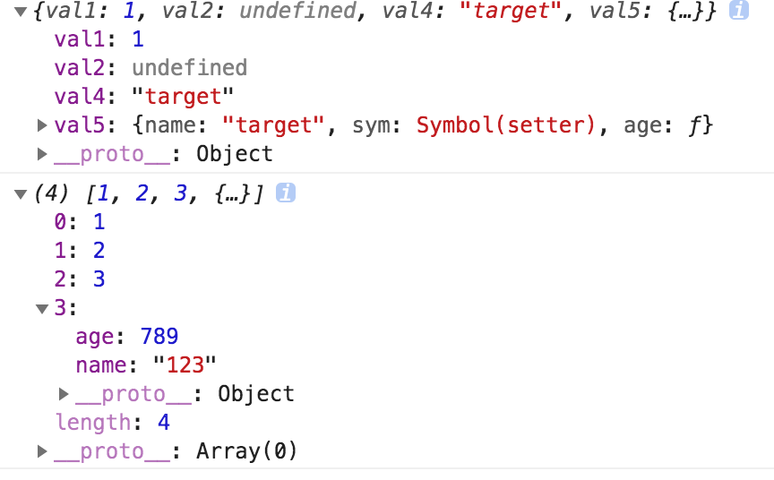

> [深拷贝系列 ———— 什么是深拷贝、浅拷贝、Object.assign](/blog/es6/es6-assign.html)
> [深拷贝系列 ———— 自己实现一个 JSON.stringify 和 JSON.parse](/blog/javascript/javascript-paser-stringify.html)
> [深拷贝系列 ———— 自己通过递归实现一个深拷贝](/blog/javascript/javascript-deepcopy.html)
> [深拷贝系列 ———— 分析 lodash 中的 deepcopy](/blog/javascript/javascript-loadsh-deepcopy.html)

## 简介

在上篇文章中我们深入了解了`JSON.parse/JSON.stringify`，并且自己实现了一个`JSON.parse/JSON.stringify`，在这篇文章中我们要自己实现一个**深拷贝**，并且解决`JSON.parse/JSON.stringify`中出现的问题。

## 递归实现

**实现目标**

- 我们通过递归实现一个简单的深拷贝
- 判断`Object`和`Array`

**实现步骤**

- 提前声明一个判断类型函数`getType`
- 声明函数`cloneDeep`，首先判断`原对象`是否为`object`类型，如果不是直接返回原值
- 声明一个新的目标对象`newTarget`，它的类型根据入参决定`（Array、Object）`
- 通过`for...in`循环`原对象`，并且通过`hasOwnProperty`判断属性是否为本身属性
- 如果是本身属性递归调用`cloneDeep`
- 最后返回新对象`newTarget`

```js
    // 获取当前类型
    function getType(attr) {
        let type = Object.prototype.toString.call(attr);
        let newType = type.substr(8, type.length - 9);
        return newType;
    }
    // 声明一个函数
    function cloneDeep (target) {
        // 判断是否传入类型为Object
        if (typeof target !== 'object') {
            return target;
        }
        // 声明新对象
        let newTarget = getType(target) === 'Array' ? [] : {};
        // 循环对象 递归复制给新对象
        for (let key in target) {
            // 判断属性是否在对象本身上
            if (target.hasOwnProperty(key)) {
                // 递归调用
                newTarget[key] = cloneDeep(target[key]);
            }
        }
        // 返回新对象
        return newTarget;
    }

    // 测试代码
    const target = {
        val1: 1,
        val2: undefined,
        val4: 'target',
        val5: {
            name: 'target',
            age: function () {},
            sym: Symbol('setter')
        }
    };
    const targetArray = [1, 2, 3, {name: '123', age: 789}];
    console.log(cloneDeep(target));
    console.log(cloneDeep(targetArray));
```

测试效果图如下：



在上面的代码中，已经解决了`JSON.stringify/JSON.parse`中的忽略`undefined/function`的问题，下面会逐渐解决问题，并且优化到类似与`lodash`库中的问题。

## 循环引用

**实现目标**

- 解决循环引用对象问题
- 解决引用丢失问题

**实现步骤**

- 首先了解`Map`、`WeakMap`是什么
- 通过`Map`、`WeakMap`、`Array`储存属性对象
- 如果再次使用，直接从`Map`、`WeakMap`、`Array`中取出(这样既解决了循环引用，又解决了引用丢失)

测试循环引用代码：

```js
    const target = {
        val1: 1,
        val2: undefined,
        val4: "target",
        val5: {
            name: "target",
            age: function() {},
            sym: Symbol("setter")
        }
    };
    target.target = target;
    console.log(cloneDeep(target));
```

执行效果如下图所示：


### Map/weakMap

`Map`和`WeakMap`都是ES6中的新出的数据类型。如果有兴趣可以去[WeakMap mdn](https://developer.mozilla.org/zh-CN/docs/Web/JavaScript/Reference/Global_Objects/WeakMap)和[Map mdn](https://developer.mozilla.org/zh-CN/docs/Web/JavaScript/Reference/Global_Objects/Map)，或者[Set 和 Map 数据结构](http://es6.ruanyifeng.com/#docs/set-map)去了解它们的`api`和`使用场景`等。

#### Map

`Map`对象保存键值对。任何值(对象或者原始值) 都可以作为一个键或一个值。

**语法**

`new Map([iterable])`

- `iterable`: `Iterable` 可以是一个`数组`或者其他 `iterable 对象`，其元素为键值对(两个元素的数组，例如: [[ 1, 'one' ],[ 2, 'two' ]])。 每个键值对都会添加到新的`Map`。`null` 会被当做 `undefined`。

**常用方法**

- `Map.prototype.get(key)`: 返回键对应的值，如果不存在，则返回`undefined`。
- `Map.prototype.set(key, value)`: 设置`Map`对象中键的值。返回该`Map对象`。
- `Map.prototype.has(key)`: 返回一个`布尔值`，表示`Map实例`是否包含键对应的值。
- `Map.prototype.delete(key)`: 如果 `Map对象`中存在该元素，则移除它并返回 `true`；否则如果该元素不存在则返回 `false`。

这里只介绍了常用的`操作方法`，`Map`还有`循环方法`、`其他方法`等等。

**实例**

```js
    var oneMap = new Map();
    var keyObj = {
        name: 'keyObj'
    };
    oneMap.set('name', 'test'); // {"name" => "test"}
    oneMap.set(keyObj, 'keyObj'); // {"name" => "test", keyObj => "keyObj"} 这里的keyObj是上面声明的对象

    oneMap.get('name'); // "test"
    oneMap.get(keyObj); // "keyObj"

    oneMap.has('name'); // true
    oneMap.has(keyObj); // true
    oneMap.has('age'); // false

    oneMap.delete('name'); // true
```

#### WeakMap

`WeakMap` 对象是一组`键/值对`的集合，其中的键是`弱引用`的。其键`必须是对象`，而值可以是`任意`的。

它的语法、参数与`Map`是一至的，只有两点区别：

- `WeakMap`只接受`对象`作为`键`名（`null除外`），`不接受其他类型的值作为键名`。
- `WeakMap` `弱引用`的`只是键名`，而`不是键值`。`键值`依然是`正常引用`。

同时`WeakMap`只有上面`get/set/has/delete`四种方法，其它的方法它都是没有的。

**实例**

```js
    const map = new WeakMap();
    map.set(1, 2)
    // TypeError: 1 is not an object!
    map.set(Symbol(), 2)
    // TypeError: Invalid value used as weak map key
    map.set(null, 2)
    // TypeError: Invalid value used as weak map key

    const wm = new WeakMap();
    let key = {};
    let obj = {foo: 1};

    wm.set(key, obj);
    obj = null;
    wm.get(key)
    // Object {foo: 1}
```

这里就不测试它的操作方法了，它的操作方法与`Map`一至。

### 通过Map解决

在这里我们通过`Map`来解决循环引用，修改代码如下：

```js
    // 声明一个函数
    function cloneDeep (target, map = new Map()) {
        // 判断是否传入类型为Object
        if (typeof target !== 'object') {
            return target;
        }
        // 声明新对象
        let newTarget = getType(target) === 'Array' ? [] : {};

        // <!------新增代码开始------!>
        // 查询map中是否有存在原对象（target），如果存在直接返回
        if (map.get(target)) {
            return target;
        }
        // 如果map中不存在原对象（target），则储存进map中
        map.set(target, newTarget);
        // <!------新增代码结束------!>

        // 循环对象 递归复制给新对象
        for (let key in target) {
            // 判断属性是否在对象本身上
            if (target.hasOwnProperty(key)) {
                // 递归调用
                newTarget[key] = cloneDeep(target[key]);
            }
        }
        // 返回新对象
        return newTarget;
    }
```

执行测试代码如下：

```js

```