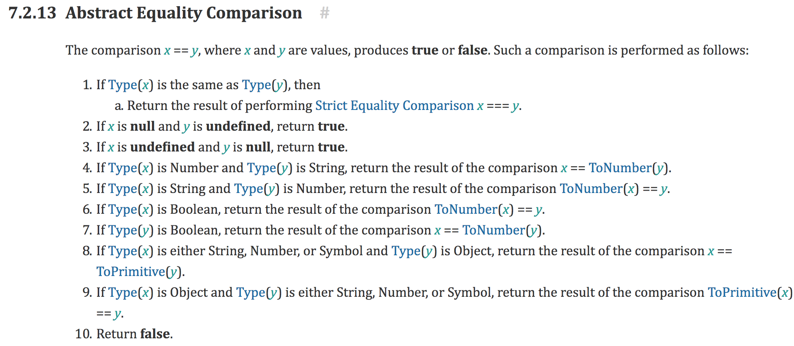
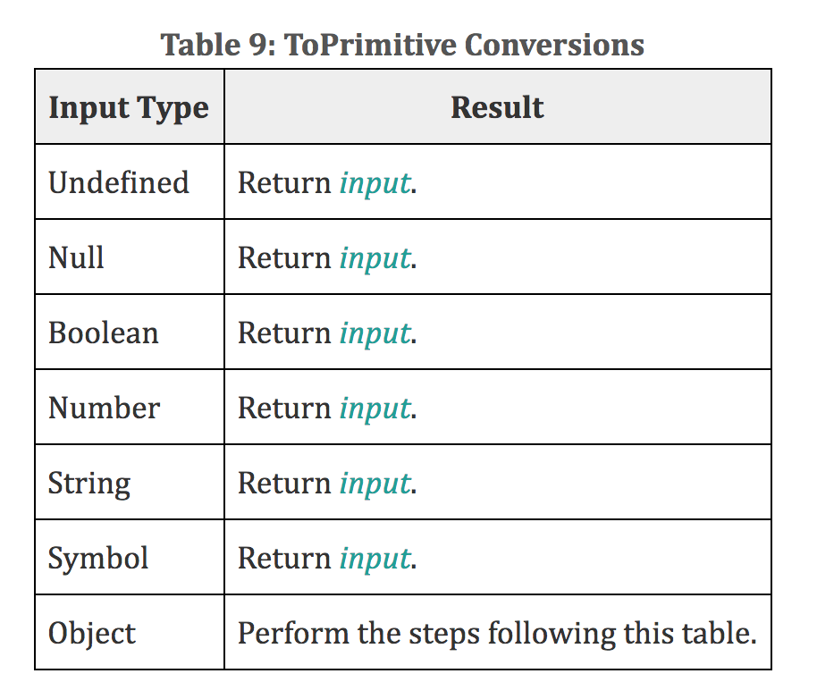
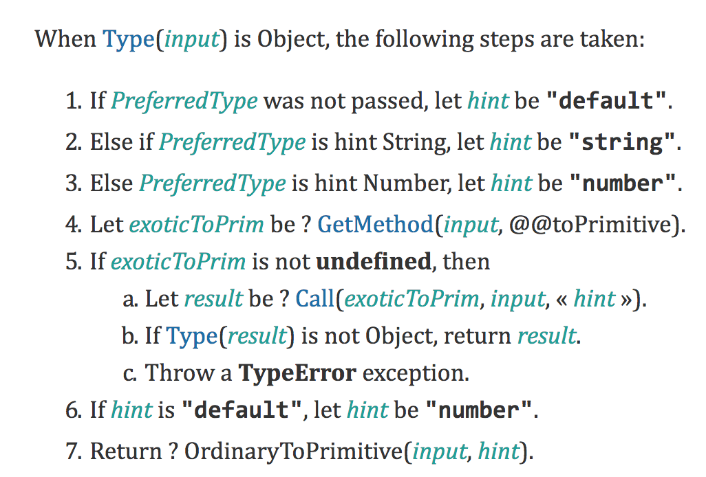
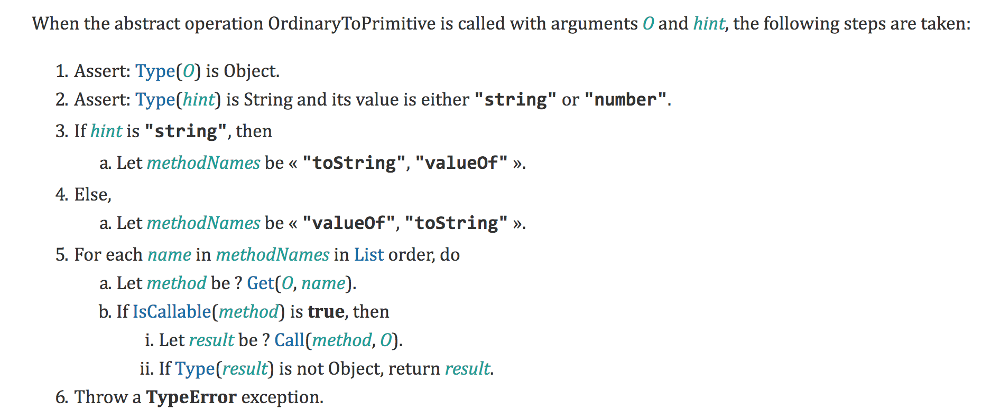

## 简介

> [JavaScript类型转换（一） 常见数据类型](/blog/javascript/javascript-Type-conversion.html)
> [JavaScript类型转换（二） 类型转换](/blog/javascript/javascript-type-one-question.html)
> [JavaScript类型转换（三）常见的面试题](/blog/javascript/javascript-type-one-questionone.html)
> [JavaScript类型转换（四）IF 转换规则](/blog/javascript/javascript-IF-False-options.html)
> [JavaScript类型转换（五）== 混乱的转换规则 ](/blog/javascript/javascript-false-true.html)

JavaScript 有两种比较方式：严格比较运算符和转换类型比较运算符。对于严格比较运算符（===）来说，仅当两个操作数的类型相同且值相等为 true，而对于被广泛使用的比较运算符（==）来说，会在进行比较之前，将两个操作数转换成相同的类型。
比较的特点:
- 对于两个拥有相同字符顺序，相同长度，并且每个字符的位置都匹配的字符串，应该使用严格比较运算符。
- 对于两个数值相同的数字应该使用严格比较运算符，NaN和任何值不相等，包括其自身，正数零等于负数零。
- 对于两个同为true或同为false的布尔操作数，应使用严格比较运算符。
- 不要使用严格比较运算符或比较运算符来比较两个不相等的对象。
- 当比较一个表达式和一个对象时，仅当两个操作数引用相同的对象（指针指向相同对象）。
- 对于Null 和 Undefined 类型而言，应使用严格比较运算符比较其自身，使用比较运算符进行互相比较。

参考 ><font color="#ff502c">https://www.h5jun.com/post/why-false-why-true.html</font>
### 一致/严格相等 (===)
一致运算符不会进行类型转换，仅当操作数严格相等时返回true
### 相等(==)
比较操作符会为两个不同类型的操作数转换类型，然后进行严格比较。当两个操作数都是对象时，JavaScript会比较其内部引用，当且仅当他们的引用指向内存中的相同对象（区域）时才相等，即他们在栈内存中的引用地址相同。

非严格比较操作符 == 是会做强制类型转换的，那么根据 ECMA 262 它的规则是：
** 图1-1 **

** <font color="#ff502c">ToPrimitive：</font> **
** 图1-2 **

** 图1-3 **

** 图1-4 **


** <font color="#ff502c">ToBoolean: </font> **
** 图1-5 **

** 图1-6 **


来源： ><font color="#ff502c">http://www.ecma-international.org</font>

## [] == false or ![] == [] or ![] == false 为true
mdn运算符优先级参考表


<font color="#ff502c">==</font>的优先级16
<font color="#ff502c">!</font>的优先级10
### [] == false 结果为 true
根据图1-1可知
- 第 7 条：If Type(y) is Boolean, return the result of the comparison x == ToNumber(y).
- 第 9 条：If Type(x) is Object and Type(y) is either String, Number, or Symbol, return the result of the comparison ToPrimitive(x) == y.

所以 [] == false 的比较是对 x 执行 ToPrimitive(x)，然后和 ToNumber(false) （为 0）进行比较。

** 看一下 ToPrimitive：**
根据上图1-2、1-3、1-4的规则对于ToPrimitive([])，先执行```[].valueOf()```，返回result的是'[]'，因为Type(result)是Object，所以继续执行```[].toString()```，返回””。
因此实际上最终是比较"" == 0，结果为true。

### ![] == [] 结果为 true
按照优先级，先执行 ![]，根据规范，实际上是 !(ToBoolean([]))：
根据上图1-5、1-6可看出，实际上 ToBoolean([]) 会return出true, ![] 就是 false.
[] 上文已经讲过了 是 “” 。
所以对比就是 false == “”，结果为true。

### ![] == false 结果为 true
按照优先级，先执行 ![]，根据规范，实际上是 !(ToBoolean([]))：
根据上图可看出，实际上 ToBoolean([]) 会return出true, ![] 就是 false.
false == false ，结果为true。

### !![] == false 结果为 false
按照优先级，先执行 !![]，根据规范，实际上是 !!(ToBoolean([]))：
根据上图可看出，实际上 ToBoolean([]) 会return出true, !![] 就是 true.
true == false ，结果为 false。
