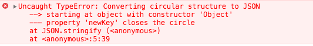

> [深拷贝系列 ———— 什么是深拷贝、浅拷贝、Object.assign](/blog/es6/es6-assign.html)
> [深拷贝系列 ———— 自己实现一个JSON.stringify和JSON.parse](/blog/javascript/javascript-paser-stringify.html)
> [深拷贝系列 ———— 自己通过递归实现一个深拷贝](/blog/javascript/javascript-deepcopy.html)
> [深拷贝系列 ———— 分析lodash中的deepcopy](/blog/javascript/javascript-loadsh-deepcopy.html)

## 简介

在上篇文章我们已经了解什么是**深拷贝**和**浅拷贝**，也着重介绍了**浅拷贝**相关的一下实现方法，或者自己实现一个浅拷贝等等。本篇文章主要介绍深拷贝的一种简单实现方式`JSON.parse/JSON.stringify`。在平常开发时我们可以经常的看到别人使用，或者在不那么了解深拷贝时自己也有使用。

**JSON.parse/JSON.stringify**其实是用来序列化JSON格式的数据的方法。那它为什么能实现一个简单的深拷贝呢？
在执行`JSON.stringify`会把我们的一个对象序列化为字符串，而字符串是基本类型。
再通过`JSON.parse`时，把字符串类型反序列化为对象，这个时候因为在反序列化之前它是基本类型所以他会指向一个新的地址，在反序列化之后它是一个对象会再分配内存空间。
所以**JSON.parse/JSON.stringify**可以实现一个简单的**深拷贝**。

本篇文章首先实现一个`JSON.stringify/JSON.parse`，下一篇文章实现一个比较完整的**深拷贝**。

## 实例

直接上代码验证一下

```js
    // 声明原始对象
    var old = {
        name: 'old',
        attr: {
            age: 18,
            sex: 'man'
        },
        title: ['M1', 'P6']
    };

    // 声明一个新对象，通过SON.parse/JSON.stringify 实现对原始对象深拷贝，并且赋值给新对象
    var newValue = JSON.parse(JSON.stringify(old));
    console.log(newValue); // {name: "old", attr: {age: 18, sex: "man"}, title: [['M1', 'P6']]}

    // 修改原始对象的name，新对象不受影响
    old.name = 'new';
    console.log(newValue); // {name: "old", attr: {age: 18, sex: "man"}, title: [['M1', 'P6']]}
    console.log(old); // {name: "new", attr: {age: 18, sex: "man"}, title: [['M1', 'P6']]}

    // 修改原始对象的引用类型，新对象也不受影响
    old.attr.age = 20;
    console.log(newValue);// {name: "old", attr: {age: 18, sex: "man"}, title: [['M1', 'P6']]}
    console.log(old); // {name: "new", attr: {age: 20, sex: "man"}, title: [['M1', 'P6']]}
```

其实是不是以为用这个就可以了，并没有什么问题啊，下面我们就来一点点揭开它的面纱。

## 局限性

其实`JSON.parse/JSON.stringify`还是有很多局限性，大致如下：

- 会忽略 `undefined`
- 会忽略 `Symbol`
- 无法序列化`function`，也会忽略
- 无法解决循环引用，会报错
- 深层对象转换爆栈

直接上代码验证

```js
    // 声明一个包含undefined、null、symbol、function的对象
    var oldObj = {
        name: 'old',
        age: undefined,
        sex: Symbol('setter'),
        title: function () {},
        lastName: null
    };
    var newObj = JSON.parse(JSON.stringify(oldObj));
    // 可以看到会忽略undefined、symbol、function的对象
    console.log(newObj); // {name: "old", lastName: null}

    var firstObj = {
        name: 'firstObj'
    }
    firstObj.newKey = firstObj;
    // Converting circular structure to JSON
    var newFirstObj = JSON.parse(JSON.stringify(firstObj));
```

如果循环引用报错如下图所示：


一个生成**任意深度、广度**对象方法。

```js
    function createData (deep, breadth) {
        var data = {};
        var temp = data;

        for (var i = 0; i < deep; i++) {
            temp = temp['data'] = {};
            for (var j = 0; j < breadth; j++) {
                temp[j] = j
            }
        }
        return data;
    }
```

验证`JSON.stringify`递归爆栈

```js
    JSON.stringify(createData(10000));
    // VM97994:1 Uncaught RangeError: Maximum call stack size exceeded
```

## 自己实现JSON.stringify

- **首先一个简单的递归**
- 区分`String`与`Boolean`、`Number`、`null`
- 过滤`undefined`、`symbol`、`function`
<!-- - 递归爆栈提示 -->
- 循环引用警告

### 一个简单的递归

递归调用

```js
    // 数据类型判断
    function getType (attr) {
        let type = Object.prototype.toString.call(attr);
        let newType = type.substr(8, type.length - 9);
        return newType;
    }

    // 转换函数
    function StringIfy(obj) {
        // 如果是非object类型 or null的类型直接返回 原值的String
        if (typeof obj !== "object" || getType(obj) === null) {
            return String(obj);
        }
        // 声明一个数组
        let json = [];
        // 判断当前传入参数是对象还是数组
        let arr = obj ? getType(obj) === "Array" : false;
        // 循环对象属性
        for (let key in obj) {
            // 判断属性是否可枚举
            if (obj.hasOwnProperty(key)) {
                // 获取属性并且判断属性值类型
                let item = obj[key];
                // 如果为object类型递归调用
                if (getType(obj) === "Object") {
                    // consoarrle.log(item)
                    item = StringIfy(item);
                }
                // 拼接数组字段
                json.push((arr ? '"' : '"' + key + '": "') + String(item) + '"');
            }
        }
        console.log(arr, String(json));
        // 转换数组字段为字符串
        return (arr ? "[" : "{") + String(json) + (arr ? "]" : "}");
    }

    // 测试代码
    StringIfy({name: { name: 'abc' }}); // "{"name": "{"name": "abc"}"}"
    StringIfy([1, 2, 4]); // "["1","2","4"]"
```

在上面代码中我们基本的`JSON序列化`，可以序列化**引用类型**和**基本类型**。

### 区分数据类型

我说的区分的类型，是`JSON.stringify`再序列化时，像`Number`、`Boolean`、`null`它是不会加上`双引号`的，只有在`String`类型或者`Object中的key`才会带`双引号`。

- 增加一个判断当前属性类型

```js
    // 。。。省略代码

    // 转换函数
    function StringIfy(obj) {
        // 。。。省略代码
        let IsQueto = (getType(item) === 'Number' || getType(item) === 'Boolean' || getType(item) === 'Null') ? '' : '"';
        // 拼接数组字段
        json.push((arr ? IsQueto : '"' + key + '": "') + String(item) + IsQueto);
        // 。。。省略代码
    }
```