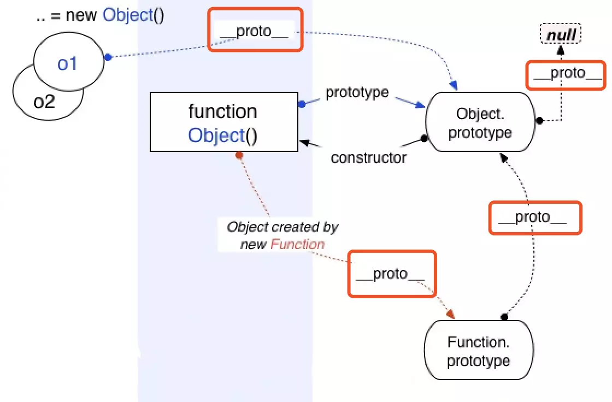
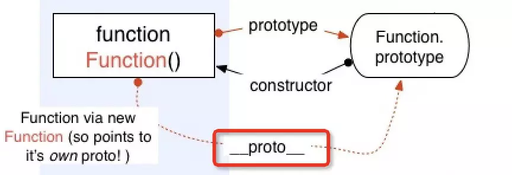
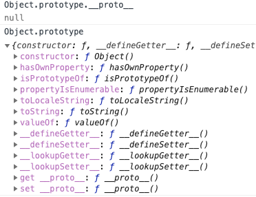
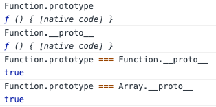

> [JavaScript原型系列（一）构造函数、原型和原型链](/blog/javascript/javascript-prototype.html)
> [JavaScript原型系列（二）什么是原型继承](/blog/javascript/javascript-prototype-one.html)
> [JavaScript原型系列（三）Function、Object、Null等等的关系和鸡蛋问题](/blog/javascript/javascript-prototype-two.html)

## 简介

* * *


基本上都知道原型链的尽头指向`null`，那么`Function.prototype`、`Object.prototype`、`null`、`Function.prototype.__proto__`、`Object.prototype.__proto__`、`function、object`之间的关系是什么，下面慢慢来记录一下。

## Object

* * *
**Object** 构造函数创建一个对象包装器。**JavaScript**中的所有对象都来自 `Object`；所有对象从`Object.prototype`继承方法和属性，尽管它们可能被覆盖。

***Object 作为构造函数时，其 [[Prototype]] 内部属性值指向 Function.prototype***

```javascript
    Object.__proto__ === Function.prototype; // true
```



### Object.prototype

`Object.prototype` 表示 `Object` 的原型对象，其 `[[Prototype]]` 属性是 `null`，访问器属性 `__proto__` 暴露了一个对象的内部 `[[Prototype]]` 。`Object.prototype`是浏览器底层根据 ECMAScript 规范创造的一个对象。

### object

通过**字面量**实例化一个`object`，它的`__proto__`指向`Object.prototype`。

```javascript
    var obj = {};
    obj.__proto__ === Object.prototype; // true
```

而通过**new Object**实例化一个`object`，它的`__proto__`指向`Object.prototype`。

```javascript
    var obj = new Object;
    obj.__proto__ === Object.prototype; // true
```

## Function

* * *
[摘录来自ECMAScript 5.1规范](http://www.ecma-international.org/ecma-262/5.1/#sec-15.3.4)
> 对象类型的成员，标准内置构造器 Function的一个实例，并且可做为子程序被调用。
> 注： 函数除了拥有命名的属性，还包含可执行代码、状态，用来确定被调用时的行为。函数的代码不限于 ECMAScript。

**Function构造函数**创建一个新的`Function`对象。在**JavaScript**中每个函数实际上都是一个`Function`对象。

### Function.prototype

全局的`Function`对象**没有**自己的属性和方法, 但是因为它本身也是**函数**，所以它也会通过原型链从`Function.prototype`上继承部分属性和方法。`Function.prototype`也是一个“函数对象“，其`[[prototype]]`内部属性值指向`Object.prototype`。

Function.prototype 的 [[Class]] 属性是 Function，所以这是一个函数，但又不大一样。

```javascript
    Function.prototype; // ƒ () { [native code] }
    Function.prototype.prototype; // undefined
```

**用 Function.prototype.bind 创建的函数对象没有 prototype 属性。**

```javascript
    let foo = Function.prototype.bind();
    foo.prototype; // undefined
```

`Function.prototype` 是引擎创建出来的函数，引擎认为不需要给这个函数对象添加 `prototype` 属性，不然 `Function.prototype.prototype…` 将无休无止并且没有存在的意义。

`Function.prototype.__proto__`指向`Object.prototype`。

```javascript
    Function.prototype.__proto__ === Object.prototype; // true
```

### Function.__proto__

`Function` 构造函数是一个函数对象，其 `[[Class]]` 属性是 `Function`。`Function` 的 `[[Prototype]]` 属性指向了 `Function.prototype`，即

```javascript
    Function.__proto__ === Function.prototype; // true
```



### function

实例化一个`Function`，它的`__proto__`指向`Function.prototype`。

```javascript
    function foo () {}
    foo.__proto__ === Function.prototype; // true
    // foo.__proto__ => Function.prototype => Function.prototype.__proto__ => Object.prototype => Object.prototype.__proto__ => null
```

## Object和Function的鸡和蛋的问题

* * *
经过上面对`Object`和`Function`的阐述，延伸出来几个问题如下：

- 在忽滤`null`在原型链上时，原型链的尽头（root）是`Object.prototype`。所有对象均从`Object.prototype`继承属性。


- `Function.prototype`和`Function.__proto__`为同一对象。

这意味着： `Object/Array/String`等等**构造函数**本质上和`Function`一样，均继承于`Function.prototype`。

- `Function.prototype`直接继承root（`Object.prototype`）。

```javascript
    // Function.prototype继承了Object.prototype
    Function.prototype.__proto__ === Object.prototype; // true
    Function.prototype instanceof Object; // true
    Function.prototype instanceof Function; // false

    // Object Array Function 等等构造函数继承了Function.prototype
    Function instanceof Function; // true
    Array instanceof Function;  // true
    Object instanceof Function; // true
    Function instanceof Object; // true
```

通过上面代码知道继承的原型链大致是： **Object.prototype(root)<---Function.prototype<---Function|Object|Array...**。

上面的会出现一个比较奇特的现象如下：

- 第一问

```javascript
    Function.__proto__ === Function.prototype;
```

`Function`对象是不是由`Function`构造函数创建的实例？

- 第二问

```javascript
    Function instanceof Object; // true
    Object instanceof Function; // true
    Object instanceof Object; // true
    Function instanceof Function; // true
```

为什么`Function instanceof Object`为`true`，`Object instanceof Function`也为`true`，那么他们到底是什么关系？

## 解答

* * *
先要了解清楚`Function.prototype`和`Object构造函数`如下：
回归规范，摘录2点：

- `Function.prototype`是个不同于一般函数（对象）的函数（对象）。

> The Function prototype object is itself a Function object (its [[Class]] is "Function") that, when invoked, accepts any arguments and returns undefined.
> The value of the [[Prototype]] internal property of the Function prototype object is the standard built-in Object prototype object (15.2.4). The initial value of the [[Extensible]] internal property of the Function prototype object is true.
> The Function prototype object does not have a valueOf property of its own; however, it inherits the valueOf property from the Object prototype Object.

上面的可以总结为：

- `Function.prototype`像普通函数一样可以调用，但总是返回`undefined`。
- 普通函数实际上是`Function`的实例，即普通函数继承于`Function.prototype`。`func.__proto__ === Function.prototype`。
- `Function.prototype`继承于`Object.prototype`，并且没有`prototype`这个属性。`func.prototype`是普通对象，`Function.prototype.prototype`是`null`。
- 所以，`Function.prototype`其实是个另类的函数，可以独立于/先于Function产生。

- `Object`本身是个（构造）函数，是`Function`的实例，即`Object.__proto__`就是`Function.prototype`。

> The value of the [[Prototype]] internal property of the Object constructor is the standard built-in Function prototype object.
> The value of the [[Prototype]] internal property of the Object prototype object is null, the value of the [[Class]] internal property is "Object", and the initial value of the [[Extensible]] internal property is true.

### 第一问

`Function`对象是由`Function`构造函数创建的一个实例？

Yes 的部分：
按照 `JavaScript` 中“实例”的定义，`a` 是 `b`的实例即 `a instanceof b` 为 `true`，默认判断条件就是 `b.prototype` 在 `a` 的原型链上。而 `Function instanceof Function` 为 true，本质上即 `Object.getPrototypeOf(Function) === Function.prototype`，正符合此定义。

No 的部分：
`Function` 是 `built-in` 的对象，也就是并不存在“`Function`对象由`Function`构造函数创建”这样显然会造成鸡生蛋蛋生鸡的问题。实际上，当你直接写一个函数时（如 `function f() {}` 或 `x => x`），也不存在调用 `Function` 构造器，只有在显式调用 `Function` 构造器时（如 `new Function('x', 'return x')` ）才有。

个人偏向先有的`Function.prototype`，再有的`function Function`，所有构造函数本质上都是集成于`Function.prototype`
，所以`Function.__proto__ === Function.prototype`。

### 第二问

```javascript
    // Function.__proto__、Function.prototype指向同一个对象，Function.prototype.__proto__指向Object.prototype
    // Function.__proto__ => Function.prototype.__proto__ => Object.prototype => Object.prototype.__proto__ => null
    Function instanceof Object; // true
    // Object作为构造函数继承自Function.prototype
    // Object.__proto__ => Function.prototype
    Object instanceof Function; // true
    // Object作为构造函数继承自Function.prototype，Function.prototype__proto__指向Object.prototype
    // Object.__proto__ => Function.prototype => Function.prototype.__proto__ => Object.prototype
    Object instanceof Object; // true
    // Function构造函数也是继承自Function.prototype
    // Function.__proto__ => Function.prototype
    Function instanceof Function; // true
```

总结一下：**先有 `Object.prototype`（原型链顶端），`Function.prototype` 继承 `Object.prototype` 而产生，最后，`Function` 和 `Object` 和其它构造函数继承 `Function.prototype` 而产生。**

## 总结

* * *

- `Object.prototype`是浏览器底层根据 `ECMAScript` 规范创造的一个对象。
- `Function.prototype`直接继承的`Object.prototype`，同样它也是由是引擎创建出来的函数，引擎认为不需要给这个函数对象添加 `prototype` 属性。`Function.prototype.prototype`为`undefined`。
- **先有 `Object.prototype`（原型链顶端），`Function.prototype` 继承 `Object.prototype` 而产生，最后，`Function` 和 `Object` 和其它构造函数继承 `Function.prototype` 而产生。**

## 参考

> [MDN Object.prototype](https://developer.mozilla.org/zh-CN/docs/Web/JavaScript/Reference/Global_Objects/Object/prototype)
> [MDN Function.prototype](https://developer.mozilla.org/zh-CN/docs/Web/JavaScript/Reference/Global_Objects/Function/prototype)
> [从__proto__和prototype来深入理解JS对象和原型链](https://github.com/creeperyang/blog/issues/9)
> [从探究Function.__proto__===Function.prototype过程中的一些收获](https://github.com/jawil/blog/issues/13)
> [【进阶5-3期】深入探究 Function & Object 鸡蛋问题](https://juejin.im/post/5cb4861ff265da036504efbc#heading-5)
