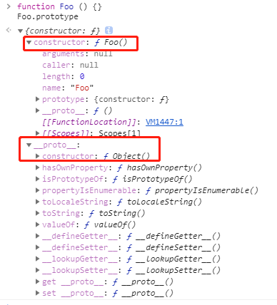

## 简介
<hr/>

首先要了解几个属性`constructor`、`prototype`、`[[prototype]]`、`__proto__`分别作用是什么，还要理解几个概念**原型**、**原型链**、**构造函数**。

结合代码先把上面的的属性和记录清楚。

## 构造函数
<hr/>

`构造函数`本身就是一个函数，与普通函数`没有`任何区别，不过为了规范一般将其`首字母`大写。`构造函数`和`普通函数`的区别在于，使用 `new` 生成实例的函数就是`构造函数`，直接调用的就是`普通函数`。下面示例代码：
```javascript
    function ConstructorFun (name) {
        this.name = name;
    }
    // 通过new关键字创建实例
    let constructorfun = new ConstructorFun();
```
其实`ConstructorFun`就是一个普通函数，但是在通过`new`关键字生成实例的时候，就可以把这个函数叫做**构造函数**;

### constructor
`constrcutor`是一种用于创建和初始化`class`创建的对象的特殊方法。
除了`null`、`undefined`其他无论是通过`new`生成的实例，还是通过字面量生成的**变量**，普通的函数都是有`constructor`属性的。并且`constructor`的属性是可以改变的。

代码如下：
```javascript
    function ConstructorFun (name) {
        this.name = name;
    }
    // 通过new关键字创建实例
    var constructorfun = new ConstructorFun();
    constructorfun.constructor === ConstructorFun; // true
    var number = 111;
    console.log(number.constructor); // ƒ Number() { [native code] }
```

## 原型
<hr/>

官方解释原型："JavaScript常被描述为一种**基于原型的语言（prototype-based language）**————每个对象拥有一个**原型对象**，对象以其原型为模板、从原型继承方法和属性。"
每个函数都有一个特殊的属性就叫作`原型（prototype）`，请看下面代码：
```javascript
    function Foo () {}
    console.log(Foo.prototype);
```
效果如下图所示：

`Foo.prototype`上有两个属性，一个是`constructor`它指向了函数本身；另一个是`__proto__`它指向了`Object.prototype`。

构造函数`Foo`有一个指向原型的指针，原型`Foo.prototype`有一个指向构造函数的指针`Foo.prototype.constructor`，用下面的图来表示更清晰一点：


其实更重要的是任何一个`prototype`对象都有一个`constructor`属性，指向这个构造函数