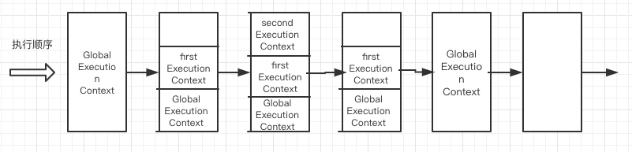

## 简介

`this`如论是在平常开发中，还是在面试时都是经常会听到，所以有了这篇文章来更系统的记录`this`从产生到使用。到最后会有一整篇的面试题来介绍`this`。

`this`是在什么时候产生的呢？`this`的作用是什么，首先要知道一个概念就是`执行上下文`。要了解清楚`执行上下文`，又要了解`"调用栈"`，要了解调用栈，又要了解`作用域`中的`动态作用域`。其实后面还有`event loop`、`线程执行`等等，所以学无止境，回头是岸。

还是回到`"调用栈"`和`执行上下文`，首先了解这两个概念就能知道`this`是什么时候产生的，`this`是什么。

首先介绍几个概念：

- `ECS`: 执行环境栈，**Execution Context Stack**。
- `EC`: 函数执行环境（或执行上下文），**Execution Context**。
- `VO`: 变量对象，**variable Object**。
- `AO`: 活动对象，**Active Object**。
- `S`: 作用域，**Scope**。
- `SC`: 作用域链，**Scope Chain**。

首先`执行栈`中包含`执行上下文`，`执行上下文`中包含有`活动变量`、`变量对象`、`作用域`，一层一层的作用域又会形成`作用域链`。它们之间都是有关联的。

## “调用栈”

什么是`调用栈`其实也是常说的`执行栈`，它其实应该叫做`执行上下文堆栈`会更准确一些。我们还是把它简称为`执行栈`。
因为JavaScript解释器被实现为单线程。这意味着`JavaScript 引擎`只能同时执行一件事，其它需要执行的事情会被放到一个栈里面储存，这个栈就叫做`执行栈`。
`执行栈`是一种拥有`LIFO（后进先出）`数据结构的栈，被用来存储代码运行时创建的所有执行上下文。

### 执行栈执行过程

当 `JavaScript 引擎`第一次遇到你的脚本时，它会创建一个`全局`的`执行上下文`并且压入当前`执行栈`。每当引擎遇到一个函数调用，它会为该函数创建一个`新的执行上下文并`压入栈的`顶部`。

引擎会执行那些`执行上下文位于栈顶的函数`。当该函数执行结束时，执行上下文`从栈中弹出`，控制流程到达当前栈中的下一个上下文。

首先我们看一张比较经典的图。


一个简单的实例，代码如下：

```js
    let name = "global name";

    function first () {
        console.log('inside first function');
        second();
    }
    function second () {
        console.log('inside second function');
        three();
    }
    first();
    console.log('inside global Execution Context');
```

执行效果如下图所示：



当上述代码在浏览器加载时，`JavaScript 引擎`创建了一个`全局执行上下文`并把它压入当前`执行栈`。当遇到 `first()` 函数调用时，`JavaScript 引擎`为该函数`创建`一个新的`执行上下文`并把它压入`当前执行栈`的顶部。

当从 `first()` 函数内部调用 `second()` 函数时，`JavaScript 引擎`为 `second()` 函数创建了一个`新的执行上下文`并把它压入当前`执行栈的顶部`。当 `second()` 函数执行完毕，它的`执行上下文`会从当前栈`弹出`，并且控制流程到达下一个`执行上下文`，即 `first()` 函数的执行上下文。
当 `first()` 执行完毕，它的执行上下文从栈`弹出`，控制流程到达全局执行上下文。一旦所有代码执行完毕，JavaScript 引擎从当前栈中`移除`全局执行上下文。

有5个需要记住的关键点，关于**执行栈（调用栈）**：

- 单线程。
- 同步执行。
- 一个全局上下文。
- 无限制函数上下文。
- 每次函数被调用创建新的执行上下文，包括调用自己。

**一个在线实例**

因为代码太多了这里就不展示了，gif也比较大，所以只放了一个外国友人的在线实例。有兴趣的可以去看一下。

在线代码体验[执行栈执行过程](https://codepen.io/njmcode/pen/dMPmGq)，如果访问比较慢可以看[执行栈执行过程demo](https://github.com/Braveheartforyou/Blog-Static/tree/master/callStack)把代码下载到本地运行查看。

## 执行上下文周期

在上面执行栈整个过程中，我们知道每次调用函数时都会创建一个**执行上下文**，现在我们要了解在`JavaScript 引擎`内部是怎么创建**执行上下文**.
在创建完成之后会执行上下文，当执行完成之后会回收当前上下文。

创建执行上下文大致分为三步：

- 创建阶段
- 执行阶段
- 回收阶段

### 创建阶段

**创建阶段**

在每次执行函数时都会走`创建执行上下文`，创建上下文会经历下面这几个事件：

- 创建`作用域`并且形成`作用域链（Scope Chain）`：定义了变量的可访问范围，控制变量的生命周期。
- 创建`变量(variables)`、`函数(functions)`、`参数(arguments)`： 变量和函数在创建时都会存在`Hosting(变量提升)`，就是会提前到最前面声明，但是不赋值。
- 确定`this`的值：`this`的复杂之处就在于它不是声明时就能确定，一般情况来说它是调用时确定的。(箭头函数除外)

我看的有挺多文章的创建的整体顺序是不太一样的，我认为他的顺序是当前我文章中的顺序。会先创建`作用域`再会创建`变量`，最后确定`this`的值。

**伪代码**

```js
    executionContextObj = {
        'scopeChain': {// 作用域链},
        'variables': {// 变量、函数、参数},
        'this': {// 运行时才能确定}
    }
````

> 其实作用域的本质是一套规则，它定义了变量的可访问范围，控制变量的可见性和生命周期。

