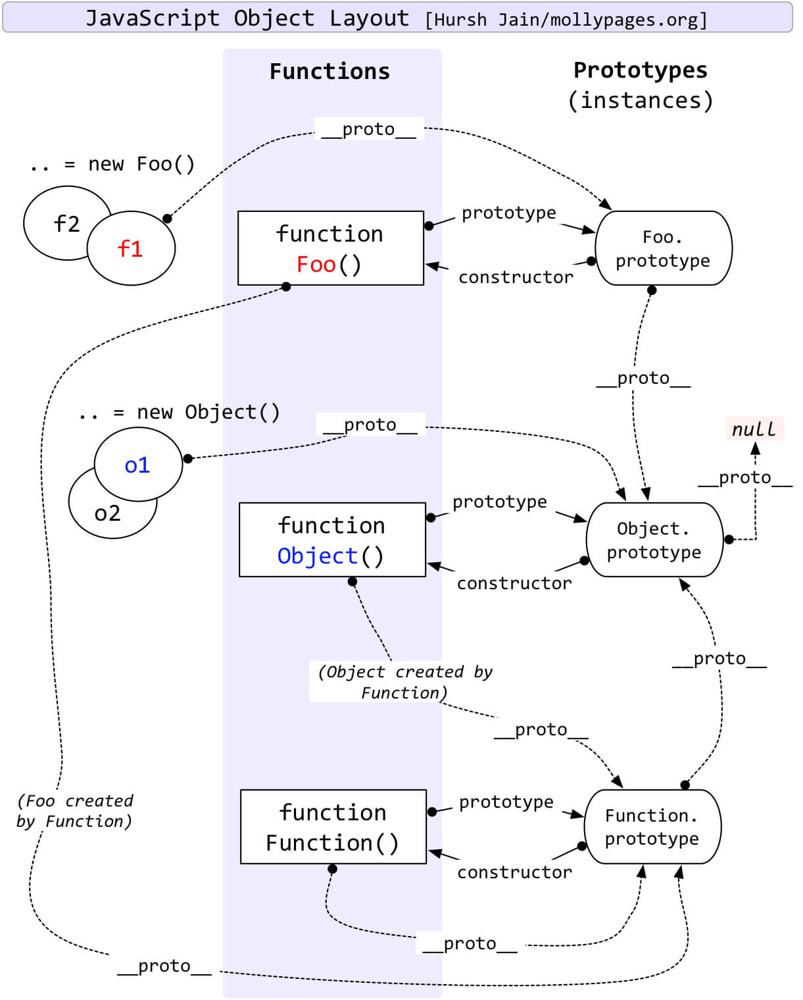

## 简介



在上一节上面介绍了原型和原型链，即每个对象拥有一个**原型对象**，通过 `__proto__` 指针指向上一个**原型** ，并从中**继承方法和属性**，同时原型对象也可能拥有原型，这样一层一层，最终指向 `null`，这种关系被称为`原型链(prototype chain)`。

`继承`是面向对象编程语言的一大核心功能点，`JavaScript`是面向对象的只不过是比较特殊的面向对象的语言。它不像`Java`是基于类的面向对象，而`javaScript`是基于`prototype`的面向对象。

会用一篇文章来介绍什么面向对象，`javascript`是怎么实现`继承`、`封装`、`多态`和`javascript`面向对象的特殊之处。

## 原型链继承

`JavaScript` 对象是动态的属性“包”（指其自己的属性）。`JavaScript` 对象有一个指向一个**原型对象**的链。当试图访问一个对象的属性时，它不仅仅在该对象上搜寻，还会搜寻该对象的原型，以及该对象的原型的原型，**依次层层**向上搜索，直到找到一个名字匹配的属性或到达原型链的末尾。

原型链继承的本质是**重写原型对象，代之以一个新类型的实例**。将父类的实例作为子类的原型。看下面代码：

```javascript
function SubType() {
  this.name = 'subtype';
}
SubType.prototype.getName = function () {
  return this.name;
};

function Sub() {}
// 将父类的实例作为子类的原型
Sub.prototype = new SubType();
var sub = new Sub();
sub.constructor === SubType; // true
Sub.prototype.constructor === SubType; // true
sub.name = 'sub';
console.log(sub.getName()); // sub
```

**优点**

- 基于原型的方法所有子类都可以复用

**缺点**

- 多个实例对引用类型的操作会被篡改
- 子类型的原型上的 constructor 属性被重写了
- 创建子类型实例时无法向父类型的构造函数传参

主要分析一下它的缺点暂时不分析它的优点。

### 引用类型被修改

因为本质上每个实例的`__proto__`都会指向构造函数的`prototype`，实例上都是保存了一个**引用地址**，所以当`prototype`中的引用类型修改所有实例都会被改变。在上面代码基础上修改如下：

```javascript
function SubType() {
  this.name = 'subtype';
}
SubType.prototype.getName = function () {
  return this.name;
};

SubType.prototype.Arr = ['sub', 'subtype', 'Sub'];
function Sub() {}
// 将父类的实例作为子类的原型
Sub.prototype = new SubType();
var sub = new Sub();
var sub1 = new Sub();
var sub2 = new Sub();

sub2.Arr.push('push');

sub1.Arr; // ["sub", "subtype", "Sub", "push"]
sub2.Arr; // ["sub", "subtype", "Sub", "push"]
```

在构造函数`SubType.prototype`新增`Arr`属性并且赋值为`['sub', 'subtype', 'Sub']`，通过`new`关键字实例化两个实例`sub1`、`sub1`,当修改了`sub2.Arr`的时候，`sub1.Arr`的也会被影响。

### 实例 constructor 被重写

子类型原型上的 `constructor` 属性被重写, 执行 `Sub.prototype = new SubType()` 后原型被覆盖，`Sub.prototype` 上丢失了 `constructor` 属性， `Sub.prototype` 指向了 `SubType.prototype`，而 `SubType.prototype.constructor` 指向了 `SubType`，所以 `Sub.prototype.constructor` 指向了 `SubType`。
如下图所示：


```javascript
function SubType() {
  this.name = 'subtype';
}
SubType.prototype.getName = function () {
  return this.name;
};

function Sub() {}
// 将父类的实例作为子类的原型
Sub.prototype = new SubType();
// 所有涉及到原型链继承的继承方式都要修改子类构造函数的指向，否则子类实例的构造函数会指向SuperType。
Sub.prototype.constrcutor = Sub;
var sub = new Sub();

Sub.prototype.constrcutor === Sub; // true
sub.__proto__.constrcutor === Sub; // true
```

通过`Sub.prototype.constrcutor = Sub;`把`Sub.prototype.constrcutor`指向`Sub`，如果所示：


> 给子类型原型添加属性和方法必须在替换原型之后，原因在第二点已经解释过了，因为子类型的原型会被覆盖。

### 属性遮蔽

在`Sub.prototype`上添加`getName`方法，当调用`sub`上得`getName`时，访问到的是`Sub.prototype.getName`而不是访问到`SubType.prototype.getName`，这种情况称为**属性遮蔽（property shadowing）**。

```javascript
function SubType() {
  this.name = 'subtype';
}
SubType.prototype.getName = function () {
  return this.name;
};

function Sub() {}
// 将父类的实例作为子类的原型
Sub.prototype = new SubType();
// 所有涉及到原型链继承的继承方式都要修改子类构造函数的指向，否则子类实例的构造函数会指向SuperType。
Sub.prototype.constrcutor = Sub;
// 添加getName属性
Sub.prototype.getName = function () {
  return 'Sub.prototype.getName';
};

var sub = new Sub();

sub.getName(); // Sub.prototype.getName
```

可以通过`__proto__`调用原型链上的属性即可。

```javascript
console.log(sub.__proto__.__proto__.getName()); // undefined
```

## 实现一个 new

---

```javascript
function create() {
  // 创建一个空对象
  let obj = new Object();
  // 获取第一个参数，构造函数
  let Preson = [].shift.call(arguments);
  // 链接该对象（即设置该对象的构造函数）到另一个对象；
  obj.__proto__ = Preson.prototype;
  // 绑定this指向，执行构造函数
  let result = Preson.apply(obj, arguments);
  return typeof result === 'object' ? result : obj;
}
```

在这里不多做赘述了，详细内容我另一片博客[javascript 中实现一个自己的 new](/blog/javascript/javascript-extends.html)

## 总结

- 每个对象拥有一个原型对象，通过`__proto__` 指针指向上一个原型 ，并从中**继承方法和属性**，同时原型对象也可能拥有原型，这样一层一层，最终指向 `null`，这种关系被称为 **原型链**。
- 当访问一个对象的属性 / 方法时，它不仅仅在该对象上查找，还会查找该对象的原型，以及该对象的原型的原型，**一层一层向上查找**，直到找到一个名字匹配的属性 / 方法或到达原型链的末尾**null**。
- 原型链的构建依赖于 `__proto__`，一层一层最终链接到 `null`。
- `instanceof` 原理就是一层一层查找 `__proto__`，如果和 `constructor.prototype` 相等则返回 `true`，如果一直没有查找成功则返回 `false`。
- 原型链继承的本质是**重写原型对象，代之以一个新类型的实例**。

## 参考

[对象原型](https://developer.mozilla.org/zh-CN/docs/Learn/JavaScript/Objects/Object_prototypes)
[继承与原型链](https://developer.mozilla.org/zh-CN/docs/Web/JavaScript/Inheritance_and_the_prototype_chain)
[图解原型链及其继承优缺点](https://www.muyiy.cn/blog/5/5.2.html#%E5%BC%95%E8%A8%80)
[一篇文章理解 JS 继承](https://mp.weixin.qq.com/s/oEyMZl-7q3pczK1GpnoqSA)
