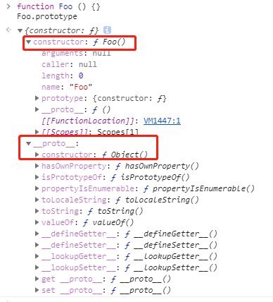
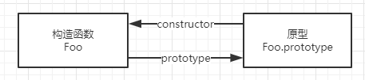
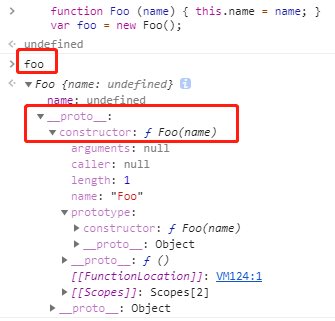
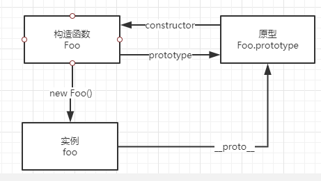
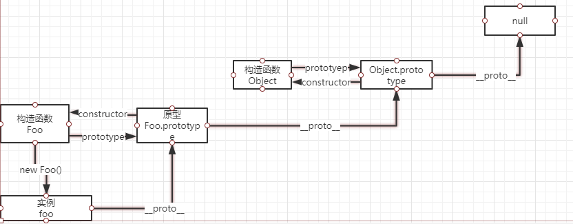

## 简介

首先要了解几个属性`constructor`、`prototype`、`[[prototype]]`、`__proto__`分别作用是什么，还要理解几个概念**原型**、**原型链**、**构造函数**。

结合代码先把上面的的属性和记录清楚。

## 构造函数

`constrcutor`是一种用于创建和初始化`class`创建的对象的特殊方法。
`构造函数`本身就是一个函数，与普通函数`没有`任何区别，不过为了规范一般将其`首字母`大写。`构造函数`和`普通函数`的区别在于，使用 `new` 生成实例的函数就是`构造函数`，直接调用的就是`普通函数`。下面示例代码：

```javascript
function ConstructorFun(name) {
  this.name = name;
}
// 通过new关键字创建实例
let constructorfun = new ConstructorFun();
```

其实`ConstructorFun`就是一个普通函数，但是在通过`new`关键字生成实例的时候，就可以把这个函数叫做**构造函数**;

### constructor

除了`null`、`undefined`其他无论是通过`new`生成的实例，还是通过字面量生成的**变量**，普通的函数都是有`constructor`属性的。

代码如下：

```javascript
function ConstructorFun(name) {
  this.name = name;
}
// 通过new关键字创建实例
var constructorfun = new ConstructorFun();
constructorfun.constructor === ConstructorFun; // true
var number = 111;
console.log(number.constructor); // ƒ Number() { [native code] }
```

### 构造函数扩展

- `let a = {}` 其实是 `let a = new Object()` 的语法糖
- `let a = []` 其实是 `let a = new Array()` 的语法糖
- `function Foo()`{ … } 其实是 var Foo = new Function(…)
- **可以使用 `instanceof` 判断一个函数是否为一个变量的构造函数**

手动实现一个`instanceof`函数如下：

```javascript
// 模拟实现instanceof
function selfInstanceof(left, right) {
  //left 表示左表达式，right 表示右表达式
  let cur = left.__proto__; // 取的cur的隐式原型
  let parent = right.prototype; // 取的right的显式原型
  while (true) {
    if (cur === null) {
      // 如果cur为null 直接返回false
      return false;
    }
    if (cur === parent) {
      // 如果cur与parent相同 返回true
      return true;
    }
    cur = cur.__proto__; // 上面两个条件都不满足，继续向上一层原型链查找
  }
}
```

### constructor 的值是否可更改

**对于引用类型来说`constructor` 属性值是可以修改的，但是对于基本类型来说是只读的。**

> 注意：`null` 和 `undefined` 是没有 `constructor` 属性的。

## 原型

官方解释原型："JavaScript 常被描述为一种**基于原型的语言（prototype-based language）**————每个对象拥有一个**原型对象**，对象以其原型为模板、从原型继承方法和属性。"
每个函数都有一个特殊的属性就叫作`原型（prototype）`，请看下面代码：

```javascript
function Foo() {}
console.log(Foo.prototype);
```

效果如下图所示：

`Foo.prototype`上有两个属性，一个是`constructor`它指向了函数本身；另一个是`__proto__`它指向了`Object.prototype`。

构造函数`Foo`有一个指向原型的指针，原型`Foo.prototype`有一个指向构造函数的指针`Foo.prototype.constructor`，用下面的图来表示更清晰一点：


其实更重要的是任何一个`prototype`对象都有一个`constructor`属性，指向这个构造函数。

### **proto**

在上面看到`__proto__`这个属性，每个实例对象（object）都有一个`隐式原型`属性(称之为`__proto__`)指向了创建该对象的构造函数的`原型`。

```javascript
function Foo(name) {
  this.name = name;
}
var foo = new Foo();
```

效果图如下：


当通过`new Foo()`生成的实例对象`foo`，它有一个`__proto__`属性指向`Foo.prototype`，可以通过以下代码验证：

```javascript
foo.__proto__ === Foo.prototype; // true
```

`Foo`、`Foo.prototype`、`Foo.prototype.constructor`、`foo.__proto__`三者的关系如下图所示：



`__proto__` 属性在 ES6 时才被标准化，以确保 Web 浏览器的兼容性，但是不推荐使用，除了标准化的原因之外还有性能问题。为了更好的支持，推荐使用 `Object.getPrototypeOf()`。

> 通过改变一个对象的 `[[Prototype]]` 属性来改变和继承属性会对性能造成非常严重的影响，并且性能消耗的时间也不是简单的花费在 `obj.__proto__ = ...` 语句上, 它还会影响到所有继承自该 `[[Prototype]]` 的对象，如果你关心性能，你就不应该修改一个对象的 `[[Prototype]]`。

如果要读取或修改对象的 `[[Prototype]]` 属性，建议使用如下方案，但是此时设置对象的 `[[Prototype]]` 依旧是一个缓慢的操作，如果性能是一个问题，就要避免这种操作。

```javascript
// 获取
Object.getPrototypeOf();
Reflect.getPrototypeOf();

// 修改
Object.setPrototypeOf();
Reflect.setPrototypeOf();
```

如果要创建一个新对象，同时继承另一个对象的 `[[Prototype]]` ，推荐使用 `Object.create()`。

```javascript
function Parent() {
  age: 50;
}
var p = new Parent();
var child = Object.create(p);
```

### [[Prototype]]

`[[Prototype]]` 是对象的一个内部属性，外部代码无法直接访问。

> 遵循 ECMAScript 标准，`someObject.[[Prototype]]` 符号用于指向 someObject 的**原型**

## 原型链

---

每个对象拥有一个原型对象，通过 `__proto__` 指针指向上一个原型 ，并从中继承方法和属性，同时原型对象也可能拥有原型，这样一层一层，最终指向 `null`。这种关系被称为`原型链 (prototype chain)`，通过原型链一个对象会拥有定义在其他对象中的属性和方法。看一面一张经典的图可能更直观：


看一下面的代码：

```javascript
function Foo() {}
var foo = new Foo();
foo.__proto__ === Foo.prototype; // true
foo.__proto__.__proto__ === Object.prototype; // true
foo.__proto__.__proto__.__proto__ === null; // true
```

下面的图可以很好的展示上面的代码`prototype`和`__proto__`指向问题。


## 特殊的 Symbol

`Symbol`是基础数据类型，它可以通过`Symbol(123)`生成实例，不能通过`new Symbol()`生成实例，`Symbol`不是构造函数，但是它有`constructor`属性。

```javascript
let sSymbol = Symbol('symbol');
let errSymbol = new Symbol('symbol'); // Uncaught TypeError: Symbol is not a constructor

Symbol.constructor; // ƒ Symbol() { [native code] }
```

## 总结

- 每一个函数对象都有一个`prototype`属性，指向函数对象的原型，原型对象上有一个`constructor`属性指向**构造函数**本身。
- 引用类型 `constructor` 属性值是可以**修改**的，但是对于基本类型来说是**只读**的，当然 `null` 和 `undefined` 没有 `constructor` 属性。
- `__proto__` 属性在 `ES6` 时被标准化，但因为性能问题并不推荐使用，推荐使用 `Object.getPrototypeOf()`。
- `__proto__` 是每个实例上都有的属性，`prototype` 是构造函数的属性，在实例上并不存在，所以这两个并不一样，但 `foo.__proto__` 和 `Foo.prototype` 指向同一个对象。
- 每个对象拥有一个原型对象，通过`__proto__`指针指向上一个原型 ，并从中继承方法和属性，同时原型对象也可能拥有原型，这样一层一层，最终指向 `null`，这就是原型链。

## 参考

[重新认识构造函数、原型和原型链](https://www.muyiy.cn/blog/5/5.1.html#%E5%BC%95%E8%A8%80)
[JS 系列二：原型与原型链](https://mp.weixin.qq.com/s/y49klI7seb3tlP4hx2A_Lg)
[对象原型](https://developer.mozilla.org/zh-CN/docs/Learn/JavaScript/Objects/Object_prototypes)
