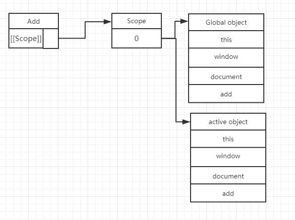

## 全局作用域

在代码中任何地方都能访问到的对象拥有全局作用域，一般来说以下几种情形拥有全局作用域：

### 最外层的函数、变量拥有全局作用域

```javascript
var sGl = '全局变量';
function fGL() {
  var _sGl = '局部变量';
  console.log(_sGl);
}
console.log(sGl); // 全局变量
fGL(); // 局部变量
```

### 没有使用 var 关键字声明的变量也都是全局变量。

```javascript
function fun() {
  name = '全局变量';
  alert(name);
}
console.log(name); // 输出:全局变量
```

### 所有 window 对象的属性拥有全局作用域

## 词法作用域

词法作用域：`函数在定义它们的作用域里运行，而不是在执行它们的作用域里运行。`也就是说词法作用域取决于源码，通过静态分析就能确定，因此`词法作用域也叫做静态作用域`
在通常情况下，变量的查询从最近接的绑定上下文开始，向外部逐渐扩展，直到查询到第一个绑定，一旦完成查找就结束搜索。

```javascript
var gl = '全局变量';
function fGl() {
  var gl = '局部变量';
  console.log(gl);
}
fGl(); // 局部变量
```

## 动态作用域

在编程实践中，最容易低估和过度滥用的概念就是动态作用域，因为很少有语言支持这种方式为绑定解析方案。

动态作用域与词法作用域相对而言的，不同于词法作用域在定义时确定，`动态作用域在执行时确定，其生存周期到代码片段执行为止`。动态变量存在于动态作用域中，`任何给定的绑定的值，在确定调用其函数之前，都是不可知的`。

在代码执行时，对应的作用域链常常是保持静态的。然而当遇到 with 语句、call 方法、apply 方法和 try-catch 中的 catch 时，会改变作用域链的。以 with 为例，在遇到 with 语句时，会将传入的对象属性作为局部变量来显示，使其便于访问，也就是说把一个新的对象添加到了作用域链的顶端，这样必然影响对局部标志符的解析。`当 with 语句执行完毕后，会把作用域链恢复到原始状态`。实例如下：

```javascript
var name = 'global';

// 使用with之前
console.log(name); // 输出:global

with ({ name: 'jeri' }) {
  console.log(name); // 输出:jeri
}

// 使用with之后，作用域链恢复
console.log(name); // 输出:global
```

在作用域链中有动态作用域时，this 引用也会变得更加复杂，不再指向第一次创建时的上下文，而是由调用者确定。比如在使用 apply 或 call 方法时，传入它们的第一个参数就是被引用的对象。实例如下：

```javascript
function globalThis() {
  console.log(this);
}

globalThis(); // 输出:Window {document: document,external: Object…}
globalThis.call({ name: 'jeri' }); // 输出:Object {name: "jeri"}
globalThis.apply({ name: 'jeri' }, []); // 输出:Object {name: "jeri"}
```

## 函数作用域

函数作用域，顾名思义就是在定义函数时候产生的作用域，这个作用域也可以称为`局部作用域`。和全局作用域相反，函数作用域一般只在函数的代码片段内可访问到，外部不能进行变量访问。在函数内部定义的变量存在于函数作用域中，其生命周期随着函数的执行结束而结束。实例如下：

```javascript
var name = 'global';
function fun() {
  var name = 'jeri';
  console.log(name); // 输出:jeri

  with ({ name: 'with' }) {
    console.log(name); // 输出:with
  }
  console.log(name); // 输出:jeri
}

fun();

// 不能访问函数作用域
console.log(name); // 输出:global
```

## 作用域链

在 JavaScript 中，`函数也是对象`，实际上，JavaScript 里`一切`都是`对象`。函数对象和其它对象一样，拥有可以通过代码访问的属性和一系列仅供 JavaScript 引擎访问的内部属性。其中一个内部属性是`[[Scope]]`，由 ECMA-262 标准第三版定义，该内部属性包含了`函数被创建的作用域中对象的集合，这个集合被称为函数的作用域链`，`它决定了哪些数据能被函数访问`。`它用来保证对执行环境有权访问的变量和函数的有序访问`。
当一个函数创建后，它的作用域会被创建此函数的作用域中可访问的数据对象填充

```javascript
function add(num1, num2) {
  var sum = num1 + num2;
  return sum;
}
```


```javascript
var total = add(5, 10);
```

执行此函数时会创建一个称为“运行期上下文(execution context)”的内部对象，运行期上下文定义函数执行的环境。每个运行期上下文都有自己的作用域链，用于标识符解析，当运行期上下文被创建时，而它的作用域链初始化为当前运行函数的[[Scope]]所包含的对象。
这些值按照它们出现在函数中的顺序被复制到运行期的上下文的作用域中，它们共同组成一个新的对象，叫“活动对象(activation object)”,该对象包含了函数的所有局部变量、命名参数、参数集合以及 this,然后此对象会被推入作用域链前端，当运行期上下文被销毁时，活动对象也随之销毁。

在全局作用域中创建的函数,其作用域链会自动成为作用域中的一员。而当函数执行时,其活动对象就会成为作用域中的第一个对象。

```javascript
var name = 'global';

function fun() {
  console.log(name); // output:global
  name = 'change';
  // 函数内部可以修改全局变量
  console.log(name); // output:change
  // 先查询活动对象
  var age = '18';
  console.log(age); // output:18
}

fun();

// 函数执行完毕，执行环境销毁
console.log(age); // output:Uncaught ReferenceError: age is not defined
```

## 闭包

闭包是 JavaScript 的一个比较重要的东西，关于这个问题有很多文章进行讲述，然而依然有相当数量的程序员对这个概念理解不透彻，我就是其中一个，闭包报的官方定义为：`一个拥有许多变量和绑定了这些变量的环境的表达式（通常是一个函数），因而这些变量也该是表达式的一部分`。 一句话概括就是：`闭包就是一个函数，捕获作用域内的外部绑定`。这些绑定是为之后使用而被绑定，即使作用域已经销毁。

### 自由变量

`自由变量与闭包的关系是，自由变量闭合于闭包的创建`。闭包背后的逻辑是，如果一个函数内部有其他函数，那么这些内部函数可以访问在这个外部函数中声明的变量（这些变量就称之为自由变量）。然而，这些变量可以被内部函数捕获，从高阶函数（返回另一个函数的函数称为高阶函数）中 return 语句实现“越狱”，以供以后使用。内部函数在没有任何局部声明之前（既不是被传入，也不是局部声明）使用的变量就是被捕获的变量。

```javascript
function makeAdder(captured) {
  return function (free) {
    var ret = free + captured;
    console.log(ret);
  };
}

var add10 = makeAdder(10);

add10(2); // 输出:12
```

从上例可知，外部函数中的变量 captured 被执行加法的返回函数捕获，内部函数从未声明过 captured 变量，却可以引用它。
如果我们再创建一个加法器将捕获到同名变量 captured，但有不同的值，因为这个加法器是在调用 makeAdder 之后被创建：

```javascript
var add16 = makeAdder(16);
add16(18); // 输出:34
add10(10); // 输出:20
```

每一个新的加法器函数都保留了自己创建时捕获的 captured 实例。

### 变量遮蔽

`在 JavaScript 中，当变量在一定作用域内声明，然后在另一个同名变量在一个较低的作用域声明，会发生变量的遮蔽`。实例如下：

```javascript
var name = 'jeri';
var name = 'tom';

function glbShadow() {
  var name = 'fun';

  console.log(name); // 输出:fun
}

glbShadow();

console.log(name); // 输出:tom
```

当在一个变量同一作用域内声明了多次时，最后一次声明会生效，会遮蔽以前的声明。

变量声明的遮蔽很好理解，然而`函数参数的遮蔽就略显复杂`。例如：

```javascript
var shadowed = 0;

function argShadow(shadowed) {
  var str = ['Value is', shadowed].join(' ');
  console.log(str);
}

argShadow(108); // output:Value is 108

argShadow(); // output:Value is
```

函数 argShadow 的参数 shadowed 覆盖了全局作用域内的同名变量。即使没有传递任何参数，仍然绑定的是 shadowed，并没有访问到全局变量 shadowed = 0。
`任何情况下，离得最近的变量绑定优先级最高`。实例如下：

```javascript
var shadowed = 0;

function varShadow(shadowed) {
  var shadowed = 123;
  var str = ['Value is', shadowed].join(' ');
  console.log(str);
}

varShadow(108); // output:Value is 123

varShadow(); // output:Value is 123
```

varShadow(108)打印出来的并不是 108 而是 123，即使没有参数传入也是打印的 123，先访问离得最近的变量绑定。
遮蔽变量同样发生在闭包内部，实例如下：

```javascript
function captureShadow(shadowed) {
  console.log(shadowed); // output:108

  return function (shadowed) {
    console.log(shadowed); // output:2
    var ret = shadowed + 1;
    console.log(ret); // output:3
  };
}

var closureShadow = captureShadow(108);

closureShadow(2);
```

典型的误区

```javascript
var test = function () {
  var ret = [];

  for (var i = 0; i < 5; i++) {
    ret[i] = function () {
      return i;
    };
  }

  return ret;
};
var test0 = test()[0]();
console.log(test0); // 输出：5

var test1 = test()[1]();
console.log(test1); //输出：5
```

从上面的例子可知，test 这个函数执行之后返回一个函数数组，表面上看数组内的每个函数都应该返回自己的索引值，然而并不是如此。当外部函数执行完毕后，外部函数虽然其执行环境已经销毁，但闭包依然保留着对其中变量绑定的引用，仍然驻留在内存之中。当外部函数执行完毕之后，才会执行内部函数，而这时内部函数捕获的变量绑定已经是外部函数执行之后的最终变量值了，所以这些函数都引用的是同一个变量 i=5。
另一个例子：

```javascript
for (var i = 0; i < 5; i++) {
  setTimeout(function () {
    console.log(i);
  }, 1000);
}

// 每隔1秒输出一个5
```

按照我们的推断，上例应该输出 1,2,3,4,5。然而，事实上输出的是连续 5 个 5。为什么出现这种诡异的状况呢？其本质上还是由闭包特性造成的，闭包可以捕获外部作用域的变量绑定。
上面这个函数片段在执行时，其内部函数和外部函数并不是同步执行的，因为当调用 setTimeout 时会有一个延时事件排入队列，等所有同步代码执行完毕后，再依次执行队列中的延时事件，而这个时候 i 已经 是 5 了。

那怎么解决这个问题呢？我们是不是可以在每个循环执行时，给内部函数传进一个变量的拷贝，使其在每次创建闭包时，都捕获一个变量绑定。因为我们每次传参不同，那么每次捕获的变量绑定也是不同的，也就避免了最后输出 5 个 5 的状况。实例如下：

```javascript
for (var i = 0; i < 5; i++) {
  (function (j) {
    setTimeout(function () {
      console.log(j);
    }, 1000);
  })(i);
}
```

闭包具有非常强大的功能，函数内部可以引用外部的参数和变量，但其参数和变量不会被垃圾回收机制回，常驻内存，会增大内存使用量，使用不当很容易造成内存泄露。但，闭包也是 javascript 语言的一大特点，主要应用闭包场合为：`设计私有的方法和变量`。

### 模拟私有变量

从上文的叙述我们知道，变量的捕获发生在创建闭包的时候，那么我们可以把闭包捕获到的变量做为私有变量。实例如下：

```javascript
var closureDemo = (function () {
  var PRIVATE = 0;
  return {
    inc: function (n) {
      return (PRIVATE += n);
    },
    dec: function (n) {
      return (PRIVATE -= n);
    }
  };
})();
var testInc = closureDemo.inc(10);
console.log(testInc); // 10

var testDec = closureDemo.dec(7);
console.log(testDec); // 3

closureDemo.div = function (n) {
  return PRIVATE / n;
};

var testDiv = closureDemo.div(3);
console.log(testDiv);
//输出：Uncaught ReferenceError: PRIVATE is not defined
```

自执行函数 closureDemo 执行完毕之后，自执行函数作用和 PRIVATE 变量随之销毁，但 PRIVATE 仍滞留在内存中，也就是加入了到了 closureDemo.inc 和 closureDemo.dec 的作用域链中，闭包也就完成了变量捕获。但之后新加入的 closureDemo.div 并不能在作用域中继续寻找到 PRIVATE 了。因为，函数只有被调用时才会执行函数里面的代码，变量的捕获也只发生在创建闭包时，所以之后新加入的 div 方法并不能捕获 PRIVATE。

### 创建特权方法

通过闭包我们可以创建私有作用域，那么也就可以创建私有变量和私有函数。创建私有函数的方式和声明私有变量方法一致，只要在函数内部声明函数就可以了。当然，既然可以模拟私有变量和私有函数，我们也可以利用闭包这个特性，创建特权方法。实例如下：

```javascript
(function () {
  // 私有变量和私有函数
  var privateVar = 10;

  function privateFun() {
    return false;
  }

  MyObj = function () {};
  MyObj.prototype.pubulicMethod = function () {
    privateVar++;
    return privateFun();
  };
})();
```

上面这个实例创建了一个私有作用域，并封装了一个构造函数和对应的方法。需要注意的是在上面的实例中，在声明 MyObj 这个函数时，使用的是不带 var 的函数表达式，我们希望产生的是一个全局函数而不是局部的，不然我们依然在外部无法访问。所以，MyObj 就成为了一个全局变量，能够在外部进行访问，我们在原型上定义的方法 publicMethod 也就可以使用，通过这个方法我们也就可以访问私有函数和私有变量了。

## 参考

[http://www.cnblogs.com/syfwhu/p/4839562.html](http://www.cnblogs.com/syfwhu/p/4839562.html)
