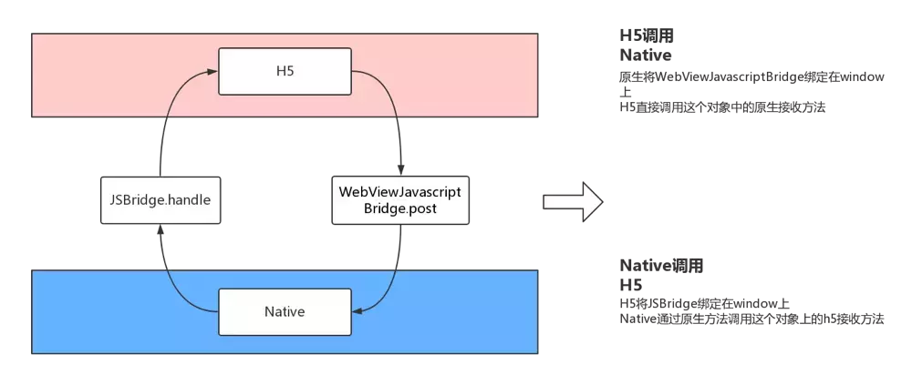
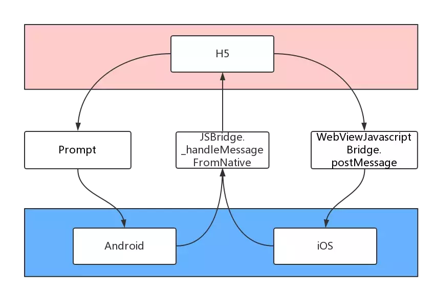

## 简介
**JSBridge**
听其取名就是js和Native之前的桥梁，而实际上JSBridge确实是JS和Native之前的一种通信方式。混合开发，最重要的问题是：**H5和Native的双向通信**。

**JSBridge 的实现原理**
`JavaScript` 是运行在一个单独的 <font color="#ff502c">JS Context</font> 中（例如，<font color="#ff502c">WebView</font> 的 <font color="#ff502c">Webkit</font> 引擎、<font color="#ff502c">JSCore</font>）。由于这些 <font color="#ff502c">Context </font>与原生运行环境的天然隔离，我们可以将这种情况与 <font color="#ff502c">RPC</font>（Remote Procedure Call，远程过程调用）通信进行类比，将 <font color="#ff502c">Native</font> 与 <font color="#ff502c">JavaScript</font> 的每次互相调用看做一次 <font color="#ff502c">RPC</font> 调用。
在 <font color="#ff502c">JSBridge </font>的设计中，可以把前端看做 <font color="#ff502c">RPC</font> 的客户端，把 <font color="#ff502c">Native</font> 端看做 <font color="#ff502c">RPC</font> 的服务器端，从而 <font color="#ff502c">JSBridge</font> 要实现的主要逻辑就出现了：通信调用（<font color="#ff502c">Native </font>与 <font color="#ff502c">JS</font> 通信） 和 句柄解析调用。（如果你是个前端，而且并不熟悉 <font color="#ff502c">RPC </font>的话，你也可以把这个流程类比成 JSONP 的流程）

流程如下图所示：

<!--  -->

## H5和NA的双向通信通用方法
H5通信方式和兼容性如下表所示。指的是借助Native的webview加载H5页面，H5和NA之间通过API、URL拦截、全局调用等形式，实现消息通信。

### H5调用NA方法

| 平台 | 方法 | 备注 |
|:----------:|:-------------:|:-------------:|
| Android | shouldOverrideUrlLoading | 	scheme拦截方法 |
| Android | addJavascriptInterface |  |
| Android | onJsAlert()、onJsConfirm()、onJsPrompt（） |  |
| IOS | 拦截URL |  |
| IOS(UIwebview) | JavaScriptCore | API方法，IOS7+ 支持 |
| IOS(WKwebview) | window.webkit.messageHandlers | 	API方法，IOS7+ 支持 |

### NA调用H5方法

| 平台 | 方法 | 备注 |
|:----------:|:-------------:|:-------------:|
| Android | loadurl() | Android 4.4 + |
| Android | evaluateJavascript() |  |
| IOS(UIwebview) | stringByEvaluatingJavaScriptFromString |  |
| IOS(UIwebview) | JavaScriptCore | IOS7.0+  |
| IOS(UIwebview) | evaluateJavaScript:javaScriptString | iOS8.0+ |

## 常用的JSBridge形式
- <font color="#ff502c">H5调Android</font>-原生通过<font color="#ff502c">addJavascriptInterface</font>注册，然后H5直接调用
- <font color="#ff502c">Android调H5</font>-原生通过<font color="#ff502c">loadUrl</font>来调用H5，`4.4`及以上还可以通过<font color="#ff502c">evaluateJavascript</font>调用
- <font color="#ff502c">H5调iOS</font>-原生通过<font color="#ff502c">JavaScriptCore</font>注册（需ios7以上），然后H5直接调用
- <font color="#ff502c">iOS调H5</font>-通过<font color="#ff502c">stringByEvaluatingJavaScriptFromString</font>
- 改写浏览器原有对象
- <font color="#ff502c">url scheme</font>交互

### H5调Android
JSInterface是安卓4.2-官方推荐的解决方案，JSInterface在4.2之前的版本都可以，但是存在严重的安全隐患，容易被利用提权。实现如下：
首先，原声webview需要先注册可供前端调用的JS函数：
```javascript
    WebSettings webSettings = mWebView.getSettings();  
    //Android容器允许JS脚本
    webSettings.setJavaScriptEnabled(true);
    private Object getJSBridge(){  
        Object insertObj = new Object(){  
            @JavascriptInterface
            public String foo(){  
                return "foo";  
            }  
            
            @JavascriptInterface
            public String foo2(final String param){  
                return "foo2:" + param;  
            }  
            
        };  
        return insertObj;  
    }
    //Android容器设置侨连对象
    mWebView.addJavascriptInterface(getJSBridge(), "JSBridge");
```
Native中通过addJavascriptInterface添加暴露出来的JS桥对象,然后再该对象内部声明对应的API方法。

**H5调用Native的方法**
```javascript
    //调用方法一
    window.JSBridge.foo(); //返回:'foo'
    //调用方法二
    window.JSBridge.foo2('test');//返回:'foo2:test'
```
> - 在Android4.2以上(api17后),暴露的api要加上注解@JavascriptInterface，否则会找不到方法。
  - 在api17以前,addJavascriptInterface有风险,hacker可以通过反编译获取Native注册的Js对象， 然后在页面通过反射Java的内置静态类，获取一些敏感的信息和破坏
  - JS调用Native暴露的api,并且能得到相应返回值

### Android调H5
native调用js比较简单，只要遵循："javascript: 方法名('参数,需要转为字符串')"的规则即可。

**在`4.4`版本之前**
```javascript
    // mWebView = new WebView(this);             
    mWebView.loadUrl("javascript: 方法名('参数,需要转为字符串')"); 
    //ui线程中运行
    runOnUiThread(new Runnable() {  
        @Override  
        public void run() {  
            mWebView.loadUrl("javascript: 方法名('参数,需要转为字符串')");  
            Toast.makeText(Activity名.this, "调用方法...", Toast.LENGTH_SHORT).show();  
        }  
    });  
```
**在4.4及以后（包括）**
```javascript
// 异步执行JS代码,并获取返回值    
mWebView.evaluateJavascript("javascript: 方法名('参数,需要转为字符串')", new ValueCallback<String>() {
    @Override
    public void onReceiveValue(String value) {
        // 这里的value即为对应JS方法的返回值
    }
});

```
> - 4.4之前Native通过loadUrl来调用JS方法,只能让某个JS方法执行,但是无法获取该方法的返回值
  - 4.4及之后,通过evaluateJavascript异步调用JS方法,并且能在onReceiveValue中拿到返回值
  - mWebView.loadUrl(“javascript: 方法名(‘参数,需要转为字符串’)”); 函数需在UI线程运行，因为mWebView为UI控件(但是有一个坏处是会阻塞UI线程)

### H5调iOS
Native中通过引入官方提供的JavaScriptCore库(iOS7以上),然后可以将api绑定到JSContext上(然后Html中JS默认通过window.top.*可调用)。
以OC为例：
```javascript
    #import <JavaScriptCore/JavaScriptCore.h>
    -(void)webViewDidFinishLoad:(UIWebView *)webView{
        [self hideProgress];
        [self setJSInterface];
    }

    -(void)setJSInterface{
        JSContext *context =[_wv valueForKeyPath:@"documentView.webView.mainFrame.javaScriptContext"];
        // 注册名为foo的api方法
        context[@"foo"] = ^() {
            //获取参数
            NSArray *args = [JSContext currentArguments];
            NSString *title = [NSString stringWithFormat:@"%@",[args objectAtIndex:0]];
            //做一些自己的逻辑
            //返回一个值  'foo:'+title
            return [NSString stringWithFormat:@"foo:%@", title];
        };    
    }          
```
H5调用IOS方法：
```javascript
    window.top.foo('test');
```
> - iOS7之前，js无法直接调用Native,只能通过urlscheme方式间接调用
  - JS能调用到已经暴露的api,并且能得到相应返回值
  - iOS原生本身是无法被JS调用的,但是通过引入官方提供的第三方"JavaScriptCore",即可开放api给JS调用

### iOS调H5
Native调用js的方法比较简单，Native通过stringByEvaluatingJavaScriptFromString调用Html绑定在window上的函数。不过应注意Oc和Swift的写法。
```javascript
    // 可以取得JS函数执行的返回值
    // 方法必须是Html页面绑定在最顶层的window上对象的
    // 如window.top.foo
    // Swift
    webview.stringByEvaluatingJavaScriptFromString("方法名(参数)")
    // OC
    [webView stringByEvaluatingJavaScriptFromString:@"方法名(参数);"];
```
> - Native调用JS方法时,能拿到JS方法的返回值
  - 不适合传输大量数据(大量数据建议用接口方式获取)
  - 有iframe时，需要获取顶层窗口的引用

### 改写浏览器原有对象
改写window上的四种方法，然后拦截固定规则的参数分发给Java对应的方法处理：
- alert，可以被webview的onJsAlert监听
- confirm，可以被webview的onJsConfirm监听
- console.log，可以被webview的onConsoleMessage监听
- prompt，可以被webview的onJsPrompt监听
prompt简单举例说明，Web页面通过调用`prompt()`方法，安卓客户端通过监听`onJsPrompt`事件，拦截传入的参数，如果参数符合一定协议规范，那么就解析参数，扔给后续的Java去处理。这种协议规范，最好是跟iOS的协议规范一样，这样跨端调起协议是一致的，但具体实现不一样而已。比如：`hybrid://action?arg1=1` 这样的协议，而其他格式的`prompt`参数，是不会监听的，即除了`hybrid://action?arg1=1` 这样的规范协议，`prompt`还是原来的`prompt`。

这四个方法也是各有利弊，比如:
- `alert`/`console.log`是调试最常用的，如果你要看看协议是不是写错了，但是传入协议却被拦截了。
- `confirm`和`prompt`都带返回值，`prompt`是四个里面唯一可以自定义返回值，可以做同步的交互，要比写各种回调更「顺」，但是一旦串行调用了，就会比较坑。

> prompt是目前安卓用的比较多的JSBridge解决方案。

### url scheme
这个叫法不是特别贴切，scheme是URI的一种格式，上文提到的hybrid://action?arg1=1 就是一个scheme协议，这里说的scheme（或者schema）泛指安卓和iOS的schema协议，因为它通用。

拦截 url scheme 的主要流程是：Web 端通过某种方式（例如 iframe.src）发送 url scheme 请求，之后 Native 拦截到请求并根据 url scheme（包括所带的参数）进行相关操作。
缺点：
- 使用 iframe.src 发送 URL SCHEME 会有 url 长度的隐患。
- 创建请求，需要一定的耗时，比注入 API 的方式调用同样的功能，耗时会较长。

> - 有些方案为了规避 url 长度隐患的缺陷，在 iOS 上采用了使用 Ajax 发送同域请求的方式，并将参数放到 head 或 body 里。这样，虽然规避了 url 长度的隐患，但是 WKWebView 并不支持这样的方式。
  - 为什么选择 iframe.src 不选择 locaiton.href ？因为如果通过 location.href 连续调用 Native，很容易丢失一些调用。

## 唤起APP技术
APP外（浏览器、微信等）调起APP自己，给APP进行导流。这时候就要用到APP的唤起技术。这里有一下几种方法：
- intent：安卓
- localserver: 安卓
- Universal links: IOS 9+
- Deep link/Applink: 安卓
- smart app banner: IOS

### 安卓intent
intent格式示例如下：
```javascript
intent:
   HOST/URI-path // Optional host 
   #Intent; 
      package=[string]; 
      action=[string]; 
      category=[string]; 
      component=[string]; 
      scheme=[string]; 
      S.xxx=xxx
   end;
```
- 第一部分：host和path是跟url无异
- 第二部分：#intent到end是完整的intent，包含了调起的app包名，action等是常用的配置项

因为Intent不仅仅是调起APP，而是安卓客户端内部模块通信也会用，所以权限很大，一般浏览器都给封掉了。

### 安卓localserver
启动一个本地server，端口号是：8888，那么在手机上，网页就可以通过：http://127.0.0.1:8888 访问这个server，server接收到请求就可以进行一些native的操作，对于需要回调数据的，就通过返回请求内容来执行，比如：
- 获取个定位信息，js执行$.get('http://127.0.0.1:8888/getGeoLocation?callback=cbname')
- server收到请求之后，调用native方法，获取GPS的定位信息，然后将数据通过response：window.cbname&&cbname({xxx})给页面返回定位数据

> - 如果控制不好权限，因为localserver是一直后台守候的，容易被利用，比如提权获取通讯录、甚至给通讯录发短信、容易造成蠕虫攻击
  - 另外安卓各种安全软件，都会清理内存和后台程序，很容易被干掉进程。浏览器也会封杀本地server调起，碰见127.0.0.1的请求就直接拦截。

### Universal links / Deep link / Applink
这三个是官方推荐的调起方法，调起协议格式也是可以统一的，比如前文提到的hybrid://action?arg1=xxx这类scheme协议就是。这样可以统一安卓和iOS调起和JSBridge通信。

#### Universal Links
iOS 9新出的一个功能，需要在App内声明一个https域名（ul.test.com），然后在该网站根目录放置apple-app-site-association文件，文件指明了转发规则，例如：
```javascript
    {
        "applinks": {
            "apps": [],
            "details": [
            {
                "appID": “xxx.com.baidu.SomeApp”,
                "paths": ["*"]
            }
            ]
        }
    }
```
当APP安装成功之后，会下载这个文件，明确知道遇见ul.test.com的域名的URL时候，会把这个URL扔给你的APP，让你去解析，APP拿到这个URL就可以解析出来需要做什么事情。

Universal Link是iOS 9+的底层实现，所以在任何地方都可以直接调起APP，不受微信这类封闭APP的限制。

#### Deep link / Applink
Deep link 是安卓一开始推出的，主要用于搜索调起APP，后来推出 Applink，实际是Deep link的升级版。

这里需要提到微信的APPlink，毕竟微信作为SuperApp，是很大的分发资源，微信有自己的分发方法，安卓内可以申请微信的APPlink，跟Universal link一样，也是一个域名下面的URL，符合一定规则就由微信（ios是底层系统）扔个对应的域名APP进行解析。

### smart app banner
在页面的head中添加下面meta，在Safari浏览器中就会出现下面的banner
```javascript
    <meta name="apple-itunes-app" content="app-id=myAppStoreID, affiliate-data=myAffiliateData, app-argument=myURL">
```
## 总结
Hybrid是一种连接H5跟NA的思路，即可以快速迭代H5功能，又可以有NA的体验，是混合开发的典型开发模式。
**JSBridge的最佳实践**
- 官方推荐的方法
- 跨平台通用
- 安全可靠
- 约定大于配置的原则
- 协议规范都使用：hybrid://action/method?arg1=xxx&arg2=xxx
- iOS使用Universal Link和UIWebview的delegate
- 安卓使用shouldOverrideUrlLoading和Applink

以上就是Native和H5间的通信原理，在不同端的代码实现也有示例，下一篇是讲解怎么封装一个自己通用的JSBridge。

## 参考
> [JSBridge深度剖析](https://yq.aliyun.com/articles/72774)
> [H5和Native交互原理](https://dailc.github.io/2017/12/24/quickhybrid_native2h5interaction.html)
> [JSBridge的实现](https://dailc.github.io/2017/12/24/quickhybrid_jsbridge.html)
> [JSBridge实战](https://juejin.im/post/5bda6f276fb9a0226d18931f#heading-11)
> [JSBridge的原理](https://juejin.im/post/5abca877f265da238155b6bc#heading-11)