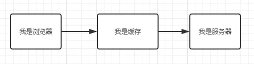
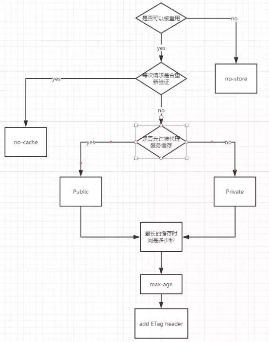

## 简述

**HTTP 缓存**相信都不陌生，因为它是在前端性能优化中必不可少的一个环节。在**首次进入或者请求数据**正常传输数据，而当**再次进入或者请求数据**时，可以走本地或者服务器上的缓存，来**节省流量**、**优化性能**、**提高用户体验**、**降低网络负荷**等等。

**web 缓存**主要用来缓存**html 文件**、**js 文件**、**css 文件**、**数据**，基本上都是提升**客户端/浏览器**请求到**服务器**之间的速度，当然也可以结合数据压缩如**gzip**、**7z**等等加快响应数据传输。

在整个应用中可以错多层缓存结构这里不多做介绍，因为前面已经大致介绍过了，这里主要介绍和前端比较相关的**HTTP 缓存**。

## HTTP 缓存

大致分为下面几步来加深对**HTTP 中的缓存**理解和应用场景。

1. **必知缓存策略的基础**
2. **缓存的判断策略**
3. **用户操作对缓存策略的影响**
4. **缓存储存的位置**
5. **缓存策略之间的对比**

## 必知缓存策略的基础

大致把协议分为**强缓存（过期策略）**和**协商缓存（协商策略）**两类缓存，可能不太准确只是自己的现在的见解，**浏览器/客户端**通过这两种策略决定使用**缓存中的副本**还是从**服务器**中获取最新的资源。

- **强缓存（过期策略）**：也就是缓存副本有效期。
  一个缓存副本必须满足以下任一条件，浏览器会认为它是有效的，足够新的，而直接从缓存中获取副本并渲染：
  - _含有完整的过期时间控制头信息（HTTP 协议报头），并且仍在有效期内_
  - _浏览器已经使用过这个缓存副本，并且在一个会话中已经检查过新鲜度_
- **协商缓存（协商策略）**：_服务器返回资源的时候有时在控制头信息带上这个资源的实体标签 Etag（Entity Tag），它可以用来作为浏览器再次请求过程的校验标识。如果发现校验标识不匹配，说明资源已经被修改或过期，浏览器需求重新获取资源内容。_

|             key             |                                                                                                 描述                                                                                                 |       缓存策略       |     首部类型      |
| :-------------------------: | :--------------------------------------------------------------------------------------------------------------------------------------------------------------------------------------------------: | :------------------: | :---------------: |
|           Pragma            |                                                                                    指定缓存机制（http 1.0 字段）                                                                                     |  强缓存（过期策略）  |   响应首部字段    |
|        Cache-COntrol        |                                                       `Cache-Control` 通用消息头字段，被用于在 http 请求和响应中，通过指定指令来实现缓存机制。                                                       |  强缓存（过期策略）  | 响应/请求首部字段 |
|           Expires           |                                                                      `Expires` 响应头包含日期/时间， 即在此时候之后，响应过期。                                                                      |  强缓存（过期策略）  |   响应首部字段    |
|        Last-Modified        |                                                          `Last-Modified` 是一个响应首部，其中包含源头服务器认定的资源做出修改的日期及时间。                                                          | 协商缓存（协商策略） |   响应首部字段    |
|      If-Modified-Since      |                             `If-Modified-Since` 是一个条件式请求首部，服务器只在所请求的资源在给定的日期时间之后对内容进行过修改的情况下才会将资源返回，状态码为 `200`。                             | 协商缓存（协商策略） |   请求首部字段    |
|            ETag             |                                                                             `ETag`HTTP 响应头是资源的特定版本的标识符。                                                                              | 协商缓存（协商策略） |   响应首部字段    |
|        If-None-Match        | `If-None-Match` 是一个条件式请求首部。对于 `GET` 和 `HEAD` 请求方法来说，当且仅当服务器上没有任何资源的 `ETag` 属性值与这个首部中列出的相匹配的时候，服务器端会才返回所请求的资源，响应码为 `200` 。 | 协商缓存（协商策略） |   请求首部字段    |
|      If-Match（辅助）       |                             `If-Match` 的使用表示这是一个条件请求。在请求方法为 `GET` 和 `HEAD` 的情况下，服务器仅在请求的资源满足此首部列出的 `ETag`值时才会返回资源。                              | 协商缓存（协商策略） |   请求首部字段    |
| If-Unmodified-Since（辅助） |                           `If-Unmodified-Since` 只有当资源在指定的时间之后没有进行过修改的情况下，服务器才会返回请求的资源，或是接受 `POST` 或其他 `non-safe` 方法的请求。                           | 协商缓存（协商策略） |   请求首部字段    |
|        Vary（辅助）         |                                    `Vary` 是一个`HTTP`响应头部信息，它决定了对于未来的一个请求头，应该用一个缓存的回复(response)还是向源服务器请求一个新的回复。                                     | 协商缓存（协商策略） |   响应首部字段    |

<!-- 下面四个就多做介绍了，大家可以去**mdn**中观看，下面是mdn中的连接。

- [Pragma](https://developer.mozilla.org/zh-CN/docs/Web/HTTP/Headers/Pragma)
- [If-Match](https://developer.mozilla.org/zh-CN/docs/Web/HTTP/Headers/If-Match)
- [If-Unmodified-Since](https://developer.mozilla.org/zh-CN/docs/Web/HTTP/Headers/If-Unmodified-Since)
- [Vary](https://developer.mozilla.org/zh-CN/docs/Web/HTTP/Headers/Vary) -->

_缓存又分为**强缓存和协商缓存**。其中强缓存包括`Expires`和`Cache-Control`，**主要是在过期策略生效时应用的缓存**。弱缓存包括`Last-Modified`和`ETag`，**是在协商策略后应用的缓存**。**强弱缓存之间的主要区别在于获取资源时是否会发送请求**。_

**强缓存和协商缓存**

- 如果本地缓存过期，则要依靠协商缓存
- **强缓存**的 http 状态码是 `200 OK`
- **协商缓存**的 http 状态码是 `304 Not Modified`

## 强缓存（过期策略）

属于**强缓存（过期策略）**的有如下：

- Cache-COntrol
- Expires

### Cache-Control

`Cache-Control`用于指定资源的缓存机制，可以同时在**请求和响应头**中设定。但是`Cache-Control`中的属性也分为**请求和响应**缓存指令，大致分为如下：

**缓存请求指令**
客户端可以在**HTTP 请求**中使用的标准 `Cache-Control` 指令。

> Cache-Control: max-age=<seconds>
> Cache-Control: max-stale[=<seconds>]
> Cache-Control: min-fresh=<seconds>
> Cache-control: no-cache
> Cache-control: no-store
> Cache-control: no-transform
> Cache-control: only-if-cached

**缓存响应指令**
服务器可以在**响应**中使用的标准 `Cache-Control` 指令。

> Cache-control: must-revalidate
> Cache-control: no-cache
> Cache-control: no-store
> Cache-control: no-transform
> Cache-control: public
> Cache-control: private
> Cache-control: proxy-revalidate
> Cache-Control: max-age=<seconds>
> Cache-control: s-maxage=<seconds>

`Cache-Control`: `cache-directive[,cache-directive]`。`cache-directive`为缓存指令，大小写不敏感，共有**12**个与**HTTP**缓存标准相关，如下所示。其中请求指令*7*种，响应指令*9*种。`Cache-Control`可以设置多个缓存指令，以逗号`,`分隔。

#### 可缓存性

- **public**： 表明响应可以被**任何对象（包括：发送请求的客户端、代理服务器、CDN 等中间代理服务器等等）缓存**，如下图所示：
  
- **private**：表明响应只能被**单个用户缓存**，**不能作为共享缓存（即代理服务器不能缓存它）**。
  
- **no-cache**：指定**不缓存响应**，表明资源**不进行缓存**，但是设置了 `no-cache` 之后并不代表**浏览器**不缓存，而是在**获取缓存前**要向**服务器确认资源**是否被更改。相当于`max-age: 0, must-revalidate`
- **no-store**： **绝对禁止缓存，请求和响应都不缓存，每次请求都从服务器获取完整资源**。

#### 到期

- **max-age=<seconds>**: 设置**缓存存储的最大周期**，超过这个时间缓存被认为过期(**单位秒**)。
- **s-maxage=<seconds>**: 覆盖`max-age`或者`Expires`头，但是**仅适用于**共享缓存(比如各个代理)，私有缓存会忽略它。
- **max-stale[=<seconds>]**: **指定时间内，即使缓存过期，资源依然有效**。
- **min-fresh=<seconds>**：**表示客户端希望获取一个能在指定的秒数内保持其最新状态的响应**。

#### 重新验证和重新加载

- **muse-revalidate**: 使用缓存资源之前，**必须先验证状态**，如果页面是**过期的(如 max-age)**，则去服务器进行**获取**。
- **proxy-revalidate**： 与`must-revalidate`作用相同，但它**仅适用于共享缓存（例如代理）**，并被私有缓存忽略。

#### 其他

- **no-transform**：强制要求代理服务器不要对资源进行转换，禁止代理服务器对`Content-Encoding`、`Content-Range`、`Content-Type`等字段的修改，因此代理服务器的`gzip`压缩将**不被允许**。

#### no-cache 和 no-store

还有一点需要注意的是，`no-cache`并不是指**不缓存文件**，`no-store`才是指**不缓存文件**。`no-cache`仅仅是表明**跳过强缓存**，强制进入**协商策略**。

#### 常用设置

**禁止缓存**
`Cache-Control: no-cache, no-store, must-revalidate`

**缓存静态资源**
`Cache-Control:public, max-age=86400`

### Expires

`Expires`指定缓存的**过期时间**，为绝对时间，即某一时刻。

> 注意：参考**本地时间**进行比对，在指定时刻后过期。**RFC 2616 建议最大值不要超过 1 年**。

### max-age 与 Expires

`Cache-Control`中的`max-age`指令用于指定**缓存过期的相对时间**。资源达到指定时间后过期。该功能与`Expires`类似。但其**优先级高于 Expires**，如果同时设置`max-age`和`Expires`，`max-age`生效，忽略`Expires`。

> Cache-Control > Expires

### 强缓存大致流程

强缓的设置流程图大致如下：


## 协商缓存

在没有**强缓存**时，就会走协商缓存，协商缓存大致流程：

- 第一次请求时，服务端返回给客户端一个**key(如 Etag 的资源值、Last-Modified 最后修改时间)**和资源
- 第二次请求时，客户端带上第一次服务端返回的 key
- 服务器端验证当前的 key 是否和上次返回给客户端的是否一致，一致返回 304 使用缓存，不一致重新返回 key 和新的资源

属于**协商缓存（协商策略）**的有如下：

- Last-Modified/If-Modified-Since/If-Unmodified-Since
- ETag/If-Match/If-None-Match

### Last-Modified/If-Modified-Since/If-Unmodified-Since

`Last-Modified/If-Modified-Since`大致流程如下：

- 第一次请求时，服务器会获取资源的最后修改时间通过设置`Last-Modified`，返回给客户端
- 后面请求时，客户端(浏览器)会自动带上`If-Modified-Since`字段
- 服务器从新获取修改时间与`If-Modified-Since`中的时间对比，如果没有变化返回`304`状态码（浏览器得知 304 状态码，资源从缓存中获取），如果改变返回`200`并且更新资源、更新`Last-Modified`

上面的流程是在设置不使用**强缓存**时的场景，这个只是现在的理解可能有很多的不太完善的地方。

#### Last-Modified

`Last-Modified`用于标记**请求资源的最后一次修改时间**。

**语法**

```javascript
Last-Modified: <day-name>, <day> <month> <year> <hour>:<minute>:<second> GMT

Last-Modified: Wed, 21 Oct 2015 07:28:00 GMT
```

**注意**

- **GMT(格林尼治标准时间)**
- `Last-Modified`只能精确到秒，因此不适合在一秒内多次改变的资源。

#### If-Modified-Since

`If-Modified-Since` 是一个条件式请求首部，与`Last-Modified`何用。有两种结果如下：

- `If-Modified-Since/Last-Modified`相同返回`304`状态码，客户端使用缓存
- `If-Modified-Since/Last-Modified`不相同返回`200`状态码，返回新的资源

> `If-Modified-Since` 只可以用在 `GET` 或 `HEAD` 请求中。

#### If-Unmodified-Since

`If-Unmodified-Since`表示资源未修改则正常执行更新，否则返回`412(Precondition Failed)`状态码的响应。主要有如下两种场景。

1. 用于不安全的请求中从而是请求具备条件性（如 POST 或者其他不安全的方法），如请求更新 wiki 文档，**文档未修改时才执行更新**。
2. 与`If-Range`字段同时使用时，可以用来保证新的片段请求来自一个未修改的文档。

### ETag/If-Match/If-None-Match

根据实体内容生成一段**唯一 hash 字符串**，标识资源的状态，由服务端产生。浏览器会将这**串字符串传回服务器**，验证资源是否已经修改，如果没有修改，过程如下：


`ETag` **HTTP 响应头**是资源的特定版本的标识符。
**语法**

```javascript
ETag: W / '<etag_value>';
ETag: '<etag_value>';
```

**W/ 可选**
**'W/'(大小写敏感) **表示使用**弱验证器**。 弱验证器很**容易**生成，但**不利**于比较。 强验证器是**比较的理想**选择，但**很难**有效地生成。

**"<etag_value>"**
实体标签唯一地表示所请求的资源。 它们是位于**双引号**之间的 ASCII 字符串（如“675af34563dc-tr34”）。

> 注意：ETag 和 If-None-Match 的值均为双引号包裹的。
> `ETag`的优先级高于`Last-Modified`。当`ETag`和`Last-Modified`，`ETag`优先级更高，但不会忽略`Last-Modified`，需要服务端实现。

`ETag` 和 `If-None-Match` 常被用来处理**协商缓存**。而 `ETag` 和 `If-Match` 可以 **避免“空中碰撞”**。

`ETag` HTTP 响应头是资源的特定版本的标识符。这可以让缓存更高效，并节省带宽，因为如果内容没有改变，Web 服务器不需要发送完整的响应。而如果内容发生了变化，使用 `ETag` 有助于防止资源的**同时更新相互覆盖（“空中碰撞”）**。

#### 实例

当编辑 MDN 时，当前的 WIki 内容被散列，并在相应中放入`Etag`:

```javascript
ETag: '33a64df551425fcc55e4d42a148795d9f25f89d4';
```

将更改保存到 WIKI 页面（发布数据）时，POST 请求将包含有`ETag`值的`If-Match`头来检车是否为最新版本。

```javascript
  If-Match: "33a64df551425fcc55e4d42a148795d9f25f89d4"
```

如果哈希值不匹配，则意味着文档已经被编辑，抛出 `412 ( Precondition Failed)` 前提条件失败错误。

`If-None-Match` 是客户端发送给服务器时的请求头，其值是服务器返回给客户端的 `ETag`，当 `If-None-Match` 和服务器资源最新的 `Etag` 不同时，返回最新的资源及其 `Etag`。

## 缓存的判断策略

缓存策略分为**强缓存**和**协商缓存**，首先经过**强缓存**的**过期策略**，才会走后面的**协商缓存**的**协商策略**，大致把缓存分为三个阶段**本地缓存阶段（强缓存）**、**协商缓存阶段（本地+服务器）**、**缓存失败阶段**。

大致在每个阶段中做的什么判断：

1. **本地缓存阶段**：如果设置了**强缓存**，那么会现在本地查找该资源，如果发现该资源，而且该资源还没有过期，就使用这个资源副本，完全不会发起`http`请求到服务器。（主要应用是**强缓存**、**serverWorker**）;
2. **协商缓存阶段**：如果在**本地缓存**找到对应的资源，但是不知道该资源**是否过期或者已经过期**，则发一个 http 请求到服务器，然后服务器**判断**这个请求，如果请求的资源在服务器上没有改动过，则返回`304`，让浏览器使用本地找到的那个资源；
3. **缓存失败阶段**: 当服务器发现请求的资源**已经修改过**，或者这是一个新的请求(在本来没有找到资源)，服务器则返回该资源的数据，并且返回`200`， 当然这个是指找到资源的情况下，如果服务器上没有这个资源，则返回`404`。

大致流程如下图所示：


这张图中没有包含`serverWorker`的缓存判断流程 b，但是在后面会有一篇文章专门介绍**serverWorker**，因为他是属于**PWA**中的内容。

> **存储策略**发生在**收到请求响应后**，用于决定**是否缓存**相应资源；**过期策略**发生在**请求前**，用于判断缓存**是否过期**；**协商策略**发生在**请求中**，用于判断缓存资源**是否更新**。

## 用户操作对缓存策略的影响

在用户刷新页面（F5）时，会对缓存产生影响，这里就会记录用户操作对缓存产生的影响。用户操作事项如下表所示：

|                  用户操作                   |                强缓存                 | 协商缓存 |
| :-----------------------------------------: | :-----------------------------------: | :------: |
|             (新标签)地址栏回车              |                 有效                  |   有效   |
|            (地址不变)地址栏回车             | 兼容性问题 Chrome(失效)/Firefox(有效) |   有效   |
|                  链接跳转                   |                 有效                  |   有效   |
|                  前进/后退                  |                 有效                  |   有效   |
|              从收藏栏打开链接               |                 有效                  |   有效   |
|            (window.open)新开窗口            |                 有效                  |   有效   |
|        刷新（Command/Ctrl + R / F5）        |                 失效                  |   有效   |
| 强制刷新（Command + Shift + R / Ctrl + F5） |                 失效                  |   失效   |

基本上包含了一些常见的用户操作对**强缓存**和**协商缓存**的影响，大致的判断流程如下：


**注意**

> - (地址不变)地址栏回车：它比较特殊，为什么它在**Chrome**是**失效**，在**Firefox**中是**有效**。因为**Chrome**把**地址不变回车**等同于**刷新当前页面**，而在**Firefox**都是作为**新地址回车**处理的。
> - `webkit(Chrome内核)`资源分为**主资源**和**派生资源**。**主资源**是地址栏输入的 URL 请求返回的**资源**，**派生资源**是主资源中所引用**的 JS、CSS、图片等资源**。
> - 在`Chrome`下刷新时，只有主资源的缓存应用方式如上图所示，**派生资源**的**缓存应用方式与新标签打开类似**，会判断缓存是否过期。强缓存生效时的区别在于新标签打开为`from disk cache`，而当前页刷新派生资源是`from memory cache`。
> - 而在`Firefox`下，当前页面刷新，所有资源都会如上图所示。

## 缓存储存的位置

从缓存的位置上来说分为**四种**，并且各自有优先级，当**依次由上到下**查找缓存且**都没有命中**的时候，才会去请求网络，大致如下：

- Service Worker
- Memory Cache
- Disk Cache
- Push Cache

### Service Worker

**Service Worker** 是一种独立于主线程之外的 **Javascript** 线程。它可以帮我们实现**离线缓存**、**消息推送**和**网络代理**等功能。

> 使用 `Service Worker`的话，传输协议**必须**为 `HTTPS`。因为 `Service Worker` 中涉及到请求拦截，所以必须使用 `HTTPS` 协议来保障安全。

**Service Worker** 实现缓存大致分为以下几个步骤：

- 首先需要在页面的 **JavaScript 主线程中注册 Service Worker**。
- 注册成功后后台开始安装步骤， 通常在安装的过程中需要缓存一些静态资源。
- 安装成功后开始**激活 Service Worker**
- 激活成功后 **Service Worker** 可以控制页面了（**监听 fetch 和 message 事件**），但是只针对在成功注册了 **Service Worker** 后打开的页面。

在这里就不细说了，后面有一个单独的章节来讲述**Service Worker**, **Service Worker 的缓存与浏览器其他内建的缓存机制不同，它可以让我们自由控制缓存哪些文件、如何匹配缓存、如何读取缓存，并且缓存是持续性的**。

### Memory Cache

**Memory Cache** 是内存中的缓存。主要包含的是当前页面中请求到的数据如**图片（base64）**、**脚本（JavaScript）**、**样式（css）**等静态数据。读取内存中的数据肯定比磁盘中的**快**，但是内存中的**缓存持续性很短**，它会随着当前**Tab 页面关闭，内存中的缓存也就被释放**。

比如在**百度首页**刷新页面，效果如下图所示：


**preload**
`<link>` 元素的 `rel` 属性的属性值`preload`，`<link rel="preload">`来显示的指定的预加载资源，也会被放入`memory cache`中。

**prefetch**
`<link rel="prefetch">` 已经被许多浏览器支持了相当长的时间，但它是意图预获取一些资源，以备下一个导航/页面使用（比如，当你去到下一个页面时）。
浏览器会给使用`prefetch`的资源一个**相对较低的优先**级与使用`preload`的资源相比。

**subresource**
`<link rel="subresource">`被 Chrome 支持了有一段时间，并且已经有些搔到预加载当前导航/页面（所含有的资源）的痒处了。这些资源会以一个**相当低的优先级**被加载。
`Memory Cache`不会轻易的命中一个请求，除了要有**匹配的 URL**，还要有相同的**资源类型**、**CORS 模式**以及一些**其他特性**。
`Memory Cache`是不关心`HTTP语义`的，比如`Cache-Control: max-age=0`的资源，仍然可以在同一个导航中被重用。但是在特定的情况下，`Memory Cache`会遵守`Cache-Control: no-store`指令，不缓存相应的资源。

> `Memory Cache`匹配规则在标准中没有详尽的描述，所以不同的浏览器内核在实现上会有所不同。

### Disk Cache/HTTP Cache

`HTTP Cache`也被叫做`Disk Cache`。从字面的意思上理解`Disk Cache`就是储存在硬盘上的**缓存**，因此它是持久存储的，是实际存在于文件系统中的。
而且**它允许相同的资源在跨会话**，甚至**跨站点**的情况下使用，例如**两个站点都使用了同一张图片**。

`HTTP Cache`会根据`HTTP Herder`中的字段判断哪些资源需要缓存，哪些资源可以不请求直接使用，哪些资源已经过期需要重新请求。
当**命中缓存**之后，浏览器会从**硬盘中读取资源**，虽然比起从内存中**读取慢**了一些，但比起网络请求还是快了不少的。绝大部分的缓存都来自 `disk cache`。

> 凡是**持久性存储**都会面临**容量增长**的问题，`disk cache` 也不例外。在**浏览器自动清理**时，会有神秘的算法去把“最老的”或者“最可能过时的”资源删除，因此是一个一个删除的。不过每个浏览器识别“最老的”和“最可能过时的”资源的算法不尽相同，可能也是它们差异性的体现。

### Push Cache

`Push Cache`（推送缓存）是 `HTTP/2` 中的内容，当以上三种缓存都没有命中时，它才会被使用。
**它只在会话（Session）中存在，一旦会话结束就被释放，并且缓存时间也很短暂**，在 Chrome 浏览器中只有 5 分钟左右，同时它也**并非严格执行 HTTP 头中的缓存指令**。

`Push Cache` 在国内能够查到的资料很少，也是因为 `HTTP/2` 在国内不够普及。这里推荐阅读`Jake Archibald`的 [HTTP/2 push is tougher than I thought](https://jakearchibald.com/2017/h2-push-tougher-than-i-thought/) 这篇文章，文章中的几个结论：

- 所有的资源都能被推送，并且能够被缓存,但是 Edge 和 Safari 浏览器支持相对比较差
- 可以推送 no-cache 和 no-store 的资源
- 一旦连接被关闭，Push Cache 就被释放
- 多个页面可以使用同一个 HTTP/2 的连接，也就可以使用同一个 Push Cache。这主要还是依赖浏览器的实现而定，出于对性能的考虑，有的浏览器会对相同域名但不同的 tab 标签使用同一个 HTTP 连接。
- Push Cache 中的缓存只能被使用一次
- 浏览器可以拒绝接受已经存在的资源推送
- 你可以给其他域名推送资源

如果以上**四种缓存都没有命中**的话，那么只能发起**请求来获取资源**了。

那么为了性能上的考虑，大部分的接口都应该选择好缓存策略，通常浏览器缓存策略分为两种：**强缓存和协商缓存**，并且缓存策略都是通过设置 `HTTP Header` 来实现的。

### 关于 memory cache 和 disk cache

这两种缓存类型存在于 Chrome 中。
`disk cache` 存在硬盘，可以存很多，容量上限比内容缓存高很多，而 `memory cache` 从内存直接读取，速度上占优势，这两个各有各的好处！

因为关于在什么时候用到什么缓存的文档相当的少所以真的不好判断，是当前使用的是哪个缓存，比如下面这个例子：


## 缓存策略之间的对比

其实缓存之间也没有太好的对比性，大致可以从**缓存策略**和**缓存位置**两个角度对比缓存的优缺点。

- **强缓存**返回 **http 200 OK 状态码**，而**协商缓存**返回**http 304 Not Modified 状态码**
- **强缓存**中的优先级为： **Cache-Control > Expires**
- **协商缓存**中的优先级： **Etag/If-None-Match > Last-Modified/Last-Since-Modified**
- **协商缓存**中，**Last-Modified**不能记录秒级以下的更新缓存，而**Etag 可以**。但是**Etag 生成唯一资源标识符又比叫困难**，而**Last-Modified 实现起来比价简单**
- `Service Worker`相对于`Disk Cache/Memory Cache`配置会麻烦一点，但是`Service Worker`应用场景更广，性能也会好一点。
- `Service Worker`必须要在`Https`协议中才会生效。
- **Disk Cache**相对于**Memory Cache**，它的优点在于**容量大、储存周期长、可被多域使用**，缺点在于**读取速度慢**
- **Memory Cache**相对于**Memory Cache**，它的优点在于**速度快、对前端 link 字段支持性**，缺点在于**储存周期短（tab 也关闭）、空间有限**

它们的值优缺点如上所示，如在**chrome**、**firefox**、**ie**中**Memory cache**和**Disk cache**也是不太相同的。

### 关于 Chrome、FF、IE 的缓存区别

**Chrome**浏览器的速度比其他两个浏览器的速度更快一点，主要是因为**V8**引擎的执行速度更快，另一方面应该就是它的**缓存策略**的使用。
从这四个方面**强缓存**、**协商缓存**、**Disk Cache**、**Memory Cache**来对比，为什么说**Chrome**执行效果比其它的两个浏览器的执行速度和加载速度更快。

就以百度首页为例看一下**Chrome**和**Firefox**的差别。

在`Chrome`和`Firefox`中打开`https://www.baidu.com/`首页，结果如下图所示
**Firefox**效果如下：

**Chrome**效果如下：


我们以百度的`bd_logo1.png`的请求为例，`logo`的请求是一个`Get`请求，同时它被设置了**四个缓存**配置，但是它在两个浏览器中表现并不相同，如下图所示

**Firefox**效果如下：

**Chrome**效果如下：


首先在**再次请求**时浏览器端都**没有携带协商缓存**需要的头部字段，所以它们肯定走的是**强缓存**，在**强缓存**中`Cache-Control`的优先级是最高的，所以都是走的**Cache-Control**的策略。

可以看到它们的区别如下几点：

- **状态码**： 首先它们返回的状态码是不同的，**Chrome**返回的状态码是`200`,**Firefox**返回的状态码是`304`。
- **使用的资源**： 可以看到**Chrome**中的资源大小为`0(耗时 0ms，也就是 1ms 以内)`，那么它使用的本地的资源。而**Firefox**中它是从服务器获取的资源。

## 测试实例

在这里我们来一个一个测试`expires/cache-control/etag/last-modified/pragma`它们是否和我们上面所总结的一致。

测试环境`chrome 78.0.3904.70`、`node 12.9.1`、`koa 2.x`.

整体的目录结构如下图所示：


代码可能写的比较粗糙，但是后面会优化一下，公共代码如下：

**index.html**代码如下

```html
<!DOCTYPE html>
<html lang="en">
  <head>
    <meta charset="UTF-8" />
    <meta name="viewport" content="width=device-width, initial-scale=1.0" />
    <meta http-equiv="X-UA-Compatible" content="ie=edge" />
    <title>Document</title>
    <link rel="stylesheet" href="/index/index.css" />
    <script src="/index/index.js"></script>
  </head>
  <body>
    测试cache
    
  </body>
</html>
```

**app.js**代码如下

```javascript
const Koa = require('koa');
const Router = require('koa-router');
const Static = require('koa-static');
const fs = require('fs-extra');
const Path = require('path');
const mime = require('mime');

const app = new Koa();
const router = new Router();

router.get('/', async (ctx, next) => {
  ctx.type = mime.getType('.html');
  // console.log(__dirname)
  const content = await fs.readFile(
    Path.resolve(__dirname + '/index/index.html'),
    'UTF-8'
  );
  // console.log(content);
  ctx.body = content;
  await next();
});
// 待优化
router.get('/index/rotateX.png', async (ctx, next) => {
  const { response, path } = ctx;
  ctx.type = mime.getType(path);
  const imageBuffer = await fs.readFile(Path.resolve(__dirname, `.${path}`));
  ctx.body = imageBuffer;
  await next();
});

// 待优化
router.get('/index/index.css', async (ctx, next) => {
  const { path } = ctx;
  ctx.type = mime.getType(path);

  const content = await fs.readFile(
    Path.resolve(__dirname, `.${path}`),
    'UTF-8'
  );
  ctx.body = content;

  await next();
});

// 待优化
router.get('/index/index.js', async (ctx, next) => {
  const { path } = ctx;
  ctx.type = mime.getType(path);

  const content = await fs.readFile(
    Path.resolve(__dirname, `.${path}`),
    'UTF-8'
  );
  ctx.body = content;

  await next();
});

// app.use(Static('./index'))
app.use(router.routes()).use(router.allowedMethods());

app.listen(3000, function (err) {
  // console.log()
  if (err) {
    console.log(err);
  } else {
    console.log('启动成功');
  }
});
```

下面的代码都是在这个代码上修改，`index.js`、`index.css`、`rotateX.png`自己写就可以，或者去网上下载一个稍微超过`2kb`大小的文件。

### Cache-Control 实例

使用`Cache-Control`缓存测试效果，修改代码如下：

修改**app.js**

```javascript
// ...省略代码
router.get('/index/rotateX.png', async (ctx, next) => {
  // ...省略代码
  // 添加代码
  ctx.set('Cache-Control', 'max-age=' + 10);
});
// ...省略代码
router.get('/index/index.css', async (ctx, next) => {
  // ...省略代码
  // 添加代码
  ctx.set('Cache-Control', 'max-age=' + 10);
});
// ...省略代码
router.get('/index/index.js', async (ctx, next) => {
  // ...省略代码
  // 添加代码
  ctx.set('Cache-Control', 'max-age=' + 10);
});
```

我们在通过`nodemon app.js`运行代码，运行效果大致如下：

1. 第一个打开`localhost:3000`时，因为没有任何缓存所以资源是`从服务器中请求`来的，如下图所示
   
2. 当我们刷新页面时，因为我们设置了`Cache-Control: max-age=10`，所以会走`本地缓存`，如下图所示
   
   第二次请求，三个请求都来自 `memory cache`。因为我们没有关闭 TAB，所以浏览器把缓存的应用加到了`memory cache`。(耗时 0ms，也就是 1ms 以内)
3. 当我们跳转到`https://www.baidu.com`，再返回页面时，它也会`走本地缓存`，如下图所示
   
   因为跳转页面等于是**关闭了 TAB**，`memory cache` 也随之清空。但是 `disk cache` 是持久的，于是所有资源来自 `disk cache`。(大约耗时 3ms，因为文件有点小)而且对比 2 和 3，很明显看到 `memory cache` 还是比 `disk cache`快得多的。

### no-cache 和 no-store 对比

我们来对比一下`no-cache`和`no-store`的区别，修改代码如下：

修改**index.html**

```html
<!DOCTYPE html>
<html lang="en">
  <head>
    <meta charset="UTF-8" />
    <meta name="viewport" content="width=device-width, initial-scale=1.0" />
    <meta http-equiv="X-UA-Compatible" content="ie=edge" />
    <title>Document</title>
    <link rel="stylesheet" href="/index/index.css" />
    <link rel="stylesheet" href="/index/index.css" />
    <script src="/index/index.js"></script>
    <script src="/index/index.js"></script>
  </head>
  <body>
    测试cache
    
    
    <!-- 异步请求图片 -->
    <script>
      setTimeout(function () {
        let img = document.createElement('img');
        img.src = '/index/rotateX.png';
        document.body.appendChild(img);
      }, 1000);
    </script>
  </body>
</html>
```

我们暂时不修改缓存的配置，通过`nodemon app.js`运行代码，运行效果大致如下：

- 同步请求方面，浏览器会**自动**把当次 `HTML` 中的资源存入到缓存 (`memory cache`)，这样碰到相同 `src` 的图片就会自动读取缓存(但不会在 `Network` 中显示出来)
- 异步请求方面，浏览器同样是不发请求而**直接读取缓存**返回。但同样不会在 `Network` 中显示。

下面我们修改**app.js**中的代码如下：

```javascript
// ...省略代码
router.get('/index/rotateX.png', async (ctx, next) => {
  // ...省略代码
  // 替换原来代码
  ctx.set('Cache-Control', 'no-cache');
});
// ...省略代码
router.get('/index/index.css', async (ctx, next) => {
  // ...省略代码
  // 替换原来代码
  ctx.set('Cache-Control', 'no-cache');
});
// ...省略代码
router.get('/index/index.js', async (ctx, next) => {
  // ...省略代码
  // 替换原来代码
  ctx.set('Cache-Control', 'no-cache');
});
```

我们运行代码看的效果如下图所示：


- 同步请求方面，浏览器会**自动**把当次 `HTML` 中的资源存入到缓存 (`memory cache`)，这样碰到相同 `src` 的图片就会自动读取缓存(但不会在 `Network` 中显示出来)

如果把`no-cache`修改为`no-store`

修改**app.js**

```javascript
// ...省略代码
router.get('/index/rotateX.png', async (ctx, next) => {
  // ...省略代码
  // 替换原来代码
  ctx.set('Cache-Control', 'no-store');
});
// ...省略代码
router.get('/index/index.css', async (ctx, next) => {
  // ...省略代码
  // 替换原来代码
  ctx.set('Cache-Control', 'no-store');
});
// ...省略代码
router.get('/index/index.js', async (ctx, next) => {
  // ...省略代码
  // 替换原来代码
  ctx.set('Cache-Control', 'no-store');
});
```

我们运行代码看的效果如下图所示：


当我们设置了`Cache-Control: no-store`时，可以看到`css`、`js`文件都被请求了两次，`png`请求了三次。

- 如之前原理所述，虽然 `memory cache` 是无视 `HTTP` 头信息的，但是 `no-store` 是特别的。在这个设置下，`memory cache` 也不得不每次都请求资源。
- 异步请求和同步遵循相同的规则，在 `no-store` 情况下，依然是每次都发送请求，不进行任何缓存。

### Last-Modified/If-Modified-Since

这里来设置协商缓存`Last-Modified/If-Modified-Since`，代码修改如下：

修改**app.js**

```javascript
const responseFile = async (path, context, encoding) => {
  const fileContent = await fs.readFile(path, encoding);
  context.type = mime.getType(path);
  context.body = fileContent;
};
router.get('/index/rotateX.png', async (ctx, next) => {
  ctx.set('Pragma', 'no-cache');
  const { response, request, path } = ctx;
  const imagePath = Path.resolve(__dirname, `.${path}`);
  const ifModifiedSince = request.headers['if-modified-since'];
  console.log(ifModifiedSince);
  const imageStatus = await fs.stat(imagePath);
  const lastModified = imageStatus.mtime.toGMTString();
  if (ifModifiedSince === lastModified) {
    response.status = 304;
  } else {
    response.lastModified = lastModified;
    await responseFile(imagePath, ctx);
  }
  await next();
});
```

大致流程如下：

1. 在`Chrome`中选中`Disable Cache`禁用缓存，可以通过下面图片看到服务器端发送给客户端`Last-Modified: Thu, 24 Oct 2019 05:12:37 GMT`。
   
2. 关闭 `disable cache` 后再次访问图片时，发现带上了 `if-modified-since` 请求头，值就是上次请求响应的 `last-modified` 值，因为图片最后修改时间不变，所以 `304 Not Modified`。效果如下图所示
   

> 启用`Disable Cache`时，我们可以看到**客户端/浏览器端**自动带上了`Pragma':'no-cache'`、`'Cache-Control': 'no-cache'`这两个字段，不适用缓存。

### Etag/If-None-Match

修改**app.js**，通过`npm i crypto -D`安装`crypto`,用于生成`md5`。

```javascript
// 处理 css 文件
router.get('/index/index.css', async (ctx, next) => {
  const { request, response, path } = ctx;
  ctx.type = mime.getType(path);
  response.set('pragma', 'no-cache');

  const ifNoneMatch = request.headers['if-none-match'];
  const imagePath = Path.resolve(__dirname, `.${path}`);
  const hash = crypto.createHash('md5');
  const imageBuffer = await fs.readFile(imagePath);
  hash.update(imageBuffer);
  const etag = `"${hash.digest('hex')}"`;
  if (ifNoneMatch === etag) {
    response.status = 304;
  } else {
    response.set('etag', etag);
    ctx.body = imageBuffer;
  }

  await next();
});
```

运行效果如下图所示：


他的过程和`Last-Modified/If-Modified-Since`，但是因为`Last-Modified/If-Modified-Since`它不能监听`1s`以内的资源变化，所以一般用他来做`Etag/If-None-Match`的补充方案。

## 总结

缓存大致分为：`强缓存`、`协商缓存`。

- `强缓存`: `pragma`、`cache-control`、`expires`
- `协商缓存`: `last-modified/If-modified-since`、`etag/if-none-match`
- `强缓存优先级`: `cache-control > pragma > expires`
- `协商缓存优先级`: `etag/if-none-match > last-modified/If-modified-since`

缓存位置分为： `Service Worker`、`Memory Cache`、`Disk Cache`、`Push Cache`，也是从左到右如果命中就使用。

上面的实例只是比较简单的应用，其实还有很多有意思的实例能加深对缓存的理解，如下：

- `pragma`、`cache-control`、`expires`优先级
- `last-modified/If-modified-since`、`etag/if-none-match`优先级
- `cache-control: no-cache`与`cache-control: max-age=0, must-revalidate`效果是否相同
- `chrome`、`firefox`、`ie`之间的缓存差别

本篇文章有意避开`Service Worker`的详细介绍，因为会有单独的一篇文章来介绍`Service Worker`在真实应用的使用。

> [在线代码](https://codesandbox.io/embed/agitated-rain-55pzk?fontsize=14)，可以**刷新页面（刷新内部页面）**在**控制台**中查看当前效果

## 参考

[一文搞懂浏览器缓存机制](https://mp.weixin.qq.com/s?__biz=MzI4NDYxNTM0OQ==&mid=2247484082&idx=1&sn=2efec72057f7fa448a6c0e258fd80370&chksm=ebf9f568dc8e7c7e7d9e134b023c4cc71528caebd14153922bd8a753eb7330ec04289b4c89cc&mpshare=1&scene=1&srcid=&sharer_sharetime=1568210174017&sharer_shareid=491f5e3b572f21d39b90888df1c8829b&key=87d0d2afc25bc11ed40773ae28d50dc35909a8612c034880c5d0f249e5ab7525f1e6476a825113b59ad0f71ae424aa90bc5ef63bd55775c844a86d0d7b64c96480f095a3072da752b723851f6685d76b&ascene=1&uin=MTY4MzM5MzY2Mw%3D%3D&devicetype=Windows+10&version=62060833&lang=zh_CN&pass_ticket=x2ObXwYE5mF5saSt6Ycrs%2FnJfxgIYByJ8YPenA%2Ft5rl%2FXcqc7s6LVGsTuEjoprxw)
[关于 http 缓存，这些知识点你可能都不懂](https://mp.weixin.qq.com/s/MYEXGtMxa3tj4H2-Wl378w)
[浏览器缓存策略](https://mp.weixin.qq.com/s/b_vo_epjycDsGvczU6ol3Q)
[一文读懂前端缓存](https://zhuanlan.zhihu.com/p/44789005)
[通过 koa2 服务器实践探究浏览器 HTTP 缓存机制](https://juejin.im/post/5d0f9585e51d4510926a7b68)
