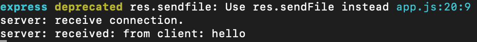
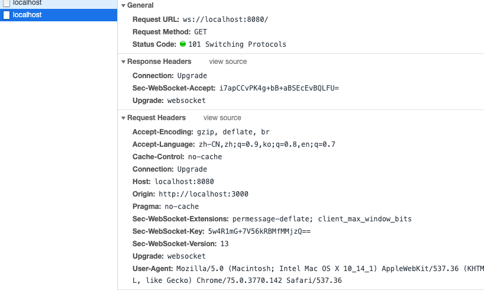

## 简介

> WebSocket 由多个标准构成: WebSocket API 是 W3C 定义的，而 WebSocket 协议(RFC 6455)及其扩展则由 HyBi Working Group(IETF)定义。

HTML5 开始提供的一种浏览器与服务器进行`全双工通讯的网络技术`，属于`应用层协议`。它基于`TCP 传输协议`，并`复用 HTTP 的握手通道`。
`WebSocket` 可以实现**客户端与服务器间双向**、**基于消息的文本或二进制数据传输**。`WebSocket` 连接远远不是一个**网络套接字**，因为浏览器在这个简单的 API 之后隐藏了所有的复杂性，而且还提供了更多服务:

- `连接协商和同源策略`;
- `与既有 HTTP 基础设施的互操作`;
- `基于消息的通信和高效消息分帧`;
- `子协议协商及可扩展能力`。

### 特点

为什么已经有了轮询还要 WebSocket 呢，是因为短轮询和长轮询有个缺陷：`通信只能由客户端发起`。
WebSocket 提供了一个`文明优雅的全双工通信`方案。一般适合于对数据的实时性要求比较强的场景，如通信、股票、直播、共享桌面，特别适合于客户端与服务频繁交互的情况下，如聊天室、实时共享、多人协作等平台。
他的主要特点如下：

- **建立在 TCP 协议之上，服务器端的实现比较容易。**
- **与 HTTP 协议有着良好的兼容性。默认端口也是 80 和 443，并且握手阶段采用 HTTP 协议，因此握手时不容易屏蔽，能通过各种 HTTP 代理服务器。**
- **数据格式比较轻量，性能开销小，通信高效。服务器与客户端之间交换的标头信息大概只有 2 字节;**
- **可以发送文本，也可以发送二进制数据。**
- **没有同源限制，客户端可以与任意服务器通信。**
- **协议标识符是 `ws`（如果加密，则为 wss），服务器网址就是 URL。ex：`ws://example.com:80/some/path`**
- **不用频繁创建及销毁 TCP 请求，减少网络带宽资源的占用，同时也节省服务器资源;**
- **WebSocket 是纯事件驱动的，一旦连接建立，通过监听事件可以处理到来的数据和改变的连接状态，数据都以帧序列的形式传输。服务端发送数据后，消息和事件会异步到达。**
- **无超时处理。**

### webSocket.readyState

`readyState`属性返回实例对象的当前状态，共有四种。

- `CONNECTING：值为 0，表示正在连接`。
- `OPEN：值为 1，表示连接成功，可以通信了`。
- `CLOSING：值为 2，表示连接正在关闭`。
- `CLOSED：值为 3，表示连接已经关闭，或者打开连接失败`。

### webSocket.onopen

实例对象的`onopen`属性，用于指定连接成功后的回调函数。

```javascript
ws.onopen = function () {
  ws.send('Hello Server!');
};
// 如果要指定多个回调函数，可以使用addEventListener方法。
ws.addEventListener('open', function (event) {
  ws.send('Hello Server!');
});
```

### webSocket.onclose

实例对象的`onclose`属性，用于指定连接关闭后的回调函数。

```javascript
ws.onclose = function (event) {
  var code = event.code;
  var reason = event.reason;
  var wasClean = event.wasClean;
  // handle close event
};
ws.addEventListener('close', function (event) {
  var code = event.code;
  var reason = event.reason;
  var wasClean = event.wasClean;
  // handle close event
});
```

### webSocket.onmessage()\webSocket.send()

**webSocket.onmessage()**
实例对象的`onmessage`属性，用于指定收到服务器数据后的回调函数。也可以处理二进制数据。

```javascript
ws.onmessage = function (event) {
  var data = event.data;
  // 处理数据
};

ws.addEventListener('message', function (event) {
  var data = event.data;
  // 处理数据
});

// 注意，服务器数据可能是文本，也可能是二进制数据（`blob对象或Arraybuffer对象`）。
ws.onmessage = function (event) {
  if (typeof event.data === String) {
    console.log('Received data string');
  }

  if (event.data instanceof ArrayBuffer) {
    var buffer = event.data;
    console.log('Received arraybuffer');
  }
};

// 收到的是 blob 数据
ws.binaryType = 'blob';
ws.onmessage = function (e) {
  console.log(e.data.size);
};

// 收到的是 ArrayBuffer 数据
ws.binaryType = 'arraybuffer';
ws.onmessage = function (e) {
  console.log(e.data.byteLength);
};
```

**webSocket.send()**
实例对象的`send()`方法用于向服务器发送数据。

```javascript
ws.onmessage = function (event) {
  var data = event.data;
  // 处理数据
};

ws.addEventListener('message', function (event) {
  var data = event.data;
  // 处理数据
});
// 发送 Blob 对象的例子。
var file = document.querySelector('input[type="file"]').files[0];
ws.send(file);

// 发送 ArrayBuffer 对象的例子。
// Sending canvas ImageData as ArrayBuffer
var img = canvas_context.getImageData(0, 0, 400, 320);
var binary = new Uint8Array(img.data.length);
for (var i = 0; i < img.data.length; i++) {
  binary[i] = img.data[i];
}
ws.send(binary.buffer);
```

### webSocket.bufferedAmount

实例对象的`bufferedAmount`属性，表示还有多少字节的二进制数据没有发送出去。它可以用来判断发送是否结束。

```javascript
var data = new ArrayBuffer(10000000);
socket.send(data);

if (socket.bufferedAmount === 0) {
  // 发送完毕
} else {
  // 发送还没结束
}
```

### webSocket.onerror

实例对象的`onerror`属性，用于指定报错时的回调函数。

```javascript
socket.onerror = function (event) {
  // handle error event
};
socket.addEventListener('error', function (event) {
  // handle error event
});
```

## webSocket 学习

对网络应用层协议的学习来说，最重要的往往就是**连接建立过程、数据交换教程**。当然，数据的格式是逃不掉的，因为它直接决定了协议本身的能力。好的数据格式能让协议更高效、扩展性更好。
大致可以通过下面的几个方面来学习:

- **如何建立连接**
- **数据帧格式**
- **数据传递**
- **连接保持+心跳**
- **Sec-WebSocket-Key/Accept 的作用**
- **数据掩码的作用**

### 实例

在正式介绍协议细节前，先来看一个简单的例子，有个直观感受。例子包括了**WebSocket 服务端、WebSocket 客户端（网页端）**。完整代码可以在 这里 找到。这里服务端用了`ws`这个库。相比大家熟悉的`socket.io`，ws 实现更**轻量**，更适合学习的目的。

#### 服务端

代码如下，监听`8080`端口。当有新的连接请求到达时，打印日志，同时向客户端发送消息。当收到到来自客户端的消息时，同样打印日志。

```javascript
const express = require('express');
const app = express();
const server = require('http').Server(app);
const WebSocket = require('ws');

const wss = new WebSocket.Server({ port: 8080 });
wss.on('connection', function connection(ws) {
  console.log('server: receive connection');
  ws.on('message', function incoming(message) {
    console.log('server: recevied: %s', message);
  });
  ws.send('world');
});

app.get('/', function (req, res) {
  res.sendfile(__dirname + '/index.html');
});
app.listen(3000);
```

服务端运行结果如下图所示：


#### 客户端

代码如下，向 8080 端口发起 WebSocket 连接。连接建立后，打印日志，同时向服务端发送消息。接收到来自服务端的消息后，同样打印日志。

```javascript
const ws = new WebSocket('ws://localhost:8080');
ws.onopen = function () {
  console.log('ws onopen');
  ws.send('from client:hello');
};
ws.onmessage = function (e) {
  console.log('ws onmessage');
  console.log('from server:' + e.data);
};
```

客户端运行结果如下图所示：


## 如何建立连接

前面提到，WebSocket 复用了`HTTP 的握手通道`。具体指的是，客户端通过 HTTP 请求与 WebSocket`服务端协商升级协议`。协议升级完成后，后续的数据交换则遵照`WebSocket 的协议`。

### 客户端：申请协议升级

首先，客户端发起协议升级请求。可以看到，采用的是标准的 HTTP 报文格式，且只支持`GET 方法`。

```javascript
    GET / HTTP/1.1
    Host: localhost:8080
    Origin: http://127.0.0.1:3000
    Connection: Upgrade // 表示要升级协议
    Upgrade: websocket // 表示要升级到websocket协议。
    Sec-WebSocket-Version: 13 // 表示websocket的版本。如果服务端不支持该版本，需要返回一个Sec-WebSocket-Versionheader，里面包含服务端支持的版本号。
    Sec-WebSocket-Key: w4v7O6xFTi36lq3RNcgctw== // 与后面服务端响应首部的Sec-WebSocket-Accept是配套的，提供基本的防护，比如恶意的连接，或者无意的连接。
```

重点请求首部意义如下：

- `Connection`: `Upgrade` 表示要升级协议
- `Upgrade: websocket`：表示要升级到 `websocket` 协议。
- `Sec-WebSocket-Version`: 13：表示 `websocket` 的版本。如果服务端不支持该版本，需要返回一个 `Sec-WebSocket-Versionheader`，里面包含服务端支持的版本号。
- `Sec-WebSocket-Key`：与后面服务端响应首部的 `Sec-WebSocket-Accept` 是配套的，提供基本的防护，比如恶意的连接，或者无意的连接。

> 注意，上面请求省略了部分非重点请求首部。由于是标准的 `HTTP` 请求，类似 `Host、Origin、Cookie` 等请求首部会照常发送。在握手阶段，可以通过相关请求`首部进行 安全限制、权限校验`等。

### 服务端：响应协议升级

服务端返回内容如下，状态代码`101`表示协议切换。到此完成协议升级，后续的数据交互都按照新的协议来。

```javascript
    HTTP/1.1 101 Switching Protocols
    Connection:Upgrade
    Upgrade: websocket
    Sec-WebSocket-Accept: Oy4NRAQ13jhfONC7bP8dTKb4PTU=
```

如下图所示：


> 备注：每个 header 都以\r\n 结尾，并且最后一行加上一个额外的空行\r\n。此外，服务端回应的 HTTP 状态码只能在握手阶段使用。过了握手阶段后，就只能采用特定的错误码。

### Sec-WebSocket-Accept 的计算

`Sec-WebSocket-Accept`根据客户端请求首部的`Sec-WebSocket-Key`计算出来。
计算公式为：

- 将`Sec-WebSocket-Key`跟`258EAFA5-E914-47DA-95CA-C5AB0DC85B11`拼接。
- 通过`SHA1`计算出摘要，并转成`base64`字符串。

伪代码如下：
`>toBase64( sha1( Sec-WebSocket-Key + 258EAFA5-E914-47DA-95CA-C5AB0DC85B11 ) )`

验证下前面的返回结果：

```javascript
const crypto = require('crypto');
const magic = '258EAFA5-E914-47DA-95CA-C5AB0DC85B11';
const secWebSocketKey = 'w4v7O6xFTi36lq3RNcgctw==';

let secWebSocketAccept = crypto
  .createHash('sha1')
  .update(secWebSocketKey + magic)
  .digest('base64');

console.log(secWebSocketAccept);
// Oy4NRAQ13jhfONC7bP8dTKb4PTU=
```

## 数据帧格式

**客户端、服务端数据的交换**，离不开数据帧格式的定义。因此，在实际讲解数据交换之前，我们先来看下 `WebSocket 的数据帧格式`。
`WebSocket 客户端、服务端通信的最小单位是帧（frame）`，由 `1 个或多个帧组成一条完整的消息（message）`。

- `发送端：将消息切割成多个帧，并发送给服务端`；
- `接收端：接收消息帧，并将关联的帧重新组装成完整的消息`；

**数据帧的格式**。详细定义可参考 [RFC6455 5.2 节](https://tools.ietf.org/html/rfc6455#section-5.2) 。

### 数据帧格式概览

下面给出了 WebSocket 数据帧的统一格式。熟悉 TCP/IP 协议的同学对这样的图应该不陌生。

- 从左到右，单位是比特。比如`FIN`、`RSV1`各占据 1 比特，`opcode`占据 4 比特。
- 内容包括了`标识、操作代码、掩码、数据、数据长度`等。（下一小节会展开）

```javascript
  0                   1                   2                   3
  0 1 2 3 4 5 6 7 8 9 0 1 2 3 4 5 6 7 8 9 0 1 2 3 4 5 6 7 8 9 0 1
 +-+-+-+-+-------+-+-------------+-------------------------------+
 |F|R|R|R| opcode|M| Payload len |    Extended payload length    |
 |I|S|S|S|  (4)  |A|     (7)     |             (16/64)           |
 |N|V|V|V|       |S|             |   (if payload len==126/127)   |
 | |1|2|3|       |K|             |                               |
 +-+-+-+-+-------+-+-------------+ - - - - - - - - - - - - - - - +
 |     Extended payload length continued, if payload len == 127  |
 + - - - - - - - - - - - - - - - +-------------------------------+
 |                               |Masking-key, if MASK set to 1  |
 +-------------------------------+-------------------------------+
 | Masking-key (continued)       |          Payload Data         |
 +-------------------------------- - - - - - - - - - - - - - - - +
 :                     Payload Data continued ...                :
 + - - - - - - - - - - - - - - - - - - - - - - - - - - - - - - - +
 |                     Payload Data continued ...                |
 +---------------------------------------------------------------+
```

### 数据帧格式详解

**FIN**：1 个比特。
如果是**1**，表示这是消息（message）的**最后一个分片（fragment）**，如果是**0**，表示不是是消息（message）的**最后一个分片（fragment）**。

**RSV1, RSV2, RSV3**：各占 1 个比特。
一般情况下全为 0。当客户端、服务端协商采用 WebSocket 扩展时，这三个标志位可以`非 0`，且值的含义由扩展进行定义。如果出现非零的值，且并没有采用 WebSocket 扩展，连接出错。

**Opcode: 4 个比特。**
操作代码，Opcode 的值决定了应该如何解析后续的`数据载荷（data payload）`。如果操作代码是不认识的，那么接收端应该`断开连接（fail the connection）`。可选的操作代码如下：

- %x0：`表示一个延续帧`。当 Opcode 为 0 时，表示本次数据传输采用了数据分片，当前收到的数据帧为其中一个数据分片。
- %x1：`表示这是一个文本帧（frame）`
- %x2：`表示这是一个二进制帧（frame）`
- %x3-7：`保留的操作代码，用于后续定义的非控制帧`。
- %x8：`表示连接断开`。
- %x9：`表示这是一个 ping 操作`。
- %xA：`表示这是一个 pong 操作`。
- %xB-F：保留的操作代码，用于后续定义的控制帧。

**Mask: 1 个比特。**
表示是否要对数据载荷进行掩码操作。从客户端向服务端发送数据时，需要对数据进行掩码操作；从服务端向客户端发送数据时，不需要对数据进行掩码操作。
如果服务端接收到的数据没有进行过掩码操作，服务端需要断开连接。
如果 Mask 是 1，那么在 Masking-key 中会定义一个`掩码键（masking key）`，并用这个掩码键来对数据载荷进行反掩码。所有客户端发送到服务端的数据帧，Mask 都是 1。

**Payload length：**数据载荷的长度，单位是字节。为 7 位，或 7+16 位，或 1+64 位。
假设数 `Payload length === x`，如果

- `x 为 0~126`：数据的长度为 x 字节。
- `x 为 126`：后续 2 个字节代表一个 16 位的无符号整数，该无符号整数的值为数据的长度。
- `x 为 127`：后续 8 个字节代表一个 64 位的无符号整数（最高位为 0），该无符号整数的值为数据的长度。

此外，如果 `payload length 占用了多个字`节的话，`payload length 的二进制表达采用网络序（big endian，重要的位在前）`。

**Masking-key：**或 4 字节（32 位）
所有从客户端传送到服务端的数据帧，数据载荷都进行了掩码操作，Mask 为 1，且携带了 4 字节的 Masking-key。如果 Mask 为 0，则没有 Masking-key。

> 备注：载荷数据的长度，不包括 mask key 的长度。

**Payload data：**(x+y) 字节
载荷数据：包括了扩展数据、应用数据。其中，扩展数据 x 字节，应用数据 y 字节。

扩展数据：如果没有协商使用扩展的话，扩展数据数据为 0 字节。所有的扩展都必须声明扩展数据的长度，或者可以如何计算出扩展数据的长度。此外，扩展如何使用必须在握手阶段就协商好。如果扩展数据存在，那么载荷数据长度必须将扩展数据的长度包含在内。

应用数据：任意的应用数据，在扩展数据之后（如果存在扩展数据），占据了数据帧剩余的位置。载荷数据长度 减去 扩展数据长度，就得到应用数据的长度。

### 掩码算法

`掩码键（Masking-key）`是由客户端挑选出来的 `32 位的随机数`。掩码操作不会影响数据载荷的长度。`掩码、反掩码`操作都采用如下算法：

首先，假设：

- `original-octet-i`：为原始数据的第 i 字节。
- `transformed-octet-i`：为转换后的数据的第 i 字节。
- `j`：为 i mod 4 的结果。
- `masking-key-octet-j`：为 mask key 第 j 字节。

算法描述为： original-octet-i 与 masking-key-octet-j 异或后，得到 transformed-octet-i。

> j = i MOD 4
> transformed-octet-i = original-octet-i XOR masking-key-octet-j

## 数据传递

一旦 WebSocket 客户端、服务端建立连接后，后续的操作都是基于数据帧的传递。

WebSocket 根据`opcode`来区分操作的类型。比如`0x8 表示断开连接`，`0x0-0x2 表示数据交互`。

### 数据分片

WebSocket 的每条消息可能被切分成多个数据帧。当 WebSocket 的接收方收到一个数据帧时，会根据`FIN 的值`来判断，是否已经收到消息的最后一个数据帧。

`FIN=1`表示当前数据帧为消息的最后一个数据帧，此时接收方已经收到完整的消息，可以对消息进行处理。FIN=0，则接收方还需要继续监听接收其余的数据帧。

此外，`opcode`在数据交换的场景下，表示的是数据的类型。`0x01 表示文本`，`0x02 表示二进制`。`而 0x00`比较特殊，表示延续帧（continuation frame），顾名思义，就是完整消息对应的数据帧还没接收完。

### 数据分片例子

直接看例子更形象些。下面例子来自[MDN](https://developer.mozilla.org/en-US/docs/Web/API/WebSockets_API/Writing_WebSocket_servers)，可以很好地演示数据的分片。客户端向服务端两次发送消息，服务端收到消息后回应客户端，这里主要看客户端往服务端发送的消息。

**第一条消息**
FIN=1, 表示是当前消息的最后一个数据帧。服务端收到当前数据帧后，可以处理消息。opcode=0x1，表示客户端发送的是文本类型。

**第二条消息**

- FIN=0，opcode=0x1，表示发送的是文本类型，且消息还没发送完成，还有后续的数据帧。
- FIN=0，opcode=0x0，表示消息还没发送完成，还有后续的数据帧，当前的数据帧需要接在上一条数据帧之后。
- FIN=1，opcode=0x0，表示消息已经发送完成，没有后续的数据帧，当前的数据帧需要接在上一条数据帧之后。服务端可以将关联的数据帧组装成完整的消息。

```javascript
    Client: FIN=1, opcode=0x1, msg="hello"
    Server: (process complete message immediately) Hi.
    Client: FIN=0, opcode=0x1, msg="and a"
    Server: (listening, new message containing text started)
    Client: FIN=0, opcode=0x0, msg="happy new"
    Server: (listening, payload concatenated to previous message)
    Client: FIN=1, opcode=0x0, msg="year!"
    Server: (process complete message) Happy new year to you too!
```

## 连接保持+心跳

WebSocket 为了保持客户端、服务端的实时双向通信，需要确保客户端、服务端之间的 TCP 通道保持连接没有断开。然而，对于长时间没有数据往来的连接，如果依旧长时间保持着，可能会浪费包括的连接资源。
但不排除有些场景，客户端、服务端虽然长时间没有数据往来，但仍需要保持连接。这个时候，可以采用心跳来实现。

- 发送方->接收方：ping
- 接收方->发送方：pong

ping、pong 的操作，对应的是 WebSocket 的两个控制帧，opcode 分别是 0x9、0xA。

举例，WebSocket 服务端向客户端发送 ping，只需要如下代码（采用 ws 模块）

```javascript
ws.ping('', false, true);
```

## Sec-WebSocket-Key/Accept 的作用

前面提到了，`Sec-WebSocket-Key/Sec-WebSocket-Accept`在主要作用在于提供基础的防护，减少恶意连接、意外连接。

作用大致归纳如下：

- 避免`服务端收到非法的 websocket 连接`（比如 http 客户端不小心请求连接 websocket 服务，此时服务端可以直接拒绝连接）
- 确保`服务端理解 websocket 连接`。因为 ws 握手阶段采用的是 http 协议，因此可能 ws 连接是被一个 http 服务器处理并返回的，此时客户端可以通过 Sec-WebSocket-Key 来确保服务端认识 ws 协议。（并非百分百保险，比如总是存在那么些无聊的 http 服务器，光处理 Sec-WebSocket-Key，但并没有实现 ws 协议。。。）
- 用浏览器里发起 ajax 请求，设置 header 时，`Sec-WebSocket-Key 以及其他相关的 header 是被禁止的`。这样可以避免客户端发送 ajax 请求时，意外请求协议升级（websocket upgrade）
- `可以防止反向代理（不理解 ws 协议）返回错误的数据`。比如反向代理前后收到两次 ws 连接的升级请求，反向代理把第一次请求的返回给 cache 住，然后第二次请求到来时直接把 cache 住的请求给返回（无意义的返回）。
- `Sec-WebSocket-Key 主要目的并不是确保数据的安全性`，因为 `Sec-WebSocket-Key`、`Sec-WebSocket-Accept` 的转换计算公式是公开的，而且非常简单，最主要的作用是预防一些常见的意外情况（非故意的）。

> 强调：`Sec-WebSocket-Key/Sec-WebSocket-Accept` 的换算，只能带来基本的保障，但连接是否安全、数据是否安全、客户端/服务端是否合法的 ws 客户端、ws 服务端，其实并没有实际性的保证。

## 数据掩码的作用

WebSocket 协议中，数据掩码的作用是增强协议的安全性。但数据掩码并不是为了保护数据本身，因为算法本身是公开的，运算也不复杂。除了加密通道本身，似乎没有太多有效的保护通信安全的办法。

- `代理缓存污染攻击`
- 最初的提案是对数据进行加密处理。基于安全、效率的考虑，最终采用了折中的方案：`对数据载荷进行掩码处理`。

## 参考

[WebSocket：5 分钟从入门到精通](https://segmentfault.com/a/1190000012709475)
[WebSocket 通信过程与实现](https://mp.weixin.qq.com/s/sXde-0h7jjGlt4hdwi_Ngw)
