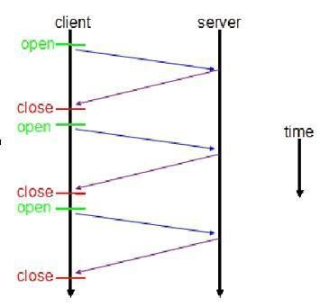
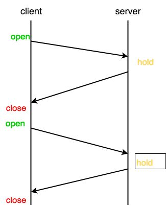

## 简介

Web Sockets 定义了一种在通过一个单一的 socket 在网络上进行**全双工通讯的通道**。仅仅是传统的 HTTP 通讯的一个增量的提高，尤其对于**实时、事件驱动**的应用来说是一个飞跃。
通过`Polling(轮询)`、`Long-Polling(长轮询)`、`Websocket`、`sse`的对比。四种 Web 即时通信技术比较它们的**实现方式**和**各自的优缺点**。
对比优缺点如下：

|    #     |           轮询(Polling)            |        长轮询(Long-Polling)        |                    Websocket                     |                 sse                 |
| :------: | :--------------------------------: | :--------------------------------: | :----------------------------------------------: | :---------------------------------: |
| 通信协议 |                http                |                http                |                       tcp                        |                http                 |
| 触发方式 |           client(客户端)           |           client(客户端)           |          client、server(客户端、服务端)          |   client、server(客户端、服务端)    |
|   优点   |     兼容性好容错性强，实现简单     |          比短轮询节约资源          | 全双工通讯协议，性能开销小、安全性高，可扩展性强 |        实现简便，开发成本低         |
|   缺点   | 安全性差，占较多的内存资源与请求数 | 安全性差，占较多的内存资源与请求数 |   传输数据需要进行二次解析，增加开发成本及难度   |          只适用高级浏览器           |
|   延迟   |     非实时，延迟取决于请求间隔     |              同短轮询              |                       实时                       | 非实时，默认 3 秒延迟，延迟可自定义 |

上面基本上包含了各个实现方式的**优点**和**缺点**，它们基于什么**协议**、由那端**主动**发送数据。

## 轮询(Polling)

**短轮询(Polling)**的实现思路就是**浏览器端**每隔几秒钟向**服务器端**发送`http`请求，服务端在收到请求后，不论是否有数据更新，都直接进行响应。**在服务端响应完成，就会关闭这个 Tcp 连接**，如下图所示：

示例代码实现如下：

```javascript
function Polling() {
  fetch(url)
    .then((data) => {
      // somthing
    })
    .catch((err) => {
      console.log(err);
    });
}
setInterval(polling, 5000);
```

- 优点：可以看到实现非常简单，它的**兼容性**也比较好的只要**支持 http 协议**就可以用这种方式实现。
- 缺点：但是它的缺点也很明显就是非常的消耗资源，因为建立`Tcp`连接是非常消耗资源的，服务端响应完成就会关闭这个`Tcp`连接，下一次请求再次建立`Tcp`连接。

## COMET

**Alex Russell（Dojo Toolkit 的项目 Lead）**称这种基于`HTTP长连接`、无须在浏览器端安装插件的“服务器推”技术为`“Comet”`。
常用的 COMET 分为两种：**基于 HTTP 的长轮询（long-polling）技术，以及基于 iframe 的长连接流（stream）模式**。

### 长轮询（Long-Polling）

客户端发送请求后服务器端**不会立即**返回数据，服务器端会**阻塞请求**连接不会**立即断开**，直到服务器端**有数据更新或者是连接超时**才返回，客户端才再次发出请求新建连接、如此反复从而获取最新数据。大致效果如下：

客户端的代码如下：

```javascript
function LongPolling() {
  fetch(url)
    .then((data) => {
      LongPolling();
    })
    .catch((err) => {
      LongPolling();
      console.log(err);
    });
}
LongPolling();
```

- 优点： 长轮询和短轮询比起来，明显减少了很多不必要的 http 请求次数，相比之下节约了资源。
- 缺点：连接挂起也会导致资源的浪费。

### 基于 iframe 的长连接流（stream）模式

当我们在页面中嵌入一个`iframe`并设置其 src 时，服务端就可以通过长连接`“源源不断”`地向客户端输出内容。
例如，我们可以向客户端返回一段`script`标签包裹的`javascript`代码，该代码就`会在 iframe 中执行`。因此，如果我们预先在`iframe`的父页面中定义一个`处理函数 process()`，而在每次有新数据需要`推送时`，在该连接响应中写入`<script>parent.process(\${your_data})</script>`。那么 iframe 中的这段代码就会调用父页面中预先定义的`process()函数`。（是不是有点像 JSONP 传输数据的方式？）

```javascript
// 在父页面中定义的数据处理方法
function process(data) {
  // do something
}

// 创建不可见的iframe
var iframe = document.createElement('iframe');
iframe.style = 'display: none';
// src指向后端接口
iframe.src = '/long_iframe';
document.body.appendChild(iframe);
```

后端还是以 node 为例

```javascript
const app = http.createServer((req, res) => {
  // 返回数据的方法，将数据拼装成script脚本返回给iframe
  const iframeSend = (data) => {
    let script = `<script type="text/javascript">
                        parent.process(${JSON.stringify(data)})
                    </script>`;
    res.write(script);
  };

  res.setHeader('connection', 'keep-alive');
  // 注意设置相应头的content-type
  res.setHeader('content-type', 'text/html; charset=utf-8');
  // 当有数据更新时，服务端“推送”数据给客户端
  EVENT.addListener(MSG_POST, iframeSend);

  req.socket.on('close', () => {
    console.log('iframe socket close');
    // 注意在连接关闭时移除监听，避免内存泄露
    EVENT.removeListener(MSG_POST, iframeSend);
  });
});
```

效果如下：


> 不过使用 iframe 有个小瑕疵，因此这个 iframe 相当于永远也不会加载完成，所以浏览器上会一直有一个 loading 标志。

他的优缺点和上面的长轮询一样。

## Websocket

WebSocket 的一些特性和基础使用方法在这里就不多赘述了，请看另一篇博客[webSocket(一) 浅析](/blog/http/http-web-socket1.html);
大致代码如下：
**服务端**

```javascript
const express = require('express');
const app = express();
const server = require('http').Server(app);
const WebSocket = require('ws');

const wss = new WebSocket.Server({ port: 8080 });
wss.on('connection', function connection(ws) {
  console.log('server: receive connection');
  ws.on('message', function incoming(message) {
    console.log('server: recevied: %s', message);
  });
  ws.send('world');
});

app.get('/', function (req, res) {
  res.sendfile(__dirname + '/index.html');
});
app.listen(3000);
```

**客户端**

```javascript
const ws = new WebSocket('ws://localhost:8080');
ws.onopen = function () {
  console.log('ws onopen');
  ws.send('from client:hello');
};
ws.onmessage = function (e) {
  console.log('ws onmessage');
  console.log('from server:' + e.data);
};
```

运行效果如下：


- 优点：不会造成性能的浪费
- 缺点：学习一套新的请求库

## SSE (Server-Sent Events)

`Server-Sent`是`HTML5`提出一个标准。由客户端发起与服务器之间创建`TCP`连接，然后**并维持这个连接**，直到客户端或服务器中的任何一方断开，`ServerSent`使用的是"问"+"答"的机制，连接创建后浏览器会周期性地发送消息至服务器询问，是否有自己的消息。其实现原理类似于我们在上一节中提到的**基于 iframe 的长连接模式**。
HTTP 响应内容有一种特殊的`content-type —— text/event-stream`，该响应头标识了响应内容为**事件流**，客户端**不会关闭连接**，而是等待服务端不断得发送响应结果。
SSE 规范比较简单，主要分为两个部分：浏览器中的`EventSource`对象，以及服务器端与浏览器端之间的**通讯协议**。

## 基础用法

在浏览器中可以通过`EventSource`构造函数来创建该对象

```javascript
var source = new EventSource('/sse');
```

而`SSE`的响应内容可以看成是一个**事件流**，由不同的事件所组成。这些事件会触发前端`EventSource`对象上的方法。

```javascript
// 默认的事件
source.addEventListener(
  'message',
  function (e) {
    console.log(e.data);
  },
  false
);

// 用户自定义的事件名
source.addEventListener(
  'my_msg',
  function (e) {
    process(e.data);
  },
  false
);

// 监听连接打开
source.addEventListener(
  'open',
  function (e) {
    console.log('open sse');
  },
  false
);

// 监听错误
source.addEventListener('error', function (e) {
  console.log('error');
});
```

`EventSource`通过事件监听的方式来工作。注意上面的代码监听了`y_msg`事件，SSE 支持自定义事件，默认事件通过监听 message 来获取数据。实现代码如下:

**客户端**

```javascript
// 显示聊天信息
let chat = new EventSource('/chat-room');
chat.onmessage = function (event) {
  let msg = event.data;
  $('.list-group').append("<li class='list-group-item'>" + msg + '</li>');
  // chat.close(); 关闭server-sent event
};

// 自定义事件
chat.addEventListener('myChatEvent', function (event) {
  let msg = event.data;
  $('.list-group').append("<li class='list-group-item'>" + msg + '</li>');
});
```

**服务端 nodejs**

```javascript
var express = require('express');
var router = express.Router();
router.get('/chat-room', function (req, res, next) {
  // 当res.white的数据data 以\n\n结束时 就默认该次消息发送完成，触发onmessage方法，以\r\n不会触发onmessage方法
  res.header({
    'Content-Type': 'text/event-stream',
    'Cache-Control': 'no-cache',
    Connection: 'keep-alive'
  });

  // res.white("event: myChatEvent\r\n"); 自定义事件
  res.write('retry: 10000\r\n'); // 指定通信的最大间隔时间
  res.write('data: start~~\n\n');
  res.end(); // 不加end不会认为本次数据传输结束 会导致不会有下一次请求
});
```

- 优点： 客户端只需连接一次，Server 就定时推送，除非其中一端断开连接。并且 SSE 会在连接意外断开时自动重连。
- 缺点： 要学习新的语法

## 总结

上面四种 Web 即时通信技术比较，可以从不同的角度考虑，它们的优先级是不同的，基本上可以分为两大类基于`http`和`tcp`两种通信中的一种。
**兼容性考虑**
`短轮询>长轮询>长连接 SSE>WebSocket`
**从性能方面考虑**
`WebSocket>长连接 SSE>长轮询>短轮询`
**服务端推送**
`WebSocket>长连接 SSE>长轮询`

## 参考

> [各类“服务器推”技术原理与实例（Polling/COMET/SSE/WebSocket）](https://juejin.im/post/5b135b78f265da6e420eab7d#heading-7) > [JavaScript 服务器推送技术之 WebSocket](https://mp.weixin.qq.com/s/7KtvnY4zSfjORtxv30YaKQ) > [轮询、长轮询、长连接、websocket](https://www.cnblogs.com/huchong/p/8595644.html) > [消息推送机制-轮询、长轮询、SSE(Server Sent Event)和 WS(WebSocket)](https://www.jianshu.com/p/ef054d3d1b62)
